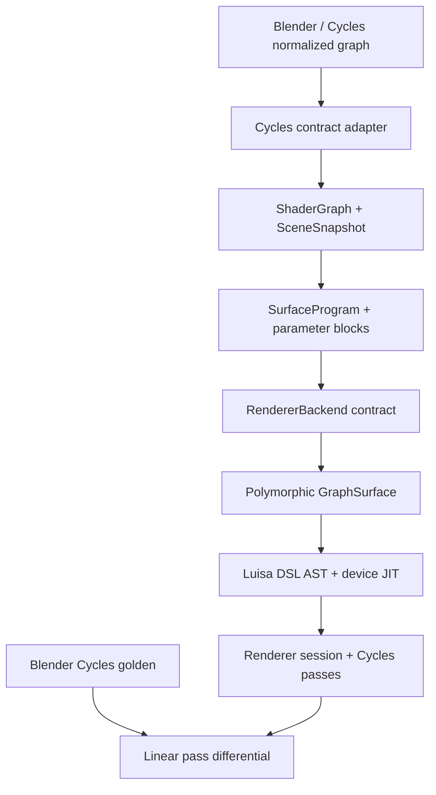

# Architecture

## Decision

Cycles defines what Blender users can express and what results are observable.
It does not define Psycles's kernel list, device memory layout, shader bytecode,
or scheduling strategy.

The repository implements the path from the normalized graph DTO through Luisa
AST construction and device execution. Compatibility is measured directly
against Blender Cycles; Psycles does not contain a second host renderer.

## Stable boundaries

### Cycles adapter

`adapter::CyclesNormalizedShaderGraph` represents the graph after
Cycles-independent semantic normalization and before SVM-specific
multi-closure transformation. `adapt_cycles_shader_graph()` rejects a graph
marked as SVM-lowered; reconstructing a closure tree from bytecode is not a
supported path.

Node lowering is registered by canonical `(Cycles type, variant)` keys. Socket
and property names are mapped explicitly, so a new or renamed Cycles node
produces a coverage diagnostic instead of silently changing its meaning.
Operation-dependent nodes use a canonical variant, for example
`("math", "multiply")`.

### ShaderGraph

`contract::ShaderGraph` is a typed DAG with three independent roots:

- `Surface` produces a surface closure;
- `Volume` produces a volume closure;
- `Displacement` produces a vector displacement.

Node types are strings registered in `NodeRegistry`, not a closed enum. This is
intentional: a Cycles upgrade that introduces a new node must produce an
explicit coverage failure rather than silently falling back to an unrelated
implementation.

Socket defaults are runtime parameters unless they are declared as static node
properties. The compiler therefore produces two signatures:

- `structure_signature`: node types, topology, socket types, roots, and static
  properties; a change requires DSL/JIT regeneration;
- `parameter_signature`: unlinked socket values; a change may be handled by
  updating parameter storage.

This split is a correctness and invalidation contract. It does not prescribe
how parameters are packed or cached.

### Surface program

`compiler::SurfaceProgram` is a typed, immutable semantic program with one
topologically ordered value instruction stream and a separate closure tree.
The unified stream is required for cross-type dependencies such as
texture-color to scalar Math to Principled roughness, and for explicit Cycles
socket conversions. Closure composition remains a tree; there is no fixed-size
`ShaderClosure[]`.

Every unlinked editable socket becomes a typed `ParameterDesc`. A
`SurfaceParameterBlock` can therefore be regenerated from a new shader graph
without rebuilding the program if its `structure_signature` still matches.
This gives multistage code a precise binding-time boundary:

| Value | Current representation | Update action |
|---|---|---|
| Node topology, static operation, socket type | Program structure | Recompile program |
| Unlinked color, roughness, strength, mix factor | Parameter block | Rebind data |
| Position, normals, incoming direction, tangent | Surface point | Evaluate on device |

`compiler::MaterialLibrary` applies this rule atomically to a scene revision.
If any material fails to compile or bind, the previous library and revision
remain visible.

### Surface dispatch

`luisa_backend::SurfaceDispatch` owns
`luisa::compute::Polymorphic<Surface>`. Integrators dispatch by a runtime
surface tag and consume a uniform semantic protocol:

- BSDF evaluation and sampling;
- emission;
- visibility opacity;
- AOV properties;
- static capability metadata.

The dispatch is not treated as legacy scaffolding. It remains in the emitted
DSL. A future compiler pass may fuse or specialize it when proven safe, but
neither the renderer contract nor an integrator is allowed to assume that this
has happened.

The surface protocol exposes semantic values, not a fixed Cycles
`ShaderClosure[]` layout. Each implementation may construct and specialize its
closure tree using ordinary host control flow while tracing Luisa DSL.

`luisa_backend::GraphSurface` is the first implementation. It consumes a shared
`SurfaceProgram`, emits host-specialized Luisa expressions, and obtains runtime
parameters, textures, attributes, and surface differentials from
`ShaderServices`. Implementations visible in a complex scene remain
unverified until focused Cycles probes pass; the authoritative status is
reported by `tools/check_cycles_shader_node_coverage.py`.

### Scene

`SceneDatabase` stores immutable logical snapshots and accepts a `SceneDelta`
against an explicit base revision. A delta is applied to a candidate copy,
validated as a complete scene, and committed atomically. This lets a Blender
adapter update materials, geometry, instances, cameras, and lights in any
command order without temporarily exposing dangling references.

The scene contract uses stable typed identifiers. It contains no Luisa resource
handles and no Cycles device pointers.

### Renderer

`contract::RendererBackend` compiles a snapshot into an opaque
`CompiledScene`; a `RenderSession` then accepts synchronous sample ranges and
writes named pass tiles to an `OutputSink`. This maps cleanly to Cycles
`PathTraceWork::render_samples()` and output tiles without importing
`PathTraceWorkGPU`, `DeviceScene`, or its queue state machine.

### Cycles differential contract

Official Blender Cycles is the sole rendering oracle. A regression case owns
one `.blend`, frame, camera, sampling configuration, and pass list. Blender
emits linear multilayer EXR; Psycles exports the same evaluated scene and
renders it through Luisa. The comparator reports per-pass RMSE, relative error,
high-percentile error, invalid pixels, and an error image. Small node probes
isolate formula or socket differences before a full-scene failure is accepted.

The Luisa `fallback` backend is useful on hosts without a supported GPU, but it
is still the Luisa AST/JIT implementation. It must not be confused with an
independently written CPU renderer.

## Explicit non-goals of the current milestone

- No SVM interpreter or SVM stack ABI.
- No recreation of Cycles `KernelData` or `IntegratorStateGPU`.
- No material clustering, dispatch grouping, or scene-specific switch
  rewriting.
- No wavefront-versus-megakernel decision.
- No closure-array size limit.
- No approximate implementation labeled as Cycles-compatible.
- No OSL execution path yet.
- No compatibility claim based only on a full-scene image or an unverified
  node implementation.

## Next implementation slices

1. Add the in-Blender extractor that copies normalized, pre-SVM
   `cycles::ShaderGraph` objects into the adapter DTO.
2. Complete camera, scene data, RayQuery, surface dispatch, transport, film,
   and pass semantics through Luisa DSL/JIT.
3. Run the same micro-scenes and Lone Monk through official Cycles and the
   Luisa executor, adding node/socket and statistical BSDF tests before
   expanding coverage.
4. Expand ShaderGraph coverage, derivatives/bump, textures, attributes, and
   the remaining closure semantics from coverage failures.
5. Only after semantic coverage is stable, add schedule IR and compiler-level
   surface-dispatch fusion experiments.
