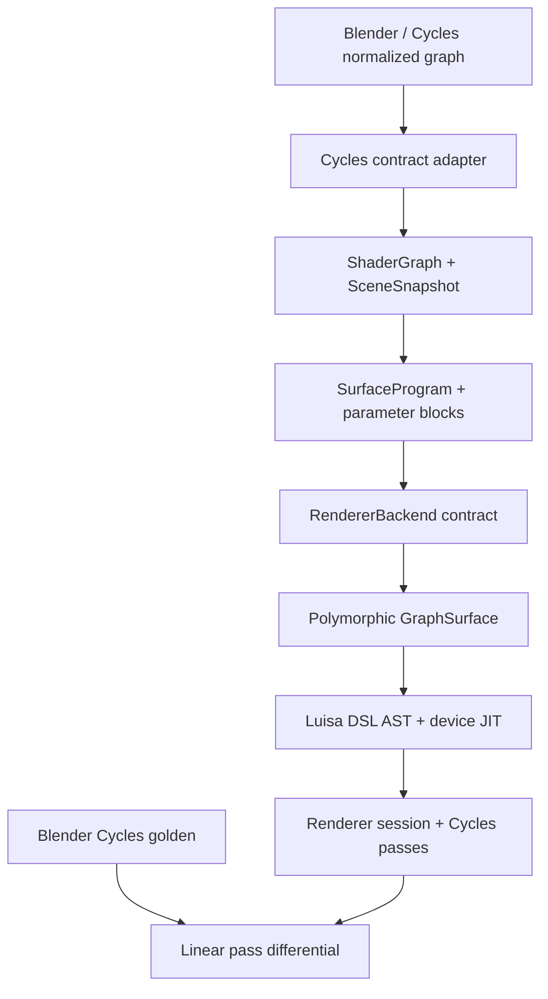

# Architecture

## Decision

Cycles defines what Blender users can express and what results are observable.
It does not define Psycles's kernel list, device memory layout, shader bytecode,
or scheduling strategy.

The repository implements the path from the normalized graph DTO through Luisa
AST construction and device execution. Compatibility is measured directly
against Blender Cycles; Psycles does not contain a second host renderer.

## Stable boundaries

### Cycles adapter

`adapter::CyclesNormalizedShaderGraph` represents the graph after
Cycles-independent semantic normalization and before SVM-specific
multi-closure transformation. `adapt_cycles_shader_graph()` rejects a graph
marked as SVM-lowered; reconstructing a closure tree from bytecode is not a
supported path.

Node lowering is registered by canonical `(Cycles type, variant)` keys. Socket
and property names are mapped explicitly, so a new or renamed Cycles node
produces a coverage diagnostic instead of silently changing its meaning.
Operation-dependent nodes use a canonical variant, for example
`("math", "multiply")`.

The Blender JSON bridge uses ordered `BlenderNodeLoweringComponent` objects
for input/context, value, procedural, and closure families. Components receive
a typed graph-mutation context; node-group recursion, output memoization, and
diagnostic ownership stay in the normalizer. This is a host-side extensibility
boundary only. Components forward raw socket topology, defaults, properties,
and closure composition into `ShaderGraph`; invoking Blender or Cycles to
pre-bake a material is forbidden.

### ShaderGraph

`contract::ShaderGraph` is a typed DAG with three independent roots:

- `Surface` produces a surface closure;
- `Volume` produces a volume closure;
- `Displacement` produces a vector displacement.

Node types are strings registered in `NodeRegistry`, not a closed enum. This is
intentional: a Cycles upgrade that introduces a new node must produce an
explicit coverage failure rather than silently falling back to an unrelated
implementation.

Socket defaults are runtime parameters unless they are declared as static node
properties. The compiler therefore produces two signatures:

- `structure_signature`: node types, topology, socket types, roots, and static
  properties; a change requires DSL/JIT regeneration;
- `parameter_signature`: unlinked socket values; a change may be handled by
  updating parameter storage.

This split is a correctness and invalidation contract. It does not prescribe
how parameters are packed or cached.

### Surface program

`compiler::SurfaceProgram` is a typed, immutable semantic program with one
topologically ordered value instruction stream plus separate surface- and
volume-closure trees.
The unified stream is required for cross-type dependencies such as
texture-color to scalar Math to Principled roughness, and for explicit Cycles
socket conversions. Closure composition remains a tree in both domains; there
is no fixed-size `ShaderClosure[]`.

Every unlinked editable socket becomes a typed `ParameterDesc`. A
`SurfaceParameterBlock` can therefore be regenerated from a new shader graph
without rebuilding the program if its `structure_signature` still matches.
This gives multistage code a precise binding-time boundary:

| Value | Current representation | Update action |
|---|---|---|
| Node topology, static operation, socket type | Program structure | Recompile program |
| Unlinked color, roughness, strength, mix factor | Parameter block | Rebind data |
| Position, normals, incoming direction, tangent | Surface point | Evaluate on device |

`compiler::MaterialLibrary` applies this rule atomically to a scene revision.
If any material fails to compile or bind, the previous library and revision
remain visible.

### Surface dispatch

`luisa_backend::SurfaceDispatch` owns
`luisa::compute::Polymorphic<Surface>`. Integrators dispatch by a runtime
surface tag and consume a uniform semantic protocol:

- BSDF evaluation and sampling;
- emission;
- visibility opacity;
- volume extinction, scattering, and emission coefficients;
- AOV properties;
- static capability metadata.

The dispatch is not treated as legacy scaffolding. It remains in the emitted
DSL. A future compiler pass may fuse or specialize it when proven safe, but
neither the renderer contract nor an integrator is allowed to assume that this
has happened.

The surface protocol exposes semantic values, not a fixed Cycles
`ShaderClosure[]` layout. Each implementation may construct and specialize its
closure tree using ordinary host control flow while tracing Luisa DSL.

`luisa_backend::GraphSurface` is the first implementation. It consumes a shared
`SurfaceProgram`, emits host-specialized Luisa expressions, and obtains runtime
parameters, textures, attributes, and surface differentials from
`ShaderServices`. Implementations visible in a complex scene remain
unverified until focused Cycles probes pass; the authoritative status is
reported by `tools/check_cycles_shader_node_coverage.py`.

`GraphSurface` is compiled as a host-side AST builder rather than implemented
by textual header fragments. Its public header owns an opaque implementation.
The implementation binds each immutable value instruction to a polymorphic
node component, then invokes that component while Luisa is recording a
kernel. Ordinary C++ classes, virtual methods, visitors, and host booleans may
therefore organize shader construction without appearing as device-side
objects, virtual calls, or dynamic branches. The resulting device program
remains one fused Luisa AST. New node families extend the component factory
and a focused translation unit instead of expanding a central shader switch.

`ShaderServices::attribute` returns both the value and an explicit presence
bit. This is required for volume grids: an existing density voxel whose value
is zero is semantically different from a missing `density` attribute, for
which Cycles retains the node's scalar density. Volume coefficient evaluation
also receives an explicit context that carries object-density scaling and
whether emission is observable; shadow and extinction-only evaluations never
infer that context from unrelated surface flags.

Volume phase mathematics is kept outside the path integrator in
`cycles_volume_phase.h`. It exposes normalized phase closures and samples,
while `cycles_fast_math.h` fixes the small set of Cycles numerical
approximations used by fitted Mie parameters. `GraphSurface` emits the
original phase closures through the host-stage `VolumePhaseCollector`
protocol. The combined `Surface::evaluate_volume` boundary returns
coefficients and optionally emits phases from one graph trace. `VolumePhaseSet`
is a separate `.h`/`.cpp` AST-builder component:
it stores closures in device-local memory, merges only exactly equal
family-specific parameters, preserves source order, applies Cycles' explicit
eight-phase copy limit, evaluates the sample-weighted mixture, and performs
Cycles' reservoir selection with random-number reuse. The path integrator will
aggregate these raw sets across the media named by its volume stack; neither
stage may collapse phase parameters into an averaged anisotropy.

`VolumeStack` is the device-local boundary-state component. Its fixed storage
contains Cycles' mandatory terminator slot, is capped at
`MAX_VOLUME_STACK_SIZE == 32`, and identifies media by the exact
`(object, shader)` pair. Enter transitions append in order, exit transitions
swap the last active entry into the removed slot, and updates are gated by
volume capability plus a transmitted surface label. The same component owns
the extra Psycles dispatch handles needed to evaluate the original volume
graph; those handles do not replace Cycles identity. Camera enclosure discovery
is split between two host-stage components. `TriangleVolumeBoundaryComponent`
reuses `TrianglePrimitiveComponent` for exact material/object identity and
reconstructs only the geometric normal needed for front/back classification.
`CameraVolumeStackComponent` performs Cycles' bounded +Z TLAS probe with
volume-only any-hit filtering, exact primitive self identity, the one-ULP
intersection offset, object-only membership tests, and duplicate front-hit
accounting. `VolumeStackCameraInitializer` remains the storage-independent
state machine beneath that traversal. The main path state and free-flight
stages consume these components in later path-kernel slices rather than
duplicating their rules.

The world entry is not identified by its shader alone. BlenderSync creates a
background-light object and Cycles stores that object's index beside the world
volume shader in kernel data. Scene schema v2 therefore exports and imports the
background object index independently of the world material's exact Cycles
shader index; the camera stack never guesses either half of the pair.

`HomogeneousVolumeTransport` is another host-stage AST component. It owns the
analytic segment measure independently of scene traversal: Cycles' weighted
RGB channel choice, bounded exponential sampling and density, scatter-versus-
transmit estimator, transmittance, and the numerically stable emission
integral. The two random inputs retain their official
`PRNG_VOLUME_SCATTER_DISTANCE` and `PRNG_VOLUME_RESERVOIR` identities; phase
sampling remains a later `PRNG_VOLUME_PHASE` operation. The default entry point
uses Cycles' unguided scatter probability, while an explicit-probability entry
point admits the history-dependent VSPG probability without changing the
estimator measure or duplicating its implementation.

### Scene

`SceneDatabase` stores immutable logical snapshots and accepts a `SceneDelta`
against an explicit base revision. A delta is applied to a candidate copy,
validated as a complete scene, and committed atomically. This lets a Blender
adapter update materials, geometry, instances, cameras, and lights in any
command order without temporarily exposing dangling references.

The scene contract uses stable typed identifiers. It contains no Luisa resource
handles and no Cycles device pointers.

Triangle attributes retain their semantic domain in the contract:
`MeshAttribute<T>` is explicitly point-, corner-, or face-domain. Blender
scene schema v2 preserves shared vertex indices; positions and Generated
coordinates are point attributes, UV/tangent data is corner-domain, and
normals follow Blender/Cycles' point-versus-corner decision. Named attributes
retain their source domain. This mirrors Cycles' triangle attribute lookup
instead of manufacturing a different vertex for every triangle corner.

### Renderer

`contract::RendererBackend` compiles a snapshot into an opaque
`CompiledScene`; a `RenderSession` then accepts synchronous sample ranges and
writes named pass tiles to an `OutputSink`. This maps cleanly to Cycles
`PathTraceWork::render_samples()` and output tiles without importing
`PathTraceWorkGPU`, `DeviceScene`, or its queue state machine.

The Luisa integrator is assembled by a host-stage `PathKernelPipeline`.
`LuisaRenderSession::initialize()` supplies immutable scene resources,
settings, and existing Luisa callables through `PathKernelConfig`; it does not
contain transport code. While the `Kernel1D` constructor records its AST, the
pipeline invokes typed virtual stages for closest-event handling, surface
reconstruction, surface shading, direct lighting, and closure continuation.
Environment, emissive-mesh, and analytic-light NEE are independently
extensible `DirectLightingComponent` objects.

The stage values are explicit `PathSampleContext`, `PathBounceContext`,
`SurfaceGeometryContext`, and `SurfaceShadingState` objects. These are C++
AST-builder state, not a device ABI or a wavefront queue. The pipeline owns the
path loop, the top-level builder owns the sample loop, and the setup/film
module owns accumulation. This makes `$break` scope and cross-stage lifetime
formal while retaining one fused device kernel, the original expression
construction order, and the original Cycles RNG-dimension order. A new
transport feature extends a component or a typed context instead of relying
on textual inclusion into another function's lexical scope.

Triangle reconstruction is a pair of composable host-stage components.
`TrianglePrimitiveComponent` is the shared semantic boundary for instance and
geometry lookup, face material selection, instance overrides, smooth flags,
Cycles shader/object identity, and material capability bits. It produces the
same `VolumeStackEntry` identity that camera and path boundary traversal
consume. Exact exported Cycles shader indices take precedence; a stable
per-scene material identity keeps renderer-neutral contract scenes usable when
that optional diagnostic identity is absent. `TriangleGeometryComponent`
builds on the primitive component and emits the remaining bindless attribute
reads and domain-index selection once while Luisa records the kernel.
Closest-hit shading, emissive-mesh evaluation, and transparent-shadow
evaluation depend on these interfaces rather than duplicating resource-slot
arithmetic. Generic named attributes use the same domain model through
`ShaderServices`; individual shader nodes never decide whether an attribute
index is a point, corner, or face index.

### Cycles differential contract

Official Blender Cycles is the sole rendering oracle. A regression case owns
one `.blend`, frame, camera, sampling configuration, and pass list. Blender
emits linear multilayer EXR; Psycles exports the same evaluated scene and
renders it through Luisa. The comparator reports per-pass RMSE, relative error,
high-percentile error, invalid pixels, and an error image. Small node probes
isolate formula or socket differences before a full-scene failure is accepted.

Image residuals are localized with the versioned
[per-path trace](cycles-path-trace.md). Diagnostic-only Cycles instrumentation
observes existing CPU/HIP kernel state without consuming RNG dimensions or
changing transport branches. Psycles emits the same indexed schema from Luisa
fallback/HIP/Vulkan. Random values and discrete transitions are exact gates;
continuous values and accelerator-specific triangle-edge ties use documented
numeric and topological equivalence rules.

The Luisa `fallback` backend is useful on hosts without a supported GPU, but it
is still the Luisa AST/JIT implementation. It must not be confused with an
independently written CPU renderer.

## Explicit non-goals of the current milestone

- No SVM interpreter or SVM stack ABI.
- No recreation of Cycles `KernelData` or `IntegratorStateGPU`.
- No material clustering, dispatch grouping, or scene-specific switch
  rewriting.
- No wavefront-versus-megakernel decision.
- No closure-array size limit.
- No approximate implementation labeled as Cycles-compatible.
- No OSL execution path yet.
- No compatibility claim based only on a full-scene image or an unverified
  node implementation.

## Next implementation slices

1. Add the in-Blender extractor that copies normalized, pre-SVM
   `cycles::ShaderGraph` objects into the adapter DTO.
2. Complete camera, scene data, RayQuery, surface dispatch, transport, film,
   and pass semantics through Luisa DSL/JIT.
3. Run the same micro-scenes and Lone Monk through official Cycles and the
   Luisa executor, adding node/socket and statistical BSDF tests before
   expanding coverage.
4. Expand ShaderGraph coverage, derivatives/bump, textures, attributes, and
   the remaining closure semantics from coverage failures.
5. Only after semantic coverage is stable, add schedule IR and compiler-level
   surface-dispatch fusion experiments.
