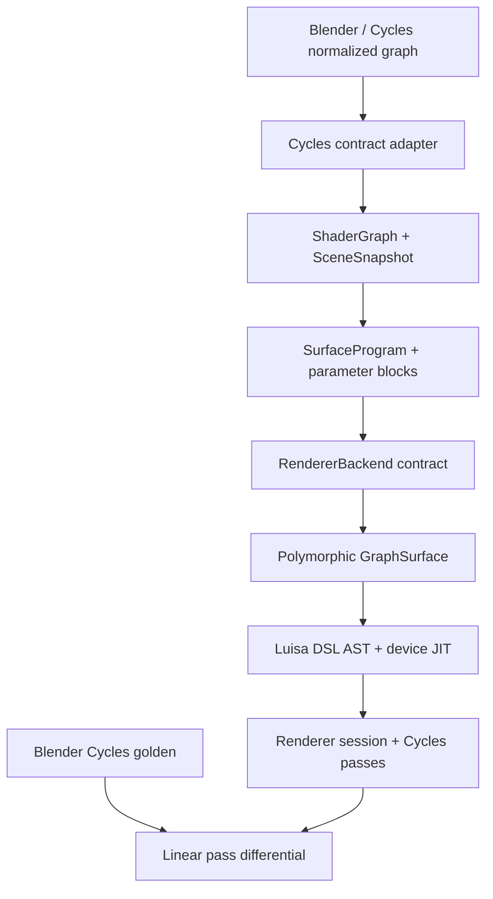

# Architecture

## Decision

Cycles defines what Blender users can express and what results are observable.
It does not define Psycles's kernel list, device memory layout, shader bytecode,
or scheduling strategy.

The repository implements the path from the normalized graph DTO through Luisa
AST construction and device execution. Compatibility is measured directly
against Blender Cycles; Psycles does not contain a second host renderer.

## Stable boundaries

### Cycles adapter

`adapter::CyclesNormalizedShaderGraph` represents the graph after
Cycles-independent semantic normalization and before SVM-specific
multi-closure transformation. `adapt_cycles_shader_graph()` rejects a graph
marked as SVM-lowered; reconstructing a closure tree from bytecode is not a
supported path.

Node lowering is registered by canonical `(Cycles type, variant)` keys. Socket
and property names are mapped explicitly, so a new or renamed Cycles node
produces a coverage diagnostic instead of silently changing its meaning.
Operation-dependent nodes use a canonical variant, for example
`("math", "multiply")`.

The Blender JSON bridge uses ordered `BlenderNodeLoweringComponent` objects
for input/context, value, procedural, and closure families. Components receive
a typed graph-mutation context; node-group recursion, output memoization, and
diagnostic ownership stay in the normalizer. This is a host-side extensibility
boundary only. Components forward raw socket topology, defaults, properties,
and closure composition into `ShaderGraph`; invoking Blender or Cycles to
pre-bake a material is forbidden.

### ShaderGraph

`contract::ShaderGraph` is a typed DAG with three independent roots:

- `Surface` produces a surface closure;
- `Volume` produces a volume closure;
- `Displacement` produces a vector displacement.

Node types are strings registered in `NodeRegistry`, not a closed enum. This is
intentional: a Cycles upgrade that introduces a new node must produce an
explicit coverage failure rather than silently falling back to an unrelated
implementation.

Socket defaults are runtime parameters unless they are declared as static node
properties. The compiler therefore produces two signatures:

- `structure_signature`: node types, topology, socket types, roots, and static
  properties; a change requires DSL/JIT regeneration;
- `parameter_signature`: unlinked socket values; a change may be handled by
  updating parameter storage.

This split is a correctness and invalidation contract. It does not prescribe
how parameters are packed or cached.

### Surface program

`compiler::SurfaceProgram` is a typed, immutable semantic program with one
topologically ordered value instruction stream plus separate surface- and
volume-closure trees.
The unified stream is required for cross-type dependencies such as
texture-color to scalar Math to Principled roughness, and for explicit Cycles
socket conversions. Closure composition remains a tree in both domains; there
is no fixed-size `ShaderClosure[]`.

Every unlinked editable socket becomes a typed `ParameterDesc`. A
`SurfaceParameterBlock` can therefore be regenerated from a new shader graph
without rebuilding the program if its `structure_signature` still matches.
This gives multistage code a precise binding-time boundary:

| Value | Current representation | Update action |
|---|---|---|
| Node topology, static operation, socket type | Program structure | Recompile program |
| Unlinked color, roughness, strength, mix factor | Parameter block | Rebind data |
| Position, normals, incoming direction, tangent | Surface point | Evaluate on device |

`compiler::MaterialLibrary` applies this rule atomically to a scene revision.
If any material fails to compile or bind, the previous library and revision
remain visible.

### Surface dispatch

`luisa_backend::SurfaceDispatch` owns
`luisa::compute::Polymorphic<Surface>`. Integrators dispatch by a runtime
surface tag and consume a uniform semantic protocol:

- BSDF evaluation and sampling;
- emission;
- visibility opacity;
- volume extinction, scattering, and emission coefficients;
- AOV properties;
- static capability metadata.

The dispatch is not treated as legacy scaffolding. It remains in the emitted
DSL. A future compiler pass may fuse or specialize it when proven safe, but
neither the renderer contract nor an integrator is allowed to assume that this
has happened.

The surface protocol exposes semantic values, not a fixed Cycles
`ShaderClosure[]` layout. Each implementation may construct and specialize its
closure tree using ordinary host control flow while tracing Luisa DSL.

`luisa_backend::GraphSurface` is the first implementation. It consumes a shared
`SurfaceProgram`, emits host-specialized Luisa expressions, and obtains runtime
parameters, textures, attributes, and surface differentials from
`ShaderServices`. Implementations visible in a complex scene remain
unverified until focused Cycles probes pass; the authoritative status is
reported by `tools/check_cycles_shader_node_coverage.py`.

`GraphSurface` is compiled as a host-side AST builder rather than implemented
by textual header fragments. Its public header owns an opaque implementation.
The implementation binds each immutable value instruction to a polymorphic
node component, then invokes that component while Luisa is recording a
kernel. Ordinary C++ classes, virtual methods, visitors, and host booleans may
therefore organize shader construction without appearing as device-side
objects, virtual calls, or dynamic branches. The resulting device program
remains one fused Luisa AST. New node families extend the component factory
and a focused translation unit instead of expanding a central shader switch.

`ShaderServices::attribute` returns both the value and an explicit presence
bit. This is required for volume grids: an existing density voxel whose value
is zero is semantically different from a missing `density` attribute, for
which Cycles retains the node's scalar density. Volume coefficient evaluation
also receives an explicit context that carries object-density scaling and
whether emission is observable; shadow and extinction-only evaluations never
infer that context from unrelated surface flags.

Volume phase mathematics is kept outside the path integrator in
`cycles_volume_phase.h`. It exposes normalized phase closures and samples,
while `cycles_fast_math.h` fixes the small set of Cycles numerical
approximations used by fitted Mie parameters. `GraphSurface` emits the
original phase closures through the host-stage `VolumePhaseCollector`
protocol. The combined `Surface::evaluate_volume` boundary returns
coefficients and optionally emits phases from one graph trace. `VolumePhaseSet`
is a separate `.h`/`.cpp` AST-builder component:
it stores closures in device-local memory, merges only exactly equal
family-specific parameters, preserves source order, and keeps the allocation
budget monotonic even when merging compacts live storage, exactly like
Cycles' separate `num_closure`/`num_closure_left` state. It then applies
Cycles' explicit eight-phase copy limit, evaluates the scalar
sample-weighted mixture used for direct lighting, and performs Cycles'
single-closure reservoir selection with random-number reuse for indirect
continuation.

`StackedVolumeEvaluator` is the host-stage aggregation boundary. At one
spatial sample it visits the runtime `VolumeStack` in order, dispatches every
original `GraphSurface` with that entry's parameter block, adds extinction,
scattering, and emission coefficients, and sends all raw phases to one
`VolumePhaseSet`. It deliberately skips merging after stack entry zero and
performs exact family/parameter merging after every later entry, matching
Cycles' `volume_shader_eval()` control flow before the stable first-eight copy.
`VolumeStackEntryPointProvider` is a polymorphic host interface for
object-dependent shader coordinates and density scale; world, mesh, motion,
and grid implementations can evolve without changing stack aggregation.
Neither layer may collapse phase parameters into an averaged anisotropy.

`VolumeStack` is the device-local boundary-state component. Its fixed storage
contains Cycles' mandatory terminator slot, is capped at
`MAX_VOLUME_STACK_SIZE == 32`, and identifies media by the exact
`(object, shader)` pair. Enter transitions append in order, exit transitions
swap the last active entry into the removed slot, and updates are gated by
volume capability plus a transmitted surface label. The same component owns
the extra Psycles dispatch handles needed to evaluate the original volume
graph; those handles do not replace Cycles identity. Camera enclosure discovery
is split between two host-stage components. Each entry also retains its
material's raw Cycles volume-sampling policy. `VolumeStack::sample_method()`
reduces those two-bit technique sets by union: an all-distance or
all-equiangular stack keeps that estimator, while either authored MIS or a
mixed stack produces MIS independent of entry order. This is the exact
algebra implemented by Cycles' `volume_stack_sample_method()`, not a
light-type heuristic. `TriangleVolumeBoundaryComponent`
reuses `TrianglePrimitiveComponent` for exact material/object identity and
reconstructs only the geometric normal needed for front/back classification.
`CameraVolumeStackComponent` performs Cycles' bounded +Z TLAS probe with
volume-only any-hit filtering, exact primitive self identity, the one-ULP
intersection offset, object-only membership tests, and duplicate front-hit
accounting. `VolumeStackCameraInitializer` remains the storage-independent
state machine beneath that traversal.

`PathVolumeStateComponent` installs this boundary state in the real
per-sample path context. It keeps the non-copyable Luisa `Local` arrays alive
through the host-stage pipeline with a move-only owner and initializes
Cycles' `volume_bounce`, `volume_bounds_bounce`, and `optical_depth` state.
Host specialization omits both the local arrays and enclosure ray query from
volume-free kernel ASTs. A volume-enabled path always receives the world
medium and terminator; the +Z probe is emitted only when the camera view plane
may overlap an object volume. After a successful surface sample, the
host-stage component consumes the exact Cycles continuation label and updates
the stack only when `LABEL_TRANSMIT` is present. The entry comes from the same
`TrianglePrimitiveComponent` used by camera traversal and carries the
effective object/shader identity plus raw graph dispatch handles; reflection,
non-volume surfaces, duplicate entrances, and exits therefore use one formal
boundary transition rather than path-local special cases. This call is
absent from volume-free ASTs. `PathVolumeSegmentStage` consumes that same
state before every typed closest event, so free flight and boundary crossing
cannot diverge into separate path-local stack rules.

`VolumeSceneMetadataComponent` performs the matching host preprocessing. It
resolves each instance's effective material slots, transforms the geometry
bound through all eight AABB corners, marks pairwise-overlapping volume
objects, and applies Cycles' conservative stack-size rule: two slots for the
background and terminator, one shared slot for disjoint object volumes, and an
additional slot for every object whose bound intersects another volume, capped
at 32. At render-kernel construction it builds the camera near-view-plane
bound for the actual aspect, projection, shift, near clip, aperture, focal
distance, and aperture ratio. Only overlap with an object-volume bound enables
the +Z enclosure query. A host stack size of zero is solely the Luisa
specialization sentinel for a volume-free scene; it is never exposed as a
Cycles stack size.

The world entry is not identified by its shader alone. BlenderSync creates a
background-light object and Cycles stores that object's index beside the world
volume shader in kernel data. Scene schema v2 therefore exports and imports the
background object index independently of the world material's exact Cycles
shader index; the camera stack never guesses either half of the pair.

`HomogeneousVolumeTransport` is another host-stage AST component. It owns the
analytic segment measure independently of scene traversal: Cycles' weighted
RGB channel choice, bounded exponential sampling and density, scatter-versus-
transmit estimator, transmittance, and the numerically stable emission
integral. The two random inputs retain their official
`PRNG_VOLUME_SCATTER_DISTANCE` and `PRNG_VOLUME_RESERVOIR` identities; phase
sampling remains a later `PRNG_VOLUME_PHASE` operation. The default entry point
uses Cycles' unguided scatter probability, while an explicit-probability entry
point admits the history-dependent VSPG probability without changing the
estimator measure or duplicating its implementation.

`VolumeProgramCapabilityComponent` is the host-side proof boundary for the
currently enabled subset. It recursively follows only values reachable from
the original Volume closure tree and admits a scene to analytic segment
integration only when no reachable spatial value exists. This is a capability
check, not shader preprocessing: accepted programs retain their raw closures
and dynamic parameter buffers, while heterogeneous programs remain intact and
receive a diagnostic.

`HeterogeneousVolumeTracking` is the first component beyond that gate. It
records the local weighted-delta-tracking transition independently of spatial
acceleration: scalar-majorant exponential free flight, Hash Prospector path
offset scrambling, null coefficients, Cycles' throughput/albedo channel
measure, real-versus-null probabilities, absorption-only deterministic
continuation, and both continuation weights. Its result carries an explicit
`majorant_exceeded` predicate. That predicate is a failed preprocessing
contract, not permission to continue with an estimated bound. Majorant
construction, octree traversal, VSPG reservoir selection, and direct-light
MIS are separate components so that none can silently alter this local
measure. Until a sound majorant provider and traversal are connected, the
scene capability gate continues to reject heterogeneous material graphs.

`VolumeMajorantSceneComponent` owns the next host-stage boundary. It maps each
internal instance and its effective material overrides to one object/shader
root for every volume stack candidate, appends the distinct World range,
dispatches the raw `GraphSurface` prepass, reduces each result through the
Cycles hierarchy builder, formally validates each full eight-child tree,
relocates all local indices, and uploads compact node/root/range buffers.
Structurally homogeneous closures use Cycles' one-cell grid; spatially varying
closures use the depth-seven 128-cubed grid. Both evaluate the same sixteen
padded Sobol points per cell and both remain available to the unified
overlapping-root traversal. The ranges form an exact ordered partition and the
World range is always last, so traversal does not depend on host pointer or
map ordering. This component builds acceleration metadata only; it neither
evaluates transport on the CPU nor replaces the original closure graph.

### Scene

`SceneDatabase` stores immutable logical snapshots and accepts a `SceneDelta`
against an explicit base revision. A delta is applied to a candidate copy,
validated as a complete scene, and committed atomically. This lets a Blender
adapter update materials, geometry, instances, cameras, and lights in any
command order without temporarily exposing dangling references.

The scene contract uses stable typed identifiers. It contains no Luisa resource
handles and no Cycles device pointers.

Triangle attributes retain their semantic domain in the contract:
`MeshAttribute<T>` is explicitly point-, corner-, or face-domain. Blender
scene schema v2 preserves shared vertex indices; positions and Generated
coordinates are point attributes, UV/tangent data is corner-domain, and
normals follow Blender/Cycles' point-versus-corner decision. Named attributes
retain their source domain. This mirrors Cycles' triangle attribute lookup
instead of manufacturing a different vertex for every triangle corner.
The schema also retains Cycles' Generated affine transform separately.
Surface shaders interpolate the point attribute; volume shaders transform
their object-space shading point because no surface primitive exists.

### Renderer

`contract::RendererBackend` compiles a snapshot into an opaque
`CompiledScene`; a `RenderSession` then accepts synchronous sample ranges and
writes named pass tiles to an `OutputSink`. This maps cleanly to Cycles
`PathTraceWork::render_samples()` and output tiles without importing
`PathTraceWorkGPU`, `DeviceScene`, or its queue state machine.

The Luisa integrator is assembled by a host-stage `PathKernelPipeline`.
`LuisaRenderSession::initialize()` supplies immutable scene resources,
settings, and existing Luisa callables through `PathKernelConfig`; it does not
contain transport code. While the `Kernel1D` constructor records its AST, the
pipeline invokes typed virtual stages for closest-event handling, surface
reconstruction, surface shading, direct lighting, and closure continuation.
Environment, emissive-mesh, and analytic-light NEE are independently
extensible `DirectLightingComponent` objects.

Volume graph aggregation follows the same host-stage component boundary.
`StackedVolumeEvaluator` owns stack ordering and raw closure accumulation,
while a `VolumeStackEntryPointProvider` builds exact world/object shader
state. The production provider uses scene transforms and Generated metadata;
fixtures can substitute a provider without branching the aggregation
algorithm or introducing a CPU reference renderer.

The stage values are explicit `PathSampleContext`, `PathBounceContext`,
`ClosestPathEvent`, `SurfaceGeometryContext`, and `SurfaceShadingState`
objects. These are C++ AST-builder state, not a device ABI or a wavefront
queue. `PathBounceSetupStage` consumes one Cycles set of Sobol dimensions and
records the closest mesh once. `ClosestEventStage` then produces exactly one
of analytic light, mesh surface, or background, with the event's absolute ray
distance. `ForwardLightStage` resolves a lamp as a transparent event and the
pipeline asks for the next event without consuming another path bounce;
`BackgroundEventStage` terminates the path. Thus the complete free-flight
segment is an explicit boundary before any event contribution is evaluated.
For volume-specialized kernels, `PathVolumeSegmentStage` consumes that
boundary first. Attenuation preserves the event, a phase collision discards it
and restarts the outer path loop, and volume termination ends the path. The
same stage owns the fixed Cycles Sobol dimensions, closest-event roulette
reuse, volume emission/pass accumulation, and the atomic
`cycles_path_state::next_volume()` transition.

Homogeneous volume direct lighting is composed from additional host-stage
objects. `HomogeneousVolumeScatterProbability` owns the VSPG sampling
probability without changing transport weights. `VolumeDirectSampling` owns
the exact Distance/Equiangular/MIS technique algebra, equiangular geometry,
and power heuristic independently of light shape.
`PathVolumeDirectLightingComponent` first asks the selected emitter family
for a proposal and its valid ray interval. After the segment component has
selected a collision distance, a polymorphic
`VolumeDirectDirectionProvider` samples that same emitter again from the
collision point with the original light random coordinates. Analytic and
mesh-emitter providers are composed at the host stage and are selected in the
recorded AST by an explicit emitter kind/index pair. This proposal/re-sample
protocol preserves Cycles' coupled RNG measure while allowing point, spot,
area, triangle, and future light-tree implementations to supply geometry
without branching the homogeneous estimator itself. The component then owns
phase/light MIS, roulette, clamping, and pass routing.
`HomogeneousVolumeShadowComponent` copies the active volume stack and walks
ordered closest boundary events to integrate shadow transmittance. Surface
transparency stays in the shared shadow component. These objects are ordinary
C++ abstractions while the resulting device work remains one fused path
kernel.

`VolumeAnalyticLightSampling` specializes the host-stage point/spot geometry
contract without duplicating the transport pipeline. In particular, the spot
segment proposal retains Cycles' zero-attenuation samples and visible-sphere
cap, while the collision-position method delegates to the ordinary spot
measure. `AreaLightSampling` similarly owns the authored-primitive segment
proposal, the exact spread-clamped rectangle/circle/ellipse collision
proposal, and known-hit evaluation. Surface NEE, volume NEE, and analytic
forward intersections all construct their AST through this object;
`path_kernel_area_light` maps the shared `LightGpu` flags and axes once.
`TriangleLightSampling` owns the corresponding three triangle measures:
area sampling for the volume-segment proposal, position-dependent
solid-angle/area sampling at the final collision, and known-hit PDF
evaluation. `EmissiveTriangleComponent` adds instance geometry, Cycles'
negative-scale orientation convention, side selection, and evaluation of the
original raw emission closure; surface NEE, forward-hit MIS, and
`VolumeMeshLightComponent` all construct their AST through that boundary.
`VolumeLightInterval` independently maps the original segment to spot, area,
or one-sided triangle geometric support. This separation prevents
radiometric rejection, proposal measure, and interval algebra from becoming
emitter-specific branches inside the homogeneous estimator.

Heterogeneous transport is split at the same semantic boundaries.
`VolumeMajorantPrepass` records the raw Luisa volume graph at the same
sixteen padded Sobol-Burley positions Cycles uses for every cell of its
128-cubed grid. Cell addressing is x-fast, sample index is
`cell_index * 16 + sample`, and the bake state is camera visibility, zero
path state and direction, and time `0.5`. The ordinary polymorphic
`SurfaceDispatch` and `VolumeStackEntryPointProvider` construct the shader
AST, so this pass evaluates the original closure graph rather than a
host-side material surrogate. It reduces the maximum extinction or emission
channel, then divides the entry-invariant object-density scale out of the
cell extrema exactly where Cycles does.

`VolumeMajorantHierarchyBuilder` consumes those extrema and reduces them into
Cycles' eight-contiguous-child hierarchy. It applies the current depth-seven and
`range * node_diagonal * volume_scale > 1.442` split rule and records the
object-bounds-to-`[1, 2)` transform. The builder is host acceleration-metadata
code only: it neither evaluates a material nor acts as a CPU transport
oracle. Cycles obtains each cell's extrema from sixteen padded Sobol samples,
so this hierarchy is a sampled estimate rather than a mathematical proof of
an upper bound. The transport contract detects a sampled extinction above the
stored estimate and follows the explicit Cycles correction path.

`VolumeMajorantTraversal` records a single-root Luisa hierarchical DDA. It
mirrors positive ray axes, derives octants and common ancestors from IEEE-754
mantissa bits, walks parent links without a device stack, and preserves
Cycles' root-extrema tail for an implicit medium whose active segment extends
beyond the root bounds. Overlapping volume-stack reduction remains a separate
component so single-root adjacency, multi-root interval selection, and
coefficient accumulation cannot silently acquire different traversal rules.
`HeterogeneousVolumeTracking` independently owns exponential candidate
distance and the throughput/albedo-weighted real/null collision measure.
Scene-side prepass resources now compose the first two stages; production
transport will consume them only after the multi-root interval reducer is
connected.

Volume-scattering probability guidance is persistent render-session state,
not path-local policy. The path kernel accumulates Cycles' raw scatter,
primary-transmit, and optical-depth statistics in dedicated per-pixel buffers.
All Combined contributions pass through one classification method so the
`PRIMARY_TRANSMIT` priority and primary-volume shadow-state override cannot
diverge between emitters. `VolumeGuidingFilter` owns two independently
compiled Luisa passes that implement the signed-RGBE horizontal and vertical
filter. `SampleDispatchPartition` composes ordinary dispatch limits with the
Cycles cumulative 1, 2, 4, 8, ... history boundaries; the session filters
after a boundary only when another sample remains. Denoised RGBE history is
constant during a dispatch, while the raw optical-depth mean is derived again
for every sample from the mutable running sum/count. That distinction makes
fused and split sample batches the same estimator.

The Combined buffer also follows Cycles' internal film convention: its fourth
component stores accumulated transparency, not alpha. Session readback first
normalizes all samples and only then computes
`saturate(1 - transparency)`, independently of exposure. Transparent
background termination and volume-primary-transmit guiding therefore share
one source value without per-event alpha approximations.

The pipeline owns the path loop, the top-level builder owns the sample loop,
and the setup/film module owns accumulation. This makes `$break` scope and
cross-stage lifetime formal while retaining one fused device kernel, the
original expression construction order, and the original Cycles
RNG-dimension order. A new transport feature extends a component or a typed
context instead of relying on textual inclusion into another function's
lexical scope.

Triangle reconstruction is a pair of composable host-stage components.
`TrianglePrimitiveComponent` is the shared semantic boundary for instance and
geometry lookup, face material selection, instance overrides, smooth flags,
Cycles shader/object identity, and material capability bits. It produces the
same `VolumeStackEntry` identity that camera and path boundary traversal
consume. Exact exported Cycles shader indices take precedence; a stable
per-scene material identity keeps renderer-neutral contract scenes usable when
that optional diagnostic identity is absent. `TriangleGeometryComponent`
builds on the primitive component and emits the remaining bindless attribute
reads and domain-index selection once while Luisa records the kernel.
Closest-hit shading, emissive-mesh evaluation, and transparent-shadow
evaluation depend on these interfaces rather than duplicating resource-slot
arithmetic. Generic named attributes use the same domain model through
`ShaderServices`; individual shader nodes never decide whether an attribute
index is a point, corner, or face index.

### Cycles differential contract

Official Blender Cycles is the sole rendering oracle. A regression case owns
one `.blend`, frame, camera, sampling configuration, and pass list. Blender
emits linear multilayer EXR; Psycles exports the same evaluated scene and
renders it through Luisa. The comparator reports per-pass RMSE, relative error,
high-percentile error, invalid pixels, and an error image. Small node probes
isolate formula or socket differences before a full-scene failure is accepted.

Image residuals are localized with the versioned
[per-path trace](cycles-path-trace.md). Diagnostic-only Cycles instrumentation
observes existing CPU/HIP kernel state without consuming RNG dimensions or
changing transport branches. Psycles emits the same indexed schema from Luisa
fallback/HIP/Vulkan. Random values and discrete transitions are exact gates;
continuous values and accelerator-specific triangle-edge ties use documented
numeric and topological equivalence rules.

The Luisa `fallback` backend is useful on hosts without a supported GPU, but it
is still the Luisa AST/JIT implementation. It must not be confused with an
independently written CPU renderer.

## Explicit non-goals of the current milestone

- No SVM interpreter or SVM stack ABI.
- No recreation of Cycles `KernelData` or `IntegratorStateGPU`.
- No material clustering, dispatch grouping, or scene-specific switch
  rewriting.
- No wavefront-versus-megakernel decision.
- No closure-array size limit.
- No approximate implementation labeled as Cycles-compatible.
- No OSL execution path yet.
- No compatibility claim based only on a full-scene image or an unverified
  node implementation.

## Next implementation slices

1. Add the in-Blender extractor that copies normalized, pre-SVM
   `cycles::ShaderGraph` objects into the adapter DTO.
2. Complete camera, scene data, RayQuery, surface dispatch, transport, film,
   and pass semantics through Luisa DSL/JIT.
3. Run the same micro-scenes and Lone Monk through official Cycles and the
   Luisa executor, adding node/socket and statistical BSDF tests before
   expanding coverage.
4. Expand ShaderGraph coverage, derivatives/bump, textures, attributes, and
   the remaining closure semantics from coverage failures.
5. Only after semantic coverage is stable, add schedule IR and compiler-level
   surface-dispatch fusion experiments.
