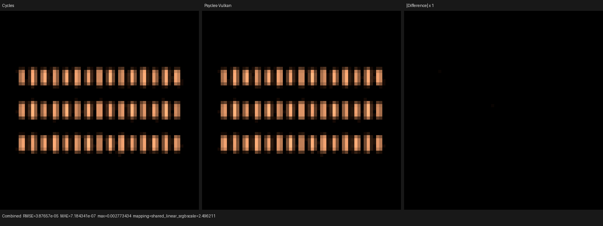

# Maintainability audit

This audit tracks source structure independently from Cycles feature coverage.
Line count is only a screening signal: a large table or a collection of small
probe builders is less risky than one function that records an entire path
integrator.

The baseline below was measured on `main` at `4e022f4`, excluding
`third_party`, build outputs, assets, and generated validation images.

The working target is at most 2,000 lines per hand-written source file.
Generated sources, imported third-party code, and declarative data tables are
reported separately rather than split mechanically. Exceeding the target
requires a documented reason and a semantic decomposition plan.

## Baseline

The screened C++, headers, and Python sources contain 57,613 lines. The main
concentration points are:

| File | Lines | Concentration | Risk |
|---|---:|---|---|
| `tools/create_cycles_shader_probe.py` | 5,518 | More than 100 independent probe builders; largest builders are feature matrices | Medium |
| `include/psycles/luisa/graph_surface.h` | 4,882 | One class; `trace_values()` spans about 2,350 lines | Critical |
| `src/adapter/blender_scene.cpp` | 4,440 | Graph normalization and scene decoding share one file; `lower_natural_output()` spans about 1,900 lines | Critical |
| `src/luisa/path_tracer_kernel.cpp` | 3,978 | Almost the whole file is one `LuisaRenderSession::initialize()` function | Critical |
| `src/compiler/surface_program.cpp` | 2,416 | `SurfaceProgramBuilder::lower_node()` spans about 1,540 lines | Critical |
| `src/luisa/path_tracer_scene.cpp` | 1,865 | `compile_scene()` owns most scene validation, material compilation, uploads, and acceleration setup | High |
| `include/psycles/luisa/cycles_noise.h` | 1,386 | One mathematical feature family split into many helpers | Medium |
| `tests/test_main.cpp` | 1,226 | Independent contract cases in one executable | Medium |

The first five critical entries combine size with a single dispatch function
or class. They make reviews harder, increase recompilation fan-out, and tempt
new features to cross semantic boundaries.

## Complete first-party scan

The 2026-07-31 scan covered every first-party C/C++ source and header, Python
module, CMake source, and `.inl` file: 143 files and 59,835 lines. It excluded
only `third_party`, build trees, and generated validation artifacts. The
initial scan found exactly five hand-written files over 2,000 lines:

| File | Baseline lines | Planned semantic modules |
|---|---:|---|
| `tools/create_cycles_shader_probe.py` | 5,518 | camera/light, closure, texture, color/value, and graph-composition probe families |
| `include/psycles/luisa/graph_surface.h` | 4,882 | value evaluation, closure construction, closure sampling, and trace ABI |
| `src/adapter/blender_scene.cpp` | 4,440 | scene decoding, graph normalization, and natural-output lowering by node family |
| `src/luisa/path_tracer_kernel.cpp` | 3,789 | path state/RNG, traversal, shading, direct lighting, volume, and film |
| `src/compiler/surface_program.cpp` | 2,416 | typed node lowering split by value, texture, and closure families |

The next largest hand-written source is
`src/luisa/path_tracer_scene.cpp` at 1,865 lines, so it is below the hard
screening threshold but remains on the high-risk watch list.

`docs/cycles-shader-nodes-4.5.10.json` is 7,691 lines. It is a generated,
declarative Cycles node inventory rather than hand-written executable code and
is intentionally kept as one versioned compatibility contract.

## Progress

The first path-kernel slice moved Cycles camera dimensions and primary-ray
construction into `path_tracer_camera.{h,cpp}`. The kernel decreased from 3,978
to 3,789 lines, the new implementation file is 244 lines, and old/new
differential renders are byte-identical. The extraction added fallback, HIP,
and Vulkan camera tests and is documented under
`validation/2026-07-31/camera-vulkan`.

The `GraphSurface` implementation is now partitioned along renderer semantics:
state and value access, Cycles scattering, value evaluation by node family,
raw closure traversal, and the public surface/volume API. The public
`graph_surface.h` facade decreased from 4,882 to 41 lines; its largest
implementation fragment is 966 lines. The fragments remain in class and
dispatcher context intentionally: this preserves Luisa DSL callable
visibility, expression construction order, and generated AST control flow.
Every extracted source range was checked byte-for-byte against the original
header before compilation.

The complete scan now covers 153 source files and 60,008 lines, with four
remaining files over 2,000 lines. The `psycles.source_size` CTest contract
rejects every new over-limit first-party source and rejects growth in the four
explicitly budgeted debt files. A debt entry is removed as soon as its
semantic decomposition reaches the target.

The split passed the 32-worker full build and all 42 CTest contracts. A
64×64, 256 spp material fixture was then rendered through fallback, HIP, and
Vulkan. All 13 linear passes from each backend (39 PFM files total) are
byte-identical to their pre-split baselines; all three Combined outputs have
SHA-256
`4ac47cfe7d528e14da89e116f1dffd3b8dbf6536f8ff0817d87ef66a4f3409b0`.
The existing Cycles/Psycles triptych below remains the visual record for this
fixture because the current Psycles panel is byte-identical:

## Target boundaries

The path tracer is split by renderer semantics:

- session resource allocation and immutable kernel parameters;
- camera sample and primary-ray construction;
- path state and Cycles RNG dimensions;
- closest-event traversal and self-intersection policy;
- surface shading and data-pass extraction;
- direct-light and forward-light estimators;
- volume stack, free-flight, phase sampling, and volume direct lighting;
- film/pass accumulation and diagnostic path tracing.

The material stack is split by compilation stage:

- Blender JSON and binary scene decoding;
- Blender node-tree normalization by node family;
- typed value-program lowering by node family;
- surface closure evaluation/sampling;
- volume closure coefficients and phase functions;
- textures, procedural nodes, and color operations.

Probe-generation modules are grouped by feature family only after the runtime
critical files are under control. Their current size has lower correctness
risk because the functions are independent and the generated `.blend` files
are checked against Cycles.

## Refactoring rules

Structural commits must not change renderer semantics. Each slice therefore:

1. moves one named responsibility behind an explicit internal interface;
2. keeps runtime kernel arguments, material parameter binding, and RNG
   dimension consumption unchanged;
3. uses the 32-thread full build and complete CTest suite;
4. runs focused fallback, HIP, and Vulkan device fixtures for touched DSL
   code;
5. runs the relevant Cycles/Psycles differential probe when a refactor can
   affect emitted AST control flow or numerical ordering;
6. records compile-stage or render-performance changes when a callable
   boundary changes generated code.

Feature work must use the new boundary instead of appending code back to a
known concentration point. File size is re-measured after each structural
checkpoint.
