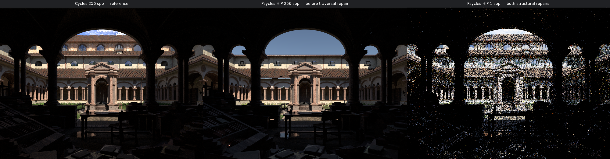
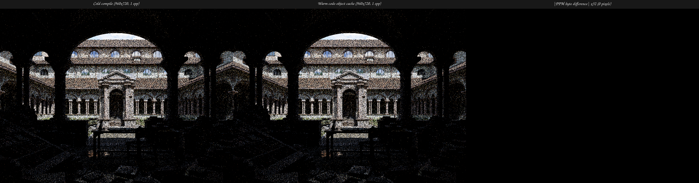
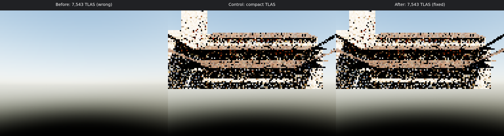
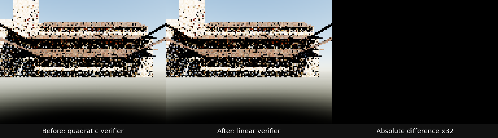

# Lone Monk backend diagnostics — 2026-07-29

This record separates the backend findings made after the Filter Glossy
alignment boundary:

- the historical full-scene Luisa HIP result is faster than Psycles Vulkan by
  its reported render timer, but is not a valid Cycles performance comparison
  because it dropped visible scene instances;
- the GFX12 large-TLAS traversal defect responsible for that structural miss
  is fixed and regression-tested in Luisa
  `next@3dc93b4c632e423e2ff44e308a2ff4656332f78a`;
- the independent cumulative HIPRT high-quality BLAS-build failure is fixed by
  stream-owned, ordered RT scratch reuse in Luisa
  `next@b417e17ef`;
- unnamed HIP shaders now use a validated final-code-object cache in Luisa
  `next@2282ffd6b`, reducing the complete 960×720 Lone Monk warm process from
  the historical `474.38 s` to `3.72 s`;
- generic XIR use-list verification is now linear in operand/use-list count in
  Luisa `next@a7118069e`, and CFG-version-scoped construct-entry dominance
  reuse follows in `next@8c7d1bf88`; lazy, observation-equivalent if-batch
  post-dominance rebuilding follows in `next@ad4fdcedd`; exact loop-boundary
  selection-relation materialization follows in `next@a73f7da96`, and exact
  enclosing-loop-exit relation materialization follows in
  `next@4e8a506eb`; together they reduce a matched strict-native Vulkan
  shader-cache miss from `205.982 s` to `26.4000 s`;
- the current strict-native Vulkan cold JIT is dominated by formal XIR CFG
  restructuring, not by CMake compilation, SPIR-V validation, or rendering.

The historical full HIP quality and performance result remains unaccepted
because it predates both repairs. A corrected high-sample Cycles comparison
still requires a fresh full-scene render; the two structural blockers no
longer prevent that render.

Cycles remains the only rendering oracle. No CPU renderer, sampler, BSDF
mirror, material baking, exposure fit, or image-space correction was used.
The compared scene is the current Blender/Cycles
`main@4fe17ef6be5d46251fa5e7dbff9018efb1c719d5` Lone Monk export with 350
geometries, 7,543 instances, 35 original raw material graphs, and 47 images.

## HIP timing is nominal, not accepted

The full 1440×1080/256 spp HIP attempt used the same bounded 8-spp dispatch
contract as the accepted Vulkan result:

```bash
python tools/measure_amd_vram.py \
  --output psycles-hip-1440x1080-256-vram.json \
  --interval 0.05 -- \
  build/bin/psycles_render_blender_scene \
  export-filter-glossy-main-4fe17ef6 \
  psycles-hip-1440x1080-256.ppm \
  hip 1440 1080 256 8
```

The process returned zero and reported 350 geometries, 7,543 instances, and
37 runtime material programs. Scene compilation took `2.91319 s`, the main
shader JIT took `75.8138 s`, render-only took `24.8549 s`, and the complete
monitored command took `104.524574 s`. Peak VRAM was 6,267,981,824 bytes,
2,164,301,824 bytes above the pre-launch baseline. The raw measurement is
[psycles-hip-1440x1080-256-vram.json](psycles-hip-1440x1080-256-vram.json).

If the image were correct, the render timer would be `1.310816×` Cycles HIP,
or 31.08% slower with `0.762883×` throughput. It would also be 9.43% lower
than Psycles Vulkan's `27.4415 s`. Those are diagnostic timer ratios only.
They are excluded from accepted performance claims because the rendered
workload is observably incomplete. The last valid same-device comparison
therefore remains Psycles Vulkan at `1.447230×` Cycles, or 44.72% slower.

The HIP EXR SHA-256 is
`ee9d239c227ff74b0bd92ca4e6a77f5155b2164be875c761343c67b49b173afa`.
The complete numerical comparison is
[hip-cycles-full-report-1440x1080-256.json](hip-cycles-full-report-1440x1080-256.json).
Every pass contains 1,555,200 finite pixels, but finite output is not the same
as correct output:

| Pass | HIP/Cycles luminance | RMSE | Relative RMSE |
|---|---:|---:|---:|
| Combined | `1.035310×` | `0.936863` | `0.585152` |
| Diffuse Color | `0.970970×` | `0.0619081` | `0.325513` |
| Diffuse Direct | `0.741783×` | `5.57446` | `0.608458` |
| Diffuse Indirect | `0.756938×` | `0.310153` | `0.765124` |
| Glossy Direct | `0.748428×` | `2.43645` | `0.562742` |
| Glossy Indirect | `0.738040×` | `0.243809` | `0.639734` |
| Emission | `0` | `0.732399` | `1.0` |
| Normal | — | `0.140065` | `0.251993` |

The Combined mean happens to be close because missing shaded geometry is
replaced by a bright sky contribution. Pass-local energy and spatial error
show that this is cancellation, not agreement.

### Original-resolution visual inspection

The following real triptychs were generated with one source pixel per panel
pixel and opened at original resolution:

- [Combined](hip-triptychs/combined.png)
- [Normal](hip-triptychs/normal.png)
- [Diffuse Color](hip-triptychs/diffcol.png)

All three independently show the same structural defect. The upper central
church storey and roof present in Cycles are absent in Psycles HIP, and the
background is visible through the resulting hole. The Normal panel contains
the same missing region, proving that the failure precedes lighting-pass
classification and EXR packing. Foreground books, arches, columns, and many
other instances remain visible, so this is not a total acceleration-structure
failure.

At the exact 64×48/1 spp seed used for a backend smoke check, HIP and Vulkan
differ in 2,487 of 3,072 pixels above `1e-6`; the same missing geometry is
visible. A controlled diagnostic changed both mesh and top-level
acceleration-structure build hints from the default high-quality mode to
`PREFER_FAST_BUILD`. It changed 507 pixels relative to the default HIP result
but did not restore the church/roof instances. The source was then restored
and rebuilt with all 32 jobs. This rejects build-hint selection as a
sufficient explanation and motivated separating instance transforms, TLAS
cardinality, and traversal state in the next isolation.

The first 12-instance isolation attempt then exposed an earlier HIPRT
boundary while retaining all 350 BLAS inputs. Near the 288th high-quality
geometry build, HIPRT's `oroModuleLaunchKernel` returned `invalid argument`
and the process aborted. An immediate repeat reached the same region, stayed
at 100% GPU, and eventually produced an AMDGPU `gfxhub` page fault for an
unmapped page in the HIPRT build. Geometry 288 (`Plane.017`) has 313,392
finite vertices and 104,464 triangles; all indices are in range, with no
duplicate-index or zero-area triangles. Thus malformed basic mesh data is not
a sufficient explanation. This builder/lifetime failure and the full-scene
missing-instance result may share a cause, but that relationship is not yet
claimed. The next regression boundary is the smallest ordered mesh set that
reproduces the HIPRT fault.

## HIPRT mixed-size BLAS scratch lifetime

Prefix minimization made the failure deterministic:

- the first 347 ordered Lone Monk geometries build successfully;
- adding geometry 347, `leaf.002`, makes the 348-geometry prefix fail;
- `leaf.002` itself contains only six finite vertices and two valid,
  nondegenerate triangles, and succeeds when built alone;
- all 348 meshes contain finite positions, in-range indices, no
  duplicate-index triangles, and no coordinate above `1e6` in magnitude.

This rejects a malformed or individually oversized final mesh. A second
synthetic control built 400 copies of the same tiny mesh successfully, which
also rejects a simple resource-count limit. The relevant variable is the
ordered distribution of builder scratch sizes.

The HIP backend previously allocated and freed a temporary buffer around
every HIPRT BLAS/TLAS build with `hipMallocAsync` and `hipFreeAsync`. Three
controlled scheduling experiments separated source-upload visibility from
scratch lifetime:

| Experiment | Result |
|---|---|
| synchronize only after the complete command list | fails |
| synchronize immediately before each mesh build | passes |
| synchronize immediately after each temporary-buffer free | passes |
| replace per-build alloc/free with stream-owned scratch | passes |

The third row is decisive: the following mesh's uploads can remain
asynchronous, while observing the preceding scratch free removes the failure.
The repair therefore follows the actual lifetime invariant:

> Every temporary acceleration-structure scratch use on one stream is totally
> ordered. Successive uses may alias one stream-owned allocation, whose
> lifetime must cover all submitted uses.

Each HIP stream now retains one power-of-two scratch allocation. BLAS, motion
BLAS, procedural, curve, and TLAS builders reuse it in stream order. A larger
request synchronizes that stream before replacing the old allocation; normal
builds perform neither a transient allocation nor a transient free. Stream
destruction drains submitted work before releasing the allocation. This
removes the failing allocator interaction without a per-build global or host
synchronization.

The regression
`src/tests/unit/runtime/test_hip_rt_scratch_reuse.cpp` uses fully synthetic
geometry with the minimized production primitive-count distribution: 348
mixed-size high-quality BLAS builds, followed by a TLAS and one exact ray per
instance. It asserts the exact instance index for every ray.

The same regression is red on the old backend: it creates 288 geometries,
completes 287 builds, then aborts with HIPRT
`oroModuleLaunchKernel: invalid argument`. With stream-owned scratch it
completes all 348 builds and passed five consecutive runs with 348 assertions
per run. A timed fixed run completed in `1.67 s` with 479,712 KiB peak
resident memory. The corresponding old run aborted in `1.38 s`; its shorter
time is only time-to-failure.

The final backend also passed:

| Suite | Backend | Assertions |
|---|---|---:|
| accel visibility | HIP and Vulkan | `131` each |
| accel build modes | HIP and Vulkan | `300` each |
| curve bounds | HIP | `17` |
| curve ray query | HIP | `96` |
| motion instance device operations | HIP | `132` |
| matrix motion instance | HIP | `80` |
| SRT motion instance | HIP | `104` |
| motion mesh | HIP | `470` |
| motion ray query | HIP | `145` |
| motion workgroup rows | HIP | `40` |
| static motion instance | HIP | `276` |

All affected targets were rebuilt with 32 jobs. The real 350-geometry,
12-instance church/roof isolation then completed on HIP instead of faulting.
Its production kernel JIT took `342.837 s`, while the 64×48/1 spp render took
`0.00351008 s`. The output PPM and multilayer EXR SHA-256 values are
`7e78fb7aa941aa6f9fe9d17ea5ae4058733e54dac7d769e251cbea43f1ff0f5f`
and
`a7b143c5ae5705714e607e2b4c44ba830bc89d876a15cd536d9c44ae31175170`.
Visual inspection shows the same church and roof silhouette as the compact
HIP and Vulkan controls. This is a structural builder check, not a
high-sample Cycles quality or performance acceptance.

Finally, both repairs were exercised together on the complete export: 350
geometries, 7,543 instances, 37 runtime material programs, and the original
raw closure graphs. The 960×720/1 spp resolution preserves the 4:3 Cycles
reference camera and exceeds 480p. The run returned zero and wrote both PPM
and multilayer EXR output. The PPM and EXR SHA-256 values are
`7ad7fa45601eba224b3ae1af74ff194b1bcc0a8e75968448db87a4dc96f5b987`
and
`48ec65735eb84a73994d651ec0860c8af0c50402acbfaa14b60e4e4dd6be06fe`.

The following real triptych was opened and inspected at original panel
resolution. The left panel is the 256-spp Cycles reference, the center panel
is the historical 256-spp HIP result before the traversal repair, and the
right panel is the corrected 1-spp structural smoke:

[](hip-triptychs/full-structural-repair.png)

The repaired panel restores the upper church storey, its roof, and the side
openings that were absent from the historical HIP image. All major silhouette
structure visible in Cycles is present. The triptych SHA-256 is
`0eeb6cc4bf7dcdb59e75ce40b0e1a543ce8d3fe607a6c72028b887355c08e0ad`.
The right panel intentionally remains noisy at one sample, so this triptych
is proof of combined BLAS/TLAS structural correctness, not image-quality
equivalence.

Scene compilation took `2.89075 s`, shader JIT took `470.854 s`, and the
actual 960×720 render took `0.14634 s`; the complete process took `474.38 s`
at 99% average CPU and 3,464,112 KiB peak resident memory. HIP LLVM codegen
took `28.4741 s`, then the 5,025,984-byte module spent another `394.166 s`
in post-emission LTO and module loading. No Cycles speed ratio is reported for
this one-sample smoke. Follow-up inspection found that the HIP backend ignored
`ShaderOption::enable_cache` for unnamed AST shaders, explaining why every
production process repeated the cold JIT. The next section records the
completed repair.

The machine-readable record is
[hip-rt-scratch-reuse.json](hip-rt-scratch-reuse.json).

## HIP unnamed shader code-object cache

The cache defect was first made red without Lone Monk. A `MemoryBinaryIO`
regression compiled the same exact kernel on independent HIP devices. The old
backend returned correct arithmetic values but performed zero cache reads and
zero cache writes; 12 assertions failed because every device repeated
AST→XIR→LLVM generation.

The repair treats a cache key as an index, not proof of identity. A canonical
identity encodes the kernel AST hash, AMDGPU architecture, selected wave size,
LLVM/HIP/HIPRT versions, driver/runtime versions, codegen revision,
register/fast-math/debug options, effective XIR switches, autodiff state, and
the full native-include bytes. The 64-bit hash of this identity names the
`BinaryIO` entry, but a hit is accepted only after all of the following:

1. byte-for-byte comparison of the complete stored identity;
2. versioned artifact framing and payload-hash validation;
3. independent comparison of argument types/usages, block size, curve bases,
   RT requirements, stack ABI, debug/register options, architecture, and wave
   size.

Thus a hash collision can at worst cause a recompile, never a false hit.
Missing, stale, truncated, corrupt, oversized, or metadata-incompatible
entries are recompiled and replaced.

The persisted payload is the final owned AMDGPU code object, not an
intermediate LLVM module. On a miss, HIP LLVM emits bitcode, hipRTC links it
once, and the backend copies the result out of the temporary link state before
destroying that state. Module loading and later cache writes use the owned
bytes. On a hit, shader creation occurs before AST translation and directly
loads the final object. Named AOT packages retain their existing version-1/2
LLVM-bitcode ABI. Bound resources are also deliberately excluded from the
persisted payload: each hit reconstructs current buffer, texture, bindless,
and acceleration-structure handles from the current `Function`.

The regression
`src/tests/unit/runtime/test_hip_shader_cache.cpp` now has 27 assertions. It
covers a cold write, a cross-device hot hit, cache-disabled zero I/O,
fast-math key separation, corruption of the code-object payload followed by
safe repair, and cross-device reconstruction of a captured buffer handle. It
passed five consecutive runs. The cache and final-code-object path also passed
two complete runs of the affected HIP suite:

| Suite | Assertions |
|---|---:|
| shader cache | `27` |
| curve ray query | `96` |
| motion instance device operations | `132` |
| matrix motion instance | `80` |
| SRT motion instance | `104` |
| motion mesh | `470` |
| motion ray query | `145` |
| motion workgroup rows | `40` |
| static motion instance | `276` |
| ray-query pipeline | `154` |
| signed texture I/O | `8` |
| mixed-size RT scratch | `348` |
| wave-size and named AOT | `6` |

All targets were built with `--parallel 32`.

### Full Lone Monk cold/warm validation

The exact repaired full scene was rendered twice at 960×720/1 spp: 350
geometries, 7,543 instances, 37 runtime material programs, and the original
raw Blender closure graphs. The first run populated an empty HIP cache; the
second was a new process and hit both HIP entries before AST translation.

| Metric | Historical uncached | Repaired cold | Repaired warm |
|---|---:|---:|---:|
| scene compilation | `2.89075 s` | `3.01963 s` | `2.89772 s` |
| shader JIT | `470.854 s` | `75.9298 s` | `0.195888 s` |
| render-only | `0.14634 s` | `0.20948 s` | `0.150765 s` |
| complete process | `474.38 s` | `80.24 s` | `3.72 s` |
| peak resident memory | `3,464,112 KiB` | `2,574,044 KiB` | `1,781,976 KiB` |

The repaired cold path generated 5,025,984 bytes of LLVM bitcode, linked a
6,220,856-byte code object in `0.967090 s`, wrote a 6,222,143-byte validated
artifact, and loaded it in `0.004294 s`. The warm process loaded the same RT
object in `0.003035 s`, with no AST, XIR, LLVM, or hipRTC-link stage. This is
`21.57×` faster than the repaired cold process and `127.52×` faster than the
historical process; its JIT timer is `2403.69×` faster than the historical
JIT. These are shader-startup measurements, not Cycles render-throughput
claims.

The cold PPM SHA-256 remained
`7ad7fa45601eba224b3ae1af74ff194b1bcc0a8e75968448db87a4dc96f5b987`,
identical to the previous structural smoke. One of five additional warm
processes produced the same byte-identical PPM. The following real triptych
uses that cold/warm pair; its third panel is the absolute PPM byte difference
amplified 32×:

[](hip-triptychs/hip-code-object-cache.png)

The difference panel is black: zero of 691,200 tone-mapped pixels differ. The
triptych SHA-256 is
`672cd95f04298850186f79aa93506aee5bc0c9563bdecd1ac7d601cab145a38d`.
It was opened at original resolution. Both panels preserve the complete
church, roof, side wings, and openings, with no visible cache-path regression.

Repeatability was audited rather than hidden. Five identical warm
code-object loads reported `0.19334–0.198625 s` shader JIT and
`3.63–3.71 s` complete process time, but zero to two isolated PPM pixels
varied from the cold run. The only observed coordinates were `(891,283)`,
`(539,484)`, and `(523,485)`. Across the multilayer EXR comparisons, at most
two pixels exceeded `1e-6`; the largest channel error was `16.5717` at an
isolated high-energy path. Since identical hot-cache runs vary among
themselves and one hot PPM exactly matches cold output, this is tracked as a
pre-existing HIPRT/path repeatability issue rather than a cold-vs-cache code
semantic difference. It does not affect the structural visual conclusion,
but exact full-scene determinism is not claimed.

The machine-readable record is
[hip-shader-code-object-cache.json](hip-shader-code-object-cache.json).

## GFX12 large-TLAS traversal overflow

The controlled invariant is independent of Lone Monk:

> Adding instances whose visibility mask excludes every tested ray must not
> change any previously visible hit.

The regression builds one visible triangle twice. The baseline TLAS contains
only that instance. The padded TLAS contains 1,024 overlapping instances,
with instance 8 visible and every other instance assigned visibility mask
zero. For the same ray and mask, the exact result must remain a surface hit:

| Query form | Baseline | Padded |
|---|---:|---:|
| closest instance | `0` | `8` |
| any hit | `true` | `true` |
| committed ray-query instance | `0` | `8` |
| committed hit type | `Surface` | `Surface` |

Before the repair, the padded result could become a miss even though the
baseline passed. Increasing the GFX12 LDS short stack merely moved the
failure to a larger TLAS and was rejected as a solution.

RDNA4's `ds_bvh_stack_push8_pop1_rtn` short stack is circular. Its raw
overflow sentinel is `0xffffffff`, while normal terminal underflow is
`0xfffffffe`. The previous HIP wrapper exposed both outcomes to traversal as
the same `InvalidValue`, so overflow silently discarded unvisited BVH nodes.
The repair preserves this distinction and follows two callback-safe policies:

- closest-hit and unsuccessful any-hit traversal restart from the original
  ray on a cold, out-of-line checked software stack; a witnessed any-hit is
  already sufficient and need not restart;
- resumable ray queries retain a software traversal stack in their persistent
  state, because restarting after a candidate callback could replay observable
  user code.

Both software paths trap on their explicit capacity boundary rather than
converting stack exhaustion into a miss. This is a traversal-state invariant,
not a scene-, instance-, transform-, or node-index special case.

The final 1,024-instance regression passed six HIP runs on the RX 9070 XT
(five consecutive runs plus one after rebasing onto the latest Luisa
`origin/next`), with 131 assertions per run. The same test passed Vulkan with
131 assertions. The following HIP suites also passed:

| Suite | Assertions |
|---|---:|
| accel build modes | `300` |
| motion ray query | `145` |
| static motion instance | `276` |
| matrix motion instance | `80` |
| SRT motion instance | `104` |
| motion mesh | `470` |

All affected targets were rebuilt with `cmake --build ... --parallel 32`.
Exploratory overlapping-TLAS runs at 7,543 and 16,384 instances also passed
before the diagnostic size override was removed from the committed
regression.

### Real-scene isolation and visual inspection

The real-scene check retains the 12 Lone Monk church/roof geometries and all
7,543 TLAS entries. The other 7,531 entries reference a valid geometry with
visibility mask zero. This makes the large input observationally equivalent
to the 12-instance compact control while retaining the production 37-program
material kernel. The large-scene `scene.json` SHA-256 is
`9738546aa71039ad9fda341a6ff0c5a92387896e436fcd95d44665f28743b100`.

The production shader cache was disabled for exactly one post-repair render,
then immediately restored and rebuilt with all 32 jobs. At 128×96/1 spp, the
old large TLAS produced only the environment. The repaired large TLAS restores
the same church and roof structure visible in the compact control. The real
triptych below was opened and inspected at original nearest-neighbor scale:

[](hip-tlas-overflow/visibility-padding-triptych.png)

The triptych SHA-256 is
`c2516418af2a0e479178293139b4959603a70350b03ffdb87a4ea17b0c9c1ec5`.
The repaired PPM and multilayer EXR SHA-256 values are
`2194385806e16d383736e9f3d2254fca112bb24bd2451d483a36b5be72f7e9f0`
and
`1a44df0bbe50fcb69be4345e1de58809565df7869d5904c6e4193efa6d1783b2`.
This low-spp isolation proves structural traversal correctness only; it is
not a Cycles quality or speed acceptance result.

The uncached command completed in `352.20 s` at 98% average CPU and
2,626,968 KiB peak resident memory. Psycles reported `351.277 s` for shader
JIT and `0.108312 s` for the tiny render. HIP LLVM code generation took
`26.5791 s` and emitted 4,180,808 bytes; the timestamped interval from code
emission to the completed LTO/module-load message was another `268.872 s`.
Thus this production HIP cold JIT is also effectively single-core and needs
separate performance work. The tiny 1-spp render timer is deliberately not
compared with Cycles. The machine-readable record is
[hip-gfx12-tlas-overflow.json](hip-gfx12-tlas-overflow.json).

## Strict-native Vulkan cold-JIT profile

The timing input retains all 350 geometries, 35 raw material graphs, and 47
images, but selects only 12 church/roof instances. This keeps the production
37-program material kernel while providing the next HIP isolation boundary.
Its `scene.json` SHA-256 is
`21ad3042c3e06eb2ccdc4294ef550cd1ca5efe5965eae7946f5ac461f7d95ce1`.

The production shader cache was temporarily disabled for this one run so that
an interrupted earlier compile could not turn the measurement into a cache
hit. The exact production kernel and strict-native configuration were used:

```bash
env LUISA_XIR_DISABLE_OPTIMIZATION=1 \
    LUISA_SPIRV_OPT_LEVEL=0 \
    LUISA_VULKAN_REQUIRE_NATIVE_XIR_SPIRV=1 \
    LUISA_XIR_TRACE_PASSES=1 \
    LUISA_LOG_LEVEL=verbose \
  build/bin/psycles_render_blender_scene \
  church-roofs vk-128x96-1.ppm vk 128 96 1 1
```

The cache setting was restored immediately afterward, followed by a
32-thread rebuild. The worktree was clean after restoration. The complete
bounded measurement is
[vulkan-jit-stages.json](vulkan-jit-stages.json).

| Cold-JIT stage | Seconds | Share of `240.23 s` |
|---|---:|---:|
| AST to XIR | `16.1140` | `6.71%` |
| Complete SPIR-V XIR legalization | `148.5515` | `61.84%` |
| └ `destructure-cfg` | `15.6820` | `6.53%` |
| └ `restructure-cfg` | `132.0029` | `54.95%` |
| Native SPIR-V emission | `37.9740` | `15.81%` |
| SPIR-V validation | `1.1970` | `0.50%` |
| Result/property handoff | `0.1610` | `0.07%` |
| RADV compute-pipeline creation | `36.0230` | `15.00%` |
| Other timestamp gap | `0.2095` | `0.09%` |

The stages account for the entire reported JIT within timestamp resolution.
The full process took `241.13 s` and peaked at 3,471,716 KiB resident memory.
The emitted module contains 2,672,528 SPIR-V words and 26 bindings.

The legalization input to the large definition contains 1,654 blocks,
208,018 instructions, 534 raw conditional terminators, and one raw indexed
terminator. `destructure-cfg` lowers 2,262 ifs, five switches, ten loops,
33 simple loops, and 39 breaks. Pre-restructure `reg2mem` then reports
361,084 hoisted allocas. `restructure-cfg` consumes `132.0029 s` while
creating 2,483 structured selections, 46 loops, and eight switches. The
post-boundary `mem2reg` promotes 359,804 allocas and completes in only
`0.4133 s`.

The process averaged approximately 198% CPU during the long passes. Thus
`cmake --build --parallel 32` correctly uses all requested build workers, but
cannot make this single shader's largely two-core JIT use 32 threads. The
formal CFG round trip is the first optimization target: eliminating only
SPIR-V validation would save about 0.5%, while improving
`restructure-cfg` addresses about 55% of cold JIT. Any repair must preserve
the existing structured-CFG invariants and regressions; replacing it with
scene-specific shortcuts would be invalid.

### Linear verifier and lazy CFG analysis reuse

The fine-grained trace showed that the apparent CFG cost was mostly a generic
verifier complexity defect. Every instruction operand asked whether its exact
`Use` node was linked into the referenced `Value`'s use-list, and the old
predicate answered by linearly scanning that complete list. For a value with
degree `d`, its `d` operands therefore performed `d²` pointer comparisons.
Shared constants and other high-fanout values made the total cost
`Σ degree(value)²`; the same verifier also ran during AST-to-XIR translation,
CFG destructuring, and native SPIR-V emission.

The repair in Luisa `next@a7118069e` materializes the exact ownership relation
once per referenced intrusive use-list:

```text
owner(use) = value  iff  use is linked in value.use_list
```

An operand is valid exactly when `owner(operand_use) == operand_value`.
Because an intrusive `Use` node has at most one list owner and verification
does not mutate use-lists, this is equivalent to the old membership predicate.
It changes the work to `O(use-list entries + membership queries)` without
skipping or weakening validation. Detached `Use` nodes and nodes linked into
the wrong `Value` remain errors.

Six strict-native shader-cache-miss runs used the same scene, executable,
environment, trace mode, and warm RADV pipeline cache. The Psycles shader
cache was disabled for each measurement and then restored, followed by a
32-job rebuild:

| Stage | Before | Linear verifier | + dom reuse | + lazy post-dom | + boundary relation | + enclosing exits | Before→final |
|---|---:|---:|---:|---:|---:|---:|---:|
| Reported shader JIT | `205.982 s` | `43.7438 s` | `39.7430 s` | `35.0676 s` | `29.8203 s` | `26.4000 s` | `7.802×` |
| AST to XIR | `15.8589 s` | `0.8458 s` | `0.8661 s` | `0.8593 s` | `0.8467 s` | `0.8658 s` | `18.317×` |
| `destructure-cfg` | `16.0259 s` | `0.8228 s` | `0.7897 s` | `0.8145 s` | `0.8161 s` | `0.8012 s` | `20.003×` |
| `restructure-cfg` | `133.1675 s` | `34.8932 s` | `30.7910 s` | `26.0943 s` | `20.9433 s` | `17.4074 s` | `7.650×` |
| Native SPIR-V emission boundary | `38.517 s` | `4.805 s` | `4.848 s` | `4.853 s` | `4.801 s` | `4.897 s` | `7.865×` |
| SPIR-V validation | `1.177 s` | `1.165 s` | `1.224 s` | `1.232 s` | `1.189 s` | `1.197 s` | `0.983×` |
| Complete process | `207.32 s` | `44.62 s` | `40.60 s` | `35.92 s` | `30.66 s` | `27.24 s` | `7.611×` |

The earlier `240.23 s` profile included a `36.023 s` cold RADV pipeline
creation, while the six matched runs above spent only `0.178 s`, `0.164 s`,
`0.165 s`, approximately `0.168 s`, `0.162 s`, and `0.163 s` respectively
between SPIR-V validation and pipeline readiness.
It is retained as historical stage context, not mixed into the controlled
speedup.

Inside `restructure-cfg`, 69 preflight verifier calls and 46 post-transform
calls fell from a combined `103.574685 s` to `5.332960 s`, a `19.422×`
speedup. They previously consumed 77.78% of the pass. Output structure did not
change: both runs emitted 2,483 selections, 46 loops, eight switches, 14
canonicalizations, 2,672,528 SPIR-V words, and 26 bindings.

The operation-count regression creates 8,192 arithmetic instructions sharing
one constant. It requires 16,386 exact membership queries, two distinct
use-list scans, and exactly 16,386 scanned entries, then separately corrupts
one operand by detaching its `Use` and by linking it into a different,
already-materialized owner's list. Both corruptions must still be rejected.

The next trace exposed a separate analysis-reuse defect.
`enforce_unique_construct_entries` inspected 5,070 constructs across the
transactional dry run and replay, and each no-change construct independently
built the same dominator tree. Dominance is a property of the executable CFG,
not of the construct being queried. Luisa `next@8c7d1bf88` therefore retains
one tree under the explicit invariant:

> The cached dominator tree is valid exactly while no CFG mutation has
> occurred since it was built.

Every successful edge rewrite invalidates the tree before the next dominance
query. No-change constructs and fixed-point rescans reuse it. On the
production input, committed-CFG dominance builds fell to 11 and
`enforce_unique_construct_entries` fell from `4.057765 s` to `0.012144 s`
(`334.14×`). The complete `restructure-cfg` pass fell from `34.893210 s` to
`30.791002 s`; the full JIT fell from `43.7438 s` to `39.7430 s`.

The corresponding operation-count regression creates 256 valid structured
ifs in one immutable CFG version and requires exactly one construct-entry
dominator build.

The remaining if-batch trace then exposed an independent eager-analysis
defect. After every successful if rewrite, the old implementation rebuilt
both dominance and post-dominance even when the next candidate could infer
its merge from dominance and never read post-dominance. Luisa
`next@ad4fdcedd` implements the following query protocol:

> Dominance is refreshed after every CFG mutation. Post-dominance may remain
> stale only until a candidate actually needs it; immediately before that
> query, it is rebuilt for the current CFG version.

This is observation-equivalent to eager rebuilding: every post-dominance
query sees exactly the CFG version it would have seen before, while analyses
that no query consumes are omitted. A stronger-looking shortcut was tested
and rejected. Holding the initial batch post-dominator snapshot caused
`restructure_roundtrips_loop_switch_nested_break_continue` to grow to 67
blocks, violating its existing strict bound of fewer than 64. Newly inserted
structural merge nodes can become the correct nearest merge, so an old-node
post-dominance argument is insufficient. The threshold was not weakened and
that experiment was not committed.

On the production shader, total post-dominator builds fell from 5,276 to 376
(`14.032×` fewer) and their nested time fell from `4.653498 s` to
`0.194341 s` (`23.945×`). The if batches fell from `9.948389 s` to
`5.320990 s` (`1.870×`), `restructure-cfg` fell from `30.791002 s` to
`26.094309 s`, and full JIT fell from `39.7430 s` to `35.0676 s`.
The committed-CFG report records 31 lazy if-batch post-dominator rebuilds.

The operation-count regression uses 64 chained diamonds under a one-iteration
budget. All merges remain inferable from the refreshed dominance tree, so it
requires exactly zero post-mutation post-dominator rebuilds. All 48
`unit_xir` tests passed in parallel, including 197 verifier assertions and
1,042 `restructure_cfg` assertions.

Fine-grained timing of the remaining post fixed point then localized
`9.548347 s` of its `11.545715 s` to `drain_selection_exits`. For every
selection site, that phase recomputed the same predicate by traversing every
structured loop region:

```text
boundary(entry) iff
    exists loop:
        entry is structurally reachable inside loop
        and entry's IfInst is a break/continue boundary selection for loop
```

Luisa `next@a73f7da96` materializes this exact existential relation once per
observed CFG version. It walks each loop region once, inserts every accepted
entry into a set, then answers all selection-site queries by exact membership.
No rewrite occurs while those queries run. A successful rewrite ends the
scan, and the next scan rematerializes the relation from the new CFG. The old
and new predicates are therefore equivalent; work changes from
`O(selection sites × loop-region traversal)` to
`O(loop-region traversal + selection membership queries)`.

The production committed CFG performed 8,855 selection-site queries with 45
relation materializations. In matched phase-instrumented runs,
`drain_selection_exits` fell from `9.548347 s` to `4.121415 s` (`2.317×`),
the post fixed point fell from `11.545715 s` to `6.279925 s` (`1.839×`),
`restructure-cfg` fell from `26.066859 s` to `20.943270 s`, and full JIT fell
from `35.0935 s` to `29.8203 s`. The existing 256-structured-if immutable-CFG
regression now additionally requires exactly one boundary-relation
materialization and exactly 256 site queries. All 48 `unit_xir` tests pass,
with 1,044 `restructure_cfg` assertions. All affected targets were built with
`--parallel 32`, and the production shader cache was restored afterward.

The remaining drain time exposed the same issue in a second relation. Each
selection site `h` traversed every function block to rediscover structured
loops and compute:

```text
enclosingExits(h) =
    union boundaries(L)
    for every structured loop L where header(L) dominates h
```

Luisa `next@4e8a506eb` extracts the structured-loop descriptors once and
materializes this relation for the current CFG and DomTree. It inserts exactly
the same non-null loop prepare, update/body, and merge blocks selected by the
old predicate. Every successful selection-exit rewrite ends the scan; the
caller rebuilds dominance and both relations before querying the changed CFG.
This changes the scan from `O(selection sites × function blocks)` to
`O(function blocks × structured loops + selection membership queries)`
without changing its accepted edges.

The production shader made 8,836 enclosing-loop queries. The added
operation-count regression requires 256 exact queries under the same single
relation build used by its 256 structured selections. In the matched run,
`drain_selection_exits` fell from `4.121415 s` to `1.249035 s` (`3.300×`),
the post fixed point fell from `6.279925 s` to `3.388372 s` (`1.853×`),
`restructure-cfg` fell from `20.943270 s` to `17.407391 s`, and full JIT fell
from `29.8203 s` to `26.4000 s`. The output remains byte-identical. All 48
`unit_xir` tests pass with 1,045 `restructure_cfg` assertions; the production
cache was again restored with a 32-job build.

The matched original, intermediate, and final cached-relation PPM files all
have SHA-256
`5a29d7d24876e89969714331b08e5c6ca23932a729a58f43878bcddd364ed587`.
The following real triptych was opened at its original 1536×428 resolution.
The source panels use 4× nearest-neighbor display scaling, and the third panel
is the absolute byte difference amplified 32×:

[](vulkan-xir-verifier/use-list-triptych.png)

The difference panel is completely black (`max channel difference = 0`), and
both rendered panels show the same church/roof structure. The triptych
SHA-256 is
`a547529633afa51cec740b3374cfe0d013214dece4f956050c7d7f002b39f642`.
This 128×96/1 spp run is deliberately a compiler and structural-semantic
regression, not a Cycles image-quality or render-throughput acceptance.

After all five repairs, `restructure-cfg` still takes `17.4074 s`, or 65.94%
of the remaining `26.4000 s` JIT. Its stable large costs are now main
restructuring iterations (`4.9776 s`, including `4.8078 s` in if batches),
verification (`5.2027 s` across nested pre/post calls), the post fixed point
(`3.3884 s`, including `1.2490 s` in selection-exit draining), and the final
selection-reentry count (`1.2638 s`). These timers are nested and must not be
added as independent totals. If-batch candidate work is the largest remaining
transform-specific optimization boundary.

The complete machine-readable before/after record is
[vulkan-xir-verifier-scaling.json](vulkan-xir-verifier-scaling.json).
