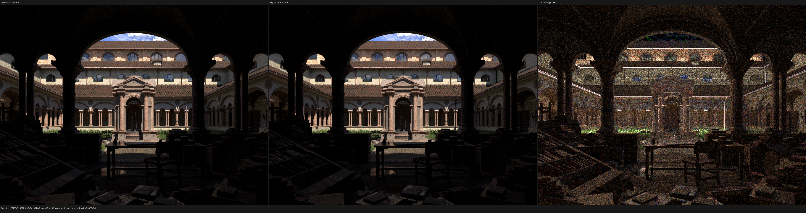
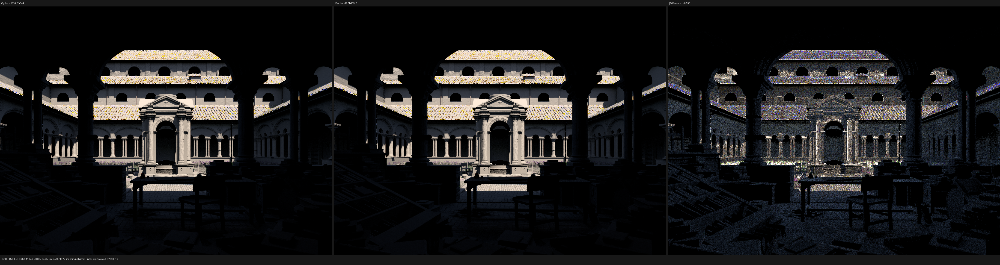
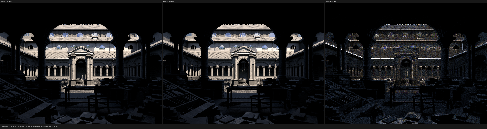

# Lone Monk current-head rerun

## Verdict

This is the first 1440×1080/256 spp Lone Monk rerun after the path-oracle,
light-sampling, explicit RNG-state, Light Path, ordered transparent-shadow,
and Luisa fallback-opacity checkpoints landed. It uses committed Psycles
`main@6b365b893a92de4e1649e452adc6b8baa69b1bea` and a freshly exported
final-render scene bundle.

The new result is mixed and remains a red compatibility checkpoint. Diffuse
Direct improves substantially, and Diffuse Indirect energy is almost exact,
but the complete Combined differential regresses because Glossy Direct and
Glossy Indirect diverge more strongly. This result must not be summarized as
an across-the-board improvement merely because the focused feature probes
pass.

## Exact inputs

| Item | Value |
|---|---|
| Psycles | `main@6b365b893a92de4e1649e452adc6b8baa69b1bea` |
| LuisaCompute | `next@30b1f3659ddd7303eacf60b1c812d91ce919c32d` |
| Blender/Cycles | `main@16d7a3a413e7`, Blender 5.3 Alpha |
| GPU | AMD Radeon RX 9070 XT |
| Scene | `lone-monk_cycles_and_exposure-node_demo.blend` |
| Scene SHA-256 | `4250d4205d8d01cefd98c15e81021d6dead540b2923797378bf7b32e96e8b8f7` |
| Extent / samples | 1440×1080 / 256 fixed spp |
| Seed | 0 |
| Sample dispatch | 8 spp |
| Export | 348 geometries, 87,541 instances, 35 source materials, 47 images |
| Exported `scene.json` SHA-256 | `065dee3d082af1d50db430f6eba22c0cce4f305814022558d3e4df014fa2980d` |
| Exported `geometry.bin` SHA-256 | `d7b2bd0c2e0d1f9df5dc0d355f540f9aac4adb108f4afccaa0f50a3d6b6e7d9b` |

Cycles adaptive sampling and denoising were disabled. Both renderers wrote
un-denoised, linear, full-float multilayer OpenEXR passes. The Blender scene
was exported again with the current exporter; no earlier scene bundle or
Psycles image was reused. The original node trees and closure topology remain
the material input, without Cycles pre-evaluation or image-space fitting.

The build immediately before rendering used all 32 requested jobs:

```bash
TMPDIR=/var/tmp/psycles-compiler-tmp \
  cmake --build build --parallel 32
ctest --test-dir build --output-on-failure -j32
```

All `36/36` tests passed.

The authoritative render, export, and Psycles render commands were:

```bash
/home/mike/Projects/blender-install-4fe17ef6/blender \
  /home/mike/Downloads/lone-monk_cycles_and_exposure-node_demo.blend \
  --background --python-exit-code 1 \
  --python tools/render_cycles_golden.py -- \
  cycles/hip.exr 1440 1080 256 \
  --cycles-device HIP --device-name "Radeon RX 9070 XT"

/home/mike/Projects/blender-install-4fe17ef6/blender \
  /home/mike/Downloads/lone-monk_cycles_and_exposure-node_demo.blend \
  --background --python-exit-code 1 \
  --python tools/export_psycles_scene.py -- export

build/bin/psycles_render_blender_scene \
  export psycles/hip.ppm hip 1440 1080 256 8
```

## Numeric result

Every recorded pass contains 1,555,200 valid pixels and zero invalid pixels.
The complete machine-readable result is [report.json](report.json).

| Pass | RMSE | Relative RMSE | Mean-luminance ratio | Maximum absolute error |
|---|---:|---:|---:|---:|
| Combined | `0.1357200` | `0.0847688` | `0.9897740` | `12.102625` |
| Diffuse Color | `0.0079731` | `0.0419227` | `1.0012931` | `0.240877` |
| Diffuse Direct | `0.3832541` | `0.0418326` | `1.0088066` | `79.719223` |
| Diffuse Indirect | `0.2749000` | `0.6781577` | `1.0001636` | `197.764709` |
| Glossy Color | `0.0014660` | `0.0206970` | `0.9989715` | `0.089464` |
| Glossy Direct | `0.6085926` | `0.1405656` | `0.9748340` | `60.057526` |
| Glossy Indirect | `0.1877012` | `0.4925126` | `0.9584347` | `24.917551` |
| Normal | `0.0136975` | `0.0246433` | n/a | `0.734882` |
| Emission | `0.0007082` | `0.0009670` | `0.9996702` | `0.091694` |
| Environment | `9.2014e-6` | `0.0059435` | `0.9951865` | `0.014200` |
| Transmission Color / Direct / Indirect | `0` | `0` | both zero | `0` |

The previous 1440×1080/256 result was produced before the subsequent
background, path-state, light, RNG, Light Path, and transparent-shadow work.
Re-evaluating that saved Psycles EXR against the newly rendered Cycles EXR
reproduces its old metrics, so the comparison below is not a Cycles rerender
artifact:

| Pass | Previous relative RMSE | Current relative RMSE | Previous luminance ratio | Current luminance ratio |
|---|---:|---:|---:|---:|
| Combined | `0.0457377` | `0.0847688` | `1.0155957` | `0.9897740` |
| Diffuse Direct | `0.0628800` | `0.0418326` | `1.0165751` | `1.0088066` |
| Diffuse Indirect | `0.6278091` | `0.6781577` | `1.0119081` | `1.0001636` |
| Glossy Direct | `0.0544777` | `0.1405656` | `1.0105737` | `0.9748340` |
| Glossy Indirect | `0.4751512` | `0.4925126` | `0.9913578` | `0.9584347` |
| Diffuse Color | `0.0419552` | `0.0419227` | `1.0012681` | `1.0012931` |
| Normal | `0.0240748` | `0.0246433` | n/a | n/a |

Diffuse direct-light per-pixel agreement and energy both improve. Diffuse
Indirect energy moves from 1.19% high to 0.016% high, despite a larger
finite-sample per-pixel residual. In contrast, Glossy Direct changes from
1.06% high to 2.52% low and Glossy Indirect changes from 0.86% low to 4.16%
low. The resulting Combined energy is 1.02% low instead of the previous 1.56%
high.

This establishes a scene-level glossy/MIS/sampling-sequence regression but
does not, by itself, identify which implementation change is causal.
Convergence, per-event traces, and focused glossy path probes are required
before changing renderer code.

## Original-resolution visual inspection

Each image below is Cycles HIP on the left, Psycles HIP in the middle, and an
independently amplified absolute difference on the right.

### Combined



Camera framing, final-render grass density, architecture, coarse silhouettes,
material placement, and large-scale illumination remain aligned. The
difference is nevertheless structured: bright roof and eave lines, curved
arches and columns, vegetation boundaries, glossy detail, and indirect-light
noise are visible. It is not an image flip, missing-instance failure, or
uniform exposure offset.

### Diffuse Direct



Diffuse Direct is visibly closer in energy and spatial structure than the
earlier checkpoint, consistent with the numeric improvement.

### Glossy Direct



Glossy Direct exposes the current regression most clearly. Roof edges,
high-frequency tiles, arches, windows, vegetation, and foreground glossy
surfaces contain coherent residuals, while total pass luminance is 2.52% low.

Triptych SHA-256 values:

- Combined:
  `ef17995e1e822462f1ff626617384fd225390470cd8629575e35f9b193532d5b`;
- Diffuse Direct:
  `ef900ede49b56f8490ecced707ec9721aef102bb2dfcbf2db1f296e82877f7ef`;
- Glossy Direct:
  `6ae47b6b51fc70705bd2df9e716f5d3e65a036be43d078f13816d70953c68661`.

## Performance and repeatability

| Renderer / run | Scene compile | Shader JIT | Render |
|---|---:|---:|---:|
| Cycles HIP | included | included | `19.455 s` |
| Psycles HIP cold | `3.490 s` | `237.907 s` | `39.978 s` |
| Psycles HIP warm | `3.308 s` | `0.332 s` | `41.252 s` |

Psycles render-only is therefore `2.05×` to `2.12×` slower than Cycles HIP
in these two runs. The cold main HIP kernel spent `20.741 s` in AMDGPU
codegen and `213.156 s` linking runtime bitcode; cold compilation is reported
separately from render throughput.

The two Psycles runs are not bit-identical because parallel GPU accumulation
can change floating-point reduction order. Their Combined RMSE is
`3.6029e-4`, only about 0.27% of the Cycles/Psycles Combined RMSE, and every
compared pass has zero invalid pixels. The complete repeatability report is
[cold-vs-warm.json](cold-vs-warm.json).

The uncommitted EXR payloads are intentionally omitted because each complete
image is approximately 119–131 MB. Their identities are retained here:

- Cycles HIP EXR SHA-256:
  `973d1c78e13a84ab9596b7690cf4a248b342ca3165b9d41589a70520ae03e7c2`;
- Psycles HIP cold EXR SHA-256:
  `be24d54c3ffb7e32200aae1fcc654d1902d46cc92f51b086bacc0f0c93cd2098`;
- machine-readable report SHA-256:
  `3cb6119b061b93a88b3ee485050d17011e9d0384561d41ec485c002256b8b3c1`.
