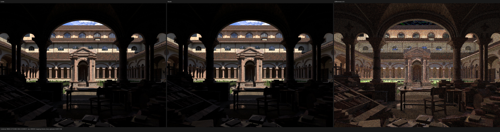
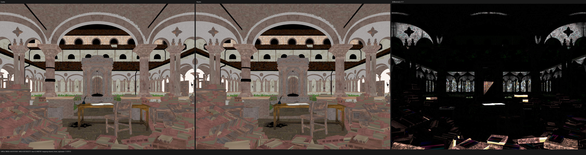
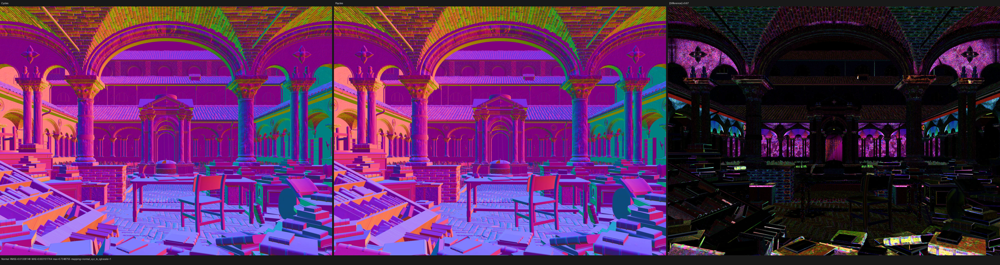

# Lone Monk camera and reconstruction-filter validation

This checkpoint validates the camera-sample convention and Cycles' finite
film-filter lookup table independently from the remaining world-light sampling
work. It is intentionally not a claim that Lone Monk is fully aligned.

## Corrected invariants

Psycles stores the output image with a top-left row origin, while Cycles forms
film coordinates from a bottom-left pixel row. For output row `y` in an image
of height `h`, the Cycles pixel hash therefore uses `h - 1 - y`, and the
vertical reconstruction-filter sample is complemented. Lens samples use the
same Shirley--Chiu concentric disk mapping as Cycles.

Cycles does not invert its reconstruction-filter CDF analytically at render
time. It builds a 1024-entry inverse-CDF table and linearly interpolates that
finite table. Psycles now builds and uploads the same table for BOX, Gaussian,
and Blackman--Harris filters. The last zero-valued sentinel is preserved.

Canonical 128x128, 1024-sample HIP probes against Blender/Cycles
`main@16d7a3a413e77928ef953eb8a4734c726addf880` measured:

| Probe | Combined energy ratio | Relative RMSE |
|---|---:|---:|
| Depth of field, disk aperture | 0.999995078 | 0.000131877 |
| Blackman--Harris 1.5 px | 1.000003521 | 0.000072793 |

The regressions reject the former continuous inverse-CDF approximation even
though its total energy was close, because it did not reproduce Cycles'
finite-sample edge coverage.

## Lone Monk full-scene rerun

The authoritative and Psycles images use the final-render dependency graph
with 80,000 rendered grass children, AMD HIP on the same Radeon RX 9070 XT,
1440x1080 output, 256 fixed samples, seed zero, adaptive sampling disabled,
denoising disabled, and linear full-float multilayer OpenEXR.

The complete report is
[report-1440x1080-256.json](report-1440x1080-256.json).

| Pass | RMSE | Relative RMSE | Mean-luminance ratio |
|---|---:|---:|---:|
| Combined | 0.0732286 | 0.0457376 | 1.015596 |
| Diffuse Color | 0.0079793 | 0.0419552 | 1.001268 |
| Diffuse Direct | 0.576083 | 0.0628800 | 1.016575 |
| Diffuse Indirect | 0.254490 | 0.627808 | 1.011908 |
| Glossy Direct | 0.235867 | 0.0544777 | 1.010574 |
| Glossy Indirect | 0.181085 | 0.475152 | 0.991357 |
| Normal | 0.0133815 | 0.0240748 | n/a |
| Emission | 0.000711 | 0.000971 | 0.999672 |

Psycles' warm-JIT rendering loop took 41.1409 seconds; scene/acceleration
compilation took 2.8624 seconds and cached shader loading took 0.2206 seconds.
The authoritative Cycles HIP render call for this 1440x1080/256 setup took
19.0588 seconds, so the current Psycles rendering loop is 2.159x as slow.

## Visual inspection

Each triptych is Cycles on the left, Psycles in the middle, and scaled absolute
difference on the right.

### Combined

### Diffuse Color

### Normal

The exact film table materially improves silhouette and normal
correspondence, including the grass band. Visual inspection still shows
different high-frequency noise and a brighter Psycles direct-light result.
That remainder is real and this checkpoint does not accept it as random
noise.

## Remaining discrepancy and falsification record

The following paired experiments were run before changing the lighting code:

- Replacing the grass closure with diagnostic emission gave a 0.999482 energy
  ratio and 0.0000119 absolute RMSE, ruling out final-render child count,
  transforms, camera/DOF, film filtering, and primary-hit coverage.
- A high-sample Nishita diffuse plane gave a 0.999905 Diffuse Direct ratio; a
  smooth diffuse sphere gave 0.999591. This rules out a general Nishita energy
  or diffuse-closure defect.
- Disabling shadow visibility for all grass source objects changed Cycles'
  full-image Diffuse Direct mean by only 0.063%, while the Psycles/Cycles
  difference remained 1.748%. Grass self-shadow masks and the basic ray-origin
  offset are not the root cause.
- Setting `light_sampling_threshold` to zero left the normal-MIS Diffuse
  Direct ratio at 1.017512, ruling out light-sample roulette.
- At 640x480/256, next-event-estimation-only raised the Diffuse Direct ratio
  to 1.051470, while forward-only produced unstable solar-disc fireflies and
  a 0.701299 ratio. These modes isolate the unresolved finite-sample behavior
  to environment-light direction sampling and its MIS PDF.

Cycles samples one background direction from a mixture of a 512x256
importance CDF with weight one and the detected solar disc with weight four,
and evaluates the same mixture PDF for both NEE and forward MIS. Psycles at
this checkpoint still uses a uniform-sphere sky estimate plus a separate sun
estimate. Although that estimator is unbiased on simple diffuse probes, it
does not match Cycles' variance or finite-sample behavior in Lone Monk. The
next correction is therefore the unified Cycles world-CDF/sun distribution,
not a grass-material compensation or a case-specific shadow patch.
