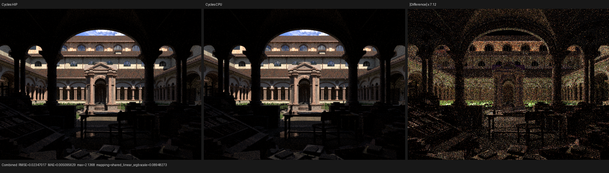
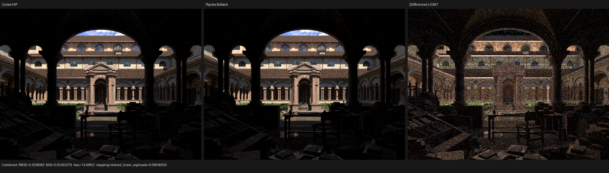
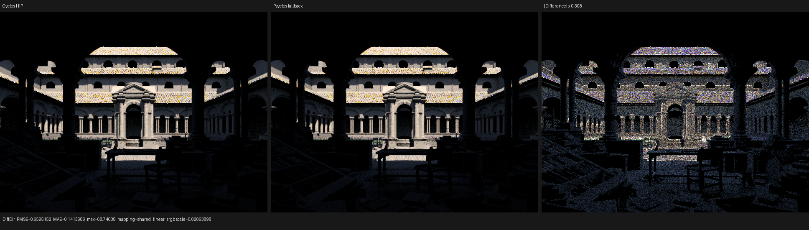
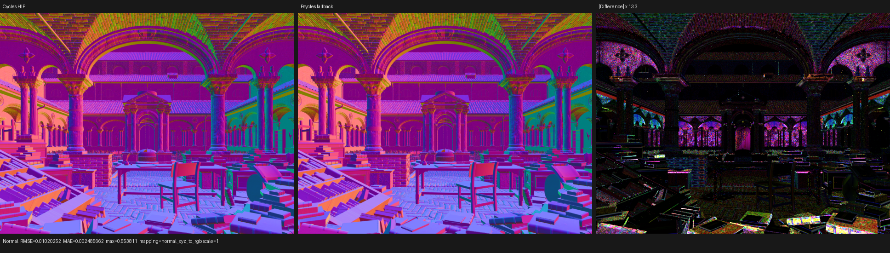
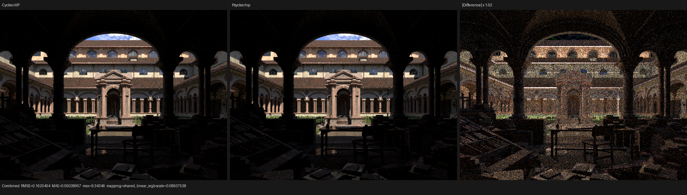
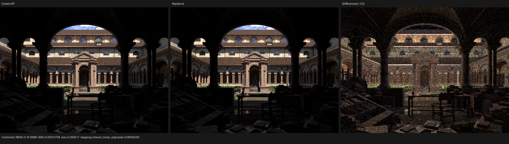

# Lone Monk five-renderer benchmark

## Verdict

The first canonical five-renderer scene run completed at 640×480 and 64 fixed
samples per pixel:

- Cycles CPU;
- Cycles HIP on the Radeon RX 9070 XT;
- Psycles/Luisa fallback;
- Psycles/Luisa HIP;
- Psycles/Luisa Vulkan.

All five paths produced finite multilayer EXRs, and all seven Cycles-reference
differential reports have zero invalid pixels in every compared pass. The
fallback world-ray repair is effective in the complete scene: fallback is no
longer black or missing direct illumination after instanced ray-query
callbacks. This does **not** close rendering parity. Psycles Combined relative
RMSE remains `0.1037`–`0.1307` against Cycles HIP, and indirect-light
per-pixel differences remain large at 64 spp.

## Exact inputs

| Item | Value |
|---|---|
| Psycles | `main@4b247e6` |
| LuisaCompute | `next@a4251d4ec` |
| Blender/Cycles | `main@16d7a3a413e7`, Blender 5.3 Alpha |
| Scene | `lone-monk_cycles_and_exposure-node_demo.blend` |
| Scene SHA-256 | `4250d4205d8d01cefd98c15e81021d6dead540b2923797378bf7b32e96e8b8f7` |
| Export | 348 geometries, 87,541 instances, 35 source materials |
| Exported `scene.json` SHA-256 | `6fff503e4c7dd66ee157469f081c283bd58db0a0fbfe831ebc0318607d35f98b` |
| Exported `geometry.bin` SHA-256 | `251f48411c84c84028703d41f8b1fd71d201eff2acd9a2c337dc4cea097fce2d` |
| Extent / samples | 640×480 / 64 fixed spp |
| Seed | scene-owned seed zero |
| Cycles CPU | AMD Ryzen 9 9950X3D, explicitly selected |
| Cycles HIP | AMD Radeon RX 9070 XT, device id `HIP_AMD Radeon RX 9070 XT_0000:03:00` |
| Psycles Vulkan | AMD Radeon RX 9070 XT through RADV GFX1201 |

The source `.blend` enables adaptive sampling and denoising. The authoritative
Cycles script disables both before rendering; Psycles always renders the same
requested fixed 64 samples and emits un-denoised linear passes. The exporter
retains the source settings and therefore reports the expected diagnostic
warnings instead of silently claiming support.

The exact command and all subprocess records are in
[benchmark.json](benchmark.json). The build immediately before this run used
`cmake --build build --parallel 32`; all 26 Psycles CTest groups passed, and
the surface-ray regression passed separately on fallback, HIP, and Vulkan.

## Render performance

The primary comparison is renderer-reported render time. Scene compilation,
shader JIT, and process wall time are retained separately.

| Renderer | Scene compile | Shader JIT | Render | Process wall | Relative to Cycles HIP |
|---|---:|---:|---:|---:|---:|
| Cycles CPU | n/a | included by Cycles | 5.2116 s | 5.6933 s | 2.706× slower |
| Cycles HIP | n/a | included by Cycles | 1.9263 s | 2.4040 s | reference |
| Psycles fallback | 1.2578 s | 16.6689 s | 5.4820 s | 23.8111 s | 2.846× slower |
| Psycles HIP | 3.2134 s | 289.628 s | 2.1883 s | 295.5069 s | 1.136× slower |
| Psycles Vulkan | 1.0504 s | 75.0263 s | 1.9676 s | 78.4697 s | 1.021× slower |

Fallback render-only time is 1.052× Cycles CPU, or 5.19% slower. It is 2.846×
Cycles HIP. Psycles HIP is 13.60% slower than Cycles HIP, while Vulkan is
2.15% slower. These numbers are a cold-cache checkpoint; they do not merge
one-time compilation into render throughput.

### Cold compilation stages

The HIP main kernel spent:

- 25.065 seconds generating 4,366,116 bytes of AMDGPU code;
- 261.446 seconds linking HIP runtime bitcode into a 5,358,776-byte code
  object;
- 3.38 milliseconds loading the final RT code object.

The bitcode link accounts for about 90.3% of the 289.628-second HIP shader-JIT
interval. HIP cold-start latency is therefore a link-stage problem in this
run, not a render or GPU execution problem.

Vulkan compiled two small helper shaders first. Its main module was
1,458,767 SPIR-V words before the compute optimization preset and 1,271,272
words after it. Timestamp evidence places about 42.8 seconds between the
preceding helper completion and the main optimization completion, followed by
0.62 seconds to report the final module. Roughly another 30.6 seconds elapsed
after SPIR-V was available and before the JIT interval ended. The latter is
consistent with Vulkan pipeline creation and RADV driver compilation; this is
an inference from the logged stage boundaries because the backend does not
yet emit a separate driver-pipeline timer.

## Cycles CPU versus HIP

Cycles CPU and HIP are very close at matched settings:

| Pass | Relative RMSE | Mean-luminance ratio, CPU / HIP |
|---|---:|---:|
| Combined | 0.015054 | 0.999966 |
| Diffuse Direct | 0.008887 | 0.999938 |
| Diffuse Color | 0.000869 | 1.000006 |
| Normal | 0.001513 | n/a |

The independently amplified difference is predominantly fine Monte Carlo and
edge noise, without a visible global exposure, color, or geometry shift.

## Psycles against Cycles HIP

| Renderer | Combined relative RMSE | Combined luminance ratio | DiffDir relative RMSE | DiffDir luminance ratio | DiffCol relative RMSE | Normal relative RMSE |
|---|---:|---:|---:|---:|---:|---:|
| fallback | 0.130726 | 0.982893 | 0.072366 | 1.008991 | 0.035690 | 0.018776 |
| HIP | 0.103935 | 0.990547 | 0.072773 | 1.009441 | 0.035692 | 0.018799 |
| Vulkan | 0.103709 | 0.990205 | 0.072666 | 1.009124 | 0.035688 | 0.018751 |

All 13 passes in every report have zero invalid pixels. The complete raw
reports are in [reports](reports/).

### Fallback

### HIP

### Vulkan

## Cross-backend diagnosis

Against Psycles HIP, fallback measures:

| Pass | Relative RMSE | Mean-luminance ratio |
|---|---:|---:|
| Combined | 0.063210 | 0.992273 |
| Diffuse Direct | 0.012086 | 0.999554 |
| Diffuse Color | 0.001220 | 1.000017 |
| Normal | 0.002724 | n/a |

Psycles Vulkan versus Psycles HIP has Combined relative RMSE `0.019296` and
mean-luminance ratio `0.999655`. Fallback's direct-light result is now close
to the GPU paths, while its larger Combined divergence is concentrated in
indirect/glossy paths and floating-point-dependent path divergence. The
backend repair is therefore accepted, but backend numerical equivalence is
not.

## Original-resolution visual inspection

The four Combined comparisons, fallback Diffuse Direct, and fallback Normal
were inspected at their original 640×480 panel resolution.

- Camera framing, final-render instance density, coarse silhouettes, and the
  dominant material colors agree at normal display scale.
- The fallback render has the expected lit courtyard and vegetation; the old
  near-black instanced-ray failure is absent.
- Grass and shrub density are broadly aligned, but their fine silhouettes and
  shadow pattern still differ. The grass issue is not considered closed.
- Cycles/Psycles differences remain visible on high-frequency roof tiles,
  masonry, vegetation boundaries, glossy highlights, and the shadowed
  foreground.
- The Normal difference is structured around fine geometry and normal-mapped
  surfaces rather than being pure sampling noise.
- Psycles HIP and Vulkan look nearly identical at normal scale. Fallback has a
  small additional Combined darkening and visibly different high-frequency
  indirect noise.

## What this run does not prove

This scene-level result does not establish full sampling parity. Psycles'
tabulated-Sobol value generation and fixed dimension constants are implemented
in Luisa and covered by bit fixtures, but there is not yet a complete
Cycles/Psycles event trace proving identical dimension consumption through
every conditional branch.

Likewise, the flat light distribution, covered analytic-light shapes, and
current diffuse/glossy/translucent/transparent/partial-Principled closures are
not the whole Cycles feature set. Environment/emitter importance
distributions, the light tree, remaining MIS paths, all Principled lobes,
volume transport, and other documented compatibility gaps remain open.

The acceptance gate is therefore being tightened to a per-event trace:
random value and dimension, emitter selection and PDF, light-shape sample,
closure/lobe selection, BSDF direction/evaluation/PDF/event flags, MIS
weights, roulette, and resulting path state must all match current Cycles.
Converged energy alone will not turn that gate green.
