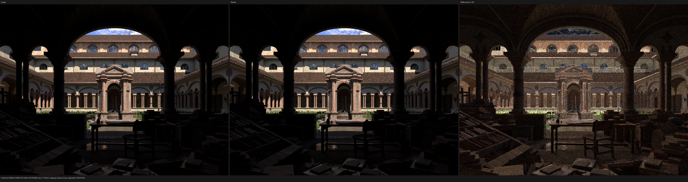
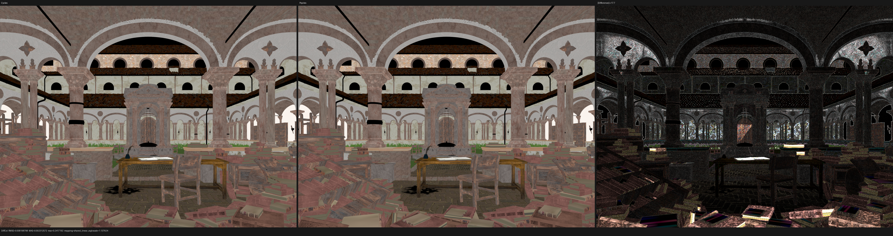
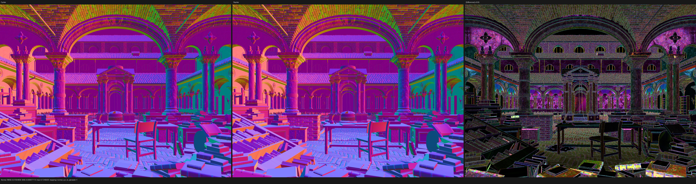
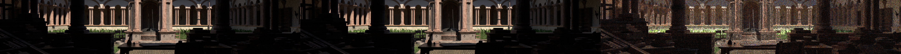
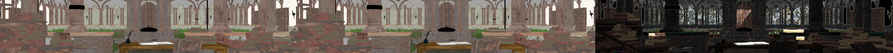

# Lone Monk final-render dependency-graph correction

## Result

The grass mismatch was primarily scene evaluation, not a color-tuning
problem. Psycles exported Blender's `VIEWPORT` dependency graph, while Cycles
renders a distinct `RENDER` dependency graph. Lone Monk requests one
interpolated grass child per parent in the viewport and 20 children per parent
for the final render. The old export therefore contained 4,000 grass
instances; the corrected export contains the required 80,000.

The production export still contains the original Blender node trees and raw
closure connections. Blender and Cycles were not used to bake materials,
lighting, or shader-stage values.

At 1440×1080 and 256 fixed samples on the same Radeon RX 9070 XT, the
correction reduced whole-frame Combined RMSE by 54.1%, Diffuse Color RMSE by
29.2%, and Normal RMSE by 45.9%. In a fixed grass-band ROI, Combined RMSE fell
by 74.8%.

## Root cause and invariant

`bpy.context.evaluated_depsgraph_get()` returns a viewport graph when called
from a background script. Mirroring `hide_render` into `hide_viewport` can
approximate visibility but cannot turn that graph into a render graph.
Render-only modifier settings, particle child counts, and other evaluation
choices remain wrong.

The exporter now obtains its graph from a temporary Blender
`RenderEngine.render(depsgraph)` callback and rejects any graph whose
`depsgraph.mode` is not `RENDER`. This establishes one global invariant:

> Every exported evaluated object, instance transform, and render mesh comes
> from the final-render dependency graph that Blender supplies to a render
> engine.

The loaded `.blend` is never saved. A temporary camera is created only when
Blender needs one to construct a final-render graph for a camera-less scene;
it is not represented in the exported contract and is removed immediately.

Particle Info has a separate Cycles invariant. Current Cycles only records
particle data when the dependency-graph persistent index is inside the parent
particle table. Child particles fall back to device particle entry zero.
Psycles therefore preserves parent indices and maps out-of-parent-table child
indices to the same zero sentinel. Increasing the final-render child count
does not invent per-child Particle Info data.

## Regression coverage

`test_blender_export_particle_info.py` constructs a scene where the viewport
has one child per parent and the final render has three. It proves that:

- the viewport graph exposes 8 child instances;
- the exported render graph exposes 24 child instances;
- all child persistent IDs outside the 8-entry parent table map to Particle
  Info index zero;
- valid parent indices are preserved, including nonzero values.

`test_blender_export_geometry_cache.py` now includes an Array modifier disabled
for viewport evaluation but enabled for rendering. The expected render
topology would fail if the exporter regressed to a viewport graph.

The project was configured against locally built Blender 5.3.0 Alpha
`16d7a3a413e77928ef953eb8a4734c726addf880`, built with 32 parallel jobs.
The Psycles build used `cmake --build build --parallel 32`. All 17 CTest tests
passed with `ctest --test-dir build --parallel 32 --output-on-failure`.

## Exact validation inputs

- Source scene:
  `/home/mike/Downloads/lone-monk_cycles_and_exposure-node_demo.blend`
- Source scene SHA-256:
  `4250d4205d8d01cefd98c15e81021d6dead540b2923797378bf7b32e96e8b8f7`
- Blender/Cycles:
  `main@16d7a3a413e77928ef953eb8a4734c726addf880`
- LuisaCompute:
  `next@ee10fb4d1a2a7edbd31aa403af5aeda41e36ee9d`
- Corrected export:
  350 geometries, 87,543 instances, 35 materials, 47 images
- Previous viewport-derived export:
  350 geometries, 7,543 instances, 35 materials, 47 images
- Corrected grass instances:
  `4,000 parents × 20 rendered children = 80,000`
- `scene.json` SHA-256:
  `d4ceb67d958b58ddbd1a4069456521c5bbedd64b969780785d6c011686ef19b4`
- `geometry.bin` SHA-256:
  `c4c42e17642444849093d53f3269316282ce3d23407fd5b20b63ccb02a064165`

The authoritative Cycles render and Psycles render both use:

- HIP on `AMD Radeon RX 9070 XT`;
- 1440×1080 output;
- 256 fixed samples, seed zero;
- adaptive sampling disabled;
- denoising disabled;
- linear, full-float multilayer OpenEXR output.

Cycles EXR SHA-256:
`8e7fa6f8c91269c74dd09ed75be3b9c460dd43519bbad8f6cd9ca565f777bc19`.

Psycles EXR SHA-256:
`80e7c790ef6fb11364d9ca30508cf18514c45c3c06e1e75c27f8c84e93ecfbb9`.

The complete numeric report is
[report-main-16d7a3a4-1440x1080-256.json](report-main-16d7a3a4-1440x1080-256.json).

## Numeric comparison

| Pass | Previous RMSE | Corrected RMSE | Change | Corrected mean-luminance ratio |
|---|---:|---:|---:|---:|
| Combined | 0.214913115 | 0.098612539 | -54.12% | 1.013781 |
| Diffuse Color | 0.011576479 | 0.008198798 | -29.18% | 1.001263 |
| Normal | 0.029473405 | 0.015940558 | -45.92% | n/a |
| Diffuse Direct | 1.679300785 | 1.586512566 | -5.53% | 1.014662 |
| Diffuse Indirect | 0.258228272 | 0.257338762 | -0.34% | 1.011526 |
| Glossy Color | 0.002606638 | 0.001897951 | -27.19% | 0.998824 |
| Glossy Direct | 0.557036340 | 0.414550066 | -25.58% | 1.008798 |
| Glossy Indirect | 0.189469755 | 0.181386828 | -4.27% | 0.989847 |
| Emission | 0.006447329 | 0.006447329 | 0.00% | 0.999617 |

The grass-band ROI is `[x=100:1340, y=610:750]` in the 1440×1080 linear
images:

| Pass | Previous ROI RMSE | Corrected ROI RMSE | Change |
|---|---:|---:|---:|
| Combined | 0.586422617 | 0.147771473 | -74.80% |
| Diffuse Color | 0.028901922 | 0.015478861 | -46.44% |
| Normal | 0.070924048 | 0.015703431 | -77.86% |

## Visual inspection

Each triptych is Cycles on the left, Psycles in the middle, and scaled absolute
difference on the right.

### Combined

### Diffuse Color

### Normal

The previous image had visibly sparse grass with exposed dark ground. In the
corrected image, grass density, silhouettes, and the material-color band agree
closely with Cycles. The remaining grass-band difference is predominantly
high-frequency sampling and edge coverage rather than a systematic dark-green
hue shift.

The following full-resolution crops retain the same left/middle/right order:

## Performance and memory

The corrected Psycles HIP rendering loop took 40.8928 seconds. The
authoritative Cycles HIP render call took 19.0588 seconds. With the same
previously used rendering-time convention, Psycles is therefore 2.146× as
slow, or 114.6% slower. The corrected 80,000-blade scene is 8.86% slower in
Psycles than the incomplete 4,000-blade export, whose rendering loop took
37.5644 seconds.

Psycles additionally reported:

- scene/acceleration compilation: 2.8196 seconds;
- shader JIT: 0.2161 seconds;
- measured command wall time: 44.8788 seconds;
- peak VRAM increase above the sampled baseline: 2,079,928,320 bytes
  (1.937 GiB);
- peak absolute VRAM usage during the command: 5,364,932,608 bytes
  (4.996 GiB).

The raw VRAM record is
[psycles-hip-vram-1440x1080-256.json](psycles-hip-vram-1440x1080-256.json),
and the Cycles device/timing record is
[cycles-main-16d7a3a4-1440x1080-256.json](cycles-main-16d7a3a4-1440x1080-256.json).

## Diagnostic method

To avoid guessing from final color, a reusable diagnostic tool can connect an
arbitrary source node output to Emission while making other surfaces and the
world black. It modifies only a derived diagnostic `.blend`; the production
export path remains untouched. The intended sequence for this material was
Particle Info Random, ColorRamp, first HSV, Backfacing, Mix, and second HSV.

The first probe already exposed the earlier geometric divergence: Cycles
covered roughly twice as many pixels even at one sample, while interior
Particle Random values agreed at `0.86031276`. Inspecting the particle settings
then proved the 1-versus-20 viewport/render child-count split. Diagnosis
stopped at that first divergent boundary, the render dependency graph, rather
than adding color compensation downstream.
