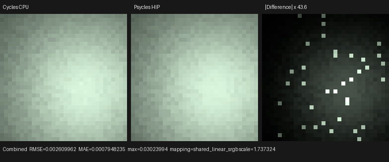
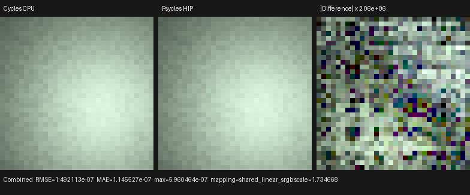
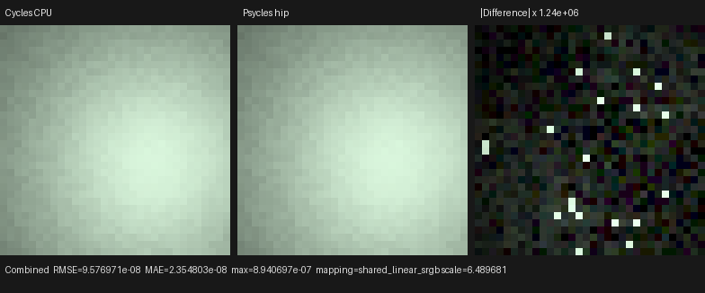
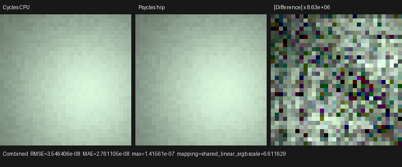
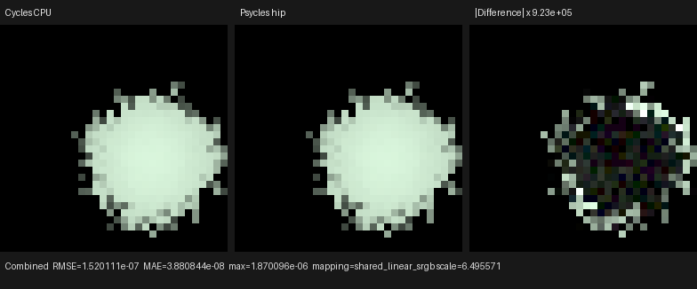
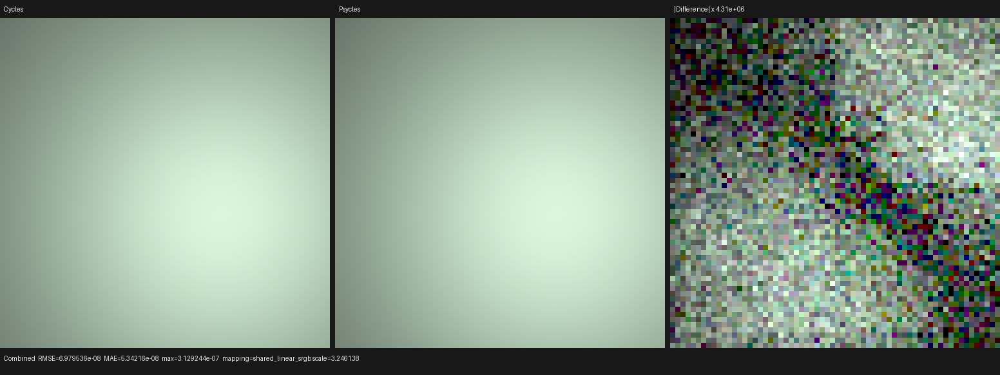
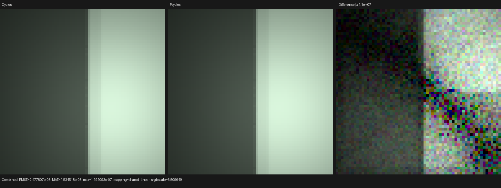
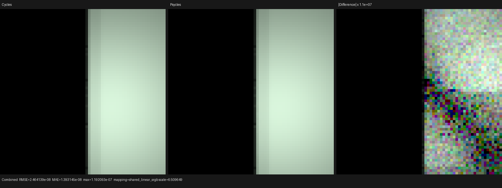

# Luisa per-path trace bring-up

This checkpoint connects the version-1 Cycles path oracle to the same Luisa
path-tracing kernel used by fallback, HIP, and Vulkan.

Configuration:

- Cycles reference: official main `ff404d072bb4`, CPU kernel
- Luisa devices: fallback, HIP on AMD Radeon RX 9070 XT, Vulkan/RADV
- scene: `build/diagnostics/minimal-point/point_light.blend`
- exported bundle: `build/diagnostics/minimal-point/export`
- full film: 32×32
- traced pixel: `(17, 16)`, Cycles lower-left coordinates
- sample: 0 of 1
- sampler: Tabulated Sobol, scrambling distance 1

The first comparison exposed a camera-ray representation mismatch:

- Cycles advances the origin to the near clipping plane;
- Cycles then uses `tmin = 0`;
- `tmax` is `(far - near)` and is divided by the camera-space direction
  cosine for perspective rays;
- the static camera ray time is `0.5`.

Psycles previously kept the unadvanced camera origin and put `near/far`
directly in the traversal interval. This produced a 0.1-unit ray-origin and
intersection-distance difference in the probe. The Luisa camera construction
now uses the Cycles representation, with a fallback GPU regression covering
orthographic and oblique perspective clipping.

After the camera correction:

- 13 currently populated sampled-random fields are exact against Cycles;
- 22 currently populated discrete fields are exact;
- 32 currently populated continuous fields pass the float32 bound;
- maximum absolute error is `4.76837158203125e-7`;
- fallback versus HIP: zero failures, maximum absolute error
  `2.384185791015625e-7`;
- fallback versus Vulkan: zero failures, maximum absolute error
  `2.384185791015625e-7`.

The next differential gate exposed an important point-light representation
difference. Psycles divided point radiance by distance squared and used a
conditional PDF of one. Cycles keeps the light's `eval_fac` independent of
distance and represents the area-to-solid-angle Jacobian in the light PDF:

```text
delta point conditional PDF = distance²
normalized delta point eval_fac = 1 / (4π)
```

Those forms have the same quotient in this isolated estimator, but only the
Cycles form composes correctly with selection PDF, light identity, forward
sampling, and MIS. The implementation now shares one Luisa DSL invariant for
delta and finite oriented-disk point lights. A device regression exercises the
formula and the measure-level rule that a zero-radius point has no competing
BSDF technique even when Blender's use-MIS property is enabled. The regression
passes on fallback, HIP, and Vulkan.

The point-path trace now also records emitter/type/primitive identity,
selection and conditional PDF, `eval_fac`, sampled direction/position/normal,
distance, BSDF PDF, and MIS weight. Against Cycles CPU, every newly populated
light field passes:

- `pdf = 2.09093976020813`;
- `selection_pdf = 1`;
- `eval_fac = 0.07957746833562851`;
- `distance = 1.4460082054138184`;
- `bsdf_pdf = 0`, `mis_weight = 1`;
- continuous direction differences remain below the existing float32 bound.

The comparison has therefore moved from 30 to 24 failing gates without
weakening the comparator. The remaining gates are raw closure
inventory/selection, BSDF sampling, post-bounce state, source object/light
group identity, and Cycles shader identity. Internal source identities are not
guessed from array lengths: they remain explicitly unwritten until the Blender
export preserves the corresponding Cycles sync identity.

The estimator image is unchanged by the point-light refactor (`oiiotool
--diff` passes), confirming that this checkpoint changes the sampling
representation rather than the intended energy.

Observed fresh trace-enabled JIT times were about 0.71 seconds for HIP and
0.72 seconds for Vulkan. Vulkan's logged compute SPIR-V optimization reduced
77,253 words to 69,543 words before pipeline creation; this small probe did not
reproduce the earlier complex-scene Vulkan compile stall.

## Cosine-hemisphere mapping checkpoint

The next formal comparison separated a measure-level match from a
sample-by-sample match. Psycles' diffuse closure previously used
`sqrt(u), 2πv` polar disk sampling and selected an arbitrary orthonormal frame.
That estimator has the correct cosine-weighted PDF, but the same two Cycles
random dimensions produce a different world-space ray. This breaks
correlated-path comparison and changes which microgeometry is visited on later
bounces.

Psycles now uses one shared Luisa DSL mapping for camera and closure sampling:

- the Shirley-Chiu concentric square-to-disk map, including Cycles' strict
  branch at equal squared coordinates;
- the fixed Cycles algebraic tangent/bitangent orientation, including its
  equal-normal-component branch;
- `sqrt(max(1 - |disk|², 0))` and no post-construction renormalization;
- `pdf = cos(theta) / π`.

The actual first-bounce diffuse oracle record is locked by the device test:

```text
N      = (0, 0, 1)
random = (0.82080835, 0.67639267)
wo     = (0.601930976, -0.222150967, 0.767025411)
pdf    = 0.244151756
```

The new regression passes independently on fallback, HIP, and Vulkan, and all
31 project tests pass with 32-way CTest scheduling. Fresh trace-enabled
renders agree between fallback/HIP and fallback/Vulkan with zero failures and
maximum absolute error `2.384185791015625e-7`. The Cycles CPU comparison still
shows the same 24 deliberately unwritten closure/BSDF/post-state gates; none
were waived. The minimal point-light EXR is unchanged under `oiiotool --diff`
because its current visible contribution is direct lighting, while this
checkpoint changes the subsequently sampled diffuse path.

## Raw closure and BSDF checkpoint

The differential surface interface now exposes two trace-only operations:

- a runtime-indexed view of the post-shader closure array, including count,
  Cycles type, sample weight, spectral weight, and normal;
- the selected closure alongside the real `SurfaceSample`, including the
  rescaled selection dimension.

The normal render kernel continues to call the compact production sampler.
The trace kernel calls the extended sampler, so closure enumeration and
selection have one implementation rather than a second diagnostic model.
Principled remains visibly represented as an aggregate virtual closure at this
checkpoint; it is not relabeled as one of Cycles' physical closures and is not
considered aligned until physical expansion is implemented.

On the diffuse point-path oracle, the following groups now pass in full:

- raw closure `count=1`, `index=0`, `type=2`,
  `sample_weight≈0.42`, weight `(0.62, 0.41, 0.23)`, and `N=(0,0,1)`;
- closure pick and exact rescaled random
  `(0.82080835, 0.67639267, 0.37341177)`;
- BSDF `pdf=unguided_pdf=0.244151756`, label `6`;
- `wo=(0.601930976, -0.222150967, 0.767025411)`;
- weighted evaluation
  `(0.151374087, 0.100102216, 0.056154907)`;
- sampled roughness `(1,1)` and eta `1`.

The strict Cycles CPU comparison drops from 24 to 12 failures without changing
the schema, tolerances, or written-state rules. Remaining failures are source
shader/light identities, post-bounce state, surface runtime flags, visibility,
and light shader identity. Fallback versus HIP and fallback versus Vulkan both
pass with zero failures. The dedicated GraphSurface device regression passes
on all three Luisa backends, and the complete suite passes 32/32 with
`ctest -j32`.

Fresh trace JIT timing on this probe was about `0.93 s` on HIP and `2.27 s` on
Vulkan. Vulkan's compute SPIR-V optimization reduced 83,078 words to 74,829;
the optimization interval accounted for about `1.29 s` of the trace compile.
The corresponding non-trace Vulkan kernel compiled in `0.51 s`, with its
SPIR-V optimization taking about `0.39 s` (75,552 to 67,995 words). This
localizes the new cost to deliberately expanded trace instrumentation rather
than the production sampler. HIP's fresh non-trace kernel compiled in
`0.71 s`. Non-trace HIP and Vulkan EXRs remain identical to the preceding
checkpoint under `oiiotool --diff`.

## Formal post-bounce state checkpoint

Post-bounce state is advanced by one Luisa DSL state-transition function whose
inputs and outputs follow the Cycles path-state ABI. It owns bounce counters,
absolute RNG offset, path flags, path visibility, lobe-specific limits, and
transparent-path preservation as one invariant. The renderer maps the
resulting Cycles visibility to the scene contract instead of maintaining a
second, independently updated state machine.

The dedicated device regression covers diffuse, transparent, and singular
glossy transitions on fallback, HIP, and Vulkan. It also locks the Cycles
closure allocation cutoff: a diffuse weight below `1e-5` is not allocated and
one at the boundary is allocated.

The point-path comparison now passes all of:

- post depth `(bounce=1, transparent=0, rng_offset=32)`;
- throughput `(0.62, 0.41, 0.23)`;
- secondary ray position and normalized direction;
- exact path flag `266513` and visibility `4`;
- MIS PDF, minimum PDF, and continuation probability;
- exact surface runtime flag `12`.

The strict Cycles CPU failure count drops from 12 to 4. Those four gates are
the source surface shader ID halves, light object/group identity, and light
shader identity; they remain unwritten rather than inferred. Cross-backend
fallback/HIP and fallback/Vulkan traces pass with zero failures and maximum
absolute difference `2.384185791015625e-7`. The full suite passes 33/33 with
32-way scheduling. The fallback, HIP, and Vulkan multilayer EXRs are unchanged
from the preceding closure checkpoint under `oiiotool --diff`.

## Explicit Cycles identity and two-stage shadow origin

The remaining source identities now originate in the Blender exporter and
survive the scene contract and GPU upload unchanged. The export mirrors the
Cycles synchronization order: five fixed default shaders, dependency-graph
light shaders, then dependency-graph material shaders. World shader index 3,
object IDs, signed light-group IDs, light shader IDs, and surface shader IDs
are recorded explicitly. Analytic lights now also retain dependency-graph
order instead of being sorted by name, which is required for fixed-RNG
emitter-selection equivalence.

The new exporter test uses `Zulu Light` followed by `Alpha Light` to make an
accidental lexical sort observable. It locks light shader IDs 5 and 6,
material shader ID 7, object identities, and light-group identities. The
source-identity unit test independently locks the exact Cycles shader-flag
composition.

All three fresh Luisa traces pass the official Cycles CPU trace with no
waivers:

| Luisa backend | Exact | Random exact | Float32 | Topology | Failures | Max abs error |
| --- | ---: | ---: | ---: | ---: | ---: | ---: |
| fallback | 43 | 16 | 84 | 3 | 0 | `4.76837158203125e-7` |
| HIP | 43 | 16 | 84 | 3 | 0 | `7.152557373046875e-7` |
| Vulkan | 43 | 16 | 84 | 3 | 0 | `7.152557373046875e-7` |

The machine-readable reports are
[fallback](cpu-vs-fallback-identity-shadow-origin.json),
[HIP](cpu-vs-hip-identity-shadow-origin.json), and
[Vulkan](cpu-vs-vk-identity-shadow-origin.json).

Numerical event equality did not replace image inspection. Before the final
checkpoint, the fallback EXR contained a diagonal dotted self-shadow and the
Vulkan EXR had a dark corner; `oiiotool --diff` reported a maximum channel
difference of `0.4223019`. This exposed a missing second stage in the Cycles
surface-shadow-ray construction.

The correction is a geometric certificate rather than an epsilon adjustment.
After the existing shadow-terminator origin, the implementation performs the
same source-triangle self-intersection test in object space that Cycles uses
for `integrate_surface_ray_offset`. It keeps the exact origin when certified
safe and applies the robust ULP offset only when that certificate fails,
without dropping source-primitive exclusion. The regression covers an
interior point and the previously ambiguous shared-edge case on fallback,
HIP, and Vulkan.

Left to right below: fallback, HIP, Vulkan after the correction.


The three post-fix EXRs pass pairwise `oiiotool --diff` with zero pixel
difference. Manual inspection confirms that the dotted band and dark corner
are gone and that all three shadow boundaries agree. Fresh trace-enabled
timings for this 32×32 diagnostic were:

| Backend | JIT | Render |
| --- | ---: | ---: |
| fallback | `0.298 s` | `0.00238 s` |
| HIP | `0.804 s` | `0.00171 s` |
| Vulkan | `2.537 s` | `0.00362 s` |

These timings characterize only the diagnostic and are not used as a
scene-performance claim. Vulkan logged a substantially longer compile stage;
the complex-scene benchmark will separately measure kernel generation,
SPIR-V optimization, pipeline creation, and steady-state render time. The
complete build and 35/35 tests pass with `--parallel 32` and `ctest -j32`.

## Flat multi-light and rectangle solid-angle checkpoint

The next gate broadens the one-point-light oracle without changing its
tolerances. The two-point diagnostic disables the Cycles light tree and gives
both dependency-graph-ordered emitters probability `0.5`. Two pixels exercise
opposite halves of the same flat distribution:

| Pixel | Selection random | Emitter / primitive | Object | Final PDF |
| --- | ---: | ---: | ---: | ---: |
| `(17, 16)` | `0.1931770742` | `0 / 0` | `1` | `1.0454698801` |
| `(0, 16)` | `0.8768947124` | `1 / 1` | `2` | `1.5947346687` |

Both branches pass all `43` exact, `16` random-exact, `84` float32, and `3`
topology checks on all three Luisa backends. The reports are:

- first emitter:
  [fallback](cpu-vs-fallback-two-point-first.json),
  [HIP](cpu-vs-hip-two-point-first.json), and
  [Vulkan](cpu-vs-vk-two-point-first.json);
- second emitter:
  [fallback](cpu-vs-fallback-two-point-second.json),
  [HIP](cpu-vs-hip-two-point-second.json), and
  [Vulkan](cpu-vs-vk-two-point-second.json).

Full-spread rectangle lights now use the same Ureña et al.
area-preserving spherical-rectangle construction as current Cycles
`area_light_rect_sample`. The Luisa DSL implementation preserves the complete
measure contract:

- the light-local rectangle frame and facing-dependent `z` flip;
- the four cancellation-resistant `asin` internal-angle terms;
- the same safe division, range reduction, and coordinate clamps;
- `1 / solid_angle` as a directional PDF;
- the same planar-PDF limit for a solid angle below `1e-5` or the grazing
  normalized-edge condition above `0.99999`;
- Cycles' concentric uniform-disk mapping for ellipse lights.

The center probe `(17, 16)` locks the sampled position
`(0.3655244410, -0.03522232175, 1.3999999762)` and PDF
`5.6394987106`. The grazing probe `(6, 30)` locks
`(0.08314055204, 0.01382339001, 1.3999999762)` and PDF
`16.7171344757`. Both complete paths pass the official Cycles CPU oracle on
fallback, HIP, and Vulkan:

- center:
  [fallback](cpu-vs-fallback-rectangle-center.json),
  [HIP](cpu-vs-hip-rectangle-center.json), and
  [Vulkan](cpu-vs-vk-rectangle-center.json);
- grazing:
  [fallback](cpu-vs-fallback-rectangle-grazing.json),
  [HIP](cpu-vs-hip-rectangle-grazing.json), and
  [Vulkan](cpu-vs-vk-rectangle-grazing.json).

The grazing oracle exposed a Luisa Vulkan backend defect rather than an
application-level light-sampling defect. Strict float32 `asin` compiled
through Vulkan did not reproduce the cancellation-heavy values used by the
spherical-rectangle formula. The fix is Luisa `next` commit
`0d2ea3f6e` (`Make Vulkan strict asin reproducible`):

- native XIR-to-SPIR-V uses a range-reduced, no-contraction float32 minimax
  path when fast math is disabled;
- the HLSL-to-SPIR-V fallback uses the same strict contract;
- float16 and explicitly fast math retain the native extended instruction;
- a dense `4,000,001`-sample sweep over `[-1, 1]` measured at most
  `2.3841858e-7` absolute error and two ULP;
- device regressions cover the native and forced-HLSL routes on fallback,
  HIP, and Vulkan;
- the native Vulkan shader-cache ABI tag moved from `v13` to `v14`, so
  corrected SPIR-V cannot be hidden by a stale disk entry.

With the corrected cache tag, the first current trace compile logged
`87,942 -> 80,155` SPIR-V words and `2.588 s` total JIT; the warm run loaded
the same program in about `0.053 s`. This confirms that the long portion is
native SPIR-V generation/optimization and pipeline preparation, rather than
CMake compilation or render execution.

The full-frame Cycles comparison initially inherited Blender 5.3's
`AUTOMATIC` sampling pattern, while the path oracle and Psycles use Tabulated
Sobol. That invalid baseline produced `0.01826` Combined RMSE. The golden
renderer now pins `TABULATED_SOBOL`, scrambling distance `1`, and disabled
automatic scrambling by default, records those fields in its JSON metadata,
and has a Blender-side regression. With the corrected baseline, the
one-sample rectangle image has:

```text
Combined RMSE             = 0.0026099617
Combined mean abs error   = 0.0007948235
mean luminance ratio      = 0.9999436938
maximum absolute error    = 0.0302399397
invalid pixels            = 0
```

Left to right below: Cycles CPU, Psycles HIP, and the absolute difference
scaled by `43.6`.



The image was opened at its original generated resolution. The two render
panels agree visually in footprint, falloff, color, and orientation. The
difference panel contains sparse brighter samples rather than a displaced or
rescaled illumination field. The machine-readable image report is
[here](cycles-cpu-vs-psycles-hip-rectangle-image.json), and the triptych
SHA-256 is
`90dd11bd2e6532c7fdc1c3fd89a04b367a2501c5d9d0fbc7375c18f576c07e7b`.

This sparse residual has a concrete, non-statistical explanation. At the
maximum-error pixel `(20, 14)`, the complete NEE/BSDF path still passes the
Cycles oracle with zero field failures. Its sampled secondary ray intersects
the rectangle plane at light-local
`(-0.0693990, 0.1255288)`, inside the half extents `(0.4, 0.25)`. Cycles
therefore records the complementary BSDF-hit-light contribution. Analytic
lights are not yet intersectable by Psycles forward rays, so that contribution
is absent. Until that technique exists, production analytic-light NEE
deliberately carries weight one to stay unbiased; the trace records the
theoretical Cycles MIS weight only for differential diagnosis.

Accordingly, this checkpoint claims exact sampled-light construction, light
identity, flat selection, PDF/evaluation measure, and traced Cycles MIS inputs.
It does **not** claim complete analytic-light MIS yet. The next required
implementation is forward intersection/evaluation of area, distant, point,
and spot lights, followed by use of the Cycles MIS weights in production.
Narrow-spread area lights also still require Cycles'
`area_light_spread_clamp_light` construction before solid-angle sampling.

## Full-spread area-light forward intersection checkpoint

The missing complementary technique is now implemented for full-spread
rectangle lights. The implementation follows the current Cycles finite-lamp
event model rather than treating a lamp hit as ordinary opaque geometry:

- the closest mesh distance first bounds a search over eligible analytic
  lights;
- an area hit must be one-sided, inside the strict open ray interval, inside
  the rectangle or ellipse, visible to the current path, and closer than the
  current closest event;
- the immediately preceding analytic light is excluded with the same
  primitive-identity rule as Cycles' `RaySelfPrimitives`;
- each lamp is a transparent event: its raw light closure is evaluated at the
  hit position and Cycles-compatible lamp UV, its contribution is accumulated,
  only `tmin` and transparent depth advance, and the path resumes toward the
  original surface or background without consuming a sampling dimension;
- the forward PDF is the shared full-spread rectangle solid-angle PDF times
  the flat light-selection PDF, and the forward and NEE contributions use the
  corresponding Cycles power-heuristic weights;
- NEE is MIS-weighted only for light kinds that have a production forward
  technique, so point and spot lights remain unbiased while their forward
  intersections are still being implemented.

The production shader still receives the original light closure graph. No
Cycles render, shader evaluation, texture, or closure value is baked into the
scene.

Two regression layers pin the discovered defect. The device-level regression
uses the exact Cycles ray from pixel `(20, 14)` and checks its hit position,
distance, UV, conditional PDF, and evaluation factor on fallback, HIP, and
Vulkan. The production-integrator regression constructs the original diffuse
closure and rectangle lamp directly, then checks the Cycles CPU full-frame RGB
means and the same BSDF-forward hit pixel. It also passes on all three Luisa
backends. Removing only the integrator event loop, while leaving the
intersection helper intact, therefore still fails the regression.

The production control flow now represents this contract with host-stage
components rather than one monolithic event routine. A bounce setup records
the Sobol dimensions and closest mesh once; each `ClosestPathEvent` is exactly
one analytic light, surface, or background and carries its absolute ray
distance. Forward-light resolution advances only `tmin` and requests the next
event in the same bounce. The unchanged Cycles full-frame means and hit pixel
pass on fallback, HIP, and Vulkan after the refactor, making this also the
regression gate for the free-flight insertion boundary.

The corrected one-sample 32×32 comparison against the pinned Cycles CPU EXR is:

| Luisa backend | Combined RMSE | Mean absolute error | Maximum absolute error | Luminance ratio | Invalid pixels |
| --- | ---: | ---: | ---: | ---: | ---: |
| fallback | `1.0329457e-7` | `7.9489837e-8` | `3.8743019e-7` | `1.0000000000` | `0` |
| HIP | `1.4921126e-7` | `1.1455268e-7` | `5.9604645e-7` | `1.0000001108` | `0` |
| Vulkan | `1.4916520e-7` | `1.1422284e-7` | `5.6624413e-7` | `1.0000000000` | `0` |

The machine-readable reports are
[fallback](cycles-cpu-vs-psycles-fallback-rectangle-forward-image.json),
[HIP](cycles-cpu-vs-psycles-hip-rectangle-forward-image.json), and
[Vulkan](cycles-cpu-vs-psycles-vk-rectangle-forward-image.json).

Left to right below: Cycles CPU, Psycles HIP, and absolute difference amplified
by approximately `2.06e6`.



The triptych was opened at its original generated resolution. The reference
and HIP panels are visually indistinguishable in footprint, falloff, hue,
brightness, and sample placement. Only sub-micro float32 backend noise becomes
visible after the extreme difference amplification; the earlier sparse dark
samples are gone. The triptych SHA-256 is
`74e2ebc8c3d1737164bd148023278b2757f2aaca30e17a91556557511ecaf914`.

The cold diagnostic JIT times were `0.343 s` for fallback, `0.922 s` for HIP,
and `2.834 s` for Vulkan; render times were respectively `2.98 ms`,
`3.59 ms`, and `3.05 ms`. HIP code generation took `0.331 s` and device
bitcode linking `0.484 s`. Vulkan's long stage again occurred while generating,
optimizing, and preparing the `92,431 -> 84,576` word SPIR-V program, not
during rendering.

As a non-regression guard, the delta point-light scene was rendered again at
the original `(17, 16)` oracle pixel. Fallback, HIP, and Vulkan each pass all
`43` exact, `16` random-exact, `84` float32, and `3` topology checks, and each
new EXR is unchanged from its pre-forward-intersection backend result under
`oiiotool --diff`.

This closes full-spread rectangle forward intersection and MIS. It does not
yet claim analytic-light completeness: finite-radius point and spot
intersection, distant-light background evaluation, and Cycles'
narrow-spread clamped area construction remain the next light-transport
gates.

## Finite point and spot light checkpoint

Finite point and spot lights now use one shared Cycles-compatible geometric
contract for both next-event estimation and the complementary BSDF-forward
technique. This replaces the earlier collection of independently implemented
polar cone, polar disk, and spot attenuation branches.

The shared Luisa DSL model preserves:

- Cycles' concentric square-to-disk map and fixed algebraic orthonormal frame;
- the cancellation-resistant `sin²(theta) -> 1 - cos(theta)` sphere-cap
  conversion and concentric uniform-cone remap;
- the exact outside-sphere law-of-cosines solve and final remap to the authored
  sphere radius;
- uniform-sphere sampling for transmissive closures inside a sphere and
  cosine-hemisphere sampling for non-transmissive closures;
- the oriented-disk point-light model, including its area-to-solid-angle
  Jacobian;
- the spot light's larger of geometric and transformed spread cones, with an
  explicit sphere intersection when the spread cone is sampled;
- one-sided spot forward intersections, matching sphere/disk support,
  conditional PDFs, and attenuation;
- Cycles lamp UVs and the complete inverse object transform. Non-uniform lamp
  scale is no longer discarded when evaluating spot profiles or raw light
  shader coordinates.

The path state now also retains Cycles' previous MIS-origin normal across
transparent events. Forward point/spot PDFs use that normal and
`PATH_RAY_MIS_HAD_TRANSMISSION` for the inside-sphere measure. Finite point and
spot lights advertise a competing BSDF technique only when their radius and
use-MIS state make that technique real.

No light closure is baked. The original exported light shader graph is still
evaluated at the sampled or intersected lamp point. Lamp `dPdu/dPdv` are zero,
as in current Cycles' `shader_setup_from_sample` for non-triangle lamps, and
object positions/normals use the reconstructed full linear transform.

The device regression locks three actual sample-0 records from current Cycles
CPU `ff404d072bb4` at pixel `(17, 16)`:

| Case | Direction | Position | Conditional PDF | `eval_fac` |
| --- | --- | --- | ---: | ---: |
| sphere point, `r=0.19` | `(0.240160823, -0.098551609, 0.965717554)` | `(0.415699244, -0.093841061, 1.256756544)` | `18.356777191` | `0.701670170` |
| disk point, `r=0.19` | `(0.229965344, -0.092087224, 0.968832254)` | `(0.437025368, -0.099281602, 1.406554103)` | `18.659315109` | `0.701670170` |
| sphere spot, `r=0.13` | `(0.222732574, -0.120983765, 0.967343390)` | `(0.403462440, -0.128706709, 1.304231167)` | `39.302562714` | `1.498833895` |

For every case the regression also fires a forward ray along the sampled
direction and checks support, hit position, normal, distance, PDF, and
validity. It passes on fallback, HIP, and Vulkan. This makes the MIS
reciprocity a tested invariant rather than two visually similar code paths.

The earlier full-frame errors were not sampling noise: using the same Sobol
dimensions with the wrong deterministic map produced RMSEs of `0.0033271`,
`0.0036397`, and `0.0185550` for sphere point, disk point, and spot
respectively. After the shared implementation, the pinned one-sample 32×32
Cycles CPU comparisons are:

| Light | Luisa backend | Combined RMSE | Mean absolute error | Maximum absolute error | Luminance ratio |
| --- | --- | ---: | ---: | ---: | ---: |
| sphere point | fallback | `7.6590e-8` | `1.6065e-8` | `9.2387e-7` | `1.0000000000` |
| sphere point | HIP | `9.5770e-8` | `2.3548e-8` | `8.9407e-7` | `1.0000000939` |
| sphere point | Vulkan | `2.5136e-7` | `1.0458e-7` | `9.3877e-7` | `1.0000011262` |
| disk point | fallback | `2.5648e-8` | `1.9447e-8` | `1.0431e-7` | `1.0000000000` |
| disk point | HIP | `3.5464e-8` | `2.7611e-8` | `1.4156e-7` | `1.0000000952` |
| disk point | Vulkan | `3.6388e-8` | `2.8142e-8` | `1.4901e-7` | `1.0000000000` |
| sphere spot | fallback | `1.1121e-7` | `2.7197e-8` | `1.8328e-6` | `0.9999996092` |
| sphere spot | HIP | `1.5201e-7` | `3.8808e-8` | `1.8701e-6` | `0.9999998046` |
| sphere spot | Vulkan | `3.3009e-7` | `9.3769e-8` | `1.9521e-6` | `1.0000013678` |

All nine machine-readable image reports are stored beside this document under
names of the form
`cycles-cpu-vs-psycles-<backend>-<light>-image.json`.

Left to right in each image: Cycles CPU, Psycles HIP, and absolute difference
under the automatically selected extreme amplification.







All three triptychs were opened at original resolution. The reference and HIP
panels are visually indistinguishable in footprint, color, brightness,
falloff, and individual one-sample placement. The difference panels become
visible only after amplification by approximately `1.24e6`, `8.63e6`, and
`9.23e5`. Their SHA-256 values are respectively
`2c0af92389e272b936e52db1f157e162a9e575f489dfcd723f972991125e3989`,
`aa762526e8bc0dd8b033b53d28eb0e6db487c6d5080b7cb302c3004bea8f386f`,
and
`1e867318f3a8513c52a8bd3033af5961f54dfa3e2eaf317d1752a2ede6f84806`.

The strict per-path comparator passes all `43` exact, `16` random-exact, `84`
float32, and `3` topology fields for sphere/disk point on all three Luisa
backends, and for the spot on HIP and Vulkan. Fallback spot has two
float32-only failures in the remapped sphere normal, with maximum absolute
error `2.8610e-6`; its direction, position, distance, PDF, evaluation factor,
random dimensions, topology, and every discrete field pass. This is a
cross-device trigonometric/cancellation rounding residual, not a changed
sampling branch, and the full-frame fallback RMSE remains `1.1121e-7`. The
reports are stored as `cpu-vs-<backend>-<light>-path.json`; the tolerance was
not weakened or waived to hide the two fields.

On the first cold sphere diagnostic, fallback JIT took `0.312 s`, HIP JIT
`0.943 s` (including `0.339 s` LLVM code generation and `0.478 s` device
bitcode linking), and Vulkan JIT `0.717 s`. Vulkan optimized the production
program from `91,931` to `84,611` SPIR-V words. The corresponding 32×32 render
times were `2.51 ms`, `2.80 ms`, and `3.15 ms`; these remain compiler
diagnostics rather than complex-scene performance claims.

This closes finite point/spot NEE and forward MIS for surface paths. It does
not close distant-light forward/background semantics, narrow-spread area
clamping, the light tree, volume direct lighting, or the remaining material
and Light Path state gates.

## Explicit path RNG-state checkpoint

Production Sobol dimensions are now addressed from the path's explicit
Cycles-compatible `rng_offset`. The enclosing renderer loop counter remains
only an execution bound and trace-event index; it is no longer allowed to
define the random sequence. This distinction is required because transparent
surfaces, portals, volume bounds, subsurface walks, and split paths do not in
general share one renderer-loop transition model.

The device path-state regression crosses two consecutive transparent
surfaces. It locks the invariant

`rng_offset: 16 -> 32 -> 48`, `bounce: 0 -> 0 -> 0`,
`transparent_bounce: 0 -> 1 -> 2`,

and verifies that the next light sample uses absolute Sobol dimension `49`
(`48 + PRNG_LIGHT`). The regression passes on fallback, HIP, and Vulkan. A
full 32-thread build and CTest run passes all `36/36` tests.

As a production-kernel non-regression check, the pinned finite sphere-point
path at pixel `(17, 16)`, sample `0`, was rendered again on HIP and compared
with the current Cycles CPU `ff404d072bb4` oracle. All `43` exact, `16`
random-exact, `84` float32, and `3` topology checks pass with zero failures;
the largest absolute float32 residual is `7.1526e-7`. Pure surface paths retain
their previous sequence, while future state transitions can advance random
dimensions without silently depending on loop structure.

## Light Path evaluation-context checkpoint

Light Path is not a property of a geometric point alone. Current Cycles
evaluates the same original shader graph under four distinct transport
contexts, and Psycles previously mixed those contexts:

| Shader evaluation | Visibility seen by Light Path | Event flags | Effective Ray Depth |
| --- | --- | --- | ---: |
| ordinary surface | incoming path visibility | incoming path flags | `bounce` |
| background emission | incoming path visibility | incoming path flags plus emission context | `bounce + 1` |
| analytic/NEE emission | none | emission context only | `bounce + 1` |
| transparent shadow | shadow only | none | `shadow bounce + 1` |

The implementation now represents this as one explicit
`ShaderEvaluationState` value rather than reconstructing individual node
inputs at each call site. The diffuse, glossy, transmission, and transparent
counters are carried unchanged into emission evaluation; transparent-shadow
evaluation begins with the main path's counters. World shader `Ray Length` is
also `FLT_MAX`, matching `shader_setup_from_background`, instead of the former
zero.

The device regression locks every visibility/event/depth field for all four
contexts and passes on fallback, HIP, and Vulkan. An end-to-end raw light-node
probe then makes a finite point lamp's original Emission strength depend on
`8 * Is Camera + 4 * Is Diffuse + 2 * Is Shadow + Ray Depth + 1`. Cycles
therefore requires primary analytic-light evaluation to produce strength
`2`: all three visibility outputs are false and the effective depth is one.
The exported graph is evaluated directly by Psycles; no closure value or
Cycles result is baked into the scene.

At 64×64 and 64 samples, with Cycles CPU `ff404d072bb4` as the oracle:

| Luisa backend | Combined relative RMSE | Direct-diffuse relative RMSE | Maximum absolute error | Luminance ratio |
| --- | ---: | ---: | ---: | ---: |
| fallback | `3.3178e-7` | `3.3341e-7` | `2.9802e-7` | `1.0000000000` |
| HIP | `4.5626e-7` | `4.5879e-7` | `3.1292e-7` | `1.0000000000` |
| Vulkan | `1.1260e-6` | `1.1147e-6` | `5.0664e-7` | `1.0000009392` |

The machine-readable reports are
[fallback](cycles-cpu-vs-psycles-fallback-light-path-image.json),
[HIP](cycles-cpu-vs-psycles-hip-light-path-image.json), and
[Vulkan](cycles-cpu-vs-psycles-vk-light-path-image.json). The probe runner
enforces a `5e-6` relative-RMSE gate in addition to its energy gate, so an
incorrect visibility combination cannot pass merely by averaging to similar
energy.

Left to right below: Cycles CPU, Psycles HIP, and the absolute difference
amplified by approximately `4.31e6`.



The image was opened at its original generated resolution. The two render
panels are visually indistinguishable in footprint, gradient, hue, and
brightness. Only backend float32 noise is visible after the extreme
amplification. The triptych SHA-256 is
`9035e30ae4769f8044b830d920b48359fd29a6ac33f076ec3ae63990e72633b9`.

## Ordered transparent-shadow checkpoint

Transparent shadow closures are now evaluated in ray-distance order. The
implementation does not infer an order from ray-query callbacks: every
eligible candidate is committed, leaving the acceleration structure to
perform the order-independent minimum-\(t\) reduction. After shading that
closest hit, the next query starts at Cycles' one-ULP
`intersection_t_offset(t)`. Thus, for strictly increasing intersection
distances, each loop iteration removes exactly the current minimum and the
sequence is monotonically closest-to-farthest regardless of acceleration
insertion or traversal order.

Each hit evaluates the original exported Blender closure graph with the
current transparent depth. No Cycles closure value, opacity, or other
pre-baked result is passed to Psycles. The transparent maximum is checked
before evaluating the next layer, matching Cycles: after the permitted count
has been consumed, another intersection is opaque.

The device regression deliberately stores the far primitive first at
`t = 2` and the near primitive second at `t = 1`. It requires the iterator to
return `(near, far, miss)` and separately verifies that excluding the near
source primitive returns the far hit. The test passes on fallback, HIP, and
Vulkan.

The end-to-end `point_light_shadow_light_path` probe makes the two raw
Transparent BSDF closures depend on Light Path `Transparent Depth`:

- near transmission: `0.20 + 0.35 * depth`;
- far transmission: `0.85 - 0.25 * depth`.

The correct near-first product is therefore
`(0.20 + 0.35 * 0) * (0.85 - 0.25 * 1) = 0.12`. A traversal-order
implementation that shades the deliberately first-created far layer first
would instead produce
`(0.85 - 0.25 * 0) * (0.20 + 0.35 * 1) = 0.4675`, so the gate cannot pass by
commuting two constant transparencies. The companion
`point_light_shadow_limit` probe sets the transparent maximum to one: the
near layer consumes the only permitted intersection and the far layer must
block the shadow.

Both probes were rendered at 64×64 and 64 samples with Blender 5.3.0 Alpha
`16d7a3a413e7`, Cycles CPU as the sole oracle, and the same scene on all three
Luisa backends.

Ordered Light Path results:

| Luisa backend | Combined relative RMSE | Direct-diffuse relative RMSE | Maximum absolute error | Luminance ratio |
| --- | ---: | ---: | ---: | ---: |
| fallback | `3.3138e-7` | `3.3224e-7` | `9.6858e-8` | `0.9999997621` |
| HIP | `4.1930e-7` | `4.1933e-7` | `1.1921e-7` | `0.9999998414` |
| Vulkan | `4.7124e-7` | `4.8049e-7` | `1.3411e-7` | `0.9999997621` |

The machine-readable ordered reports are
[fallback](cycles-cpu-vs-psycles-fallback-ordered-shadow-image.json),
[HIP](cycles-cpu-vs-psycles-hip-ordered-shadow-image.json), and
[Vulkan](cycles-cpu-vs-psycles-vk-ordered-shadow-image.json).

Transparent-limit results:

| Luisa backend | Combined relative RMSE | Direct-diffuse relative RMSE | Maximum absolute error | Luminance ratio |
| --- | ---: | ---: | ---: | ---: |
| fallback | `3.3207e-7` | `3.3297e-7` | `9.6858e-8` | `0.9999998256` |
| HIP | `4.1923e-7` | `4.1943e-7` | `1.1921e-7` | `0.9999998256` |
| Vulkan | `4.7214e-7` | `4.8164e-7` | `1.3411e-7` | `0.9999996512` |

The machine-readable limit reports are
[fallback](cycles-cpu-vs-psycles-fallback-shadow-limit-image.json),
[HIP](cycles-cpu-vs-psycles-hip-shadow-limit-image.json), and
[Vulkan](cycles-cpu-vs-psycles-vk-shadow-limit-image.json). The runner
enforces `5e-6` relative-RMSE gates for both Combined and Diffuse Direct in
addition to energy-ratio gates.

Left to right below: Cycles CPU, Psycles HIP, and the amplified absolute
difference for the ordered probe.



The original-size render panels were inspected directly. The double-layer
dark band, transition edge, bright region, footprint, and color are visually
indistinguishable; residual backend float32 noise appears only under extreme
difference amplification. The triptych SHA-256 is
`7d239ba2c9989bcdb0dbf010c39e17805e0cde7f21e3ae0c299077189da9b45b`.

The transparent-limit comparison likewise shows the Cycles and Psycles
blocked band and lit region as visually indistinguishable.



Its triptych SHA-256 is
`660c61ddfec81c9f09a6769bf24946e708d7dd5bf3d969f2c0dabf39c66a0e4e`.

This work also exposed a real Luisa fallback defect rather than a Psycles
callback misuse. Opaque instance flags were truncated while being stored in a
one-bit field, XIR's byte-sized Boolean argument did not match the embedded
C++ Boolean ABI, and the filter initially had no lifetime-safe way to read
top-level instance opacity when an acceleration build and dispatch were
queued on the same stream. Luisa `next` commits `f15a85944` and `30b1f3659`
fix the flag/ABI handling and query the top-level Embree instance geometry at
filter execution time. The same-stream regression passes all 139 assertions
on fallback, HIP, and Vulkan and requires opaque instances to bypass candidate
callbacks. Psycles' transparent instances remain explicitly non-opaque, so
their closure-evaluation callbacks are intentional.

The complete Psycles 32-thread build and all `36/36` CTest tests pass with the
fixed Luisa revision. This checkpoint proves ordered non-coincident
transparent layers. Exactly coincident equal-\(t\) surfaces still require an
explicit Cycles-compatible tie rule before claiming that degenerate case;
the current one-ULP progress rule intentionally makes no unstated
callback-order promise.
