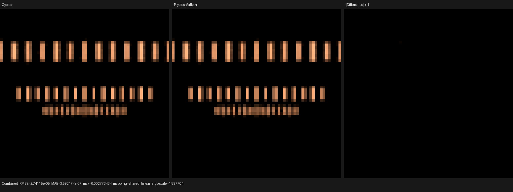

# Camera extraction and Vulkan XIR validation

This checkpoint validates the semantic camera-module extraction and the Luisa
XIR fix needed by the full Psycles Vulkan path-tracing kernel. Cycles remains
the image oracle; no CPU reference renderer or pre-baked material path is used.

## Change boundary

Camera RNG dimensions and primary-ray construction moved from
`path_tracer_kernel.cpp` into `path_tracer_camera.{h,cpp}`. The extraction keeps
the following order and formulas unchanged:

- Cycles pixel-coordinate mapping and pixel hash;
- camera filter and lens/time Sobol dimensions;
- sample-zero center-filter override;
- perspective, orthographic, and panorama ray construction;
- aperture sampling, camera clipping, and ray differentials.

The monolithic kernel decreased from 3,978 to 3,789 lines. A detached build of
the pre-extraction revision produced byte-identical PPM output for both camera
probes, establishing that the remaining Cycles difference predates the
structural change.

## XIR defect and formal repair

The full Vulkan kernel previously exhausted the post-restructure fixed point.
A three-target selection-exit protocol ends in this shape:

```text
new merge -> dispatch 0 -> dispatch 1 -> fallback proxy -> target
```

The final target can still be inside the original selection. The former repair
looked only at the two immediate conditional targets, so the unconditional
fallback proxy hid the illegal edge.

For a selection with header `H` and merge `M`, an edge `(P, E)` is a
post-merge re-entry exactly when:

```text
H dominates P
M dominates P
H dominates E
M does not dominate E
```

The repair now walks each finite, side-effect-free forwarding chain from an
exit-dispatch arm, finds the deepest selection satisfying this relation, and
node-splits the `E`-owned region with `H`, `M`, and sibling entries as its
frontier. `P` is redirected to the `M`-dominated copy, eliminating the boundary
edge rather than wrapping it in another selection.

The minimal regression uses an outer switch with two return exits and a cross
edge into a nested selection's merge. Restricting the implementation back to
immediate targets makes the test fail with one illegal construct. The general
dominance-boundary implementation passes, remains idempotent, and verifies
that cloned opaque ray-query state receives distinct affine storage.

Luisa commit: `b33e304a8` (`next`).

## Build and tests

All build commands used 32 parallel workers:

```text
TMPDIR=/var/tmp/psycles-compiler-tmp \
  cmake --build build-luisa-tests --parallel 32
ctest --test-dir build-luisa-tests -L unit_xir \
  --output-on-failure -j32

TMPDIR=/var/tmp/psycles-compiler-tmp \
  cmake --build build --parallel 32
ctest --test-dir build --output-on-failure -j32
```

Results:

- Luisa `test_xir_pass_restructure_cfg`: 57 tests, 1,072 assertions passed;
- Luisa `unit_xir`: 48/48 passed;
- Psycles: 41/41 passed, including fallback/HIP/Vulkan camera fixtures.

## Cold Vulkan compile

Device: AMD Radeon RX 9070 XT, RADV GFX1201.

The main path kernel converged rather than growing by a fixed amount forever:

| Post iteration | Blocks | Instructions | Relevant changes |
|---:|---:|---:|---|
| input | 155 | 7,450 | — |
| 0 | 317 | 9,646 | selection exit and re-entry split |
| 1 | 370 | 9,710 | loop/header/boundary canonicalization |
| 2 | 371 | 9,711 | final header |
| 3 | 371 | 9,711 | fixed point |

Timings from a forced cold shader-cache run:

- `restructure-cfg`: 420 ms;
- complete SPIR-V XIR legalization: 526 ms;
- complete shader JIT: 0.805 s;
- 64×64, 1 spp render: 0.0031 s.

SPIR-V validation and pipeline creation both succeeded.

## Cycles differential renders

Both probes were rendered at 64×64 and 256 spp. The linear Combined PFM from
Psycles fallback, HIP, and Vulkan is byte-identical for the Blackman-Harris
probe.

| Probe | Mean-energy ratio | Relative RMSE | Maximum absolute error |
|---|---:|---:|---:|
| Blackman-Harris filter | 1.00005509 | 0.00075209 | 0.00277343 |
| Disk depth of field | 0.99997388 | 0.00045087 | 0.00277343 |

Visual inspection agrees with the metrics: the rendered structures, filter
footprints, and depth-of-field blur align. The difference panel contains only
one isolated boundary pixel in each probe; there is no spatially extended
shape, blur, or energy mismatch. This known one-pixel discrepancy is not
introduced by the camera extraction because old and new Psycles builds are
byte-identical.

### Blackman-Harris filter


Machine-readable metrics:
[`blackman-harris-vk-vs-cycles.json`](blackman-harris-vk-vs-cycles.json).

### Disk depth of field



Machine-readable metrics:
[`dof-disk-vk-vs-cycles.json`](dof-disk-vk-vs-cycles.json).
