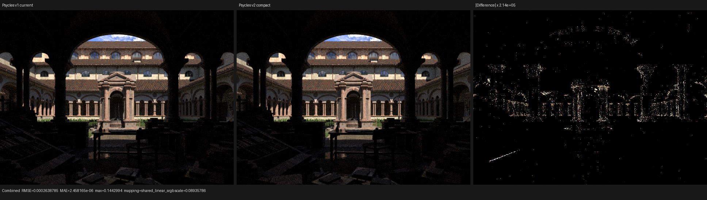
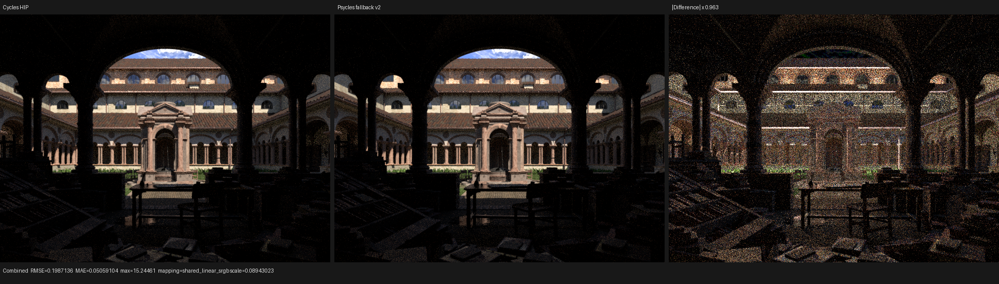

# Cycles-domain compact geometry checkpoint

This checkpoint replaces Psycles' flattened triangle-corner geometry with the
same point, corner, and face attribute model used by current Cycles. It also
moves repeated Luisa triangle-attribute AST construction behind a real
host-stage C++ component. This is a storage and architecture checkpoint, not a
claim that the remaining Lone Monk transport differential is solved.

## Reference state

- Psycles implementation: `151bb96`.
- Blender/Cycles source reference:
  `b82c3f0da6c1813dabedc563d64e536f4d83e868`.
- Exporting Blender build: 5.3.0 Alpha,
  `16d7a3a413e7` (2026-07-29).
- Device: AMD Radeon RX 9070 XT; CPU: Ryzen 9 9950X3D.
- Lone Monk comparison: 640x480, 64 fixed spp, adaptive sampling and
  denoising disabled in the official Cycles goldens.

## Contract and implementation

`psycles.blender-scene.v2` and `PSYGEO2` preserve actual Blender vertex
indices. Positions and Generated coordinates use the point domain. UV and
MikkTSpace tangent/sign data use the corner domain. Normals use either point
or corner storage according to Blender's normal domain, matching current
Cycles' `vert_normals()` and `corner_normals()` paths. Named attributes retain
their point, corner, or face domain instead of being expanded to synthetic
vertices.

The Luisa runtime uploads each attribute once at its natural cardinality.
`TriangleGeometryComponent` is a polymorphic host-stage AST builder in a
separate header and translation unit. Surface reconstruction, emissive-mesh
evaluation, and transparent-shadow evaluation all invoke this component while
Luisa records the fused kernel. Generic shader attributes use one domain-index
rule in `BufferShaderServices`; node implementations do not contain
attribute-specific indexing patches.

The v1 reader remains supported so historical bundles can be compared with
the same current renderer binary.

## Regression gates

The Blender exporter regression constructs a four-point, two-triangle mesh
with six corners. It checks shared indices, point normals and Generated
coordinates, corner UV/tangents, point and corner colors, section byte counts,
the v2 magic/version, and successful C++ import.

The full-path area-light regression shades a shared-index quad through named
POINT, CORNER, and FACE attributes in the same material. POINT and FACE
attributes multiply by unit color, so the existing official Cycles pixel and
full-frame mean oracle remains unchanged while incorrect domain indexing
either changes the result or reads beyond the natural buffer cardinality. The
test passes on fallback, HIP, and Vulkan.

The 32-worker full build and all 47 CTest cases pass. Every hand-written
first-party source remains below 2,000 lines.

## Complex-scene storage

All counts below are from unmodified evaluated Blender scenes. `geometry.bin`
includes the 16-byte file header; bundle sizes include JSON and copied source
textures.

| Scene | Points | Corners | Triangles | v1 geometry | v2 geometry | Reduction |
|---|---:|---:|---:|---:|---:|---:|
| Lone Monk | 1,135,341 | 4,716,183 | 1,572,061 | 457,215,172 B | 339,905,404 B | 25.66% |
| Classroom | 256,269 | 1,489,272 | 496,424 | 140,996,704 B | 100,440,364 B | 28.76% |
| Blender 4.1 Splash | 14,135,152 | 84,268,380 | 28,089,460 | 8,841,529,456 B | 7,046,437,660 B | 20.30% |

| Scene | v1 bundle | v2 bundle | Reduction |
|---|---:|---:|---:|
| Lone Monk | 574,935,037 B | 465,473,463 B | 19.04% |
| Classroom | 232,131,023 B | 191,619,255 B | 17.45% |
| Blender 4.1 Splash | 9,018,751,868 B | 7,223,688,451 B | 19.90% |

The v2 Splash export took 353.9 s and peaked at 25,051,412 KiB RSS. The
contract saves 1,795,091,796 geometry bytes, but Blender/Python export memory
is still too high. UV/tangent arrays legitimately remain corner-domain; the
next memory optimization must stream them rather than discard or
vertex-average them.

## Same-binary v1/v2 isolation

The current fallback binary rendered the historical v1 Lone Monk bundle and a
fresh v2 bundle with identical settings. Emission, Environment, and all three
Transmission passes are byte-identical. Combined has RMSE
`0.0002638785`, relative RMSE `0.0001701721`, mean absolute error
`2.45816e-6`, and per-channel mean ratios within `2.51e-6` of one. The 99th
percentile pixel RMSE is `1.06704e-6`; the larger maximum error
`0.1442994` is confined to sparse indirect/highlight paths.

Normal has RMSE `5.41587e-8` and a maximum error of `2.19345e-5`. This is
expected from replacing the v1 exporter's unconditional loop-normal copy with
Cycles' point/corner normal-domain rule. The visual A/B was inspected at
native resolution: camera, grass band, architecture, materials, shadows, and
foreground silhouettes are unchanged. The difference panel below is amplified
by approximately 214,000x.

The complete pass metrics are in
[the v1/v2 report](reports/v1-v2.json).

## Official Cycles comparison

Against the same-scene official Cycles HIP golden, v2 fallback Combined has
relative RMSE `0.1274578`, luminance ratio `0.9819458`, and no invalid pixels.
Normal relative RMSE is `0.0192076`. Native-resolution inspection confirms
matching camera, geometry, primary material regions, and grass placement, but
the remaining brightness/noise differential is visible on the roof,
windows, courtyard foliage/grass, and indirect foreground. This checkpoint
does not classify those differences as fixed.

The complete pass metrics are in
[the Cycles HIP comparison](reports/v2-vs-cycles-hip.json).

## Backend and JIT observations

| Backend | Scene compile | Cold JIT | Warm JIT | Cold render | Warm render |
|---|---:|---:|---:|---:|---:|
| fallback | 1.300 s | 19.101 s | not measured | 5.406 s | not measured |
| HIP | 4.091 s | 222.142 s | 0.266 s | 2.262 s | 2.244 s |
| Vulkan | 0.903 s | 137.128 s | 1.133 s | 2.246 s | 2.213 s |

Official Cycles took 5.212 s on CPU and 1.926 s on HIP for this fixture.
Psycles fallback is 3.7% slower than Cycles CPU render-only. Psycles HIP and
Vulkan cold-run render intervals are respectively 17.4% and 16.6% slower than
Cycles HIP; process startup and JIT are excluded from those ratios.

HIP AMDGPU code generation took 18.56 s, while final device-bitcode linking
took 199.98 s. Vulkan produced 1,606,220 SPIR-V words before optimization and
1,349,527 after it; the large DXC/SPIR-V pipeline accounts for most of its
cold JIT. These are separate backend bottlenecks.

Vulkan's cold and warm reruns are byte-identical across all 13 passes. HIP
matches exactly on five passes and has sparse differences on eight; Combined
relative RMSE is `0.0005831` and its 99th percentile pixel RMSE is zero. Since
this is a same-binary, same-scene rerun, it remains tracked as HIP/HIPRT
non-determinism rather than a geometry-contract regression.
