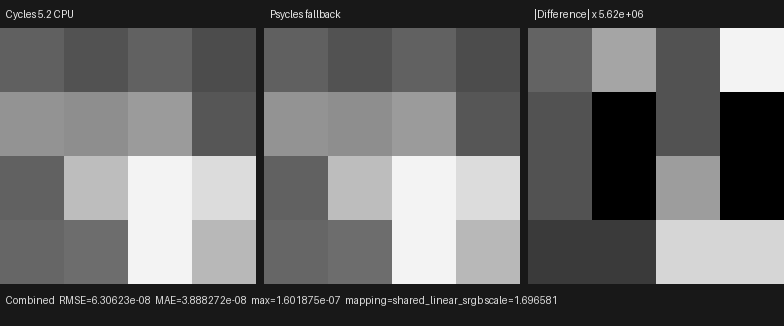
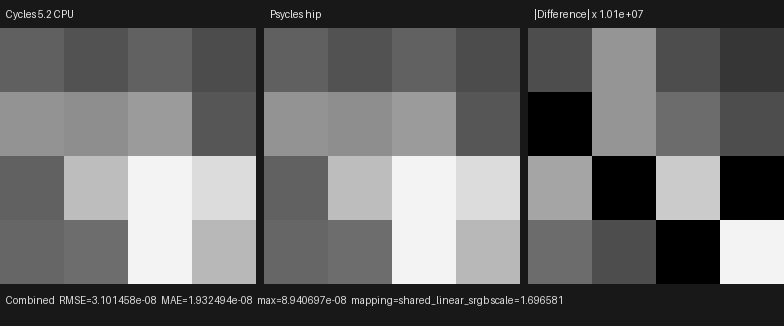
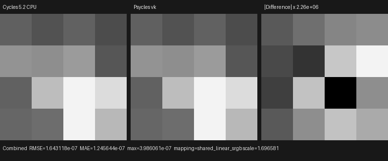
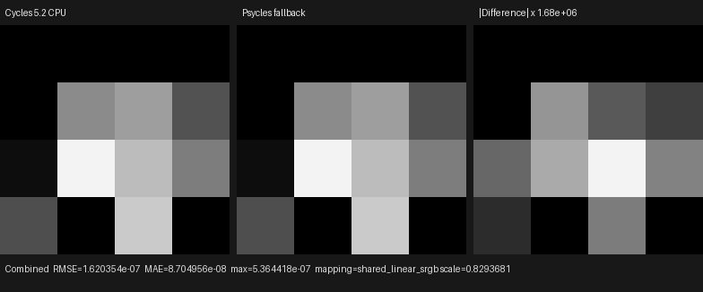
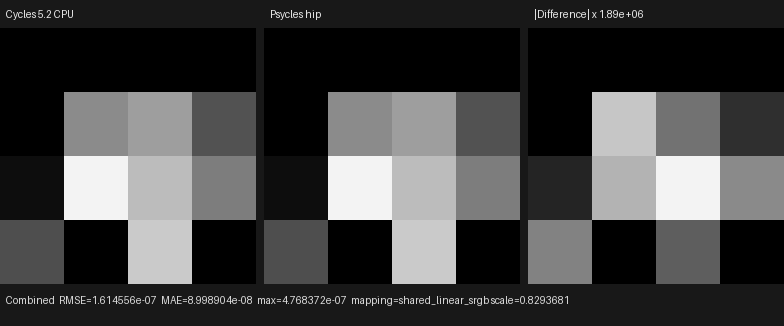
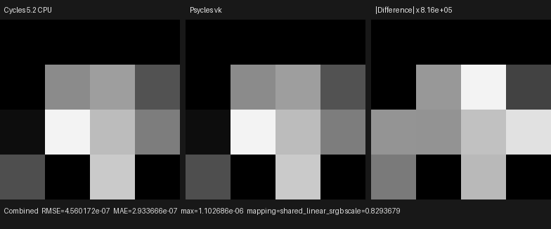

# Homogeneous volume area-light MIS

This checkpoint connects Cycles' finite area-emitter measures to the
production Luisa volume path. It covers authored rectangle and ellipse
primitives, finite spread, spread-support segment clipping, the distinct
segment-proposal and collision-position samplers, rectangle solid-angle
sampling, ellipse area-to-solid-angle conversion, light/phase MIS, and the
forward path that hits an analytic emitter after a volume scattering event.
The scene passes its original isotropic Volume Scatter closure to both
renderers; there is no Cycles-side density, material, lighting, or
transmittance pre-bake.

## Formal contract and root cause

The implementation was audited against official Blender/Cycles main
`b82c3f0da6c1813dabedc563d64e536f4d83e868`, principally
`kernel/light/area.h`, `kernel/light/light.h`,
`kernel/integrator/volume_stack.h`, `kernel/integrator/volume_util.h`, and
`kernel/integrator/shade_volume.h`. The executable image oracle is Blender
5.2.0 LTS `fbe6228777e7`.

Cycles defines two different proposal measures and one shared collision
evaluation:

- `area_light_eval<true>` samples the authored rectangle or ellipse in area
  measure before free-flight integration. Its light PDF is converted to solid
  angle after the original primitive has been sampled.
- The conservative spread cone clips the volume integration interval. At the
  selected collision, `area_light_eval<false>` intersects that cone footprint
  with the authored primitive, chooses the minimum-area rectangle, circle, or
  ellipse support, and samples that support. Rectangles use their exact solid
  angle; ellipses use area measure followed by the solid-angle Jacobian.
- A continuation ray still intersects the authored primitive. However,
  `area_light_eval_from_intersection` evaluates that known hit using the same
  spread-clamped collision measure as the second proposal. Geometry support
  and probability measure are deliberately separate.

The previous forward-intersection implementation stopped after the authored
primitive hit and used its unclamped area PDF for narrow spread. On the
ellipse fixture, explicit volume NEE already matched Cycles exactly
(`P`, random coordinates, light point, direction, distance, PDF, and
evaluation), but logical pixel 14 accumulated `36.5273` instead of the
official `0.7083594`. The excess came from the continuation ray hitting the
analytic emitter with the wrong PDF.

`AreaLightSampling` now owns all three operations in a real `.h`/`.cpp`
host-stage component:

1. `from_segment` implements the authored-primitive proposal.
2. `from_position` implements the spread-clamped collision proposal.
3. `from_intersection` evaluates a known authored-primitive hit in that same
   collision measure.

Both the volume direct-light component and analytic-light forward
intersection construct their Luisa AST through this shared object. The fix is
therefore a measure-preserving refactor of the Cycles contract, not a
pixel-specific branch or an ad hoc epsilon patch. Psycles contains no CPU
reference renderer; Cycles remains the sole rendering oracle.

## Regression coverage

The focused analytic test pins the official narrow-ellipse collision record:

```text
P      = (0.125122309, -0.374877691, -0.751611710)
D      = (0.231876835,  0.163865522,  0.958843648)
hit    = (0.210152447, -0.314787567, -0.400000006)
t      = 0.366703898
pdf    = 1.37085104
eval   = 3.11509562
uv     = (0.142020717, 0.347826838)
```

The integrated test pins every Combined and Volume Direct RGB value, plus
alpha, for two one-sample scenes on fallback, HIP, and Vulkan:

- a `1.0 × 0.6` full-spread rectangle;
- a `1.0 × 0.6` ellipse with a `1.2` radian spread, which exercises the
  circle/ellipse/rectangle support choice and the previously incorrect
  forward-hit path.

## Reproduction

Generate the official one-sample, Box-filtered, Tabulated Sobol oracles:

```text
/usr/bin/blender --background --factory-startup \
  --python tools/create_cycles_volume_direct_oracle.py -- \
  docs/validation/2026-07-31/homogeneous-volume-area-mis/exr/full/cycles-cpu.exr \
  --light area --area-shape RECTANGLE \
  --area-spread 3.141592653589793 \
  --volume-sampling MULTIPLE_IMPORTANCE --samples 1

/usr/bin/blender --background --factory-startup \
  --python tools/create_cycles_volume_direct_oracle.py -- \
  docs/validation/2026-07-31/homogeneous-volume-area-mis/exr/narrow/cycles-cpu.exr \
  --light area --area-shape ELLIPSE --area-spread 1.2 \
  --volume-sampling MULTIPLE_IMPORTANCE --samples 1
```

Render the same raw-closure fixtures through the Luisa backends. Arguments
two through five preserve earlier distant, VSPG, point, and spot diagnostics;
arguments six and seven are the full and narrow area-light outputs:

```text
./build/bin/psycles_luisa_volume_path_tests fallback \
  /var/tmp/volume-direct-fallback.exr \
  /var/tmp/volume-guided-fallback.exr \
  /var/tmp/volume-point-fallback.exr \
  /var/tmp/volume-spot-fallback.exr \
  docs/validation/2026-07-31/homogeneous-volume-area-mis/exr/full/psycles-fallback.exr \
  docs/validation/2026-07-31/homogeneous-volume-area-mis/exr/narrow/psycles-fallback.exr

./build/bin/psycles_luisa_volume_path_tests hip \
  /var/tmp/volume-direct-hip.exr \
  /var/tmp/volume-guided-hip.exr \
  /var/tmp/volume-point-hip.exr \
  /var/tmp/volume-spot-hip.exr \
  docs/validation/2026-07-31/homogeneous-volume-area-mis/exr/full/psycles-hip.exr \
  docs/validation/2026-07-31/homogeneous-volume-area-mis/exr/narrow/psycles-hip.exr

./build/bin/psycles_luisa_volume_path_tests vk \
  /var/tmp/volume-direct-vk.exr \
  /var/tmp/volume-guided-vk.exr \
  /var/tmp/volume-point-vk.exr \
  /var/tmp/volume-spot-vk.exr \
  docs/validation/2026-07-31/homogeneous-volume-area-mis/exr/full/psycles-vk.exr \
  docs/validation/2026-07-31/homogeneous-volume-area-mis/exr/narrow/psycles-vk.exr
```

The focused measure regression runs with:

```text
./build/bin/psycles_luisa_analytic_light_sampling_tests fallback
./build/bin/psycles_luisa_analytic_light_sampling_tests hip
./build/bin/psycles_luisa_analytic_light_sampling_tests vk
```

## Numerical and visual result

All inputs are raw 32-bit scene-linear OpenEXR. All pixels are finite and the
identity orientation has the uniquely lowest error.

Full-spread rectangle:

| Backend | RMSE | Relative RMSE | Maximum absolute error |
|---|---:|---:|---:|
| fallback | 6.3062e-8 | 2.4780e-7 | 1.6019e-7 |
| HIP | 3.1015e-8 | 1.2187e-7 | 8.9407e-8 |
| Vulkan | 1.6431e-7 | 6.4566e-7 | 3.9861e-7 |

Narrow-spread ellipse:

| Backend | RMSE | Relative RMSE | Maximum absolute error |
|---|---:|---:|---:|
| fallback | 1.6204e-7 | 4.1904e-7 | 5.3644e-7 |
| HIP | 1.6146e-7 | 4.1754e-7 | 4.7684e-7 |
| Vulkan | 4.5602e-7 | 1.1793e-6 | 1.1027e-6 |

All six triptychs were opened at original resolution. Their Cycles and
Psycles panels have the same 4×4 spatial intensity pattern, including the
zero-support pixels of the narrow ellipse. Residuals become visible only
after amplification between `8.16e5` and `1.01e7`, so the difference panels
show floating-point amplification rather than a visible support, orientation,
or energy mismatch.













The exact images and machine-readable reports are retained under
[`exr/`](exr/), [`triptychs/`](triptychs/), and the six
`*-report.json` files beside this document. A single
[six-comparison inspection sheet](triptychs/overview.png) is included for a
compact visual audit.

## Backend compilation observation

On the RX 9070 XT, the incremental 32-thread C++ build completed in `0.22 s`.
The first HIP run generated the area-containing path shader in approximately
`0.50 s` and linked its code object in `1.04 s`; cached runs completed in about
`0.23 s` including all fixtures. The corresponding Vulkan cold run spent
approximately `5.25 s` and `9.72 s` lowering and optimizing its two large
SPIR-V path shaders (`102052 -> 87777` and `151708 -> 142057` words). A cached
run completed in `0.66 s`. The Vulkan delay is therefore JIT
lowering/optimization, not C++ compilation or path execution.

The required full commands also pass:

```text
TMPDIR=/var/tmp/psycles-compiler-tmp cmake --build build --parallel 32
ctest --test-dir build --output-on-failure -j32
```

All `79/79` tests passed in `2.10 s`, including the source-size gate. The
largest checked production source is `src/luisa/path_tracer_scene.cpp` at
`1955` lines, below the 2000-line policy.

## Remaining scope

This validates the analytic area-light homogeneous-volume sub-contract.
Triangle emitters, environment volume NEE, heterogeneous grid/null-collision
transport, shared surface area-light NEE cleanup, and complex-scene volume
validation remain open. Those gates precede volume-quality or performance
claims for Blender 4.1 Splash, Classroom, Lone Monk, and other production
scenes.
