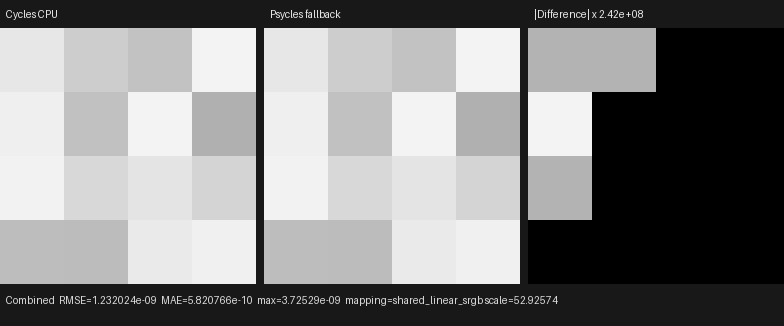
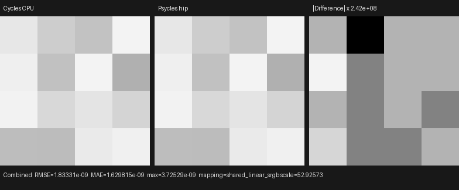
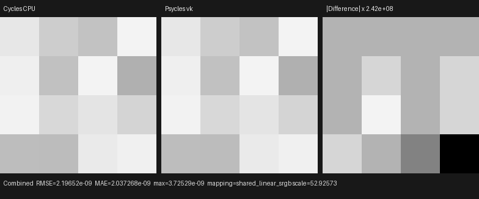

# Homogeneous volume distant-light NEE

This checkpoint connects the first production volume next-event estimator:
homogeneous distance sampling toward analytic distant lights, raw phase
closure evaluation, transparent-surface and medium shadow transmittance,
Cycles light roulette/clamping, and Volume Direct pass routing. It uses the
original material Volume closure graph. No closure, density, lighting, or
transmittance is baked by Blender or Cycles.

## Official contract

The implementation was audited against official Cycles main
`b82c3f0da6c1813dabedc563d64e536f4d83e868`, especially
`integrator/shade_volume.h`, `integrator/volume_shader.h`,
`film/light_passes.h`, and `film/volume_guiding_denoise.h`. The executable
oracle is Blender 5.2.0 LTS `fbe6228777e7`.

- Light selection occurs before distance integration. Distant lights force
  the distance measure even when a material requests MIS or equiangular
  sampling.
- The direct estimator reuses the channel-rescaled Volume Reservoir dimension
  and the scatter/transmit-rescaled Volume Scatter Distance dimension.
- Primary homogeneous rays use Cycles' VSPG defensive probability. With an
  empty history this is `0.25 * (1 - T) + 0.75 * 0.5` in channels with
  extinction. This state change, rather than an RNG or light-normalization
  error, explained the original differential.
- Phase value/PDF, light PDF, NEE MIS weight, light roulette, continuation
  probability, transparent shadow, volume shadow, and light clamping are
  composed in that order.
- The volume shadow component traverses ordered closest boundary events,
  copies the path volume stack, integrates each interval, and applies exact
  enter/exit transitions. It does not approximate self-intersection with a
  scene-scale epsilon.

`HomogeneousVolumeScatterProbability`,
`HomogeneousVolumeSegmentComponent`,
`AnalyticVolumeDirectLightingComponent`, and
`HomogeneousVolumeShadowComponent` are separate host-stage C++ components.
Their virtual composition builds one fused Luisa device AST.

## Reproduction

The Cycles oracle is generated with one sample, Box filter, seed 11939,
explicit Tabulated Sobol, a white isotropic Volume Scatter closure at density
0.5, a black world, and a unit zero-angle Sun:

```text
blender --background --factory-startup \
  --python tools/create_cycles_volume_direct_oracle.py -- \
  docs/validation/2026-07-31/homogeneous-volume-direct/exr/cycles-cpu.exr

./build/bin/psycles_luisa_volume_path_tests fallback \
  docs/validation/2026-07-31/homogeneous-volume-direct/exr/psycles-fallback.exr
./build/bin/psycles_luisa_volume_path_tests hip \
  docs/validation/2026-07-31/homogeneous-volume-direct/exr/psycles-hip.exr
./build/bin/psycles_luisa_volume_path_tests vk \
  docs/validation/2026-07-31/homogeneous-volume-direct/exr/psycles-vk.exr
```

The 16 official Combined values are compiled into the end-to-end regression.
Every RGB pixel, alpha, Volume Direct, zero Volume Indirect, and zero
Environment value is checked on fallback, HIP, and Vulkan.

## Numerical and visual result

All images are raw 32-bit scene-linear OpenEXR. Identity orientation is
strongly preferred over every flip, all 16 pixels are finite, and the
remaining differences are a few floating-point ULPs:

| Backend | RMSE | Relative RMSE | Maximum absolute error |
|---|---:|---:|---:|
| fallback | 1.2320e-9 | 9.0119e-8 | 3.7253e-9 |
| HIP | 1.8333e-9 | 1.3410e-7 | 3.7253e-9 |
| Vulkan | 2.1965e-9 | 1.6067e-7 | 3.7253e-9 |

The generated nearest-neighbor triptychs were opened at original resolution.
The Cycles and Psycles panels have the same 4×4 spatial intensity pattern on
all three backends. The right panels deliberately amplify ULP-scale residuals
by about `2.42e8`; these amplified blocks are not visible-energy errors.







The complete machine-readable measurements are
[`fallback-report.json`](fallback-report.json),
[`hip-report.json`](hip-report.json), and
[`vk-report.json`](vk-report.json).

## Scope after this checkpoint

This is an exact distant-light homogeneous sub-contract, not a claim that
volume lighting is finished. The subsequent
[`finite-point MIS`](../homogeneous-volume-point-mis/README.md) checkpoint
connects point emitters, equiangular sampling, and distance/equiangular MIS.
Spot/area/triangle visible intervals, environment NEE, and heterogeneous
grid/null-collision transport remain open. The accumulated VSPG history and
power-of-two filter schedule were completed in
[`volume-guiding-history`](../volume-guiding-history/README.md). The remaining
gates precede complex volume-scene quality claims.
