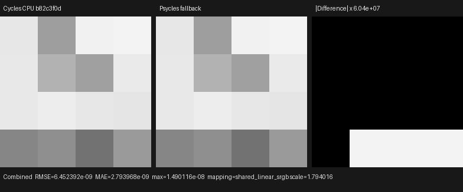
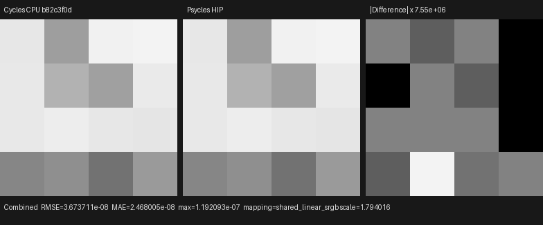
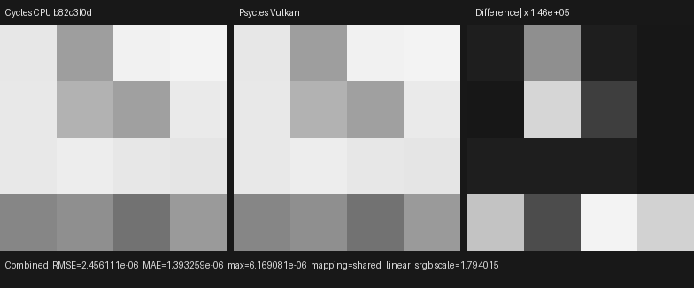
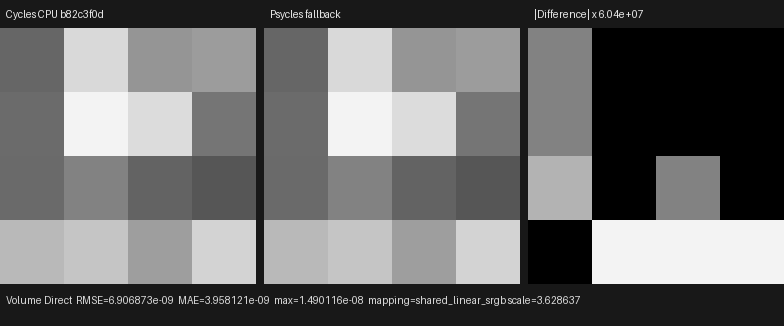
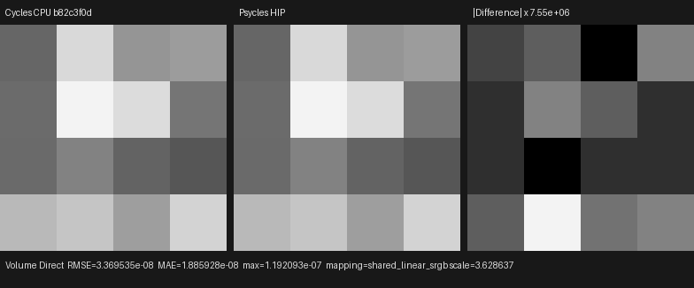
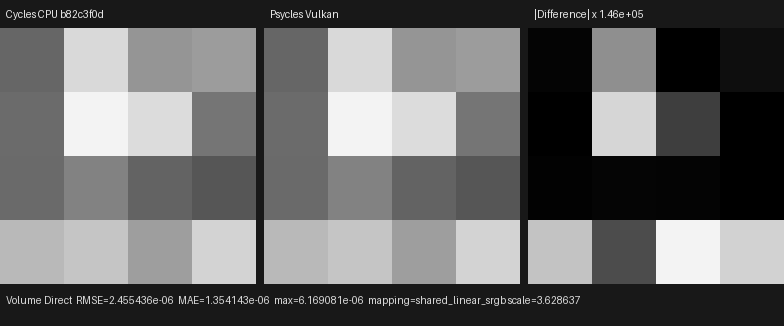

# Homogeneous volume environment-emitter MIS

This checkpoint connects Cycles' background-light measure to the production
Luisa volume path. It covers environment-emitter selection, deferred
direction sampling at the volume collision, background-map PDF evaluation,
raw World closure evaluation, phase/light MIS, infinite-distance shadow
rays, and the Camera and Volume Scatter World visibility bits. No material or
lighting value is pre-baked by Blender/Cycles.

## Formal contract

The implementation and executable image oracle were audited against an
official local build of Blender/Cycles main
`b82c3f0da6c1813dabedc563d64e536f4d83e868` (Blender 5.3.0 Alpha), principally
`kernel/light/background.h`, `kernel/light/light.h`,
`kernel/integrator/shade_volume.h`, and `scene/light.cpp`.

Cycles' volume direct-light operation is a two-stage protocol:

1. Emitter selection occurs before the volume collision position is known.
   An environment emitter proposes the complete finite volume segment and
   requests distance sampling. It does not draw a background direction at
   this stage.
2. After the distance sampler has selected the collision position, the
   environment direction is drawn from `PRNG_LIGHT.xy`. The resulting PDF is
   the background directional PDF multiplied by the emitter-selection PDF.
3. A phase-sampled path that reaches the background evaluates the same
   directional measure without drawing another sample, so the forward and
   NEE branches use one MIS probability space.

Consuming `PRNG_LIGHT.xy` during the segment proposal would perturb both the
distance/direction coupling and the exact Tabulated Sobol path relative to
Cycles. `VolumeEnvironmentLightComponent` therefore exposes a proposal that
only defines the interval and a direction provider that is invoked only
after the collision exists.

`EnvironmentLightComponent` is the shared host-stage boundary for
background-map/sun directional sampling, forward PDF evaluation, and
evaluation of the original World closure. Surface NEE, volume NEE, and the
forward background event use that same `.h`/`.cpp` component. The reference
position remains in its interface because Cycles portal sampling is
position-dependent, even though portals are not implemented yet. These C++
objects generate the fused Luisa DSL AST; they are not textual `.inl`
fragments or separate runtime kernels.

The oracle's World graph is spatially varying and remains raw:
`Texture Coordinate (Generated) -> Linear Gradient Texture -> Math Multiply
Add (0.25 * Fac + 0.5) -> Background`. Psycles receives and evaluates those
original nodes. Cycles is the only rendering oracle; there is no Psycles CPU
reference renderer.

## Background-emitter eligibility

The source audit and a `--debug-cycles` run exposed an important distinction
between sampling resolution and emitter eligibility. In current Cycles,
`MANUAL` controls the background map resolution; it does not force a constant
World closure into the light distribution. Without a portal, the background
is enabled as an emitter only when its shader uses MIS and
`has_surface_spatial_varying` is true. Cycles logs `Background MIS has been
disabled` for the constant raw Background graph used by the negative
fixture.

Psycles now applies that same structural predicate while constructing the
light distribution. The regression separately pins the constant World case:
the camera and phase-sampled forward paths still see the raw background, but
there is no environment NEE proposal because no environment emitter exists.

## Regression scene

The 4×4, one-sample fixture contains:

- a homogeneous isotropic Volume Scatter closure at density 0.5;
- the spatially varying raw World graph above, sampled through a 4×2 manual
  background map;
- a Box pixel filter, Tabulated Sobol, seed 11939, Multiple Importance volume
  distance sampling, and direct-light MIS;
- no analytic or mesh emitter, isolating the environment path.

The integrated regression pins all 16 official Cycles Combined and Volume
Direct values and requires the same values on fallback, HIP, and Vulkan. It
also renders three policy variants:

- a constant raw World graph, which must remain forward-only under current
  Cycles emitter eligibility;
- World Volume Scatter visibility disabled, which must make Volume Direct
  exactly zero while leaving the camera background visible;
- World Camera visibility disabled, which must leave volume illumination
  active and make Combined RGB equal Volume Direct RGB.

The scene contract, Blender importer, and Blender exporter carry all six
World visibility fields: Camera, Diffuse, Glossy, Transmission, Shadow, and
Volume Scatter. This checkpoint exercises Camera and Volume Scatter exactly;
per-lobe filtering of aggregate surface closures remains listed below as open
scope.

## Reproduction

Generate the official latest-Cycles CPU oracle:

```text
/home/mike/Projects/blender-install-4fe17ef6/blender \
  --background --factory-startup \
  --python tools/create_cycles_volume_direct_oracle.py -- \
  docs/validation/2026-07-31/homogeneous-volume-environment-mis/exr/cycles-cpu.exr \
  --light environment --volume-sampling MULTIPLE_IMPORTANCE --samples 1
```

Render the identical fixture through all Luisa backends:

```text
./build/bin/psycles_luisa_volume_environment_tests fallback \
  docs/validation/2026-07-31/homogeneous-volume-environment-mis/exr/psycles-fallback.exr

./build/bin/psycles_luisa_volume_environment_tests hip \
  docs/validation/2026-07-31/homogeneous-volume-environment-mis/exr/psycles-hip.exr

./build/bin/psycles_luisa_volume_environment_tests vk \
  docs/validation/2026-07-31/homogeneous-volume-environment-mis/exr/psycles-vk.exr
```

The backend regressions are also registered with CTest as
`psycles.luisa_volume_environment_{fallback,hip,vk}`.

## Numerical and visual result

All inputs are raw 32-bit scene-linear multilayer OpenEXR. Every tested pixel
is finite, and the identity orientation has the uniquely lowest RMSE for
every pass and backend.

### Combined

| Backend | RMSE | Relative RMSE | Maximum absolute error | Mean luminance ratio |
|---|---:|---:|---:|---:|
| fallback | 6.4524e-9 | 1.7650e-8 | 1.4901e-8 | 1.00000000 |
| HIP | 3.6737e-8 | 1.0049e-7 | 1.1921e-7 | 1.00000000 |
| Vulkan | 2.4561e-6 | 6.7186e-6 | 6.1691e-6 | 0.99999750 |

### Volume Direct

| Backend | RMSE | Relative RMSE | Maximum absolute error | Mean luminance ratio |
|---|---:|---:|---:|---:|
| fallback | 6.9069e-9 | 5.5557e-8 | 1.4901e-8 | 1.00000000 |
| HIP | 3.3695e-8 | 2.7104e-7 | 1.1921e-7 | 1.00000022 |
| Vulkan | 2.4554e-6 | 1.9751e-5 | 6.1691e-6 | 0.99999145 |

All six triptychs and their combined inspection sheet were opened at original
resolution. Cycles and Psycles have the same spatial background gradient,
volume-collision illumination pattern, and per-pixel occlusion structure in
both Combined and Volume Direct. There is no visible coherent edge, spatial
shift, color shift, or energy bias at the shared display exposure. Fallback
and HIP residuals appear only after amplification by `7.55e6`–`6.04e7`;
Vulkan residuals appear after `1.46e5` amplification and retain the same
structure with no perceptible error in the rendered image.













The exact images and machine-readable reports are retained under
[`exr/`](exr/), [`triptychs/`](triptychs/), and the three `*-report.json`
files beside this document. A single
[six-comparison inspection sheet](triptychs/overview.png) is included for a
compact visual audit.

## Backend compilation observation

On the RX 9070 XT, the first HIP spatial-World run spent approximately
`0.53 s` generating the new path shader and `1.06 s` linking its code object.
The corresponding Vulkan cold run spent approximately `10.35 s` in SPIR-V
optimization (`170657 -> 152455` words); a warm rerun completed in about
`0.29 s`. This again localizes the Vulkan cold delay to device shader
lowering/optimization rather than C++ compilation or the 4×4 render.

The required full validation commands are:

```text
TMPDIR=/var/tmp/psycles-compiler-tmp cmake --build build --parallel 32
ctest --test-dir build --output-on-failure -j32
```

The 32-thread build completed in `8.29 s`; all `90/90` tests passed in
`19.01 s`, including the new fallback/HIP/Vulkan render regressions, Blender
World-visibility round trips, OpenEXR coverage, and the source-size gate. The
largest checked production source is `src/luisa/path_tracer_scene.cpp` at
1969 lines, below the 2000-line policy.

## Remaining scope

This validates the homogeneous environment-emitter sub-contract. Environment
portals, World surface-visibility filtering per individual closure lobe,
heterogeneous grid/null-collision transport, emitter importance/light-tree
sampling, and full complex-scene volume validation remain open. Those gates
precede volume-quality or performance claims for Blender 4.1 Splash,
Classroom, Lone Monk, and other production scenes.
