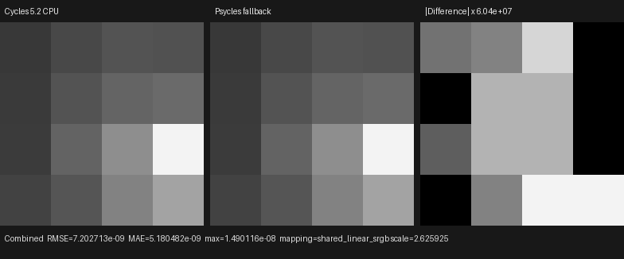
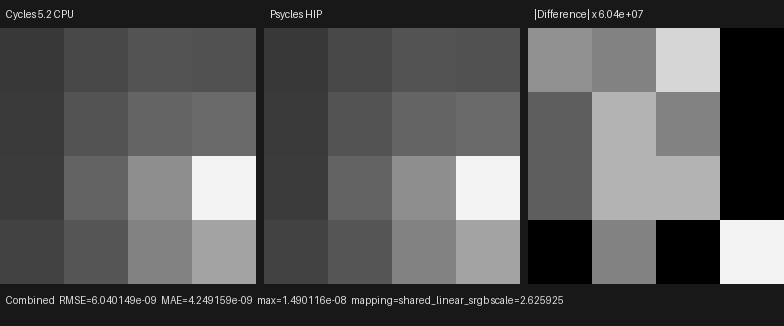
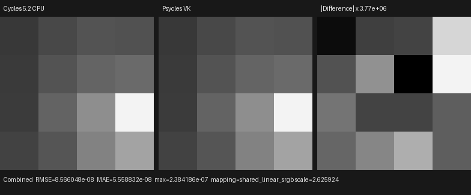

# Homogeneous volume finite-point MIS

This checkpoint connects Cycles' finite-emitter volume sampling measure to the
production Luisa path tracer for point lights. It covers light proposal before
volume integration, exact distance/equiangular technique selection, the
two-technique power heuristic, and re-sampling the same emitter from the final
volume collision point. The material is passed as its original Volume Scatter
closure; Blender/Cycles performs no density, phase, lighting, or transmittance
pre-bake.

## Official contract

The implementation was audited against official Cycles main
`b82c3f0da6c1813dabedc563d64e536f4d83e868`, principally
`kernel/integrator/shade_volume.h`,
`kernel/integrator/volume_stack.h`, and the analytic light samplers. The
executable oracle is Blender 5.2.0 LTS `fbe6228777e7`.

- Cycles consumes `PRNG_LIGHT` before volume integration and samples a point
  on the selected finite emitter to define the equiangular geometry.
- The raw stack policy is a technique set: Distance is `1`, Equiangular is
  `2`, and Multiple Importance is `3`. A finite point light uses the stack
  result; a distant light still forces Distance.
- MIS consumes `PRNG_VOLUME_SCATTER_DISTANCE` before indirect free flight.
  Values below `0.5` select Distance and multiply the value by two; the upper
  half selects Equiangular and remaps `(r - 0.5) * 2`.
- The indirect free-flight estimator then rescales the same random value.
  Direct channel choice and Distance sampling consume the reservoir/scatter
  values left by that indirect estimator. This coupling is part of the
  probability measure, not an implementation detail.
- Equiangular sampling uses the representative light point, perpendicular
  distance, endpoint angles, Cycles' `1e-6` uniform fallback, and a clamp only
  for floating-point endpoint error.
- Both MIS branches multiply their selected estimator by
  `2 * power_heuristic(selected_pdf, competing_pdf)`.
- After the collision distance is known, the same light is sampled again from
  that exact point with the original `PRNG_LIGHT.xy`. The original phase
  closures, light shader, light/phase MIS, surface shadow, and volume shadow
  are then evaluated.

`VolumeDirectSampling` owns the technique and equiangular measure.
`HomogeneousVolumeTransport` owns the homogeneous distance estimator and its
MIS combination. `AnalyticVolumeDirectLightingComponent` owns emitter
proposal and final contribution, while a polymorphic
`VolumeDirectDirectionProvider` performs the post-distance re-sample. These
ordinary `.h`/`.cpp` host-stage components compose one fused Luisa kernel AST;
there is no CPU reference renderer or textual kernel inclusion.

Degenerate intervals, a light point on the ray (`D == 0`), and a zero/zero
power-heuristic input are explicitly finite and invalid rather than relying on
masked NaNs. The standalone 46-record regression runs those boundaries on all
three backends.

## Reproduction

Generate the official one-sample, Box-filtered, explicit Tabulated Sobol
oracle. The scene contains a white isotropic Volume Scatter closure at density
`0.5`, a black world, and a zero-radius point light with energy `10` at
`(0.6, -0.25, -0.8)`:

```text
blender --background --factory-startup \
  --python tools/create_cycles_volume_direct_oracle.py -- \
  docs/validation/2026-07-31/homogeneous-volume-point-mis/exr/cycles-cpu.exr \
  --light point --volume-sampling MULTIPLE_IMPORTANCE --samples 1
```

Render the identical raw-closure scene through each Luisa backend. The first
two output arguments retain the distant-light and VSPG diagnostics; the third
is this finite-point result:

```text
./build/bin/psycles_luisa_volume_path_tests fallback \
  /var/tmp/volume-direct-fallback.exr \
  /var/tmp/volume-guided-fallback.exr \
  docs/validation/2026-07-31/homogeneous-volume-point-mis/exr/psycles-fallback.exr
./build/bin/psycles_luisa_volume_path_tests hip \
  /var/tmp/volume-direct-hip.exr \
  /var/tmp/volume-guided-hip.exr \
  docs/validation/2026-07-31/homogeneous-volume-point-mis/exr/psycles-hip.exr
./build/bin/psycles_luisa_volume_path_tests vk \
  /var/tmp/volume-direct-vk.exr \
  /var/tmp/volume-guided-vk.exr \
  docs/validation/2026-07-31/homogeneous-volume-point-mis/exr/psycles-vk.exr
```

All 16 official Combined values are compiled into the end-to-end regression.
Every RGB channel, alpha, and Volume Direct channel is checked on fallback,
HIP, and Vulkan.

## Numerical and visual result

All images are raw 32-bit scene-linear OpenEXR. All 16 pixels are finite and
identity orientation is unambiguous:

| Backend | RMSE | Relative RMSE | Maximum absolute error |
|---|---:|---:|---:|
| fallback | 7.2027e-9 | 7.0121e-8 | 1.4901e-8 |
| HIP | 6.0401e-9 | 5.8803e-8 | 1.4901e-8 |
| Vulkan | 8.5660e-8 | 8.3393e-7 | 2.3842e-7 |

The three generated triptychs were opened at original resolution. The Cycles
and Psycles panels have the same 4×4 spatial intensity pattern on every
backend. The difference panels deliberately amplify floating-point residuals
by `3.77e6`–`6.04e7`; their visible blocks are numerical amplification, not a
visible-energy mismatch.







The exact inputs and machine-readable measurements are retained in
[`exr/`](exr/), [`fallback-report.json`](fallback-report.json),
[`hip-report.json`](hip-report.json), and
[`vk-report.json`](vk-report.json).

## Vulkan compilation observation

On the RX 9070 XT, the focused Vulkan run spent nearly all cold-start time
generating and optimizing two large path-kernel SPIR-V modules: approximately
`4.66 s` for `101053 -> 87777` words and `5.66 s` for
`135198 -> 125920` words. Context creation, scene upload, and execution were
not the slow stages. The corresponding new HIP modules required about
`1.28 s` total LLVM code generation plus linking before later cache hits.

## Remaining scope

This validates the finite point-light homogeneous sub-contract. Spot and area
lights still need their exact visible-ray interval clipping and paired
proposal/re-sample implementations; triangle emitters and environment volume
NEE remain open. Heterogeneous grid/null-collision transport is also separate.
Those gates precede volume-quality claims for Blender 4.1 Splash, Classroom,
Lone Monk, and other complex scenes.
