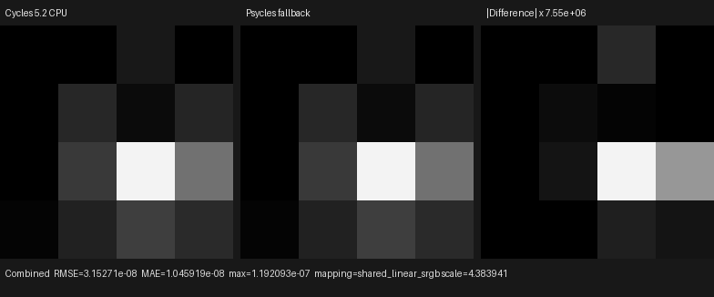
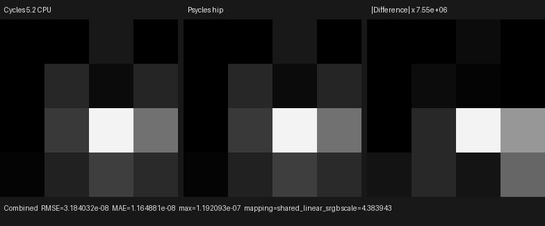
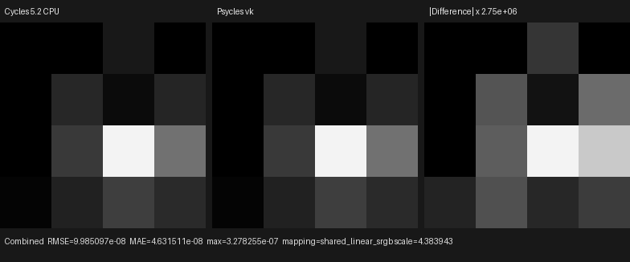

# Homogeneous volume finite-spot MIS

This checkpoint connects Cycles' finite spot-emitter volume measure to the
production Luisa path tracer. It covers the distinct segment-proposal and
collision-position samplers, exact visible-ray cone clipping, coupled
Distance/Equiangular MIS, light/phase MIS, and Volume Direct pass routing. The
scene passes its original Volume Scatter closure to both renderers; there is no
Cycles-side density, material, lighting, or transmittance pre-bake.

## Official contract

The implementation was audited against official Cycles main
`b82c3f0da6c1813dabedc563d64e536f4d83e868`, principally
`kernel/light/spot.h`, `kernel/light/light.h`,
`kernel/integrator/volume_stack.h`, `kernel/integrator/volume_util.h`, and
`kernel/integrator/shade_volume.h`. The executable image oracle is Blender
5.2.0 LTS `fbe6228777e7`.

Cycles has two intentionally different spot-light sampling contracts:

- Before free-flight integration, `spot_light_sample<true>` samples the
  visible sphere cap for a spherical light outside the emitter. It never
  substitutes the surface-only spread-cone proposal and it preserves a
  geometrically valid sample even when spot attenuation is zero.
- `volume_valid_direct_ray_segment` transforms the volume ray to light space,
  intersects the finite-radius expanded positive spot cone, and clips the
  original integration interval. This support restriction, rather than
  proposal rejection by attenuation, determines where a collision may receive
  energy.
- Distance/Equiangular selection and the two-technique power heuristic operate
  on that clipped interval and the proposed light point.
- At the selected collision, the same emitter and original `PRNG_LIGHT.xy`
  coordinates are sampled again with `spot_light_sample<false>`. This ordinary
  finite-emitter measure may use the spread cone and rejects a zero
  radiometric evaluation factor.

`VolumeAnalyticLightSampling` owns these two contracts as an ordinary
host-stage C++ class in a real `.h`/`.cpp` pair. `VolumeLightInterval` owns the
geometric support map. `AnalyticVolumeDirectLightingComponent` composes both
objects with the existing polymorphic `VolumeDirectDirectionProvider` while
constructing one fused Luisa kernel AST. No CPU reference renderer or textual
kernel inclusion is present.

The focused homogeneous fixture now has 59 records. Two new records pin the
non-obvious sampler distinctions directly:
`spot_light_sample<true>` remains valid with zero evaluation while
`spot_light_sample<false>` is invalid, and a narrow finite sphere uses the
visible-sphere PDF for the segment proposal but the spread-cone PDF at the
collision. The integrated regression additionally pins all 16 official
Combined values and checks RGB, alpha, and Volume Direct for fallback, HIP,
and Vulkan.

## Reproduction

Generate the official one-sample, Box-filtered, explicit Tabulated Sobol
oracle. The scene contains a white isotropic Volume Scatter closure at density
`0.5`, a black world, and a zero-radius spot light with energy `10`, angle
`0.9`, blend `0.35`, and position `(0.2, -0.1, -0.4)`:

```text
blender --background --factory-startup \
  --python tools/create_cycles_volume_direct_oracle.py -- \
  docs/validation/2026-07-31/homogeneous-volume-spot-mis/exr/cycles-cpu.exr \
  --light spot --volume-sampling MULTIPLE_IMPORTANCE --samples 1
```

Render the identical raw-closure scene through each Luisa backend. The first
three image arguments retain the distant, VSPG-history, and finite-point
diagnostics; the fourth is this finite-spot result:

```text
./build/bin/psycles_luisa_volume_path_tests fallback \
  /var/tmp/volume-direct-fallback.exr \
  /var/tmp/volume-guided-fallback.exr \
  /var/tmp/volume-point-fallback.exr \
  docs/validation/2026-07-31/homogeneous-volume-spot-mis/exr/psycles-fallback.exr
./build/bin/psycles_luisa_volume_path_tests hip \
  /var/tmp/volume-direct-hip.exr \
  /var/tmp/volume-guided-hip.exr \
  /var/tmp/volume-point-hip.exr \
  docs/validation/2026-07-31/homogeneous-volume-spot-mis/exr/psycles-hip.exr
./build/bin/psycles_luisa_volume_path_tests vk \
  /var/tmp/volume-direct-vk.exr \
  /var/tmp/volume-guided-vk.exr \
  /var/tmp/volume-point-vk.exr \
  docs/validation/2026-07-31/homogeneous-volume-spot-mis/exr/psycles-vk.exr
```

The focused sampler and interval records run separately with:

```text
./build/bin/psycles_luisa_homogeneous_volume_tests fallback
./build/bin/psycles_luisa_homogeneous_volume_tests hip
./build/bin/psycles_luisa_homogeneous_volume_tests vk
```

## Numerical and visual result

All inputs are raw 32-bit scene-linear OpenEXR. All 16 pixels are finite and
the identity orientation has the uniquely lowest error:

| Backend | RMSE | Relative RMSE | Maximum absolute error |
|---|---:|---:|---:|
| fallback | 3.1527e-8 | 6.0235e-7 | 1.1921e-7 |
| HIP | 3.1840e-8 | 6.0833e-7 | 1.1921e-7 |
| Vulkan | 9.9851e-8 | 1.9077e-6 | 3.2783e-7 |

All three triptychs were opened at original resolution. The Cycles and Psycles
panels have the same 4×4 spatial light-cone intensity pattern on every
backend. Their difference panels require amplification by `7.55e6`,
`7.55e6`, and `2.75e6`, respectively; the visible residual blocks are
floating-point amplification rather than a visible-energy or coordinate
mismatch.







The exact inputs and machine-readable measurements are retained in
[`exr/`](exr/), [`fallback-report.json`](fallback-report.json),
[`hip-report.json`](hip-report.json), and
[`vk-report.json`](vk-report.json).

## Backend compilation observation

On the RX 9070 XT, the first integrated HIP run generated and linked the new
path kernel in approximately `1.4 s`; later scenes loaded the resulting cache.
The corresponding Vulkan run spent approximately `6.8 s` in SPIR-V
optimization and compilation (`141759 -> 132326` words). This confirms that
the observed Vulkan cold-start delay is shader lowering/optimization rather
than scene upload or path execution.

## Remaining scope

This validates the finite spot-light homogeneous sub-contract. Area-light
proposal sampling, triangle emitters, environment volume NEE, heterogeneous
grid/null-collision transport, and complex-scene volume validation remain
open. Those gates precede volume-quality claims for Blender 4.1 Splash,
Classroom, Lone Monk, and other production scenes.
