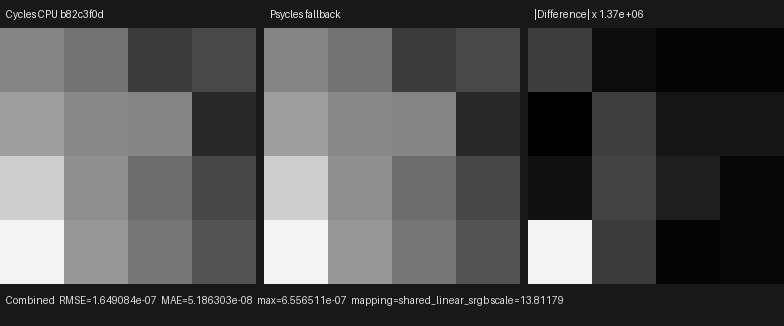
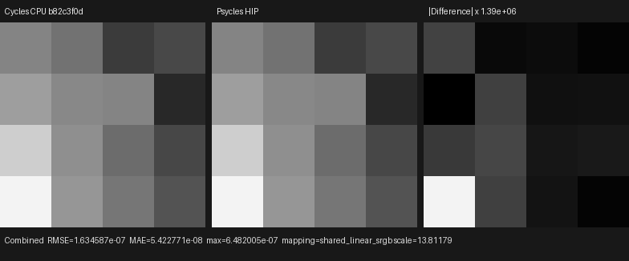
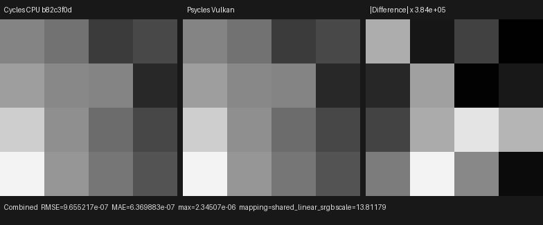

# Homogeneous volume mesh-emitter MIS

This checkpoint connects Cycles' emissive-triangle measures to the production
Luisa volume path and consolidates the previously duplicated surface paths.
It covers the volume-segment area proposal, collision-position
solid-angle/area proposal, one-sided plane clipping, raw emission closure
evaluation, phase/light MIS, target-triangle shadow exclusion, forward-hit
PDF evaluation, Volume Scatter visibility, and a negative-determinant
instance. No material or lighting value is pre-baked by Blender/Cycles.

## Formal contract

The implementation and executable image oracle were audited against an
official local build of Blender/Cycles main
`b82c3f0da6c1813dabedc563d64e536f4d83e868` (Blender 5.3.0 Alpha), principally
`kernel/light/triangle.h`, `kernel/light/light.h`,
`kernel/integrator/shade_volume.h`, and `util/math_intersect.h`.

Cycles intentionally defines two sampling measures for one triangle:

1. `triangle_light_sample<true>` always uses the low-distortion triangle-area
   map for the pre-collision volume-segment proposal. Its sampled point
   defines the equiangular reference before the collision exists.
2. `triangle_light_sample<false>` is evaluated after the collision has been
   selected. Its distance-to-plane/longest-edge predicate chooses either the
   exact spherical-triangle solid-angle map or the area map and its
   solid-angle Jacobian.
3. A forward ray that hits the triangle evaluates the same
   position-dependent measure without drawing a new sample.

These are different probability spaces, so reusing the surface sampler for
the segment proposal would change both the collision distribution and the
coupled Light random coordinates. `TriangleLightSampling` therefore exposes
the three operations explicitly as `from_segment`, `from_position`, and
`from_intersection`.

The emitting half-space is independent of those probability measures.
Cycles forms a world-edge cross product and flips it under
`SD_OBJECT_NEGATIVE_SCALE`; algebraically this is the normalized
inverse-transpose transform of the authored local normal. The segment is then
clipped against that oriented plane for FRONT or its negation for BACK, while
FRONT_BACK retains the complete interval. `VolumeLightInterval::triangle`
implements this half-space intersection directly rather than approximating
it with a ray epsilon or query.

`EmissiveTriangleComponent` is the shared host-stage boundary for instance
geometry, that orientation convention, authored side selection, all three
triangle measures, and construction of the original `SurfacePoint`.
Surface NEE, volume NEE, and surface forward-hit MIS call the same component.
`VolumeMeshLightComponent` implements the mesh-emitter side of the generic
volume proposal/re-sample protocol. These are real `.h`/`.cpp` C++ objects
that generate the fused Luisa AST; the refactor does not hide duplicated
kernels in textual `.inl` fragments.

The emission graph remains a raw Emission closure with color 1 and strength
10. Psycles evaluates that original closure at the sampled surface point.
Cycles is the only rendering oracle; there is no Psycles CPU reference
renderer.

## Regression scene

The 4×4, one-sample fixture contains:

- a homogeneous isotropic Volume Scatter closure at density 0.5;
- one explicit triangle with `Emission Sampling = FRONT`;
- an instance scale of `(-1, 1, 1)`, exercising the negative-scale
  orientation rule;
- a black world, Box pixel filter, Tabulated Sobol, and seed 11939;
- Multiple Importance volume distance sampling and direct-light MIS.

The integrated regression pins all 16 official Cycles Combined values and
requires the same values in Psycles Combined and Volume Direct on fallback,
HIP, and Vulkan. A second render removes the triangle's Volume Scatter
visibility bit and requires an exactly black Volume Direct pass. The same
target-triangle identity is passed to both surface and volume shadow
traversal, covering self-occlusion without an emitter-specific epsilon.

## Reproduction

Generate the official latest-Cycles CPU oracle:

```text
/home/mike/Projects/blender-install-4fe17ef6/blender \
  --background --factory-startup \
  --python tools/create_cycles_volume_direct_oracle.py -- \
  docs/validation/2026-07-31/homogeneous-volume-triangle-mis/exr/cycles-cpu.exr \
  --light mesh --volume-sampling MULTIPLE_IMPORTANCE --samples 1
```

Render the identical fixture through all Luisa backends:

```text
./build/bin/psycles_luisa_volume_triangle_tests fallback \
  docs/validation/2026-07-31/homogeneous-volume-triangle-mis/exr/psycles-fallback.exr

./build/bin/psycles_luisa_volume_triangle_tests hip \
  docs/validation/2026-07-31/homogeneous-volume-triangle-mis/exr/psycles-hip.exr

./build/bin/psycles_luisa_volume_triangle_tests vk \
  docs/validation/2026-07-31/homogeneous-volume-triangle-mis/exr/psycles-vk.exr
```

The backend regressions are also registered with CTest as
`psycles.luisa_volume_triangle_{fallback,hip,vk}`.

## Numerical and visual result

All inputs are raw 32-bit scene-linear OpenEXR. Every pixel is finite, and the
identity orientation has the uniquely lowest RMSE:

| Backend | RMSE | Relative RMSE | Maximum absolute error | Mean luminance ratio |
|---|---:|---:|---:|---:|
| fallback | 1.6491e-7 | 6.8882e-6 | 6.5565e-7 | 0.99999727 |
| HIP | 1.6346e-7 | 6.8276e-6 | 6.4820e-7 | 0.99999707 |
| Vulkan | 9.6552e-7 | 4.0330e-5 | 2.3451e-6 | 1.00001247 |

All three triptychs and their combined inspection sheet were opened at
original resolution. Cycles and Psycles have the same 4×4 spatial energy
pattern and emitting half-space. The residual is not visible at the shared
display exposure; it appears only after difference amplification of
`3.84e5`–`1.39e6`, where it has no coherent support, orientation, or
brightness bias.







The exact images and machine-readable reports are retained under
[`exr/`](exr/), [`triptychs/`](triptychs/), and the three `*-report.json`
files beside this document. A single
[three-backend inspection sheet](triptychs/overview.png) is included for a
compact visual audit.

## Backend compilation observation

On the RX 9070 XT, the first HIP run spent approximately `0.54 s` generating
the new path shader and `1.17 s` linking its code object. The corresponding
Vulkan cold run spent approximately `10 s` in SPIR-V optimization
(`169132 -> 151004` words). This again localizes the Vulkan delay to device
shader lowering/optimization rather than C++ compilation or the 4×4 render.

The required full commands are:

```text
TMPDIR=/var/tmp/psycles-compiler-tmp cmake --build build --parallel 32
ctest --test-dir build --output-on-failure -j32
```

The 32-thread build completed in `8.30 s`; all `87/87` tests passed in
`18.38 s`, including the new fallback/HIP/Vulkan render regressions and the
source-size gate. The largest checked production source is
`src/luisa/path_tracer_scene.cpp` at 1964 lines, below the 2000-line policy.

## Remaining scope

This validates the homogeneous mesh-emitter sub-contract. Emission Sampling
AUTO preprocessing, environment volume NEE, heterogeneous grid/null-collision
transport, emitter importance/light-tree sampling, and full complex-scene
volume validation remain open. Those gates precede volume-quality or
performance claims for Blender 4.1 Splash, Classroom, Lone Monk, and other
production scenes.
