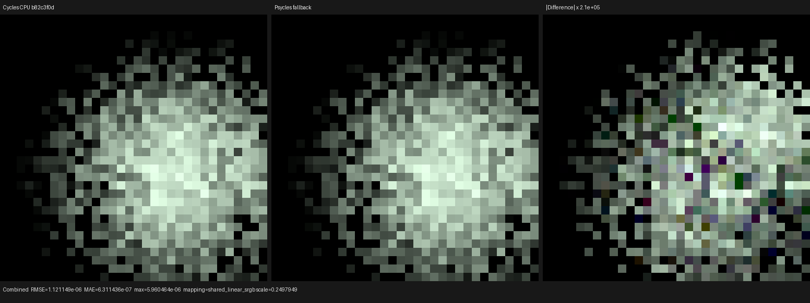
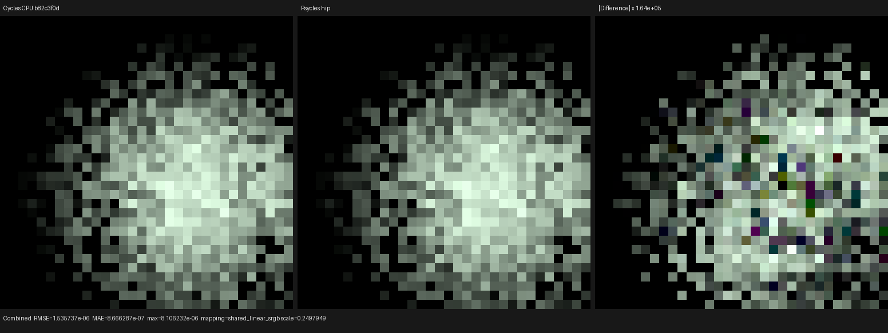
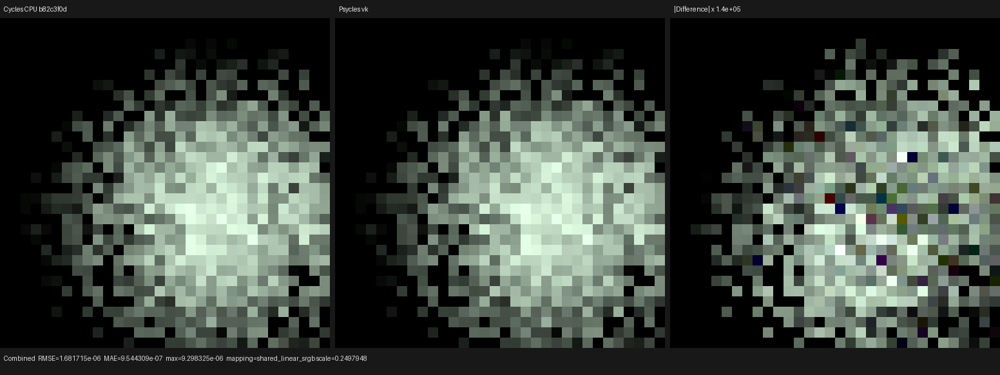

# Surface area-light MIS

This checkpoint removes the last independent area-light sampler from the
production surface next-event estimator. Surface NEE, volume collision NEE,
and BSDF/phase-forward analytic-light hits now construct the same Cycles
spread-clamped probability measure through one host-stage Luisa component.
The fixture passes a raw Diffuse BSDF closure and a raw area-light emission
closure; neither renderer receives pre-baked lighting, materials, or sampled
light coordinates.

## Formal contract

The implementation was audited against official Blender/Cycles main
`b82c3f0da6c1813dabedc563d64e536f4d83e868`, especially
`kernel/light/area.h` and `kernel/light/light.h`. The executable CPU oracle is
the Release build of that same checkout: Blender 5.3.0 Alpha, built
2026-07-31, hash `b82c3f0da6c1`.

For a surface point \(P\), Cycles' ordinary area-light proposal is
`area_light_eval<false>(..., sample_coord=true)`. Its construction is:

1. retain the authored rectangle or ellipse for geometric identity and UV;
2. project the finite spread cone onto the light plane;
3. intersect that footprint with the authored primitive;
4. choose the minimum-area enclosing rectangle, circle, or ellipse;
5. sample a rectangle in exact solid angle, or an ellipse/circle in area and
   apply the area-to-solid-angle Jacobian;
6. evaluate power normalization and spread attenuation on the original lamp.

The complementary forward ray intersects the authored primitive but calls the
same construction with `sample_coord=false`, so its conditional PDF is in the
identical collision measure.

The previous surface branch implemented only two special cases: exact solid
angle for full-spread rectangles and uniform authored-area sampling for every
ellipse or narrow-spread lamp. The latter is not Cycles' proposal. It also
duplicated flag, axis, UV, PDF, and normalization logic already needed by the
volume and forward paths.

`AreaLightSampling::from_position` now owns the complete ordinary proposal,
while `AreaLightSampling::from_intersection` owns known-hit evaluation.
`path_kernel_area_light.h/.cpp` adapts `LightGpu` to that component once, so
surface and volume AST builders cannot reinterpret ellipse, full-spread, or
normalization flags independently. These are ordinary C++ abstractions that
generate one fused Luisa device AST; there is no CPU reference renderer.

## Reproducible Cycles oracle

The new generator constructs the scene from a Blender factory startup:

```text
/home/mike/Projects/blender-install-4fe17ef6/blender \
  --background --factory-startup \
  --python tools/create_cycles_area_light_surface_oracle.py -- \
  docs/validation/2026-07-31/surface-area-light-mis/exr/cycles-cpu.exr \
  --area-shape ELLIPSE --area-spread 1.2 --samples 1
```

It creates a constant raw Diffuse BSDF on an eight-unit plane, a
`0.8 × 0.5` ellipse with energy `37`, a `1.2` radian spread, a black world,
and the same orthographic camera, 32×32 Blackman-Harris filter, seed `20903`,
and Tabulated Sobol configuration as the production test. Its Combined layer
is the retained oracle. As a scene-generator control, running this script
under Blender 5.2.0 LTS `fbe6228777e7` reproduced the historical
`build/diagnostics/area-light/rectangle.blend` outputs under
`oiiotool --diff`. Moving the identical scene to current main changes only
float-level Cycles numerics: the narrow-ellipse 5.2/main comparison has
`8.6851e-7` RMSE and `5.4836e-6` maximum absolute error.

Render both the retained full rectangle and new narrow ellipse fixture:

```text
./build/bin/psycles_luisa_area_light_forward_tests fallback \
  /var/tmp/surface-area-full-fallback.exr \
  docs/validation/2026-07-31/surface-area-light-mis/exr/psycles-fallback.exr
./build/bin/psycles_luisa_area_light_forward_tests hip \
  /var/tmp/surface-area-full-hip.exr \
  docs/validation/2026-07-31/surface-area-light-mis/exr/psycles-hip.exr
./build/bin/psycles_luisa_area_light_forward_tests vk \
  /var/tmp/surface-area-full-vk.exr \
  docs/validation/2026-07-31/surface-area-light-mis/exr/psycles-vk.exr
```

The device regression pins current-main full-frame means for both the
full-spread rectangle and narrow ellipse, plus the rectangle BSDF-forward hit.
For the narrow ellipse it also pins opaque alpha for all 1024 pixels and five
official Cycles pixels spanning zero support, low energy, central energy, a
forward-hit location, and a high-energy spread sample.

## Numerical and visual result

All images are raw 32-bit scene-linear OpenEXR. The identity orientation is
the uniquely lowest-error mapping and no pixel is invalid:

| Backend | RMSE | Relative RMSE | Maximum absolute error |
|---|---:|---:|---:|
| fallback | 1.1211e-6 | 1.0659e-6 | 5.9605e-6 |
| HIP | 1.5357e-6 | 1.4601e-6 | 8.1062e-6 |
| Vulkan | 1.6817e-6 | 1.5989e-6 | 9.2983e-6 |

All three triptychs were opened at original resolution. Cycles and Psycles
show the same irregular one-sample spread footprint, zero-support boundary,
sample positions, hue, and peak structure. Only float32 residuals become
visible after difference amplification by `1.40e5` to `2.10e5`.







The exact EXRs, machine-readable reports, and a
[three-backend inspection sheet](triptychs/overview.png) are retained beside
this document.

## Backend compilation observation

The cold HIP surface path generated AMDGPU code in `0.35 s` and linked the
device bitcode in `0.54 s`. Vulkan optimized the larger shared-sampler path
from `149515` to `117313` SPIR-V words in about `1.41 s`; the full cold test
completed in `1.66 s`. Cached HIP and Vulkan runs completed in less than
`0.05 s` including both scenes. As in the larger volume kernel, cold latency
is device shader lowering/linking rather than C++ compilation or rendering.

## Remaining scope

This closes surface and homogeneous-volume analytic area-light proposal
sharing for rectangle/ellipse and full/narrow spread. Triangle emitters,
environment volume NEE, heterogeneous grid/null-collision transport, distant
forward/background details, and the light tree remain open before full
production-scene compatibility claims.
