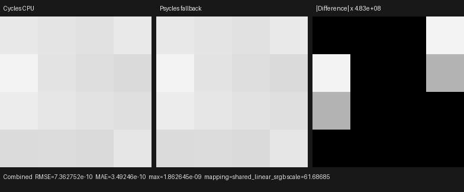
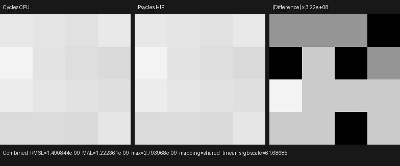
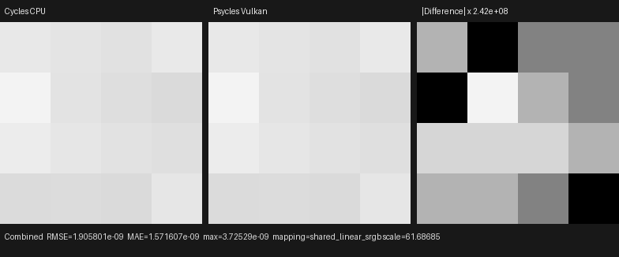

# Volume-scattering probability history

This checkpoint connects Cycles' volume-scattering probability guiding
(VSPG) history to the production Luisa path tracer. It covers raw film
classification, signed-RGBE spatial filtering, cumulative power-of-two update
boundaries, and reuse by later primary volume segments. Blender/Cycles remains
the sole rendering oracle; no CPU reference renderer or material pre-baking is
used.

## Official contract

The implementation was audited against official Cycles main
`b82c3f0da6c1813dabedc563d64e536f4d83e868`, principally
`kernel/film/light_passes.h`,
`kernel/film/volume_guiding_denoise.h`,
`kernel/integrator/shade_volume.h`, and
`integrator/render_scheduler.cpp`. The executable oracle is Blender 5.2.0 LTS
`fbe6228777e7`.

- The raw per-pixel state is three independent accumulators: volume-scatter
  RGB, primary-transmit RGB, and optical-depth sum/count.
- Combined writes use Cycles' priority: `PRIMARY_TRANSMIT` wins over
  volume-scatter visibility. A primary-volume NEE shadow copy is the formal
  exception because Cycles clears transmit and injects volume-scatter before
  its Combined write.
- The primary-transmit path flag starts on a camera segment inside a medium
  and is cleared exactly by the first `next_volume()` transition.
- Horizontal and vertical filters use the exact signed RGBE encoding,
  neighboring sample-count normalization, and Cycles spatial kernel.
- Filtering occurs after cumulative sample counts 1, 2, 4, 8, ... only when
  more samples remain. These boundaries compose with, rather than replace,
  the renderer's maximum samples per dispatch.
- Denoised RGBE radiance is immutable within a dispatch. The raw majorant
  optical-depth mean is different: it is derived from the current running
  sum/count at the start of every sample, including statistics produced by
  earlier samples in the same fused dispatch.

The last distinction was exposed by the first 4-sample differential: rendering
samples 0–2 and then 3 matched Cycles, but one API call for samples 0–3 differed
at pixel 14. One Sobol decision crossed the stale cached majorant threshold.
Making the majorant a derived value restored equivalence without a
scene-specific branch. The regression retains both sample partitionings.

## Film transparency discovered during the audit

The same Combined-write audit found an independent transparent-film error.
Cycles accumulates `transparency = 1 - alpha` in the raw Combined fourth
channel, normalizes it over all samples, and only then computes
`saturate(1 - transparency)`. Psycles now uses that representation instead of
tracking a per-event alpha, and exposure affects RGB only.

The official finite absorption oracle with transparent film has zero Combined
RGB and constant alpha `0.361163139`; its attenuated Environment pass remains
present. The end-to-end regression checks those values on fallback, HIP, and
Vulkan.

## Reproduction

Generate the official four-sample, explicit Tabulated Sobol oracle:

```text
blender --background --factory-startup \
  --python tools/create_cycles_volume_direct_oracle.py -- \
  docs/validation/2026-07-31/volume-guiding-history/exr/cycles-cpu.exr \
  --samples 4
```

Render the same raw closure scene through each Luisa backend. The first output
argument is the one-sample diagnostic and the second is the 4-sample VSPG
image:

```text
./build/bin/psycles_luisa_volume_path_tests fallback \
  /var/tmp/volume-direct-fallback.exr \
  docs/validation/2026-07-31/volume-guiding-history/exr/psycles-fallback.exr
./build/bin/psycles_luisa_volume_path_tests hip \
  /var/tmp/volume-direct-hip.exr \
  docs/validation/2026-07-31/volume-guiding-history/exr/psycles-hip.exr
./build/bin/psycles_luisa_volume_path_tests vk \
  /var/tmp/volume-direct-vk.exr \
  docs/validation/2026-07-31/volume-guiding-history/exr/psycles-vk.exr
```

The focused regression checks the official 1-sample empty-history image, an
official 3-sample intermediate value, and all 16 official 4-sample values. It
also compares a 3+1-sample API sequence with a single 4-sample call, exercises
the schedule with a dispatch limit larger than the history boundaries, and
checks the standalone filter bit-for-bit. The complete test suite passed:

```text
TMPDIR=/var/tmp/psycles-compiler-tmp \
  cmake --build build --parallel 32
ctest --test-dir build --output-on-failure -j32
```

Result: 79/79 tests passed. The focused VSPG/path-state/filter/partition set
passed 10/10 on fallback, HIP, and Vulkan.

## Numerical and visual result

All compared images are raw 32-bit scene-linear OpenEXR at 4 spp. All 16
pixels are finite, the identity orientation is unambiguous, and the residuals
are a few floating-point ULPs:

| Backend | RMSE | Relative RMSE | Maximum absolute error |
|---|---:|---:|---:|
| fallback | 7.3628e-10 | 5.8954e-8 | 1.8626e-9 |
| HIP | 1.4908e-9 | 1.1937e-7 | 2.7940e-9 |
| Vulkan | 1.9058e-9 | 1.5260e-7 | 3.7253e-9 |

The three generated triptychs were opened at original resolution. In every
case, the Cycles and Psycles panels show the same 4×4 guided intensity pattern.
The difference panels deliberately multiply ULP-scale residuals by
`2.42e8`–`4.83e8`; their visible blocks are numerical amplification, not
visible-energy differences.







The exact inputs and machine-readable results are retained in
[`exr/`](exr/), [`fallback-report.json`](fallback-report.json),
[`hip-report.json`](hip-report.json), and
[`vk-report.json`](vk-report.json).

## Remaining scope

This validates history-dependent homogeneous distant-light transport, not
complete volume rendering. Finite point/spot/area lights still require
equiangular/distance MIS, environment volume NEE remains open, and
heterogeneous grid/null-collision transport is not implemented. Those are the
next gates before Blender 4.1 Splash, Classroom, and other complex volume
scenes can be treated as parity tests rather than diagnostics.
