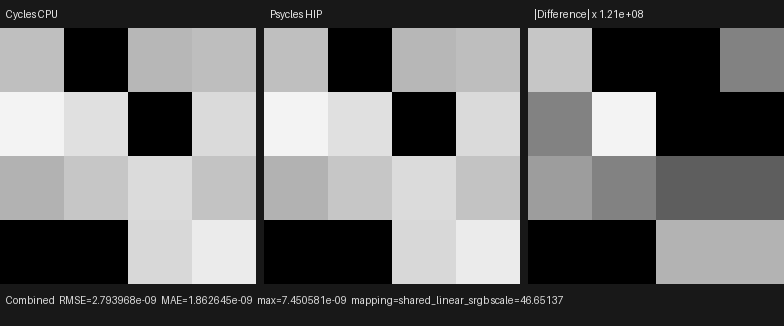

# Production heterogeneous-volume shadow transport

## Verdict

Psycles `main@8f413cbecfb1dba152d1d533d359c7facc17b88d`
connects current-Cycles residual-ratio heterogeneous shadow transport to the
production Luisa path kernel and removes the former spatial-volume scene gate.
The retained input is the original Blender closure graph: no Cycles
pre-evaluation, coefficient texture, fitted image, or Psycles CPU reference
renderer is involved.

The complete 4×4 one-sample production fixture now agrees with
Blender/Cycles CPU to at most `7.4506e-9` in scene-linear RGB on fallback, HIP,
and Vulkan. This fixture exercises Generated-coordinate density, adaptive
majorant traversal, VSPG, distance NEE, raw phase recovery, and
heterogeneous shadow transmittance in one pixel estimator. It is a focused
algorithmic checkpoint, not a substitute for the requested Lone Monk,
Splash, and Classroom full-scene acceptance runs.

## Exact sources and device

| Item | Value |
| --- | --- |
| Psycles | `main@8f413cbecfb1dba152d1d533d359c7facc17b88d` |
| LuisaCompute | `next@21612b45beccff433aa93eb3a3a981afc48f53e1` |
| Blender executable | `main@b82c3f0da6c1`, Blender 5.3 Alpha |
| Cycles reference checkout | `main@6f7add4a791e69f23bcc7ff0bdf4ea0307b002c5` |
| GPU | AMD Radeon RX 9070 XT |
| Vulkan driver | RADV GFX1201 |
| Sampling | one fixed Tabulated Sobol sample, seed `11939`, Box filter |

The audited `intern/cycles` implementation is unchanged between the Blender
executable and the checked-out Cycles reference revision used for source
inspection.

## Cycles contracts preserved

The implementation follows the relations in
`kernel/integrator/shade_volume.h`,
`kernel/integrator/shade_shadow.h`,
`kernel/integrator/state_util.h`, and
`kernel/geom/shader_data.h`:

1. `volume_octree_advance_shadow()` advances one 16-dimension bounce block
   before every attempted coalesced interval, including the final failed
   attempt after traversal exhaustion.
2. Adjacent immutable majorant segments are merged until
   `(sigma_max - sigma_min) * segment_length >= 1`; the original closure is
   still evaluated independently at every residual-ratio sample.
3. Transmittance uses Cycles' biased `k`, synchronized power-of-two expansion
   order, paired lower-order estimators, and single-term telescoping
   correction. Throughput terminates only below `1e-6`.
4. Shadow tracking starts from a copied path RNG state scrambled with
   `0x8647ace4`; the ordinary heterogeneous camera path retains its distinct
   `0xe35fad82` domain.
5. A committed transparent-surface hit has two distinct consumers: volume
   transport starts at the raw hit `t`, while only the next surface query uses
   the one-ULP `nextafter` offset.
6. `shader_setup_from_volume()` resets Light Path `Ray Length` to zero for
   every transparent-shadow interval.
7. Cycles copies the complete camera volume stack into shadow state.
   A shadow-invisible object remains in homogeneity selection, majorant
   traversal, and RNG consumption; only its raw closure evaluation is skipped.
   The implementation initially compacted such entries out, passed a simple
   image check, and was rejected during source audit because it changed the
   stochastic structure. The committed form uses structure-preserving
   evaluation masking.

The last point is intentionally not implemented as a case-specific image
patch. `VolumeStackEntryPointProvider::should_evaluate()` is the host-stage
semantic boundary used by both analytic stacked evaluation and raw
heterogeneous collision evaluation. Runtime Light Path extrema apply the same
predicate while preserving Cycles' heterogeneous `0.5` majorant floor.

## Host-stage composition

Ordinary C++ polymorphism composes one fused Luisa AST; there is no device-side
virtual dispatch:

- `PathVolumeTrackingRandomSource` owns the camera/shadow Sobol dimension
  mapping;
- `HeterogeneousVolumeShadowComponent` owns shadow segment coalescing,
  residual-ratio traversal, cutoff, and observable RNG state;
- `VolumeShadowIntervalCursor` owns raw-medium-boundary versus offset-query
  semantics and per-interval Ray Length;
- `VolumeShadowComponent` selects analytic or heterogeneous transport from
  the complete active stack;
- `SceneVolumeStackEntryPointProvider` owns the exact object visibility rule;
  and
- `InstanceGpu::visibility_mask` carries the normalized Blender/Cycles
  visibility contract to device code.

These are real `.h + .cpp` components. The main shadow adapter is 337 lines,
the generic estimator is 212, the RNG adapter is 89, and the interval cursor
is 35. A reusable 52-line CMake helper now registers the same device fixture
for fallback, HIP, and Vulkan, reducing the top-level `CMakeLists.txt` from
2067 to 1924 lines.

## Regression coverage

The dedicated shadow fixture pins three current-Cycles paths on all backends:

- nonconstant raw extinction through four source majorant segments;
- throughput termination after the first coalesced group; and
- a shadow-invisible/zero-coefficient medium that still consumes all four
  segments, three groups, five closure queries, and advances the copied RNG
  offset from `100` to `164`.

The stacked-volume fixture separately proves that a hidden object remains in a
two-entry stack while the accumulated coefficients contain only the visible
World closure. The surface-ray fixture checks the raw `1.0` and `8.5` medium
boundaries bit-for-bit, their exact next representable query values, and zero
Ray Length on fallback, HIP, and Vulkan.

The production path regression adds three independent Cycles oracles:

- raw Generated-coordinate density with heterogeneous shadow transport;
- `Density = 0.5 + Light Path.Ray Length` plus a transparent shadow-only
  interval splitter; and
- a heterogeneous object with Shadow visibility disabled, which retains its
  majorant/RNG structure while contributing zero shadow coefficients.

Oracle generation:

```sh
/home/mike/Projects/blender-install-4fe17ef6/blender \
  --background --factory-startup \
  --python tools/create_cycles_volume_direct_oracle.py -- \
  /var/tmp/psycles-heterogeneous-volume-direct.exr \
  --heterogeneous

/home/mike/Projects/blender-install-4fe17ef6/blender \
  --background --factory-startup \
  --python tools/create_cycles_volume_direct_oracle.py -- \
  /var/tmp/psycles-volume-shadow-ray-length.exr \
  --ray-length-density --shadow-split-plane

/home/mike/Projects/blender-install-4fe17ef6/blender \
  --background --factory-startup \
  --python tools/create_cycles_volume_direct_oracle.py -- \
  /var/tmp/psycles-heterogeneous-shadow-invisible.exr \
  --heterogeneous --hide-volume-shadow
```

Backend image reproduction:

```sh
for backend in fallback hip vk; do
  build/bin/psycles_luisa_volume_path_tests \
    "${backend}" heterogeneous \
    "docs/validation/2026-08-01/heterogeneous-volume-shadow-production/exr/psycles-${backend}.exr"
done
```

## Numerical and visual result

All 16 pixels and all RGB channels are finite. Identity orientation is the
minimum-error orientation for every backend.

| Backend | RMSE | Relative RMSE | Maximum absolute error | Mean-luminance ratio |
| --- | ---: | ---: | ---: | ---: |
| fallback | `2.0029e-9` | `1.6560e-7` | `4.6566e-9` | `0.999999909` |
| HIP | `2.7940e-9` | `2.3100e-7` | `7.4506e-9` | `1.000000000` |
| Vulkan | `2.2088e-9` | `1.8263e-7` | `5.5879e-9` | `1.000000000` |

The complete machine-readable results are
[fallback-report.json](fallback-report.json),
[hip-report.json](hip-report.json), and
[vk-report.json](vk-report.json).



The triptych is nearest-neighbor enlarged because the regression is 4×4.
Visual inspection confirms identical black-sample placement, spatial
ordering, and grayscale energy. The right panel needs an approximately
`1.21e8×` amplification to expose the remaining ULP-scale arithmetic
difference; it does not reveal a flip, sampling-branch mismatch, or structured
lighting residual.

Artifact SHA-256 values:

- Cycles CPU EXR:
  `b895c0492d83978aa7649c5a13b3aa64d6f0a9489aa8025448d36ab60c77c405`;
- Psycles fallback / HIP / Vulkan EXRs:
  `90da08e34af8bba6ba067623fb287f958efbfeb7da59fff65589e1b92b331fe0`,
  `1433c05f77c7966d13eeead1b3bc54c59fb526acbf406119c00e7ff53e5258c7`,
  and
  `25478a359990c32d6828b1956a58ed745b90a04cb7f78e7d21982570deb46918`;
- triptych:
  `32e30f5ff09af6af02c76210f40bd41583f7ffd066d21329fea19da0120923a0`.

## Vulkan cold-JIT diagnosis

The corrected full-stack kernel was profiled with production optimization and
the Psycles shader cache explicitly disabled:

```sh
PSYCLES_DISABLE_SHADER_CACHE=1 \
LUISA_VULKAN_REQUIRE_NATIVE_XIR_SPIRV=1 \
LUISA_XIR_TRACE_PASSES=1 \
LUISA_LOG_LEVEL=verbose \
  build/bin/psycles_luisa_volume_path_tests vk heterogeneous
```

| Stage | Time | Share of process |
| --- | ---: | ---: |
| Whole focused process | `24.180 s` | `100%` |
| XIR translation | `0.127 s` | `0.53%` |
| Structured optimization | `0.240 s` | `0.99%` |
| SPIR-V XIR legalization | `20.874 s` | `86.33%` |
| `restructure-cfg` alone | `19.698 s` | `81.46%` |
| SPIR-V optimization/emission | about `2.568 s` | `10.62%` |
| Vulkan pipeline creation | about `0.028 s` | `0.12%` |

`restructure-cfg` accounts for `94.36%` of legalization. It receives 6375
lowered phi nodes and produces 131 loops, 665 selections, and 38 switches.
Its nested trace records 14,989 selection-exit site queries and 12,653
enclosing-loop queries. The dominant nested fixed point is `12.913 s`;
selection-exit draining and construct-exit fixup account for `5.666 s` and
`4.951 s` inside that fixed point. The detailed bounded snapshot is
[vulkan-cold-jit.json](vulkan-cold-jit.json).

Thus the Vulkan cold delay is still a Luisa XIR CFG-restructuring complexity
problem, not RADV pipeline creation. The earlier formal dominance-based
selection-reentry fix remains effective, but this larger kernel exposes a
separate remaining cost in the post-restructure fixed point. That issue is the
next Luisa `next` task; it must be optimized through equivalent CFG relations
and structural regressions, not kernel-shape special cases.

## Validation and honest boundary

The implementation was built with all requested host threads:

```sh
cmake --build build --parallel 32
ctest --test-dir build --output-on-failure -j32
python -m py_compile tools/create_cycles_volume_direct_oracle.py
git diff --check
```

The first cold full CTest run passed every renderer/backend test but exposed
the 2067-line top-level CMake file (`118/119`). After the reusable test module
refactor, the final run passed `119/119` in `3.48 s` with warm shader caches.
The source-size gate checks 314 first-party files and now passes.

Surface transparency and volume attenuation are still traversed separately in
the fused Psycles kernel. Their product is commutative, but Cycles interleaves
them and can terminate earlier at its throughput cutoff. Exact cutoff ordering
and cache-resume behavior remain an explicit parity item rather than being
silently claimed complete.

The next scene-level acceptance step is a fresh Lone Monk render at 480p or
higher, followed by Blender 4.1 Splash and Classroom volume-lighting cases.
Each run must retain raw closures and report Cycles HIP/CPU versus Psycles
HIP/Vulkan/fallback timing, multilayer EXR numerical metrics, and
original-resolution visual triptychs.
