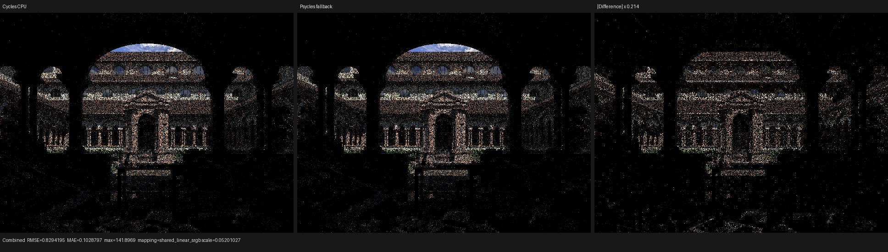
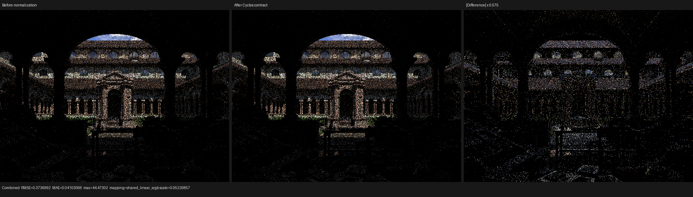

# Lone Monk tangent normal-frame validation

This checkpoint fixes a concrete Cycles contract mismatch found while
following the grass/leaf path at pixel `(404, 178)`, sample 0, in the
640x480 Lone Monk render. It is an improvement checkpoint, not a claim of
complete scene parity.

## Oracle and root cause

The only behavioral oracle is current Cycles. The diagnostic build is
based on Blender/Cycles `6f7add4a791e69f23bcc7ff0bdf4ea0307b002c5`
with the local path-trace instrumentation commit
`a29a0fec7adaba810aaf8540f2e47833efdd4291`.

The selected second surface is material `bush`. Its relevant raw graph is
UV -> Mapping -> `LeafSet019_1K_Normal.jpg.001` -> Normal Map (tangent,
OpenGL, strength 1) -> Principled BSDF. No Cycles evaluation or material
pre-baking is used by Psycles.

The misleadingly named current Cycles helper
`triangle_smooth_normal_unnormalized_object_space()` actually computes
`safe_normalize(triangle_interpolate(...))` before the MikkTSpace
bitangent and mapped normal are constructed. Psycles previously kept that
interpolated object-space normal unnormalized inside the tangent frame.
Because the mapped tangent and normal components are then normalized as a
sum, the old result depended on the length of the interpolated vertex
normal. This is a semantic mismatch, not a backend epsilon issue.

Psycles now normalizes the object-space base normal at the Normal Map
component boundary and uses the unperturbed world-space shading normal
when the required base/tangent data is unavailable. The implementation was
also moved out of the generic image-value component into dedicated
host-stage `NormalMapValueNode` and `BumpValueNode` classes. The split
preserves raw graph closures while making normal operations independently
extensible during Luisa AST construction.

## Regression contract

`psycles_luisa_cycles_closure_tests` now evaluates a raw
Normal Map -> Diffuse graph with:

- a deliberately non-unit object-space base normal `(0, 0, 0.5)`;
- tangent-space color `(0.8, 0.3, 0.9)` and strength 1;
- expected Cycles normal
  `(0.557086014, -0.371390671, 0.742781341)`;
- a zero-base-normal case that must fall back to `(0, 0, 1)`.

A unit-normal-only fixture would not distinguish the corrected contract
from the previous implementation. The old scale-dependent construction
fails the new non-unit test.

The targeted regression passed on all production Luisa backends:

```text
psycles.luisa_cycles_closure_fallback  Passed
psycles.luisa_cycles_closure_hip       Passed
psycles.luisa_cycles_closure_vk        Passed
```

The complete Psycles suite was then run with 32-way scheduling: 123/123
tests passed in 4.49 seconds.

## Path-level result

The table compares the second-event sampled closure normal against Cycles
CPU. Cycles CPU and Psycles fallback are the same-device pair; Cycles HIP
is included to quantify the oracle's own accelerator intersection
variation on this high-frequency texture.

| Trace | Normal | L2 error vs Cycles CPU |
|---|---|---:|
| Cycles CPU | `(-0.979629695, -0.109711431, 0.168193683)` | 0 |
| Psycles fallback before | `(-0.979592383, -0.108766437, 0.169022709)` | 0.001257653 |
| Psycles fallback after | `(-0.979660153, -0.108926371, 0.168526024)` | 0.000853052 |
| Cycles HIP | `(-0.979714692, -0.106628358, 0.169674709)` | 0.003421403 |

The fix reduces the selected fallback path's closure-normal L2 error by
32.2%. The remaining fallback/CPU intersection-coordinate differences are
`3.19e-6` in `u` and `2.25e-5` in `v`; the corresponding Cycles CPU/HIP
differences are `6.78e-5` and `4.09e-5`. Texture filtering amplifies those
small barycentric differences, so GPU validation must remain device-paired
rather than forcing a CPU bit pattern onto accelerator intersections.

The decoded comparisons are retained in
[reports/path-cycles-cpu-vs-psycles-fallback.json](reports/path-cycles-cpu-vs-psycles-fallback.json)
and
[reports/path-cycles-cpu-vs-cycles-hip.json](reports/path-cycles-cpu-vs-cycles-hip.json).

## Visual inspection

The following 640x480 triptychs were opened and inspected at their native
1936x546 generated size. These are deterministic one-sample diagnostic
renders, not converged quality or performance evidence.



The building layout, silhouette, and dominant illumination agree by eye.
Structured residuals remain across the roof/eaves, vegetation, facade
edges, and foreground. At one sample, stochastic path divergence dominates
the reported Combined relRMSE of 0.334860; the mean-luminance ratio is
0.980506. This image therefore locates remaining work but is not an
acceptance image.



With identical Psycles intersections and random samples, the difference
panel shows the corrected tangent frame affecting normal-mapped roof,
facade, foliage, and foreground paths rather than only the selected pixel.
The before/after mean-luminance ratio is 0.999600. The associated image
reports are retained under [reports](reports).

## Next divergence boundary

Cycles samples a triangle emitter at the selected leaf event. Psycles'
analytic-light component writes path-trace light slots, but its emissive
mesh component currently does not. Therefore the empty Psycles light slots
are an instrumentation gap and are not evidence that mesh next-event
estimation was skipped. The next formal step is to give every direct-light
component the same trace contract, then compare emitter identity, PDF,
geometry, shader evaluation, visibility, and MIS before changing transport
behavior.

The full HIP path-diagnostic kernel is intentionally not an acceptance
gate for this checkpoint: its roughly 8.3 MiB generated module enters the
already documented superlinear HIPRTC cold-link path. Backend semantics are
covered here by the focused three-backend regression; a converged
CPU/HIP/Vulkan/fallback scene matrix will be rerun after the mesh-light
trace boundary is observable.
