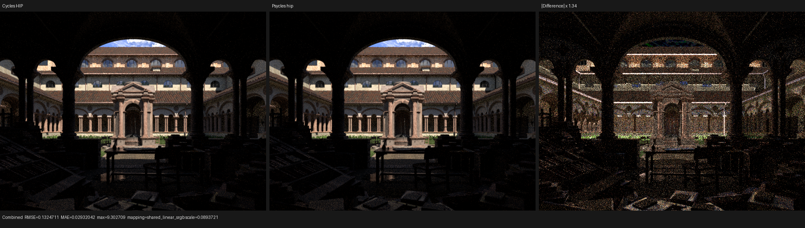
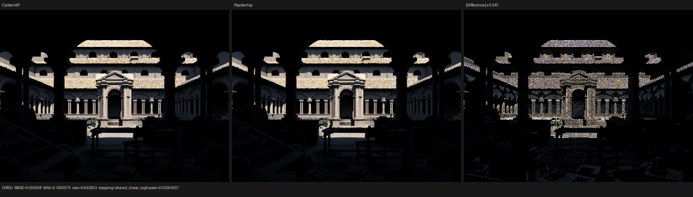
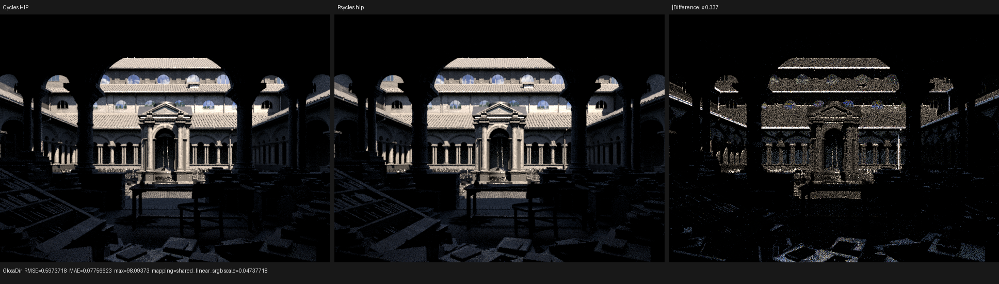
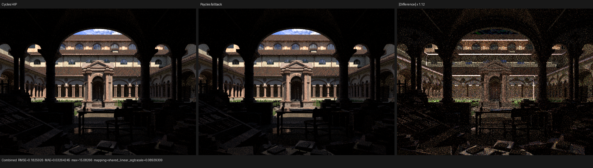
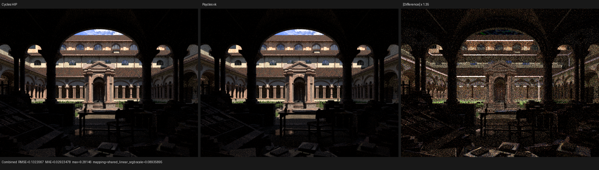
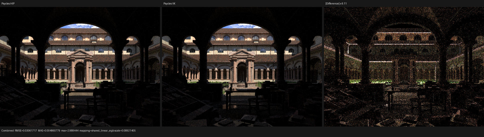
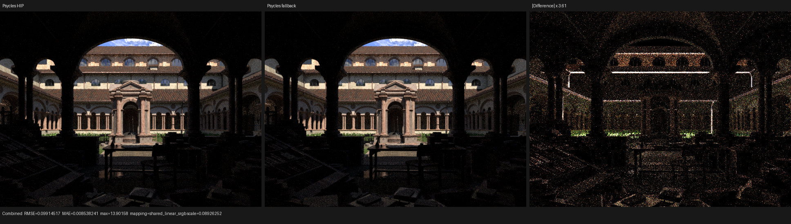

# Lone Monk Principled physical-closure validation

This checkpoint validates Psycles commit
`912f9694578c89477afd82bd968cf709cba5df88` after replacing the virtual
aggregate Principled closure with the Cycles physical closure sequence.
It is an improvement checkpoint, not a claim of complete Cycles parity.

## Inputs and matrix

- scene:
  `lone-monk_cycles_and_exposure-node_demo.blend`
- resolution and sampling: 640x480, 64 fixed samples, seed owned by the
  scene, adaptive sampling and denoising disabled by the benchmark runner
- Blender executable: 5.3.0 Alpha,
  `b82c3f0da6c1`
- Cycles source reference:
  `6f7add4a791e69f23bcc7ff0bdf4ea0307b002c5`
- LuisaCompute:
  `next@d0dd9ae50cca2f29d091962ccc164a9f29cf3f48`
- device: AMD Ryzen 9 9950X3D and AMD Radeon RX 9070 XT
- exported scene: 348 geometries, 87,541 instances, 37 raw material
  graphs

The canonical runner executed Cycles CPU, Cycles HIP, Psycles fallback,
Psycles HIP, and Psycles Vulkan sequentially. The fallback entry is the
production Luisa LLVM/Embree path, not a Psycles CPU reference renderer.
The exact commands, hashes, selected devices, reports, and timing
boundaries are retained in [benchmark.json](benchmark.json).

## Render throughput

The comparison below uses renderer-reported render intervals. Cold
process/JIT time is reported separately and is not folded into rendering
throughput.

| Renderer | Render time | Relative to Cycles HIP |
|---|---:|---:|
| Cycles HIP | 1.9087 s | 1.000x |
| Cycles CPU | 4.9631 s | 2.600x slower |
| Psycles HIP | 2.2213 s | 1.164x slower |
| Psycles Vulkan | 2.6747 s | 1.401x slower |
| Psycles fallback | 5.2920 s | 2.773x slower |

Psycles HIP is 16.4% slower than Cycles HIP on the same RX 9070 XT.
Psycles HIP is 2.23x faster than Cycles CPU. Psycles fallback is 6.6%
slower than Cycles CPU.

The physical closure expansion did not materially change steady-state
throughput from the immediately preceding aggregate-closure run:
Psycles HIP was 2.2218 s and Vulkan was 2.6662 s there.

## Image agreement

All values below compare against the new Cycles HIP render.

| Backend | Combined relRMSE | Combined MAE | Mean luminance ratio |
|---|---:|---:|---:|
| Psycles HIP | 0.084969 | 0.029320 | 0.989484 |
| Psycles Vulkan | 0.084799 | 0.029235 | 0.989184 |
| Psycles fallback | 0.117118 | 0.032642 | 0.981922 |

Against the immediately preceding aggregate Principled run, HIP Combined
relRMSE fell from 0.098791 to 0.084969 (14.0%) and MAE fell from
0.047301 to 0.029320 (38.0%). The strongest per-pass improvements are:

| HIP pass | Previous relRMSE | Current relRMSE | Change |
|---|---:|---:|---:|
| Diffuse Indirect | 0.913368 | 0.340005 | -62.8% |
| Glossy Indirect | 0.869936 | 0.425117 | -51.1% |
| Diffuse Direct | 0.071572 | 0.065030 | -9.1% |
| Glossy Direct | 0.147873 | 0.145901 | -1.3% |

The color and normal AOVs are effectively unchanged, as expected: the
fix changes physical closure allocation, selection, and the remapped
third BSDF random dimension rather than the original material graph
inputs.

HIP and Vulkan remain visually equivalent at normal display scale. Their
Combined mean luminance ratio is 0.999696 and their Combined relRMSE is
0.019670; the remaining difference is stochastic/intersection backend
variation. Fallback versus HIP has a 0.992358 luminance ratio and
0.063696 relRMSE, with most visible backend variation on high-contrast
roof edges and rare high-energy samples.

## Visual inspection

Every image below was opened at its generated 1936x546 resolution. The
right panel is an automatically scaled absolute difference, so its scale
must not be compared visually between files without reading the label.

The two rendered panels are now substantially closer. The grass no
longer shows the broad aggregate-Principled sampling mismatch. Remaining
structured residuals are visible on roof highlights, eaves, arch and
column silhouettes, vegetation, and the high-contrast foreground.

Diffuse Direct MAE fell by 22.5%. Residuals remain concentrated on the
roof tiles, facade edges, vegetation, and hard shadow boundaries.

Glossy Direct MAE fell by 22.1%, although relRMSE moved less because rare
bright samples dominate RMS. Roof and facade highlights are still
systematically different and remain an active parity target.

The backend-only triptychs were also inspected:

## Cold compilation diagnosis

HIP and Vulkan have different cold-JIT bottlenecks.

For the production HIP path kernel:

- Luisa XIR/LLVM code generation: 20.164 s
- LLVM bitcode size: 4,569,964 bytes
- `hiprtcLinkComplete`: 280.864 s
- total shader JIT: 305.545 s
- cached render interval: 2.221 s

The preceding kernel used 4,453,120 bytes of bitcode and spent 195.906 s
in `hiprtcLinkComplete`. A 2.62% bitcode increase therefore caused a
43.4% link-time increase, showing that HIPRTC linking is superlinear for
this kernel. The much larger path-diagnostic kernel generated about
8.33 MiB of bitcode and remained in `hiprtcLinkComplete` for more than
22 minutes before the intentionally aborted measurement. That diagnostic
callable composition requires separate optimization; it is not part of
the production throughput number.

Vulkan used the native XIR-to-SPIR-V route, not the DXC fallback. Its
logged optimizer reduced 1,930,185 SPIR-V words to 1,705,322 words. The
native generation/optimization interval occupied about 76 seconds, and
total shader JIT was 117.712 s. The current Luisa logs do not yet split
the remaining roughly 42 seconds among shader-module creation, pipeline
creation, and cache serialization, so those stage timings are the next
backend diagnostic task.

## Remaining work

The selected grass path now matches Cycles' closure order
Transparent(30), GGX(12), Diffuse(2), and its GGX outgoing direction is
within roughly 1e-3. The remaining input discrepancy begins earlier:
intersection barycentrics differ by about 2e-5 and the interpolated
closure normal by about 1e-3. Direct-light trace fields are also not yet
recorded by Psycles. These are concrete next divergence boundaries; the
current images are not accepted as final Cycles parity.

The complete pass reports are in [reports](reports).
