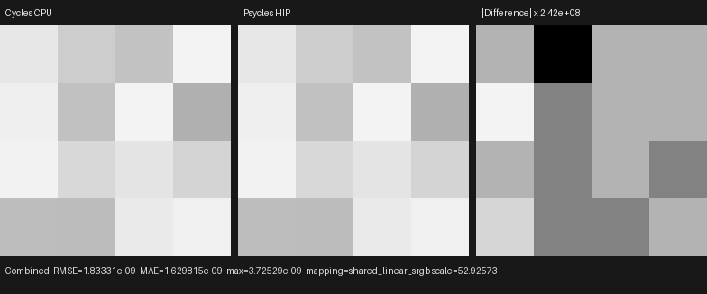
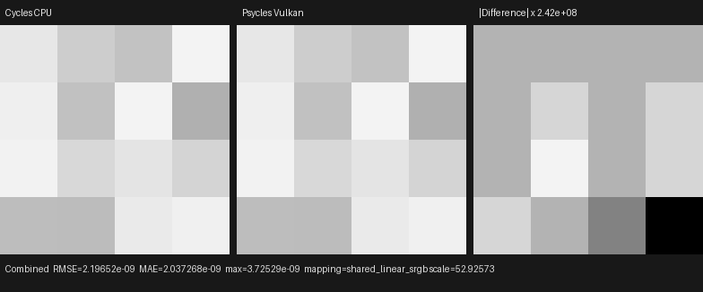

# Production scene volume-majorant connection

This checkpoint moves the Cycles-compatible volume-majorant construction out
of an isolated component fixture and into the production
`LuisaPathTracerBackend::compile_scene` path. Blender/Cycles main
`b82c3f0da6c1813dabedc563d64e536f4d83e868` remains the only renderer oracle.
Psycles evaluates the original retained `GraphSurface` Volume closure through
Luisa DSL; it does not use a Psycles CPU reference renderer, a baked material,
or a Blender/Cycles preprocessing substitute.

## Production ownership

After material lowering, geometry and attributes have been uploaded, and the
BLAS/TLAS, texture heap, and bindless heap are complete, the production scene
compiler now:

1. derives every majorant material from the retained runtime
   `MaterialBinding` and `CompiledMaterial`;
2. uses the same Cycles shader-index fallback and material identity as
   `VolumeStack`;
3. classifies homogeneity with the production
   `VolumeProgramCapabilityComponent`;
4. plans object and World root ranges from the original `SceneSnapshot`;
5. evaluates raw closure extrema on the selected Luisa backend;
6. builds and formally validates the Cycles octree hierarchy; and
7. retains the flattened node, root, and range buffers in `LuisaSceneData`.

The production homogeneous oracle retains one root, one leaf node, two ranges
(one object and the final World range), and World range index one. The existing
heterogeneous-scene capability gate deliberately remains before this stage:
spatial Volume graphs are not accepted for rendering until the majorant
traversal, null-collision transport, phase sampling, and direct-light estimator
are connected to the production path.

## Vulkan backend defect and formal fix

The first Vulkan run exposed a Luisa native XIR-to-SPIR-V metadata
contradiction. Optimized XIR correctly assigned an unused `Accel` argument a
zero descriptor-role mask, but argument-usage collection passed that exact
`Usage::NONE` through a code-emission helper whose separate contract maps
unused values to a conservative `READ`. Artifact validation therefore rejected
the impossible pair `READ + no Accel descriptor role`.

The fix is in Luisa `next` commit
`9516ee301` (`Fix native SPIR-V unused accel usage`). Persisted usage now comes
directly from the exact optimized-XIR analysis; the conservative default
remains local to code emission. The regression pins all four semantic states:
dead traversal and unused Accel are `NONE + zero roles`, instance reads are
`READ + instance`, and instance writes are `WRITE + instance`. Luisa's SPIR-V
codegen, saved-argument, shader-binary, and interface-planner tests all pass.
The original Psycles production scene is the end-to-end runtime regression.

## Numerical and backend result

The production test compiles the scene, inspects the retained resource
cardinalities, renders the existing official Cycles homogeneous-volume oracle,
and checks every Combined, Environment, Volume Direct, and Volume Indirect
value. Warm focused wall times were:

| backend | wall time | result |
| --- | ---: | --- |
| fallback (LLVM/Embree, 32 threads) | `0.19 s` | pass |
| HIP | `0.39 s` | pass |
| Vulkan/RADV | `0.94 s` | pass |

The fresh 32-bit scene-linear EXRs remain within a few floating-point ULPs of
the official Cycles CPU oracle:

| backend | RMSE | relative RMSE | maximum absolute error |
| --- | ---: | ---: | ---: |
| fallback | `1.2320e-9` | `9.0119e-8` | `3.7253e-9` |
| HIP | `1.8333e-9` | `1.3410e-7` | `3.7253e-9` |
| Vulkan | `2.1965e-9` | `1.6067e-7` | `3.7253e-9` |

These are a 4×4 exact estimator regression and shader-compilation timings, not
a complex-scene speed claim. Lone Monk, Splash, and Classroom performance
comparisons remain subject to the production heterogeneous-transport and
other documented scene gates.

The final full build used `--parallel 32` and completed in `8.52 s`.
Serial CTest then passed `105/105` tests in `9.27 s`, including all
fallback/HIP/Vulkan volume stages, the OpenEXR contract, and the source-size
gate.

## Visual inspection

All three generated triptychs were opened at original generated resolution.
The Cycles and Psycles panels have the same 4×4 spatial intensity pattern,
with no changed silhouette, orientation, invalid pixel, or visible-energy
difference. The right panels amplify ULP-scale residuals by approximately
`2.42e8`; their blocks are intentionally not displayed at physical scale.






The EXRs, triptychs, and complete machine-readable measurements are retained
beside this report as `fallback-report.json`, `hip-report.json`, and
`vk-report.json`.

## Reproduction

```sh
cmake --build build \
  --target psycles_luisa_volume_path_tests \
  --parallel 32
ctest --test-dir build --output-on-failure \
  -R 'psycles\.luisa_volume_path_(fallback|hip|vk)$' \
  --parallel 3
```
