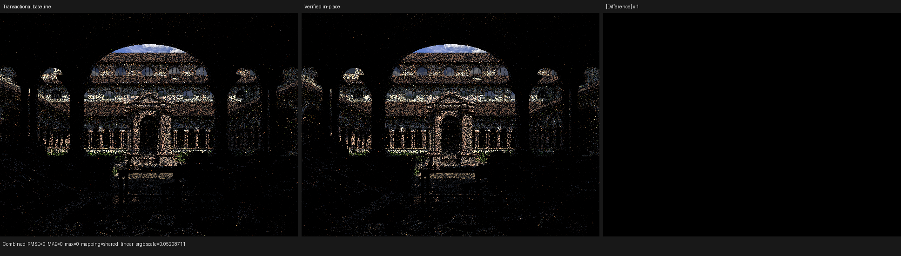

# Vulkan CFG disposable-compilation checkpoint

This checkpoint removes a formally redundant execution of Luisa's
`restructure_cfg` transform from native SPIR-V code generation. The repair is
published on LuisaCompute `next` as
`5018c341fcd4d03d320efb10f868ac453414244c`, based on
`f72451482b68a2ab8d23d074e07aa6b5da380d35`.

It changes compilation ownership, not CFG semantics or the renderer. The
default public pass remains transactional. Only the freshly translated,
exclusively owned, fail-stop SPIR-V legalization module opts into the new
disposable in-place policy.

## Formal ownership contract

`RestructureCFGMutationMode` now has two explicit policies:

- `TRANSACTIONAL` transforms a shadow definition, verifies the complete
  candidate output, and replays the graph-isomorphic result onto the original.
  Any failure preserves the complete input and this remains the default.
- `IN_PLACE_DISCARDABLE` transforms the original definition once. It still
  performs one complete input verification at the pass boundary and one
  complete output verification after successful transformation. A failure may
  leave partial output, so the caller must have exclusive ownership and must
  discard the complete module.

The SPIR-V path satisfies the second policy: AST-to-XIR creates a fresh module,
the legalization pipeline owns it exclusively, and any failed restructure pass
terminates code generation. No intermediate verifier was added. As before,
`LUISA_XIR_VERIFY_INTERMEDIATE=1` is the only way to enable per-definition
diagnostic checks.

The pass report now exposes
`definition_transform_invocation`. This turns the performance contract into a
regression-testable invariant: the 15-definition production kernel reports 15
physical transform calls in disposable mode instead of the shadow/replay total
of 30. `boundary_verifier` remains exactly 2.

## Exact production measurement

Both cold runs compiled the same Lone Monk path-tracing kernel on the same AMD
Radeon RX 9070 XT (RADV GFX1201), from the same Psycles
`374b116341f1beb87c496c27d7739baf49569d5d` source and exported scene:

- 348 geometries;
- 87,541 instances;
- 37 raw material graphs;
- 640x480, one fixed sample, eight samples per dispatch;
- the exact 6,834,784-byte shader artifact was removed from the runtime cache
  before each cold process;
- Mesa's disk cache was left enabled for the cold AST/XIR comparison so driver
  pipeline compilation did not contaminate the XIR timing.

The transactional measurement used XIR
`d0dd9ae50cca2f29d091962ccc164a9f29cf3f48` plus the phase-timing
instrumentation subsequently published unchanged in `f72451482`; the repaired
measurement used `5018c341f`. Commit `f72451482` changes Vulkan cache
persistence and diagnostics, not `restructure_cfg`, so it does not alter the
transactional XIR baseline.

The measured command was:

```sh
LUISA_VULKAN_PROFILE_COMPILATION=1 \
LUISA_LOG_LEVEL=verbose \
build/bin/psycles_render_blender_scene \
  /var/tmp/psycles-lone-monk-five-way-20260801-current/export \
  /var/tmp/psycles-vk-inplace-profile-20260801/vk.ppm \
  vk 640 480 1 8
```

| Compilation phase | Transactional baseline | Verified in-place | Change |
|---|---:|---:|---:|
| AST to XIR | 1,402.011 ms | 1,368.374 ms | -2.4% |
| Structured optimization | 3,826.786 ms | 3,778.987 ms | -1.2% |
| Complete XIR legalization | 59,494.996 ms | 42,961.471 ms | -27.8% |
| `restructure-cfg` within legalization | 34,336.310 ms | 17,684.160 ms | -48.5% |
| Handoff validation | 751.993 ms | 759.942 ms | +1.1% |
| SPIR-V emission | 835.600 ms | 830.691 ms | -0.6% |
| SPIR-V optimizer execution | 4,144.546 ms | 4,170.264 ms | +0.6% |
| Complete native AST to SPIR-V | 75,476.640 ms | 58,758.916 ms | -22.2% |
| Renderer-reported shader JIT | 76.358 s | 59.637 s | -21.9% |

The measured reduction is 16.718 seconds in complete native AST-to-SPIR-V
compilation. The 16.652-second reduction inside `restructure-cfg` agrees with
the prior fine-grained trace, where the deterministic replay alone consumed
16.682 seconds. Other pass costs are statistically unchanged and are not
attributed to this repair.

## First-compile Vulkan PSO persistence

The immediately preceding Luisa repair
`f72451482b68a2ab8d23d074e07aa6b5da380d35` also ensures that a native cold
compile writes its Vulkan pipeline cache during the first process, rather than
waiting for a later shader-artifact load. The verified in-place cold process
created both:

| Artifact | Size | Runtime cache key |
|---|---:|---|
| Native SPIR-V package | 6,834,784 bytes | `7fd3a4ba6e60823033105981cddfbadd.spv` |
| Vulkan pipeline cache | 6,846,776 bytes | `ada35993da15a04141220d1d57601e44.vk` |

A second process then disabled Mesa's disk shader cache explicitly while
retaining those two Luisa artifacts:

```sh
MESA_SHADER_CACHE_DISABLE=true \
LUISA_VULKAN_PROFILE_COMPILATION=1 \
LUISA_LOG_LEVEL=verbose \
build/bin/psycles_render_blender_scene \
  /var/tmp/psycles-lone-monk-five-way-20260801-current/export \
  /var/tmp/psycles-vk-inplace-profile-hot-pso-20260801/vk.ppm \
  vk 640 480 1 8
```

The large compute pipeline was created in 1.702 ms and shader JIT completed in
1.396 seconds. Before first-process PSO persistence, the same Mesa-disabled
path took 41,287.313 ms for pipeline creation and 42.710 seconds for JIT.
Whole-process wall time for the repaired cache hit was 3.05 seconds.

## Semantic and visual equivalence

The generated native SPIR-V package is byte-identical before and after the
ownership change:

```text
SHA-256 10840657fcb78b5e5ba5e759ddf8987dc29de717af1e606976f5c4412f872cc7
```

The baseline, repaired-cold, and repaired-hot renders also have byte-identical
linear Combined PFM payloads:

```text
SHA-256 6f7750f9a0811209d54e642570e225182d647470d8bdf8a959aefb5805fda5f3
```

The EXR comparison reports RMSE, relative RMSE, MAE, and maximum absolute error
all equal to zero across 307,200 valid pixels. The generated 1936x550
triptych was opened at original resolution: both image panels are visually
identical and the difference panel is uniformly black.



The machine-readable pixel measurements are retained in
[pixel-report.json](pixel-report.json), and the complete timing snapshot is in
[profile.json](profile.json).

## Regression and integration gates

- default transactional success, default rollback on exhausted iteration
  budget, disposable success, and disposable failure behavior are all covered;
- both module and function disposable entry points assert one physical
  transform invocation and two successful boundary verifier invocations;
- `test_xir_pass_mutation_safety`: 26 tests / 172 assertions;
- `test_xir_pass_restructure_cfg`: 57 tests / 1,076 assertions;
- `ctest -L unit_xir --parallel 32`: 48/48;
- `test_vk_shader_cache vk`: 1 test / 8 assertions;
- `test_vk_spirv_codegen_path vk`: 86 tests / 2,029 assertions;
- complete Luisa and Psycles builds used `--parallel 32`;
- complete integrated Psycles CTest: 123/123.

This checkpoint is a compiler-performance and cache-correctness result. It does
not replace the current 64-spp Cycles/Psycles physical-closure comparison or
claim any additional rendering parity.
