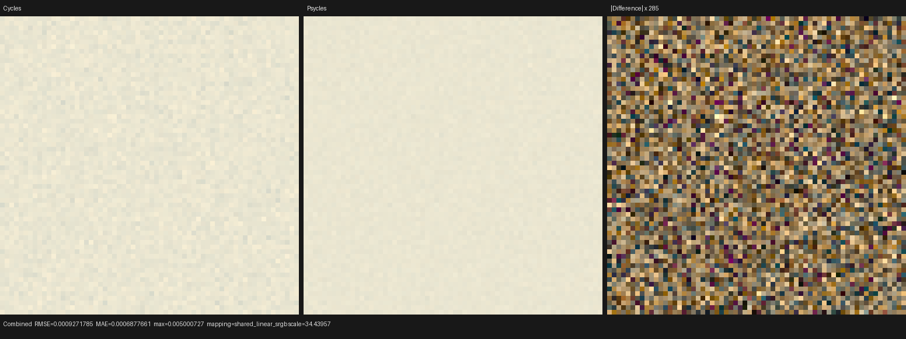
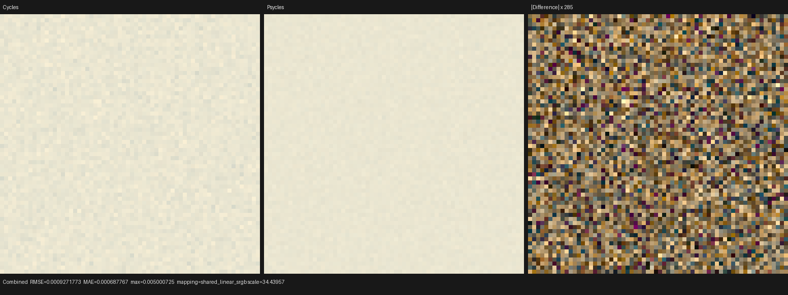
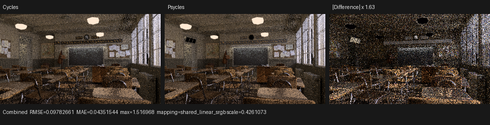
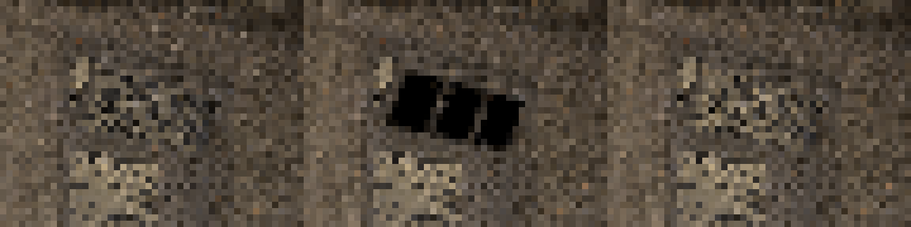
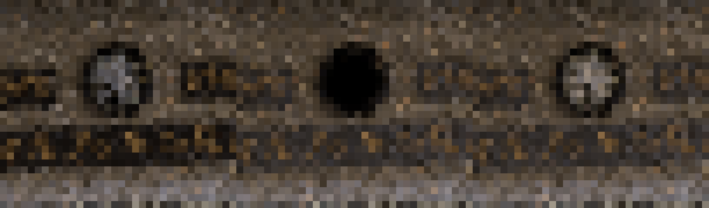
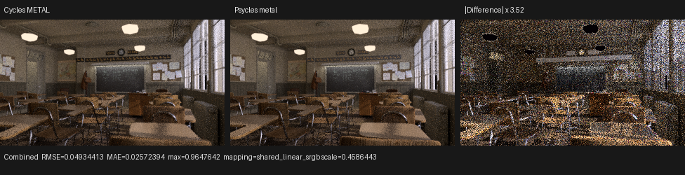
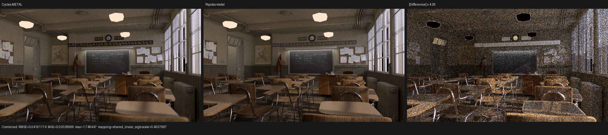
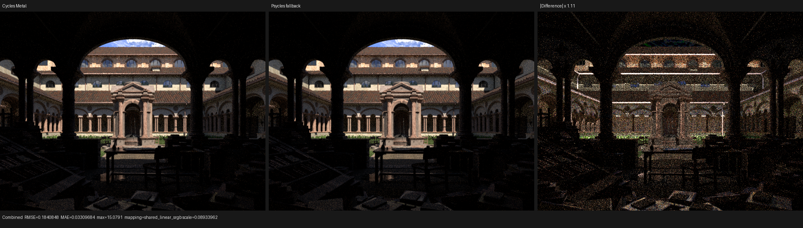
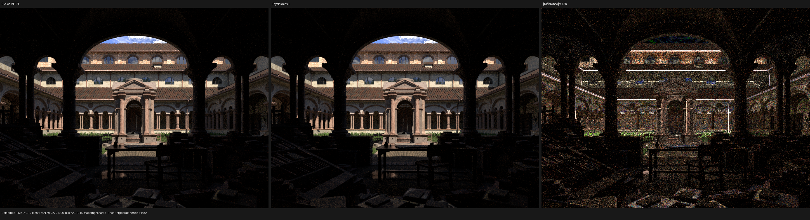

# Apple Classroom and Lone Monk validation

This checkpoint brings Psycles up on Apple Silicon with strict Luisa fallback
and Metal backends, renders two official Blender demo scenes without material
pre-baking, and records defect-driven compatibility repairs for Classroom's
legacy Hosek-Wilkie daylight portals, empty window-frame material slots, and
Glass BSDF materials on the clock, transom window, and ceiling lamps.

The Psycles worktree started at
`main@037babebe93e51b427cc7e0a53105c27468d9758`. This record describes the
current change set on top of that commit. The pinned LuisaCompute revision is
`e10701e6f` on `codex/psycles-apple-fallback-llvm21`, based on upstream
`next@5018c341f`; the branch contains the Apple fallback fixes. The clean
Blender/Cycles source oracle is
`main@c2acd5638ea00c2f5843d34e2049eae60e4cdae3`.

## Machine and toolchain

| Item | Validated value |
|---|---|
| Host | Apple M1 Max, 10 CPU cores, 64 GiB memory |
| GPU | Apple M1 Max, 32 GPU cores |
| OS | macOS 26.3, build 25D125 |
| Blender executable | Blender 5.2.0 LTS, hash `fbe6228777e7` |
| CMake / Ninja | 4.3.1 / 1.13.2 |
| C++ compiler | Homebrew LLVM 21, Apple arm64 Release build |
| Fallback dependencies | LLVM 21.1.8 and Embree 4.4.1 |
| Image dependencies | OpenImageIO 3.1.16, NumPy 2.5.1, Pillow 12.3 |

The release cache has `PSYCLES_ENABLE_LUISA_FALLBACK=ON`,
`PSYCLES_ENABLE_LUISA_METAL=ON`, `PSYCLES_ENABLE_LUISA_HIP=OFF`,
`PSYCLES_ENABLE_LUISA_VULKAN=OFF`, and
`PSYCLES_ENABLE_OPENIMAGEIO=ON`. Requested fallback and Metal targets are
strict CMake postconditions.

## Inputs

Both scenes came from Blender's official demo archive.

| Scene | Official source | SHA-256 | Exported raw content |
|---|---|---|---|
| Classroom | <https://download.blender.org/demo/test/classroom.zip> | `0f0ecc58d45f12b2f4272a53e2d8e69135518e16e956b118f10c20d8dcfdf5e6` | 252 geometries, 894 instances, 85 source materials, 51 images |
| Lone Monk | <https://download.blender.org/demo/cycles/lone-monk_cycles_and_exposure-node_demo.blend> | `4250d4205d8d01cefd98c15e81021d6dead540b2923797378bf7b32e96e8b8f7` | 348 geometries, 87,541 instances, 35 source materials, 47 images |

Classroom uses `_mainScene`, frame 1, camera `renderCam`, and seed 1. Lone
Monk uses scene `daylight`, frame 4, camera `cam.001`, and seed 0. The matched
comparisons disable adaptive sampling and denoising and preserve the scene's
seed. The export retains original nodes, links, socket values, geometry,
instances, images, and render settings; Blender/Cycles is not used to bake a
material or lighting result.

## Defects and repairs

### Hosek-Wilkie daylight

The first Classroom render was recognizable but approximately twice as
bright as Cycles. A controlled light inventory showed that both renderers saw
exactly 80,648 emissive triangles: 80,640 ceiling-lamp triangles, six daylight
portal triangles, and two blackboard-light triangles. Disabling analytic
lights and isolating the portals retained the mismatch.

The portal graph uses a raw `TEX_SKY` node with
`sky_type=HOSEK_WILKIE`, turbidity 2.9, ground albedo 0.3, and an explicit
sun direction. Psycles had lowered every Sky Texture mode to Nishita. The
repair now:

- preserves `HOSEK_WILKIE` as a distinct compiler node;
- cooks the upstream XYZ Hosek coefficients once as immutable topology data;
- evaluates the original direction-dependent Hosek formula through the Luisa
  graph on fallback and Metal;
- converts XYZ through the scene's exported Cycles color transform;
- keeps `SINGLE_SCATTERING`/legacy `NISHITA` on the existing Nishita path;
- emits explicit diagnostics for the still-partial Preetham and Multiple
  Scattering modes.

The imported graph remains raw. No portal strength, scene exposure, light
area, or sampled sky value is patched for Classroom.

The source coefficient tables and model cook are unmodified BSD-3-Clause
files from the recorded Blender/Cycles checkout. Their provenance is retained
in `third_party/sky_hosek`.

### Empty window material slots

The first accepted triptych still contained thin magenta lines beside the
windows. They were not missing textures or Glass BSDF output. The exported
`Cube.018` and `Cube.019` meshes are instanced fourteen times along the window
wall and intentionally contain null material slots. Cycles maps an empty slot
to `ShaderManager::default_surface`, a Principled BSDF with base color 0.8,
roughness 0.5, IOR 1.5, and Multi-GGX distribution. Psycles instead mapped it
to a magenta missing-material sentinel.

The importer now constructs the Cycles default Principled graph once as
material 1 and maps null or absent slots to it. A focused import regression
requires that material to remain Principled rather than a diagnostic color.
The corrected fallback and Metal images contain neutral window-frame pieces;
the magenta lines are gone. A linear-EXR pixel check found 51 pixels with the
old magenta sentinel signature and zero in the corrected fallback render.

### Glass clock, transom, and ceiling lamps

After the empty-slot repair, the Classroom clock face and frosted transom
above the door still rendered as solid black. They were the visible instances
of three raw Glass BSDF materials that previously lowered to no surface
closure: `wallClock_Glass`, `frostedGlass`, and `ceillingLamp_glass`.

The Glass implementation now preserves and executes the original node graph
on both Luisa backends. It includes smooth dielectric delta reflection and
refraction, rough GGX visible-normal sampling, rough Beckmann sampling,
Fresnel/IOR handling on front and back faces, geometric-normal validity, and
separate glossy/transmission light-pass attribution. The importer retains
Color, Roughness, IOR, Normal, and Distribution rather than replacing any of
the three Classroom materials.

A canonical four-panel probe covers smooth Beckmann, smooth GGX, the exact
Classroom ceiling-lamp Beckmann roughness, and rough tinted GGX. At 64x64 and
256 fixed samples against Cycles Metal, fallback produced:

| Pass | Luminance / Cycles | Relative RMSE | Invalid pixels |
|---|---:|---:|---:|
| Combined | 0.999886 | 0.005620 | 0 |
| Glossy Color | 0.999350 | 0.001055 | 0 |
| Glossy Direct | 1.001174 | 0.002185 | 0 |
| Transmission Color | 1.000022 | 0.000063 | 0 |
| Transmission Direct | 0.999861 | 0.005115 | 0 |

These passes are enforced by the shader-probe runner's energy and relative
RMSE gates. The complete report is
[glass-transport-fallback-vs-cycles-metal-64x64-256.json](reports/glass-transport-fallback-vs-cycles-metal-64x64-256.json).
The same probe passed on Psycles Metal: Combined luminance is 0.999886 of
Cycles, relative RMSE is 0.005620, and all pixels are finite. Fallback versus
Metal has a 1.000000 Combined luminance ratio and 0.0000325 relative RMSE. Its
Cycles comparison is
[glass-transport-metal-vs-cycles-metal-64x64-256.json](reports/glass-transport-metal-vs-cycles-metal-64x64-256.json).

### Metal long-dispatch completion

The first 320x180, 64-sample Metal benchmark appeared to render in roughly
four seconds but contained large black horizontal regions. Repetitions moved
the missing region, showing that this was not scene data or a material graph.
The fused path kernel could exceed the practical duration of one Metal command;
the current Luisa stream synchronization returned without surfacing that the
command had stopped before every pixel completed.

Psycles now preserves the same kernel and absolute sample indices while
partitioning Metal work into full-width row bands. Each command targets at most
131,072 pixel-samples, and every submitted band is synchronized before the next
one. Readback additionally requires every pixel's sample counter to equal the
session's completed sample count, so a backend can no longer turn incomplete
coverage into a successful image.

The repaired eight-sample dispatch used for this checkpoint is pixel-identical
to the known-safe four-sample-dispatch Metal reference: Combined RMSE and
maximum absolute error are both zero. Two repeated repaired frames are also
pixel-identical and took 25.6995 and 23.4594 seconds. The normal benchmark run
took 25.4340 seconds and has no black bands or invalid pixels.

A subsequent controlled 1/2/4/8-sample sweep selected four samples as the new
default while retaining the independent row-band work cap; see the
[Monster and Barbershop checkpoint](../apple-monster-barbershop/README.md#metal-samples-per-dispatch-sweep).

## Focused Hosek regression

The new `hosek_wilkie_diffuse_transport` probe creates a raw Blender world,
renders it in Cycles Metal, exports it, and runs that graph through both
Psycles backends at 64x64 and 64 fixed samples.

| Psycles backend | Combined luminance / Cycles | Diffuse Direct luminance / Cycles | Invalid pixels |
|---|---:|---:|---:|
| fallback | 1.000284 | 1.000249 | 0 |
| Metal | 1.000285 | 1.000250 | 0 |

Fallback and Metal are mutually consistent: their Combined luminance ratio is
`1.00000115`, RMSE is `3.34e-7`, and invalid pixels are zero.

The gate intentionally uses integrated energy. Cycles and Psycles construct
different importance maps for this legacy analytic sky, so their paired
finite-sample pixels have stochastic differences even though the evaluated
sky energy agrees. The reports retain the 4.24% Combined and 3.40% Diffuse
Direct relative RMSE rather than hiding that sampling-distribution difference.





## Classroom result

The matched checkpoint is 320x180, 16 fixed samples, seed 1. Cycles selected
only `METAL_Apple M1 Max (GPU - 32 cores)`. Psycles used the production Luisa
fallback backend and the recorded exact partition of at most eight samples per
dispatch.

| Metric | Before repairs | Hosek only | Default-slot repair | Current Glass |
|---|---:|---:|---:|---:|
| Combined luminance / Cycles | 2.005238 | 1.002376 | 1.009643 | 1.013742 |
| Combined relative RMSE | 0.912358 | 0.232985 | 0.229211 | 0.228045 |
| Diffuse Direct luminance / Cycles | 2.484176 | 0.998291 | 0.997188 | 0.997188 |
| Invalid Combined pixels | 0 | 0 | 0 | 0 |

The current render took 28.7395 seconds after a 218.008-second cold fallback
JIT. The matched Cycles Metal render took 98.6381 seconds. These are recorded
timings, not a general performance claim: the Cycles invocation included a
cold scene/device setup, while the Psycles render interval excludes its
separately reported JIT.

Additional post-repair evidence:

- Diffuse Color luminance ratio: 1.004884, relative RMSE 0.056028;
- Normal RMSE: 0.0377342, relative RMSE 0.068875;
- Emission luminance ratio: 0.999846, relative RMSE 0.028617;
- Glossy Color luminance ratio: 1.001075;
- Transmission Color luminance ratio: 1.001024, relative RMSE 0.011821;
- Glossy Direct luminance ratio: 0.944636;
- all compared pass pixels are finite.

The same corrected package rendered through Psycles Metal. Against Cycles
Metal its Combined luminance ratio is 1.010155, relative RMSE is 0.229011,
and invalid pixels are zero. Fallback versus Metal has a 1.000507 Combined
luminance ratio; both backends remove the magenta empty-slot artifact.



The Cycles and Psycles panels were opened at the generated 976x250 triptych
resolution. They show the same classroom layout, daylight exposure, ceiling
emitters, desks, chairs, blackboard, maps, windows, and major shadow regions.
The neutral window-frame segments now agree visually, no magenta coverage
pixels remain, and the clock/transom Glass no longer forms black cutouts. The
amplified difference panel is dominated by low-sample noise and remaining
transport differences rather than a global exposure error.

The object-local crops below are ordered Cycles, Psycles before Glass support,
and Psycles after Glass support. Blender camera projection placed the frosted
transom at pixels x=40.17..63.16, y=45.69..59.06 and the clock glass at
x=168.51..176.68, y=42.22..50.90 in the 320x180 frame.





### Matched Classroom performance checkpoint

The project benchmark runner repeated Classroom at 320x180 and 64 fixed
samples with warm Psycles shader caches. All three renderers consumed the same
scene state and the Psycles backends reused the same exported raw graph bundle.
The primary timing is each renderer's reported render interval; process setup,
scene compilation, and shader JIT are recorded separately.

| Renderer | Render | Relative to Cycles Metal | Other timed phases |
|---|---:|---:|---|
| Cycles Metal | 1.38101 s | 1.00x | 2.32506 s process wall |
| Psycles Metal | 25.4340 s | 18.417x slower | 1.01058 s scene compile, 0.837571 s warm JIT |
| Psycles fallback | 134.554 s | 97.432x slower | 0.956597 s scene compile, 0.496709 s warm JIT |

On this scene and checkpoint, Psycles Metal is 5.29x faster than Psycles
fallback. This is one matched run rather than a broad renderer claim. Its full
manifest is
[classroom-apple-benchmark-320x180-64.json](reports/classroom-apple-benchmark-320x180-64.json).

The corrected Metal image has Combined luminance 1.010774 times Cycles,
relative RMSE 0.118657, and zero invalid pixels. Fallback has luminance ratio
1.010494 and relative RMSE 0.119008. Metal versus fallback has luminance ratio
1.000277 and relative RMSE 0.015057, with no missing coverage.



For visual inspection, the corrected Metal path was also rendered at 640x360
and 128 fixed samples. This is four times the pixels and twice the samples of
the performance checkpoint. Psycles took 152.583 seconds and Cycles Metal took
4.86059 seconds. Combined luminance is 1.010696 times Cycles, relative RMSE is
0.098125, and all pixels are finite. Diffuse Color relative RMSE is 0.052092,
Transmission Color relative RMSE is 0.004111, and Emission luminance is
0.999920 times Cycles. Original-resolution inspection confirms that the window
pieces are neutral, the clock and transom transmit light, and the entire Metal
frame has complete coverage. The machine-readable comparison is
[classroom-metal-vs-cycles-metal-640x360-128.json](reports/classroom-metal-vs-cycles-metal-640x360-128.json).



## Lone Monk result

The matched checkpoint is 640x480, 64 fixed samples, seed 0. Cycles selected
the M1 Max Metal device and Psycles used fallback. The original 35 material
graphs and 87,541 instances remained in the export.

| Pass | Luminance / Cycles | Relative RMSE |
|---|---:|---:|
| Combined | 0.980041 | 0.117896 |
| Diffuse Color | 1.001297 | 0.035689 |
| Normal | n/a | 0.019189 |
| Diffuse Direct | 1.009105 | 0.068452 |
| Glossy Direct | 0.959702 | 0.209602 |
| Emission | 0.999629 | 0.001013 |

Combined RMSE is 0.184085, MAE is 0.033097, and invalid pixels are zero.
Psycles rendered in 21.4762 seconds after a 0.3183-second warm fallback JIT;
Cycles Metal rendered in 4.0321 seconds.



The generated 1936x546 triptych was inspected at original resolution. Both
panels show the same monastery courtyard, central monk, foreground arches,
roofline, vegetation, and lighting structure. The remaining residuals are
concentrated on high-frequency foliage, roof highlights, and indirect/glossy
transport; there is no missing-scene or camera mismatch.

The larger visual checkpoint uses 960x720 and 128 fixed samples: 2.25 times
the pixels and twice the samples of the earlier image. Both Psycles backends
completed with zero invalid pixels.

| Renderer | Render | Relative to Cycles Metal | Shader JIT |
|---|---:|---:|---:|
| Cycles Metal | 14.7416 s | 1.00x | included in Blender setup |
| Psycles fallback | 108.391 s | 7.353x slower | 74.2062 s cold |
| Psycles Metal | 121.238 s | 8.224x slower | 518.475 s cold |
| Psycles Metal warm repeat | 121.205 s | 8.599x slower than its 14.0948 s repeat oracle | 0.620668 s |

Metal is therefore 11.9% slower than fallback for this heavily instanced
scene, despite being 5.29x faster on Classroom. The one-time Metal shader
compile is also material: 8.64 minutes cold, versus 0.62 seconds from cache.
The timings demonstrate that backend ranking is scene dependent.

Against Cycles, the high-sample Metal image has Combined luminance ratio
0.980035, relative RMSE 0.122921, and zero invalid pixels. Diffuse Color
relative RMSE is 0.038306, Normal relative RMSE is 0.021393, Diffuse Direct
relative RMSE is 0.049171, and Emission luminance ratio is 0.999654. Fallback
has Combined luminance ratio 0.979819 and relative RMSE 0.124580. Metal versus
fallback has luminance ratio 1.000220 and relative RMSE 0.021340. The complete
cold matrix is
[lone-monk-apple-benchmark-960x720-128-cold.json](reports/lone-monk-apple-benchmark-960x720-128-cold.json),
and the cache behavior is retained in
[lone-monk-apple-benchmark-960x720-128-metal-warm.json](reports/lone-monk-apple-benchmark-960x720-128-metal-warm.json).



## Commands and automated gates

The complete build and test gate was:

```bash
cmake --build build-macos --parallel 10
ctest --test-dir build-macos --output-on-failure -j10
```

Result: **69/69 tests passed** in 15.66 seconds. This includes fallback and
Metal runtime tests, Blender CLI exporter/API tests, source-size and shader
probe runner contracts, multilayer EXR, import/normalization, and renderer
contracts.

The focused fallback and Metal commands were:

```bash
build/validation-venv/bin/python tools/run_cycles_shader_probes.py \
  --blender /opt/homebrew/bin/blender \
  --psycles-render build-macos/bin/psycles_render_blender_scene \
  --output-dir build-macos/shader-probes/hosek-wilkie \
  --backend fallback --cycles-device METAL \
  --cycles-device-name "Apple M1 Max" \
  --width 64 --height 64 --samples 64 \
  hosek_wilkie_diffuse_transport

build/validation-venv/bin/python tools/run_cycles_shader_probes.py \
  --blender /opt/homebrew/bin/blender \
  --psycles-render build-macos/bin/psycles_render_blender_scene \
  --output-dir build-macos/shader-probes/glass-transport-fallback \
  --backend fallback --cycles-device METAL \
  --cycles-device-name "Apple M1 Max" \
  --width 64 --height 64 --samples 256 \
  glass_transport

build/validation-venv/bin/python tools/run_cycles_shader_probes.py \
  --blender /opt/homebrew/bin/blender \
  --psycles-render build-macos/bin/psycles_render_blender_scene \
  --output-dir build-macos/shader-probes/glass-transport-metal \
  --backend metal --cycles-device METAL \
  --cycles-device-name "Apple M1 Max" \
  --width 64 --height 64 --samples 256 \
  glass_transport

build/validation-venv/bin/python tools/run_cycles_shader_probes.py \
  --blender /opt/homebrew/bin/blender \
  --psycles-render build-macos/bin/psycles_render_blender_scene \
  --output-dir build-macos/shader-probes/hosek-wilkie-metal \
  --backend metal --cycles-device METAL \
  --cycles-device-name "Apple M1 Max" \
  --width 64 --height 64 --samples 64 \
  hosek_wilkie_diffuse_transport
```

The complete machine-readable pass reports are in [reports](reports).

## Remaining limitations

This is successful scene rendering and a substantial compatibility repair,
not a claim of complete Cycles parity.

- Classroom still reports one unsupported Wave Texture, whose output default
  is retained. Glass now contributes color and transport, although Multi-GGX
  Glass currently shares the single-scatter GGX implementation and Glass thin
  film inputs are not yet modeled.
- Preetham and Multiple Scattering Sky Texture modes are distinct from Hosek
  and the implemented single-scattering Nishita path; they remain partial.
- Classroom's 16-sample comparison is deliberately a development checkpoint,
  not a final high-sample quality/performance gate.
- Lone Monk retains the known indirect/glossy transport residuals and is
  slower than Cycles Metal on this machine.
- The copied official `.blend`, texture payloads, generated EXRs, PPM/PFM
  images, and shader caches remain ignored local inputs/outputs. Only compact
  reports and viewable validation triptychs are retained here.
