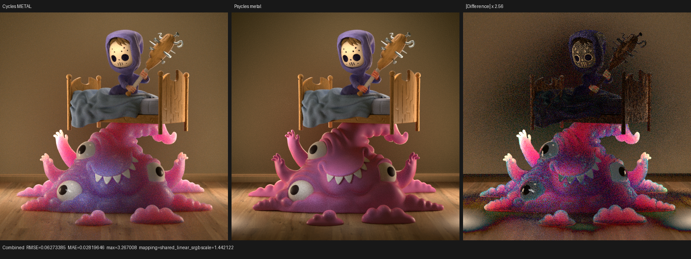
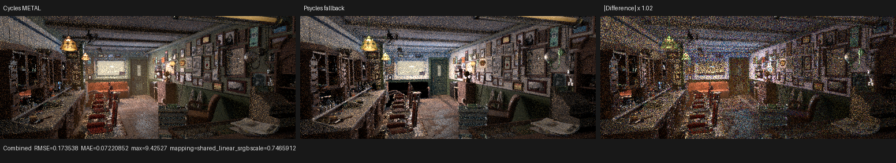

# Apple Monster Under the Bed and Barbershop validation

This checkpoint renders two additional official Blender/Cycles demo scenes on
Apple Silicon through Psycles' raw scene-graph workflow. Monster Under the Bed
now renders through both Luisa fallback and Metal at 512x512, 256 samples.
Barbershop Interior now exports its 2.6 GiB bundle, compiles its unusually large
unified material kernel on fallback, and renders at 512x214, 32 samples without
the former opaque-black fog boundary.

The work does not bake Blender materials or lighting. Blender 5.2 exports the
original nodes, links, socket values, geometry, instances, packed images, and
render settings; Psycles compiles and traces that package. Cycles Metal renders
the same `.blend` file as the comparison oracle.

## Machine and inputs

| Item | Validated value |
|---|---|
| Host | Apple M1 Max, 10 CPU cores, 64 GiB memory |
| GPU | Apple M1 Max, 32 GPU cores |
| OS | macOS 26.3, build 25D125 |
| Blender | 5.2.0 LTS, Homebrew installation |
| Psycles build | Apple arm64 Release; fallback and Metal enabled |
| Fallback toolchain | Homebrew LLVM 21.1.8, Embree 4.4.1 |

| Scene | Official source | SHA-256 | Exported raw content |
|---|---|---|---|
| Monster Under the Bed | <https://download.blender.org/demo/cycles/monster_under_the_bed_sss_demo_by_metin_seven.blend> | `9463082f8d365ad8ae19c1ba86429deb3b532c5a2d0db0b9492c3c759f64d28d` | 34 geometries, 36 instances, 20 source materials, 22 images |
| Barbershop Interior | <https://svn.blender.org/svnroot/bf-blender/trunk/lib/benchmarks/cycles/barbershop_interior/> | `95972b56180462cac47ec82f3a755bd9111ec18ca37a6196a319c013db994130` | 1,055 geometries, 1,111 instances, 547 source materials, 190 images |

Both matched runs disable adaptive sampling and denoising. The benchmark runner
records the exact bundle and output hashes in
[monster-benchmark.json](reports/monster-benchmark.json) and
[barbershop-benchmark.json](reports/barbershop-benchmark.json).

## Compatibility and backend repairs

### Principled subsurface inputs

Psycles previously ignored Principled `Subsurface Weight`, `Subsurface Radius`,
and `Subsurface Scale`, which removed much of the monster's intended colored
scatter. The graph compiler and Luisa closure path now retain all three inputs.
Until spatial BSSRDF random walks are implemented, they drive an explicitly
diagnosed, energy-normalized, radius-tinted diffuse approximation with a
stronger tint at grazing angles. The original base color remains the albedo
data pass. Focused fallback and Metal closure tests cover the new parameters,
closure type, finite weight, and unmodified albedo contract.

This is a material improvement, not a claim of full Cycles SSS equivalence. The
matched Monster Combined relative RMSE improved from approximately 0.531 to
0.446, while the remaining missing spatial diffusion is clearly recorded below.

### Packed OpenEXR textures

Barbershop embeds textures that stb_image cannot decode. The shared image I/O
layer now decodes an in-memory encoded payload through OpenImageIO when the
fast stb path does not recognize it. It validates extent and allocation size,
normalizes one- through four-channel inputs to RGBA8, and has a packed-EXR
regression. The scene compiler calls this helper rather than owning a duplicate
decoder.

### Volume-only material boundaries

The Barbershop `fog` material has a volume root and no surface root. Cycles
treats its mesh as an invisible volume boundary; Psycles previously supplied
the generic opaque-black empty-surface fallback, producing a large black box in
front of the camera. The graph normalizer now supplies a white Transparent BSDF
surface only when a material is volume-only. A genuinely empty material still
uses the opaque-black Cycles-compatible fallback. Import tests enforce both
branches.

Volume transport for this particular fog graph is not yet supported, so the
repair removes the false black surface but does not synthesize fog lighting.

### Oversized fallback compilation

Barbershop's unified dispatch contains about 1.4 million LLVM instructions.
The normal O3 pipeline showed pathological compile time and memory growth in
SROA/SLP. LuisaCompute `next` commit `133598dc9` retains O3 for ordinary
kernels and selects a bounded O0 pipeline plus fast code generation when the
largest generated function exceeds 250,000 instructions. The fallback worker
stack reserve is 16 MiB because the resulting Barbershop function requires
about 10 MiB at runtime. Cache ABI 3 prevents loading incompatible older
objects.

The first successful Barbershop shader compile took about 310 seconds and
produced a 113 MiB cached object. Warm JIT loading in the recorded 32-sample run
took 3.292 seconds.

### Metal command-buffer failures

LuisaCompute `next` commit `3fd13bd6a` makes command-buffer failure reporting a
release-build invariant. Normal submissions and event signal/wait buffers now
share the checked submit path; synchronization buffers are checked after
completion; and an asynchronous Metal error is fatal instead of being only a
debug warning. The platform watchdog is still avoided by Psycles' bounded
pixel-sample row bands. Focused Metal volume tests pass with the checked stream.

A warm-cache diagnostic temporarily removed only the pixel-sample cap and
submitted 320x180x8 pixel-samples as one command. Metal rejected it after 3.16
seconds with `kIOGPUCommandBufferCallbackErrorImpactingInteractivity`; the
patched release backend printed the command-buffer error and terminated with
exit 134. The production cap was then restored and rebuilt.

## Monster Under the Bed result

The matched high-sample run is 512x512 at 256 fixed samples.

| Renderer | Shader JIT | Render | Relative speed vs Cycles Metal |
|---|---:|---:|---:|
| Cycles Metal | included in renderer setup | 13.6810 s | 1.000x |
| Psycles fallback | 0.2795 s warm | 53.0894 s | 3.881x slower |
| Psycles Metal | 433.466 s cold | 59.1024 s | 4.320x slower |

| Psycles backend | Luminance / Cycles | Combined relative RMSE | Invalid pixels |
|---|---:|---:|---:|
| fallback | 0.771653 | 0.445778 | 0 |
| Metal | 0.771663 | 0.445772 | 0 |

Fallback and Metal agree closely, which isolates the remaining visual gap to
shared renderer compatibility rather than a backend-specific calculation.
The primary gaps are true spatial BSSRDF transport and the monster material's
unsupported Voronoi texture used for bump detail.

Detailed pass metrics are retained in
[monster-fallback-vs-cycles-metal.json](reports/monster-fallback-vs-cycles-metal.json)
and [monster-metal-vs-cycles-metal.json](reports/monster-metal-vs-cycles-metal.json).

## Barbershop Interior result

The matched run is 512x214 at 32 fixed samples. It is intentionally recorded at
a moderate sample count: one warm fallback render already takes about 34
minutes with the compile-time-safe O0 kernel.

| Renderer | Shader JIT | Render | Relative speed vs Cycles Metal |
|---|---:|---:|---:|
| Cycles Metal | included in renderer setup | 13.2821 s | 1.000x |
| Psycles fallback | 3.2918 s warm | 2,019.84 s | 152.072x slower |

Psycles has no invalid pixels. Its Combined luminance is 1.28487 of Cycles and
its relative RMSE is 0.79445. The render has the correct camera, geometry,
major lighting layout, furniture, mirrors, glass, and texture placement. The
former black fog box is absent. The remaining difference is material-heavy and
is amplified by 32-sample noise.

The detailed report is
[barbershop-fallback-vs-cycles-metal.json](reports/barbershop-fallback-vs-cycles-metal.json).

## Metal samples-per-dispatch sweep

The Classroom production kernel is measured at 320x180 and 64 fixed samples
with a warm Metal shader cache. Each setting preserves absolute sample indices;
the 131,072 pixel-sample safety cap may split one sample batch into multiple
full-width row bands.

| Requested samples per dispatch | Metal render | Submitted row bands | Output vs 1 spp |
|---:|---:|---:|---:|
| 1 | 27.9566 s | 64 | reference |
| 2 | 27.5919 s | 32 | Combined and Normal exact |
| 4 | 21.7015 s | 32 | Combined and Normal exact |
| 8 | 21.9877 s | 32 | Combined exact; Normal max error 1.66e-8 |

One sample per dispatch is therefore not the efficient choice for this fused
kernel: it is 28.8% slower than four samples because it doubles command count
without improving output or safety. Four samples is 1.3% faster than eight in
the matched sweep and retains exact Combined, Normal, and Albedo results against
the one-sample reference. A second run through the new no-argument default took
21.4295 seconds; its Combined output is bit-identical and its Normal maximum
error versus explicit four-sample dispatch is 1.66e-8.

The production C++ options, standalone renderer, and Python benchmark runner
now default to four samples per dispatch. The safety property remains the
independent 131,072 pixel-sample cap, so four-sample Classroom batches become
two row bands and no long full-frame command is submitted. Full measurements,
hashes, and the failed unbounded diagnostic are in
[classroom-metal-dispatch-sweep.json](reports/classroom-metal-dispatch-sweep.json).

## Known compatibility gaps

- Monster uses the documented radius-tinted diffuse approximation rather than
  a spatial random-walk BSSRDF; Voronoi texture lowering is also pending.
- Barbershop volume emission/scattering is not yet lowered. The fog mesh is now
  a correct transparent boundary, but the interior medium is absent.
- Barbershop still diagnoses Pointiness, Voronoi, Wave, Magic, Hair Info,
  Attribute, standalone Subsurface Scattering, Refraction BSDF, and some
  implicit socket conversions. True displacement is approximated as bump.
- `generic_scratches.png` and `guilder_ornament.png` are absent from the
  downloaded Barbershop source; Blender/Cycles reports the same missing files.
- The Barbershop fallback's compile-time-safe O0 path is functional but far
  slower than Cycles Metal. Recovering performance requires splitting or
  specializing the unified material dispatch, not re-enabling the pathological
  LLVM pipeline.

## Validation

The feature set was built in Release with both Apple backends enabled. After
restoring the production Metal work cap and selecting the four-sample default,
the complete CTest suite passed 69/69 in 20.74 seconds. This includes packed
OpenEXR, Blender import/export, closure, dispatch partition, source-size,
fallback runtime, and focused Metal volume coverage. `git diff --check` is also
clean.
