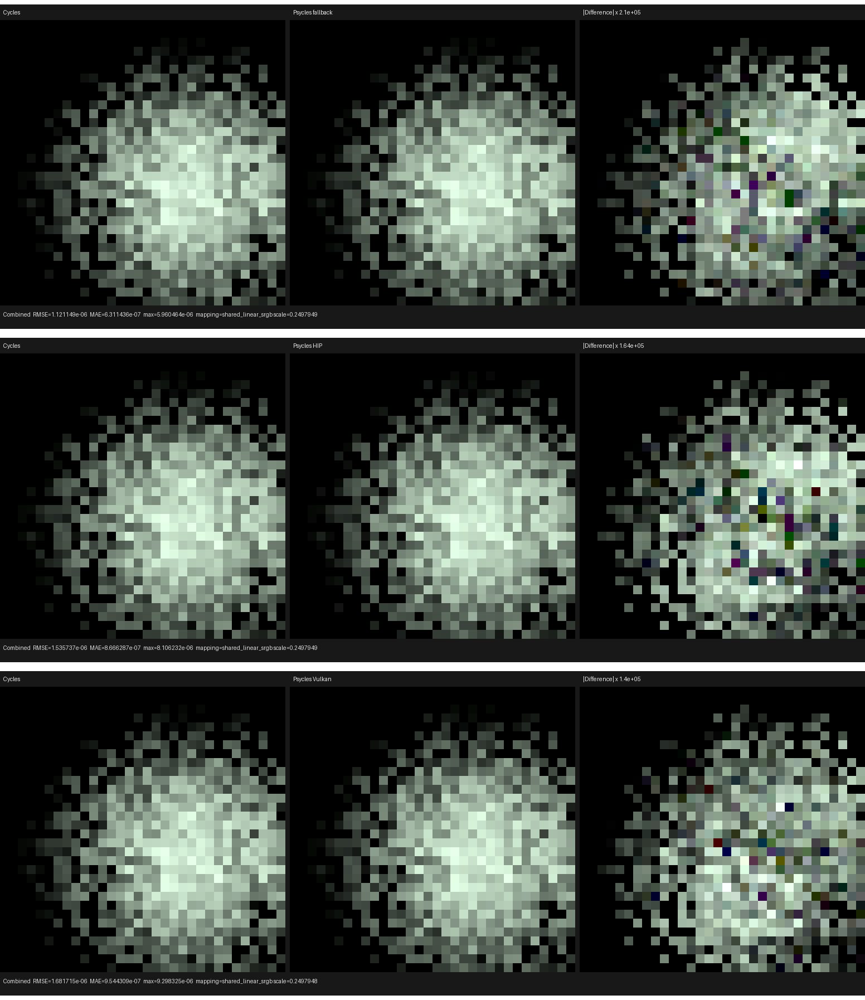

# Direct-light trace phase contract

This checkpoint gives surface next-event estimation one observational Cycles
trace boundary for analytic lamps, emissive triangles, and the environment.
The implementation is a host-stage virtual component: its enabled policy
records Luisa DSL AST at Cycles semantic boundaries, while its null policy
emits no shader statements or storage accesses. Rendering and diagnostics
therefore use the same light-sampling and BSDF implementation rather than a
trace-only copy of the algorithm. There is no Psycles CPU reference renderer.

## Cycles oracle and formal sequence

The oracle is the local current Cycles checkout at
`/home/mike/Projects/blender-cycles-trace`, specifically
`kernel/integrator/shade_surface.h:343-435`. Its surface NEE sequence is:

1. call `light_sample_from_position`; on failure write
   `light_meta=(-1,-1,-1)` and return;
2. write the sampled light type, emitter, global primitive, object, group,
   packed shader, combined PDF, selection PDF, evaluation factor, direction,
   position, and geometric normal;
3. for a triangle with a non-sentinel primitive, reject exactly when source
   object and global primitive both match and
   `dot(D, transmission ? -Ng : Ng) > 0`;
4. evaluate the surface BSDF and NEE MIS weight;
5. write `(distance, bsdf_pdf, mis_weight)` before the shadow query;
6. trace the shadow ray and reuse that one BSDF evaluation for contribution
   and pass splitting.

Psycles now follows that state machine. The triangle predicate is expressed
once in terms of Cycles global primitive/object identity; it does not use an
epsilon or a ray query and it does not enumerate geometric cases. Analytic,
triangle, and environment components all receive the same
`DirectLightTraceRecorder` host object. The normal renderer receives the null
implementation, so Luisa's multistage AST construction erases diagnostics at
host time.

The analytic component also evaluates its raw lamp shader after recording the
sample and before BSDF evaluation, and evaluates the BSDF once before shadow
traversal. Environment and mesh emission still reside inside their shared
sampling components; separating their pure proposal from raw closure
evaluation is recorded below as remaining phase-alignment work.

## Device regression

`test_luisa_area_light_forward.cpp` now requests an event-zero path trace at
Cycles film pixel `(20,14)`, sample zero. The same executable runs these raw
scene contracts on fallback, HIP, and Vulkan:

| Emitter | Type | emitter | primitive | object | group | packed shader |
|---|---:|---:|---:|---:|---:|---:|
| area lamp | 3 | 0 | 0 | 1 | -1 | `0x51000005` |
| zero-energy raw Emission triangle | 5 | 0 | 41 | 9 | 6 | `0x5000000b` |
| spatial raw world closure | 2 | 0 | 0 | 10 | 4 | `0x5000000c` |

The triangle fixture deliberately places its geometry at Cycles primitive
prefix 41, so a local TLAS/BLAS primitive index cannot accidentally pass. Its
raw Emission closure has zero strength: Cycles still accepts the geometric
light sample and records its identity/PDF, then obtains a zero contribution
from shader evaluation. This locks the rule that radiance is not part of
proposal validity. The regression additionally checks written-slot presence, unit direction,
positive combined PDF, exact selection PDF, finite-light `D=normalize(P-LP)`
and distance, BSDF PDF/MIS presence, and the background identities
`P=Ng=-D`, `eval_fac=1`, and `t=1e30` (`ray_maximum`). All three backends pass.
Observed complete test times on the first run after this change were 1.68 s
for fallback (including the initially failing assertion that exposed the
exact `1e30` boundary), 3.92 s for HIP, and 9.93 s for Vulkan. Cached fallback
then completed in 0.07 s.

After the final typed-record cleanup, a 32-way complete project run passed
123/123 tests in 67.12 s. The two longest checks were the existing Vulkan
volume path (58.14 s) and volume environment (67.12 s) tests; no backend test
failed.

## Numerical and visual check

Moving BSDF evaluation before shadow traversal must not alter radiance. The
retained current-Cycles CPU narrow-ellipse EXR was compared with fresh raw
32-bit scene-linear outputs from every backend:

| Backend | RMSE | Relative RMSE | Maximum absolute error |
|---|---:|---:|---:|
| fallback | 1.1211491e-6 | 1.0659154e-6 | 5.9604645e-6 |
| HIP | 1.5357368e-6 | 1.4600783e-6 | 8.1062317e-6 |
| Vulkan | 1.6817154e-6 | 1.5988652e-6 | 9.2983246e-6 |

Each fresh output also passes `oiiotool --fail 0 --warn 0 --diff` against its
pre-change backend EXR, proving pixel-exact preservation. I opened the
three-backend overview at original resolution. Cycles and Psycles have the
same sparse one-sample support boundary, individual sample locations, hue,
central peak, and black regions. Differences become visible only after the
per-backend `1.40e5` to `2.10e5` amplification shown in the third column.

The fresh EXRs, machine-readable reports, and individual triptychs are kept
beside this document.

## Subsequent closure-filter checkpoint

The `surface_shader_bsdf_eval` gate is now closed by the formal sampled-light
projection in
[`2026-08-03/sampled-light-closure-filter`](../../2026-08-03/sampled-light-closure-filter/README.md).
Emitter exclude flags project BSDF contributions while every eligible closure
remains in the one-sample-model PDF; glass, translucent, and no-MIS behavior
is locked on fallback, HIP, and Vulkan.

## Remaining alignment gates

- Emissive-triangle and environment proposal sampling must expose raw light
  closure evaluation as a later shared component so their execution phase,
  not only their recorded trace boundary, matches Cycles.
- MNEE, light linking, and the light tree remain separate production gates.

Together the two checkpoints close direct-light trace identity, evaluation
ordering, and sampled-emitter closure filtering. They do not claim complete
Lone Monk or all-Cycles feature parity.
