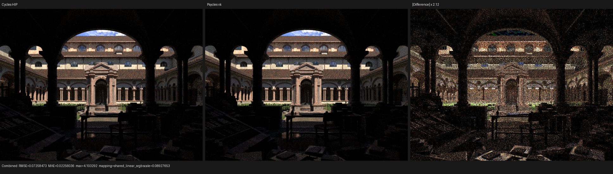
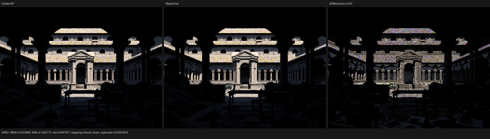
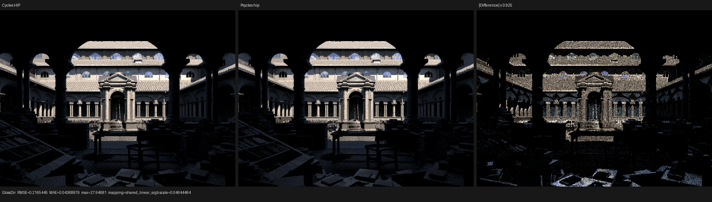
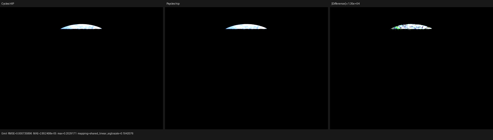
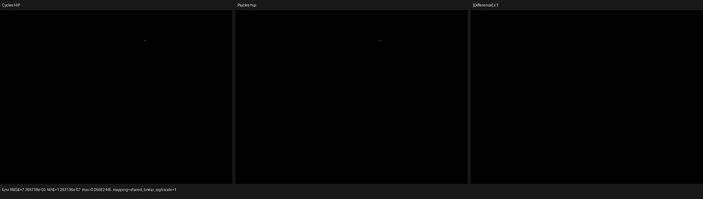
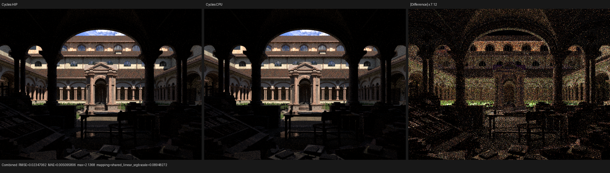

# Constant light-emission scheduling

This checkpoint validates Psycles `ab649bd`. It implements Cycles' constant
emission scheduling for surface next-event estimation and background hits
without evaluating or baking Blender material values on the host. Cycles is
the only rendering oracle.

## Cycles oracle and formal transfer relation

The source oracle is current Cycles main `a3afe632`, specifically
`scene/shader.cpp:124-252`, `kernel/integrator/shade_surface.h:387-430`, and
`kernel/integrator/shade_light.h:115-230`. The locally built Blender
5.3-alpha binary is `b82c3f0d`; its `intern/cycles` tree is byte-identical to
the current checkout.

Cycles assigns `SD_HAS_CONSTANT_EMISSION` from the authored closure topology.
A linked socket is non-constant even when its source happens to be a Constant
node. The constant result is available before the receiving BSDF. A
non-constant shader is evaluated by `SHADE_LIGHT_NEE` only after the BSDF is
known to be non-zero and before shadow traversal.

Psycles represents the supported raw closure language with the total
classification

```text
M : ClosureExpression -> {none, constant, deferred}
```

where `none` is the additive identity and also the constant zero function.
The transfer relation is:

```text
M(non-emitting leaf) = none
M(Emission(C, S)) = constant  iff C and S are direct, unlinked inputs
M(Add(A, B)) = join(M(A), M(B))
M(Mix(F, A, B)) = join(M(A), M(B),
                         constant if F is direct, deferred if F is linked)
M(any other connected value dependency) = deferred
```

The join order is `none < constant < deferred`. This is one exhaustive
closure-tree relation, not a list of scene-specific exceptions. Compiler
regressions cover non-emitting graphs, direct emission, a linked Constant
color, Add identity, and a linked Mix factor.

The host classification only chooses which Luisa AST is recorded. Constant
radiance remains a device expression over the runtime parameter buffer. The
`SurfaceParameterServices` interface exposes only scalar and color parameter
reads; it has no SurfacePoint, texture heap, attribute lookup, geometry heap,
or BSDF table. Thus the constant callable cannot accidentally grow into a
host material evaluator or a second shading path.

## Recorded path stages

The scene compiler carries the classification on materials, analytic lights,
emissive triangles, and the World. Host/JIT-stage polymorphism selects one of
the following paths for each fixed scene:

```text
constant: proposal/side/self validity -> constant emission -> receiving BSDF
          -> termination -> shadow

deferred: proposal/side/self validity -> receiving BSDF -> non-zero check
          -> full raw closure evaluation -> termination -> shadow
```

The same rule is used by analytic, triangle, and environment surface NEE.
A constant World background hit uses a direction-free callable; an
environment texture, sun model, or spatial World graph selects the full
directional evaluator. Blender closure graphs and per-instance parameter
blocks remain intact throughout.

This checkpoint does not claim that volume NEE has adopted the same
constant/deferred boundary. Volume direction providers still require a
follow-up phase split. Principled BSDF emission import/lowering is also an
explicit missing feature, so Cycles-compatible Principled emission is not
claimed here.

## Regression results

The constant callable's restricted signature and inability to sample a
texture are compile-time assertions in `test_luisa_area_light_forward`.
Production fixtures exercise non-zero constant World and triangle emission,
the default analytic-light factor, and a spatial deferred World across the
existing surface and volume suites. The Release build used 32 jobs. Full
CTest passed `123/123` on fallback, HIP, and Vulkan, including the 2,000-line
source-size gate and OpenEXR tests.

## Lone Monk five-way benchmark

The canonical raw-closure bundle
`4250d4205d8d01cefd98c15e81021d6dead540b2923797378bf7b32e96e8b8f7`
was rendered afresh at 640x480, 64 fixed spp, and four samples per dispatch.
Cycles CPU and HIP were both rerendered by Blender `b82c3f0d`; HIP explicitly
selected the Radeon RX 9070 XT.

| Renderer | Scene compile | Shader JIT | Render | Relative render time |
|---|---:|---:|---:|---:|
| Cycles CPU | - | - | 5.193 s | 2.800x Cycles HIP |
| Cycles HIP | - | - | 1.855 s | reference |
| Psycles fallback | 1.289 s | 85.431 s cold | 5.550 s | 1.069x Cycles CPU |
| Psycles HIP | 3.530 s | 361.832 s cold | 2.432 s | 1.311x Cycles HIP |
| Psycles Vulkan | 0.971 s | 118.762 s cold | 4.251 s | 2.292x Cycles HIP |

The warm HIP rerun loaded the new shader cache in 0.347 s and rendered in
2.391 s. Cold HIP LLVM/code generation took 24.110 s; code-object linking
took 333.135 s. The main generated object was 4,686,592 bytes and the linked
object was 5,938,872 bytes. Relative to the previous checkpoint, the linked
object shrank by 1,664 bytes. Vulkan optimized
`2,005,852 -> 1,772,507` SPIR-V words, only 469 optimized words above the
previous checkpoint. The large cold-compile cost is therefore still in HIP
linking and Vulkan driver pipeline creation, not an unexplained render phase.

Combined-pass metrics against the fresh Cycles HIP render are:

| Backend | RMSE | Relative RMSE | MAE | Mean luminance ratio |
|---|---:|---:|---:|---:|
| fallback | 0.072131 | 0.046266 | 0.022414 | 1.004629 |
| HIP | 0.072907 | 0.046764 | 0.022567 | 1.005187 |
| Vulkan | 0.072585 | 0.046557 | 0.022560 | 1.004726 |

Strict zero-tolerance OpenImageIO comparison against checkpoint `82ea7fc`
passed for the complete fallback and Vulkan multilayer EXRs. HIP changed at
58 pixels with RMS `0.00150654`; the new cold/warm pair changed at 53 pixels
with RMS `0.00136951`. Both are inside the already measured HIP runtime
non-determinism floor. This is consistent with the intended scheduling
equivalence rather than an estimator change.

The complete runner manifest is [benchmark.json](benchmark.json). Retained
linear-pass reports are [Cycles CPU/HIP](cycles-cpu-report.json),
[fallback](fallback-report.json), [HIP](hip-report.json), and
[Vulkan](vk-report.json).

## Visual inspection

I opened all three Combined triptychs at their original 1936x546 resolution,
then inspected HIP Diffuse Direct, Glossy Direct, Emission, and Environment.
Composition, exposure, sky opening, material families, arch and roof
silhouettes, and the broad grass/vegetation placement agree. No new spatial
break or energy discontinuity is visible after the phase split.

The known residuals remain: colored finite-sample structure on roof tiles and
facades in Diffuse Direct, smaller glossy residuals on roof/window/arch
edges, grass and vegetation highlights, and sparse bright samples. Emission
and Environment remain visually aligned at the displayed scale. These are
active sampler/material/light-distribution parity work, not accepted as final
Cycles parity.












Cycles CPU and HIP differ at finite sample count as well; their retained
triptych keeps that device variance visible:



## Next parity gates

- apply the same constant/deferred phase relation to volume direct lighting;
- import and lower raw Principled emission sockets without baking;
- align emitter/environment importance distributions and exact RNG mapping;
- implement light trees, MNEE, path guiding, and light linking; and
- continue attribution of the older Vulkan throughput gap.
