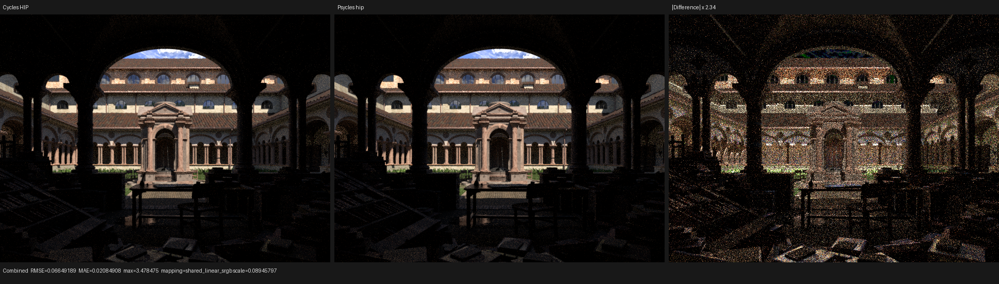
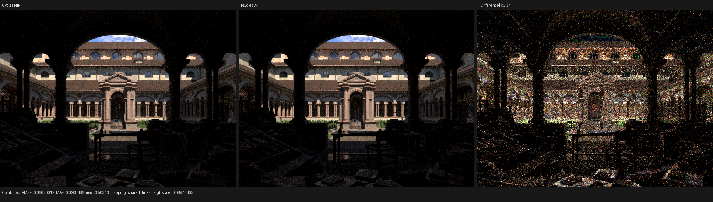
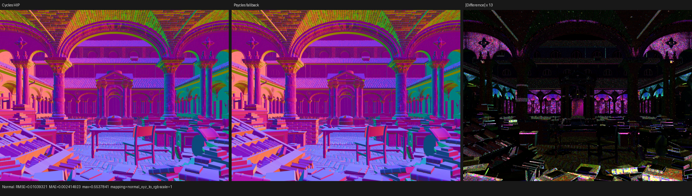

# Lone Monk HIP callable-boundary validation

This checkpoint fixes a Luisa HIP code-generation policy that expanded every
Luisa DSL `Callable` into every native call site. On the current Lone Monk
shader, a few large shared material and lighting callables were consequently
multiplied into a single path-tracing megakernel. The fix is in Luisa
`next@2e179e5f3`; Psycles first consumes it at `main@4c17943d3`.

The rendering oracle remains Cycles itself. The five-way scene run uses
Blender 5.3-alpha `b82c3f0da6c1`, Cycles CPU/HIP, and the production Luisa
fallback/HIP/Vulkan paths. No Psycles CPU reference renderer, material baking,
Cycles-side closure evaluation, or precomputed shader replacement is involved.
The exported bundle contains 37 original Blender closure graphs.

## Formal backend contract

The backend now records a temporary `luisa-generated-callable` provenance
attribute on LLVM declarations produced from XIR callables. The two-stage
contract is:

1. before the module optimizer, a generated callable has neither
   `alwaysinline` nor `noinline`; LLVM O3 therefore applies one uniform
   whole-module cost model to it;
2. a small or single-use callable may be folded by that optimizer;
3. a callable that survives O3 is a deliberate shared function boundary and
   receives `noinline` before the bitcode is handed to HIPRTC; and
4. the temporary provenance attribute is removed with the other internal ABI
   attributes before serialization.

This is a structural invariant, not a list of material names or scene cases.
The final dumped IR was inspected directly: the retained shared `callable`
has `noinline`, while `luisa-generated-callable` is absent. The HIP shader
cache codegen revision is incremented to three so an older expanded object
cannot mask the policy change.

## Regression proof

Luisa's new `test_hip_callable_boundary` builds a 192-round integer callable,
executes it through one and sixteen call sites, and checks all sixteen results
against the scalar formula. It also bounds code-object growth. On the RX 9070
XT:

| Policy | One use | Sixteen uses | Result |
| --- | ---: | ---: | --- |
| O3 cost model + preserved boundary | 14,611 bytes | 14,643 bytes | pass |
| former forced `alwaysinline` policy | 14,611 bytes | 140,435 bytes | fails the regression |

The former policy was restored only for this negative-control run and then
removed. The focused callable test passes 20 assertions, the existing HIP
shader-cache test passes 35 assertions, and the Psycles suite passes 129/129
with fallback, HIP, and Vulkan coverage.

## Complex-scene compile result

The pre-fix diagnostic generated 8,691,124 bytes of optimized LLVM bitcode.
LLVM O3/code generation took 66.280 s, and the downstream HIP link still had
not completed after 45 minutes. With the formal boundary policy, the same AST
generates 3,420,380 bytes, a 60.65% reduction. The isolated first fixed run
took 26.731 s in LLVM and 36.474 s in the downstream link, then dispatched
successfully. A subsequent complete benchmark, after the ROCm compiler path
was warm, measured 24.462 s in LLVM and 0.270 s in the final link; the complete
reported shader JIT was 34.266 s.

Vulkan is now the dominant cold-compile problem. Its path-tracing shader enters
native SPIR-V optimization at 3,642,422 words and leaves at 3,204,480 words.
That optimization/translation interval took about 120.2 s, while total Vulkan
JIT took 215.332 s; the remaining time is dominated by downstream pipeline
creation. This is a separate structural target from the fixed HIP LLVM policy.

## Five-way 640x480 result

All entries use 64 spp and a maximum of eight samples per Psycles dispatch.
Cycles has adaptive sampling and denoising explicitly disabled by the golden
renderer. Timings are seconds on the local Ryzen 9 9950X3D and Radeon RX 9070
XT.

| Renderer | Scene compile | Cold JIT | Warm JIT | Render only | Relative to Cycles HIP |
| --- | ---: | ---: | ---: | ---: | ---: |
| Cycles CPU | included | included | included | 5.029 | 2.72x slower |
| Cycles HIP | included | included | included | 1.848 | 1.00x |
| Psycles fallback | 1.550 | cache hit: 0.677 | cached | 21.709 | 11.75x slower |
| Psycles HIP | 3.842 | 34.266 | 0.665 | 3.537 | 1.91x slower |
| Psycles Vulkan | 1.287 | 215.332 | 2.918 | 8.311 | 4.50x slower |

Warm HIP and Vulkan render-only times were 3.529 s and 8.291 s. The HIP
callable fix is therefore a compile-time correctness/scalability repair; it
does not yet make Psycles faster than Cycles HIP.

Correction recorded at `3020c88`: the fallback 0.677 s entry above was a cache
hit, not a cold compile. Fresh path-kernel hashes later measured 83.115 s and
84.803 s cold and reported 537,135 fallback LLVM instructions. See the
[`shared-surface-closure-evaluator`](../shared-surface-closure-evaluator/README.md)
checkpoint for the cache-state proof and native-object hashes.

## Numerical comparison

The table compares linear multilayer EXRs against Cycles HIP. Cycles CPU versus
Cycles HIP is included as the current same-implementation device baseline.

| Actual | Combined RMSE | Combined relative RMSE | Mean luminance ratio | Normal RMSE |
| --- | ---: | ---: | ---: | ---: |
| Cycles CPU | 0.0234714 | 0.0150549 | 0.999966 | 0.000822357 |
| Psycles fallback | 0.0657810 | 0.0421929 | 0.999763 | 0.0103932 |
| Psycles HIP | 0.0664919 | 0.0426489 | 1.000331 | 0.0103943 |
| Psycles Vulkan | 0.0662001 | 0.0424617 | 0.999855 | 0.0103745 |

The three Luisa backends agree closely in overall energy, but they remain
well outside the Cycles CPU/HIP device variance. RNG dimension parity, closure
selection, and light/BSDF proposal matching therefore remain active work.

A repeated HIP run changed 57 of 307,200 pixels above `1e-6` in the complete
multilayer EXR (`RMS=0.00123885`, peak SNR `105.397 dB`, maximum difference in
Diffuse Direct). Vulkan's repeated pixels pass `oiiotool --diff`; its EXR file
hash differs only through container metadata. The sparse HIP/HIPRT
nondeterminism is recorded rather than hidden by selecting a favorable run.

## Visual inspection

All six triptychs below were opened at original resolution. The Cycles panel
is left, Psycles is center, and an amplified absolute difference is right.
Camera registration, architectural geometry, roof highlights, foreground
props, arch shadows, and the grass/foliage silhouettes align on all three
Luisa backends. In particular, there is no longer a missing or spatially
shifted grass band. The Combined difference is predominantly high-frequency
sampling residual across both the lit facade and vegetation rather than a
grass-only structural error. Normal residuals concentrate on thin foliage,
alpha/edge coverage, and dark foreground silhouettes; broad surfaces do not
show a systematic normal rotation.

This visual result is a checkpoint, not a 1:1-quality acceptance. The visible
and numerical residuals above still require algorithmic alignment.

### Combined

### Normal

The complete machine-readable matrix is in [`benchmark.json`](benchmark.json),
the four comparison reports are in [`reports/`](reports/), and the observed
compiler/render logs are retained in [`logs/`](logs/).
