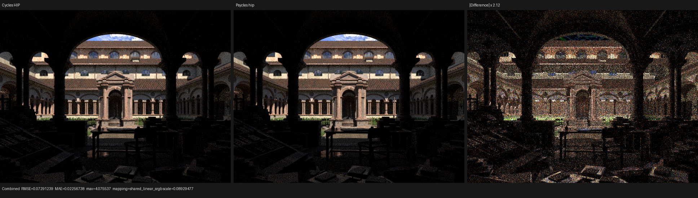
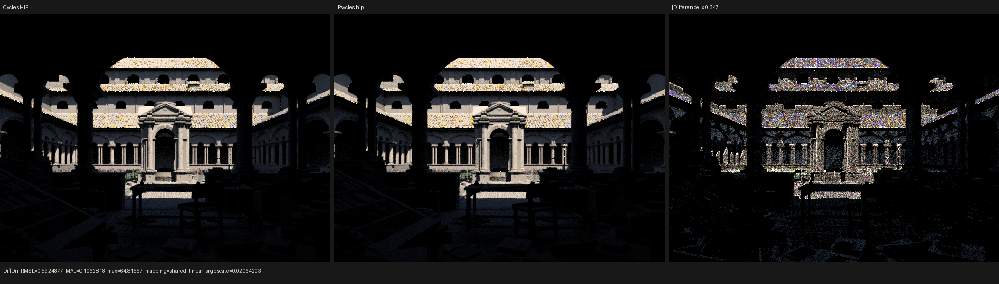
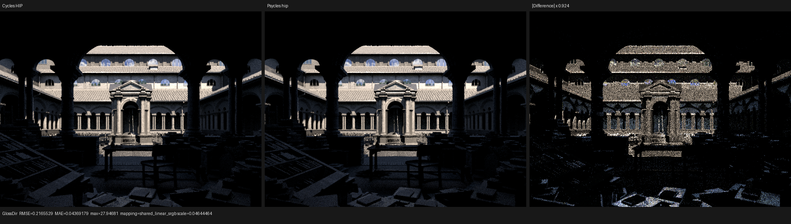

# Light proposal and raw emission phase

This checkpoint validates Psycles `82ea7fc`. It separates emissive-triangle
and environment geometry proposals from raw closure evaluation in the fused
Luisa path kernel. Cycles remains the only algorithmic oracle; no host or CPU
reference renderer was added.

## Cycles state machine

The source oracle is current Cycles main `a3afe632`, in
`kernel/integrator/shade_surface.h:319-450`,
`kernel/light/sample.h:23-40`, and
`kernel/integrator/shade_light.h:115-230`. The locally built Blender 5.3-alpha
binary is at `b82c3f0d`; its `intern/cycles` tree is byte-identical to the
current checkout.

Cycles first constructs a `LightSample`, rejects an invalid or geometric
self-sample, and only then evaluates the emitter shader. Constant emission is
resolved before the BSDF evaluation. A non-constant full shader is scheduled
through `SHADE_LIGHT_NEE` after surface shading and before shadow traversal.
Both paths share the invariant that raw closure evaluation is not part of the
geometric proposal and cannot precede proposal/self validity.

Psycles now expresses that invariant in its host-stage type system. For scene
state `S`, reference point `P`, and light random sample `u`, the proposal is

```text
Q(S, P, u) = (identity, direction, position, normal, pdf, valid)
```

and deliberately contains no radiance. Raw radiance is a separate operation

```text
L = E(path_state, Q)
```

that requires `PathSampleContext`. `Q` accepts only `LuisaSceneData`, so it
cannot call a surface/world closure even accidentally. This is one interface
law for every material graph, not a collection of emitter or shader cases.

`EmissiveTriangleComponent` and `EnvironmentLightComponent` remain ordinary
virtual C++ objects while Luisa records the selected implementation into the
fused device AST. Surface mesh NEE evaluates `E` only after side validity and
the exact Cycles primitive/object self-rejection predicate. Volume mesh NEE
also gates it on Volume Scatter visibility. Surface and volume environment
NEE gate it on a non-zero directional proposal; background hits use the same
world evaluator with the background shader state. Blender passes the original
closure graphs unchanged—there is no baking or material surrogate.

The remaining finer-grained optimization is to specialize Cycles' constant
emission fast path from its deferred non-constant path. This checkpoint closes
the earlier proposal/evaluation coupling and its invalid/self-sample ordering;
it does not claim that wavefront scheduling specialization is complete.

## Regression coverage

`test_luisa_area_light_forward` contains compile-time interface assertions:

- neither proposal type has a `radiance` member;
- both `from_position` methods take scene data rather than path state; and
- raw emission is available only through the separate evaluator signature.

The existing production render fixtures then exercise raw triangle and
spatial World closures. Mesh/environment volume fixtures cover the same
components at a sampled volume collision. Fallback, HIP, and Vulkan all
passed. The complete 32-way build and CTest run passed `123/123`, including
the 2,000-line source-size gate.

## Lone Monk 640x480 validation

The canonical Cycles-identity bundle
`4250d4205d8d01cefd98c15e81021d6dead540b2923797378bf7b32e96e8b8f7`
was rendered at 640x480, 64 fixed spp, and four samples per dispatch. Cycles
CPU/HIP goldens are the unchanged outputs from the immediately preceding
checkpoint.

| Renderer | Scene compile | Shader JIT | Render | Relative reference |
|---|---:|---:|---:|---:|
| Psycles fallback | 1.263 s | 85.659 s cold | 5.637 s | 1.106x Cycles CPU |
| Psycles HIP | 3.351 s | 0.335 s warm | 2.395 s | 1.297x Cycles HIP |
| Psycles Vulkan | 0.928 s | 117.802 s cold | 4.285 s | 2.321x Cycles HIP |

HIP cold JIT was 361.272 s: LLVM generation took 24.051 s for 4,685,820
bytes, while `hiprtcLinkComplete` took 332.688 s and produced a 5,940,536-byte
code object. Vulkan generated exactly the previous checkpoint's
`2,005,177 -> 1,772,038` SPIR-V word counts. The OOP phase split therefore did
not inflate the final Vulkan shader.

Strict zero-tolerance OpenImageIO A/B passed for fallback and Vulkan. HIP is
not bit-deterministic on this scene: the previous checkpoint's own cold/warm
pair differed at 66 pixels with RMS `0.00149189`; the new cold/warm pair
differed at 54 pixels with RMS `0.00136812`. The old/new cold pair differed at
31 pixels with RMS `0.000604649`, inside that measured pre-existing runtime
floor. This is recorded rather than mislabeled as exact parity.

Combined-pass metrics against Cycles HIP are unchanged within that floor:

| Backend | RMSE | Relative RMSE | MAE | Mean luminance ratio |
|---|---:|---:|---:|---:|
| fallback | 0.072130 | 0.046265 | 0.022413 | 1.004629 |
| HIP warm | 0.072912 | 0.046767 | 0.022567 | 1.005188 |
| Vulkan | 0.072584 | 0.046557 | 0.022560 | 1.004726 |

The exact values and compiler measurements are in
[validation.json](validation.json). Retained comparison data are in the
[fallback](fallback-report.json), [HIP](hip-report.json), and
[Vulkan](vk-report.json) reports.

## Visual inspection

I opened all three Combined triptychs at their original 1936x546 resolution,
plus HIP Diffuse Direct and Glossy Direct. Composition, exposure, sky opening,
material families, and the broad grass/vegetation placement remain aligned
across the three Psycles backends. No new spatial or energy discontinuity is
visible after the phase split. The known structured residuals remain around
roof tiles/eaves, facade and arch silhouettes, vegetation/grass highlights,
and sparse bright samples. Diffuse Direct still shows the larger colored
sample-structure residual; Glossy Direct is closer but retains roof, window,
arch, and foreground edges. These remain active parity work.








## Remaining direct-light gates

- specialize constant and deferred non-constant emitter evaluation;
- align emitter/environment importance distributions and exact random mapping;
- attribute and recover the older Vulkan throughput regression; and
- implement light trees, MNEE, path guiding, and light linking.
