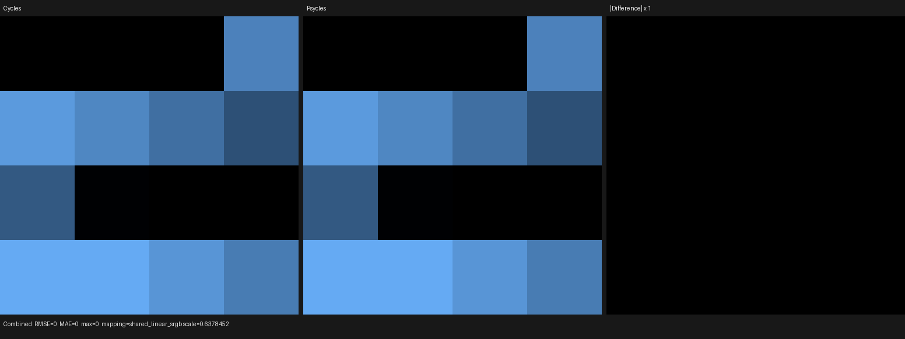
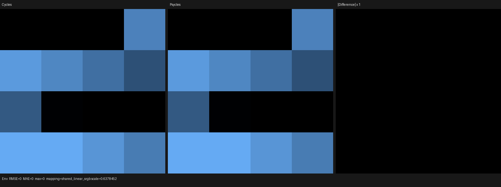

# Principled Alpha and transparent-closure merging

This checkpoint implements physical Principled Alpha on the Luisa path and
matches Cycles' transparent-closure allocation and merging semantics. Blender
closures and linked Alpha expressions remain raw device-side inputs; Cycles is
the only rendering oracle.

## Formal contract

For closure-tree leaf `i`, let `T_i` be its transparent contribution:

- a Transparent BSDF contributes its signed closure weight; and
- a Principled BSDF contributes
  `W_i * (1 - saturate(alpha_i))`, while its ordered lower layers receive
  `W_i * saturate(alpha_i)`.

Cycles applies its cutoff before merging. Psycles therefore evaluates the
single relation

```text
s_i = abs(average(T_i))
a_i = (s_i >= 1e-5)
T   = sum_i select(0, T_i, a_i)
q   = sum_i select(0, s_i, a_i)
j   = min { i | a_i }
```

and emits exactly one allocated transparent closure at leaf position `j`,
with signed weight and transparent extinction `T` and sample weight `q`.
Every other virtual transparent candidate is unallocated. The cutoff is not
applied after summation: sub-cutoff leaves cannot combine into a closure, and
opposite signed leaves retain the sum of their individual absolute-average
sample weights even when their spectral weights cancel.

The first-allocation predicate is a Luisa device expression. This matters when
an early candidate is rejected at runtime and a non-transparent closure occurs
before the first accepted candidate: placing the merged closure statically at
the first possible leaf would change Cycles' closure indices and random-lobe
selection order even if the resulting pixel happened to be unchanged. A
three-leaf regression pins rejected Transparent, allocated Diffuse, allocated
Transparent to the exact resulting order `Diffuse, Transparent` on fallback,
HIP, and Vulkan.

The same transfer relation drives closure expansion, sampling, closure traces,
runtime transparency capability, and transparent extinction. There is no
host-side Alpha evaluator or material-specific case table.

## Regression matrix

The registered `principled_alpha_surface` probe is a 4x4 full-frame material
matrix. Base Color is black and IOR is 1, while the World is nonzero, so both
Combined and Environment isolate physical transparency. Its sixteen raw node
graphs cover:

- Alpha below zero, zero, fractional values, one, and above one;
- linked Alpha values `0.2`, `0.4`, `0.6`, and `0.8`;
- three values immediately around the transparent closure cutoff; and
- an Add Shader case that merges a standalone Transparent BSDF with
  Principled Alpha.

The generated `.blend` is rendered unchanged by current Cycles CPU, exported
with the original node graphs, then rendered by Psycles fallback, HIP, and
Vulkan. The reusable probe runner hard-gates both Combined and Environment.
The device closure test separately pins merged weight/sample weight/extinction,
opaque Alpha attenuation, first-allocation order, and reflective-caustics
branches on all three backends.

The final all-thread regression passed `123/123` tests in `66.78 s`:

```bash
cmake --build build -j32
ctest --test-dir build --output-on-failure -j32
```

## Latest-Cycles EXR differential

The Blender oracle is 5.3-alpha `a29a0fec7ada`; the inspected source oracle is
Cycles main `a3afe6326e5f`. The probe rendered 64x64 at 64 samples.

| Backend | Pass | RMSE | Relative RMSE | Maximum error | Mean luminance ratio |
|---|---|---:|---:|---:|---:|
| fallback | Combined | 0 | 0 | 0 | 1.0 |
| fallback | Environment | 0 | 0 | 0 | 1.0 |
| HIP | Combined | 0 | 0 | 0 | 1.0 |
| HIP | Environment | 0 | 0 | 0 | 1.0 |
| Vulkan | Combined | 0 | 0 | 0 | 1.0 |
| Vulkan | Environment | 0 | 0 | 0 | 1.0 |

All three backends reproduce the Cycles full-image mean RGB exactly:
`(0.0771500990, 0.2378854752, 0.5336202979)`. Complete machine-readable pass
reports are retained under [reports](reports).

These tiny renders diagnose compiler and closure semantics rather than scene
throughput. In the final cold runs, fallback JIT/render took
`0.834/0.0225 s`; HIP took `1.888/0.00694 s`, including `0.711 s` LLVM codegen
and `0.842 s` bitcode linking; Vulkan took `2.334/0.0110 s` and produced an
optimized 245,511-word SPIR-V module. Complex-scene Cycles CPU/HIP versus
Psycles fallback/HIP/Vulkan timing remains a separate benchmark gate.

## Visual inspection

All six Combined/Environment triptychs were opened at original resolution.
Cycles and Psycles have identical cell order, boundaries, colors, and black
cells on fallback, HIP, and Vulkan. Every difference pane is entirely black at
unit amplification, consistent with the zero-error reports.






## Remaining Principled work

- implement and validate physical Sheen and Coat scattering/sample/PDF/AOV
  behavior using the same ordered layer component;
- complete transmission, subsurface, thin-film, and remaining Principled
  interactions; and
- validate those closures in Lone Monk and other complex Blender scenes.
