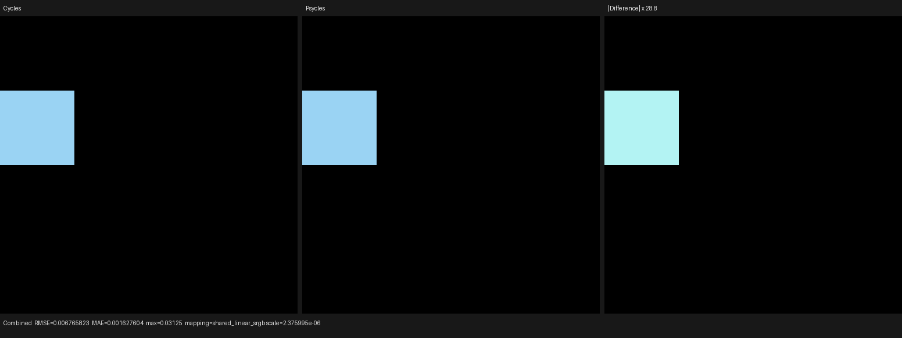
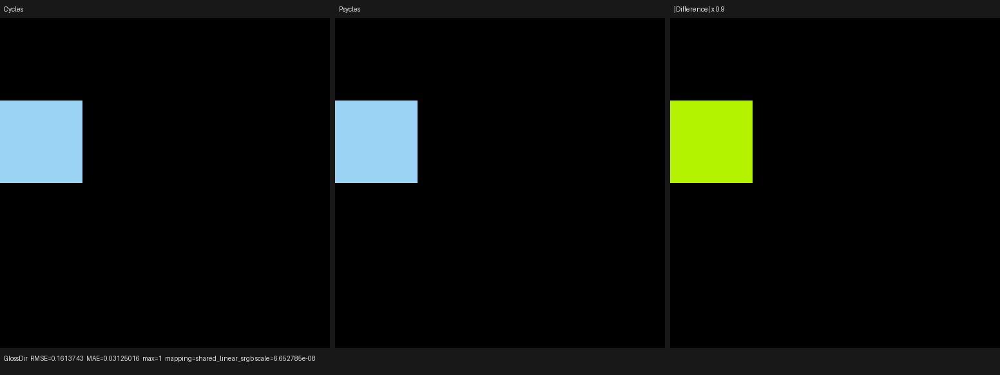
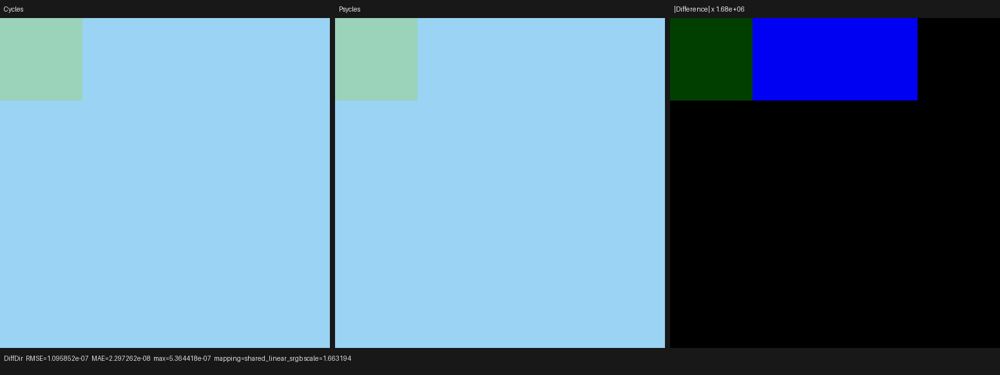
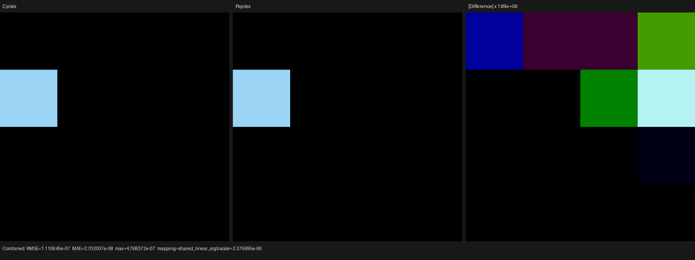
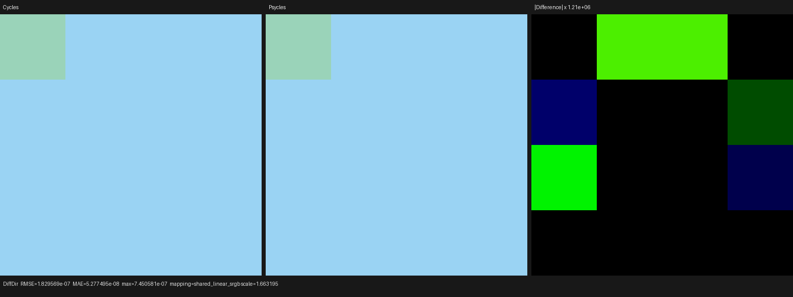
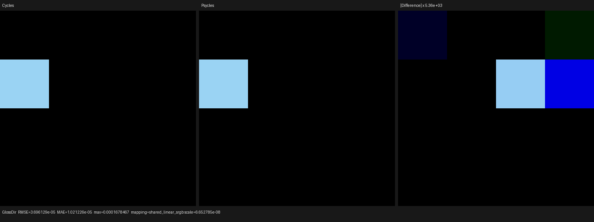
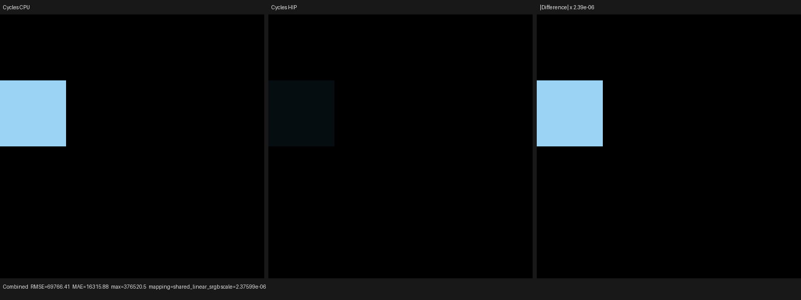

# Cycles physical Principled Coat and singular microfacet MIS

This checkpoint implements physical Principled Coat on the Luisa rendering
path and closes the singular-reflection mixture relation that Coat exposed.
The implementation receives the original Blender closure graph and records
device-side Luisa expressions; it does not pre-bake materials, call Cycles at
render time, or introduce a Psycles CPU reference renderer.

## Cycles oracle

The rendering oracle is Blender 5.3-alpha `b82c3f0da6c1`, built on
2026-07-31. The inspected source checkout is
`/home/mike/Projects/blender-cycles` at `a3afe6326e5f`. A scoped Git diff of
`intern/cycles` between the executable revision and the source revision is
empty, so the executable and the source-level contract are the same Cycles
implementation.

The relevant Cycles contracts are the ordered Principled setup in
`intern/cycles/kernel/svm/closure.h`, GGX evaluation and the
`alpha_x * alpha_y <= 2e-10` singular predicate in
`intern/cycles/kernel/closure/bsdf_microfacet.h`, and the aggregate closure
sampling relation in the Cycles shader evaluator. Cycles is the sole numeric
and rendering reference.

## Host-stage component and device relation

The previous emission-only helper is now a general
`PrincipledLayerComponent` in a real `.h`/`.cpp` pair. Its methods use ordinary
host-side structure to compose Alpha, Sheen, Coat, and Emission while every
socket value, table lookup, allocation predicate, and layer update remains a
Luisa device expression in the generated shader AST. The same component is
used by physical closure traversal and deferred Principled emission, so these
paths cannot drift into separate Coat implementations.

For incoming lower-layer RGB weight `W`, authored Coat weight `c`, roughness
`r`, IOR `eta`, tint `T`, and the current path's reflective-caustics predicate
`R`, the recorded relation is:

```text
c0        = max(c, 0)
requested = c0 > 1e-5
r0        = saturate(r)
eta0      = max(eta, 1)
Ncoat     = ensure_valid_reflection(
                safe_normalize_fallback(linked_or_default_normal), wi)
P         = max(W * c0, 0)
q_alloc   = average(P)
allocated = requested && R && q_alloc >= 1e-5

D, E      = Cycles_GGX_energy_compensation(r0, dot(wi, Ncoat), eta0)
S         = Cycles_GGX_albedo_table(r0, dot(wi, Ncoat), eta0)
A         = eta0 > 1 ? lerp(F0(eta0), 1, S) : 0
F         = P * D
B         = F * A
W1        = allocated ? layer(W, B) : W

cos_t     = sqrt(1 - (1 / eta0^2) * (1 - dot(wi, Ncoat)^2))
Tpath     = max(T, 0)^(1 / cos_t)
W_next    = requested && T != 1 ? W1 * mix(1, Tpath, c0) : W1
```

Here `layer(W, B)` is Cycles' component-safe lower-layer attenuation:
`W * saturate(1 - max_component(B / W))`. The reflective closure stores
`F`, energy scale `E`, albedo `B`, allocation weight `q_alloc`, and sample
weight `q_alloc * average(A) * average(D)`. The authored Coat weight is not
saturated for either allocation or tint mixing, matching SVM rather than the
different OSL presentation.

Allocation, Fresnel setup, and tint transmission are intentionally
orthogonal. IOR one still occupies a valid Coat slot but has zero Fresnel and
zero sample weight. Disabling reflective caustics removes the Coat, metallic,
and dielectric reflection slots and their reflective layer attenuation, but
does not remove absorption through the authored Coat Tint medium. Recorded
allocation weights are cleared when a slot is not allocated, preventing a
nonexistent closure from affecting lobe roulette.

The path predicate itself follows Cycles:

```text
reflective_caustics = integrator.caustics_reflective ||
                      previous_ray_was_not_diffuse
```

It is threaded explicitly through surface runtime flags, closure tracing,
evaluation, sampling, callables, and the production geometry/shading path.

## Formal singular-mixture relation

Microfacet roughness now keeps Cycles' exact setup value
`alpha = saturate(roughness)^2`, widened only by Filter Glossy. There is no
arbitrary `1e-3` roughness floor. A closure is singular exactly when
`alpha * alpha <= 2e-10`; regular evaluation and regular directional PDF are
then zero, while sampling returns the mirror direction and Cycles' finite
delta representation (`1e6`). Internal sampling arithmetic uses only the
smallest denominator guard needed to keep unselected branches finite.

GGX uses the cancellation-resistant Cycles form:

```text
cos2  = min(dot(N, H)^2, 1)
denom = (1 - cos2) + alpha^2 * cos2
D     = alpha^2 / (pi * denom^2)
```

This matters at normal incidence: `1 + cos2 * (alpha^2 - 1)` loses the
entire finite peak when `alpha^2` is below float epsilon. The new device
regression proves the analytic 16:1 peak ratio between roughness `.01` and
`.02`, rather than pinning individual backend literals.

For selection weights `w_i`, total weight `Q = sum_i(w_i)`, regular
competitors `(f_i, p_i)`, and selected delta closure `s`, the aggregate sample
is now formed once as:

```text
f = sum_regular(f_i) + f_delta_s
p = sum_regular(w_i * p_i / Q) + w_s * p_delta_s / Q
```

The selected singular closure is excluded from regular evaluation by the
same formal predicate. This relation is shared by singular GGX, Glass,
near-unit-IOR Glass transmission, and Transparent closures; it preserves
regular competing closures and their AOV contributions. Invalid samples
clear evaluation, PDF, events, eta, and roughness rather than leaving payload
that downstream code merely promises to ignore.

## Regression matrix

The registered `principled_coat_surface` probe is a 4x4 raw Principled matrix
with a Box filter, direct Sun, and base IOR one to isolate Coat over diffuse.
Its linked inputs cover:

- negative, zero, below-cutoff, exact-cutoff, ordinary, and above-one Coat
  weights;
- negative, zero, `.001`, `.01`, `.20`, `.27`, `.30`, and `.31` roughness;
- IOR one, `1.33`, `1.45`, `1.5`, `1.6`, and two;
- white, colored, and overdriven Coat Tint; and
- default, linked-equivalent, scaled-equivalent, and zero linked normals.

The canonical differential is 64x64 at 64 spp. Since each cell is a flat
direct-light evaluation, this is a deterministic shader fixture rather than
a noisy convergence test. Its gates require every nonzero pass luminance
ratio to remain within `[0.99999, 1.00001]` and relative RMSE below `1e-4`.

The dedicated device test adds structural cases that an image alone cannot
pin:

- strict `> 1e-5` cutoff and closure order;
- occupied IOR-one Coat with zero sampling weight;
- Coat plus diffuse singular mixture evaluation/PDF/AOV;
- exact `.01`/`.02` GGX peak scaling;
- componentwise `bsdf_alloc` clamping for overdriven tint;
- Coat Tint attenuation with reflective caustics disabled;
- no base-dielectric attenuation when its reflective slot is disabled;
- Glass plus diffuse singular mixture MIS; and
- Transparent plus Translucent delta mixture MIS.

The shared Luisa surface fixture was extracted into
`tests/luisa_surface_test_support.h`, and backend registration now reuses the
single `psycles_add_luisa_backend_test` CMake function. The root CMake file is
1975 lines and the source-size regression remains active.

## Latest-Cycles EXR differential

All values below compare Psycles against the latest Cycles CPU oracle. Full
machine-readable data is retained under [reports](reports).

| Backend | Pass | Relative RMSE | Maximum error | Mean luminance ratio |
|---|---|---:|---:|---:|
| fallback | Combined | 9.640e-8 | 3.125e-2 | 0.999999814 |
| fallback | Diffuse Direct | 2.770e-7 | 5.364e-7 | 1.000000000 |
| fallback | Glossy Direct | 6.438e-8 | 1.000 | 0.999999889 |
| HIP | Combined | 9.640e-8 | 3.125e-2 | 0.999999814 |
| HIP | Diffuse Direct | 2.770e-7 | 5.364e-7 | 1.000000000 |
| HIP | Glossy Direct | 6.438e-8 | 1.000 | 0.999999889 |
| Vulkan | Combined | 1.582e-12 | 4.768e-7 | 1.000000000 |
| Vulkan | Diffuse Direct | 4.624e-7 | 7.451e-7 | 0.999999750 |
| Vulkan | Glossy Direct | 1.475e-11 | 1.678e-4 | 1.000000000 |

Diffuse Color and Glossy Color are bit-exact on fallback and HIP. They are
respectively bit-exact and `2.266e-7` relative RMSE on Vulkan. Normal is
bit-exact on fallback and at `1.490e-8` relative RMSE on HIP/Vulkan. All
images have zero invalid pixels.

The final all-thread build and complete suite passed `126/126` tests:

```bash
cmake --build build -j32
ctest --test-dir build -j32 --output-on-failure
```

The six focused closure/Coat tests pass on fallback, HIP, and Vulkan as
separately registered CTest cases.

## Cycles CPU/HIP narrow-peak diagnostic

A matched 64x64, 256-spp Cycles CPU/HIP run exposes one oracle-backend
difference: case 8, normal incidence with Coat roughness `.01`. Cycles CPU's
Glossy Direct value is about 166.95 times Cycles HIP's value. The other 15
cells, Diffuse Color, and the material layout align.

For this case `alpha = 1e-4` and `alpha^2 = 1e-8`, so it remains a regular
closure above the `2e-10` singular boundary. Inverting the measured peak gives
the HIP denominator contribution:

```text
sqrt(CPU / HIP)       = 12.920932
inferred denominator  = 1.292093e-7
inferred (1 - cos^2)  = 1.19209325e-7
inferred cos          = 0.9999999403953
1 - cos               = 5.960466e-8
```

That last value is half a float ULP at one. Cycles' HIP device compilation
uses `-ffast-math`; its normalized half vector lands one representable step
below the exact CPU normal, and the intentionally extreme finite GGX peak
amplifies that step. The retained direct report therefore shows Combined and
Glossy Direct luminance ratios near `0.006`, while Diffuse Color is exact and
Normal relative RMSE is `2.107e-8`.

Psycles fallback, HIP, and Vulkan all follow the formal Cycles source
expression and agree with Cycles CPU. No backend-specific degradation was
added to imitate the Cycles HIP fast-math artifact. The discrepancy is kept
as an explicit oracle diagnostic so a future Cycles or compiler change is
observable.

## Probe timing and compile stages

These tiny-fixture timings diagnose shader compilation and dispatch only;
they are not production-scene speedup claims.

| Renderer/backend | Shader JIT | Render |
|---|---:|---:|
| Cycles CPU | n/a | 0.020-0.036 s |
| Psycles fallback, cached | 0.0467 s | 0.0477 s |
| Psycles HIP, cached | 0.0536 s | 0.0117 s |
| Psycles Vulkan, cached | 0.1870 s | 0.0226 s |
| Cycles HIP, 256-spp diagnostic | n/a | 0.088 s |
| Psycles HIP, 256-spp diagnostic | 0.0530 s | 0.0328 s |

The earlier cold Coat compilation measured `8.664 s` on HIP, including
`1.329 s` LLVM code generation and `6.840 s` HIP bitcode linking. Cold Vulkan
took `3.498 s` and optimized 293,758 SPIR-V words to 275,352. Thus the cold
HIP bottleneck here is device-bitcode linking, while the cold Vulkan delay is
shader generation/SPIR-V optimization and driver compilation, not the
32-thread C++ build.

## Visual inspection

Every retained triptych below was opened at original resolution. On
fallback, HIP, and Vulkan the Cycles and Psycles panels have identical cell
boundaries, cutoff transitions, tint ordering, linked-normal behavior,
diffuse attenuation, and Coat peak placement. The fallback/HIP difference
panes contain only ULP-scale tails. Vulkan's structured difference colors
appear only after automatic amplification by up to `1.89e6`; its unamplified
maximum Combined error is `4.768e-7`, with no visible material or geometry
error.
















The direct Cycles CPU/HIP triptych visibly isolates the `.01` roughness cell
described above rather than a broad algorithm or layout mismatch:




## Remaining Principled and scene work

- implement physical Principled transmission, thin-wall behavior,
  subsurface, thin film, anisotropy, and their exact closure interactions;
- continue aligning Cycles RNG dimensions, camera/material-boundary coverage,
  light/environment proposals, and estimator scheduling;
- re-evaluate Lone Monk grass after the next material/sampler checkpoint; and
- run Blender 4.1 Splash, Classroom with volume lighting, and the broader
  complex-scene matrix at 480p/1080p across Cycles CPU/HIP and Psycles
  fallback/HIP/Vulkan.

This checkpoint closes physical Coat, reflective-caustics allocation, and the
shared singular-mixture relation. It does not claim complete Principled or
full-scene Cycles parity.
