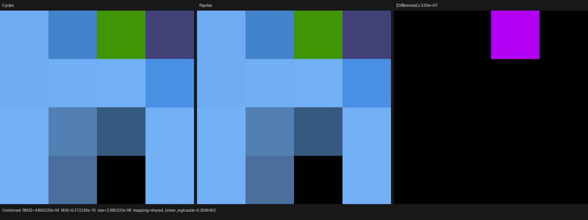
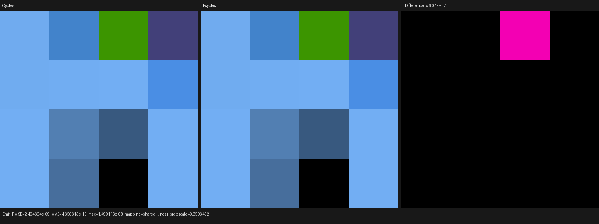

# Principled Alpha, Sheen, and Coat emission layers

This checkpoint implements the ordered Cycles Principled layers that attenuate
authored surface emission. The original Blender sockets remain device-side
Luisa expressions; no closure is baked or evaluated by a host reference
renderer. Current Blender/Cycles main is the sole rendering oracle.

## Formal contract

`PrincipledEmissionLayerComponent` is a host-stage C++ component that records
the device AST for one Principled closure. Starting with the closure-tree mix
weight, it applies the same ordered relation as Cycles:

1. clamp Alpha and multiply the lower-layer weight;
2. allocate Sheen only above the Cycles closure cutoff, validate its LTC
   transform/albedo lookup, and reduce the lower weight by the maximum
   relative layer albedo;
3. conditionally allocate reflective Coat according to both the closure
   cutoff and Cycles' effective reflective-caustics predicate, including GGX
   energy preservation and the generalized-Schlick IOR albedo estimate;
4. apply Coat Tint's refracted optical-depth approximation whenever Coat is
   requested, even if reflective caustics are disabled; and
5. multiply the untouched authored Emission Color × Strength by the resulting
   lower-layer weight.

The reduction is one total transfer relation,
`W' = W * saturate(1 - max(safe_divide(A, W)))`; it is not a list of
material-specific cases. Sheen and Coat reuse the versioned Cycles lookup
tables already consumed by Psycles' microfacet implementation.

The compiler IR now records whether Coat Normal is linked as an explicit
topology bit. This distinction cannot be reconstructed from a value's numeric
contents or operation kind: a linked constant is still linked, while an
unlinked socket must inherit the Principled Normal. The implementation also
preserves Cycles' exact zero-only normalization at the degenerate boundary
where the main and coat normals cancel.

The effective reflective-caustics value is evaluated per ray as
`integrator.reflective_caustics || !ray_visibility.diffuse`, matching the
Cycles path relation. It is passed through the generated surface-emission
callable rather than frozen into material state.

This checkpoint is specifically emission-layer parity. Alpha transparency and
the physical Sheen/Coat scattering closures are not claimed complete yet.

## Regression matrix

The `principled_emission_layers` probe is a 4×4 full-frame material matrix.
Its sixteen raw Principled closures cover:

- Alpha below zero, inside the unit interval, above one, and neutral;
- low/high/negative Sheen Roughness, signed/HDR Sheen Tint, and weights above
  one;
- smooth and rough Coat, IOR 1.0 through 2.0, colored Coat Tint, and Coat
  Weight above one;
- independently linked Coat Normal values;
- combined Alpha + Sheen + Coat + Tint; and
- the exact zero sheen-normal boundary produced by opposite normals mixed at
  `0.5`.

The generated `.blend` is rendered unchanged by official Cycles CPU, exported
with its original node graphs, then rendered by Psycles fallback, HIP, and
Vulkan. Both Combined and Emit are hard-gated in the reusable probe runner.
The Luisa closure test additionally executes the reflective-caustics enabled
and disabled branches on all three backends. Adapter regression checks every
new socket expression and the linked-normal topology bit.

The build and focused device tests used all 32 available threads:

```bash
cmake --build build -j32
ctest --test-dir build --output-on-failure \
  -R 'psycles\.luisa_cycles_closure_(fallback|hip|vk)$' -j32
```

The final full run passed `123/123` in 56.05 seconds with fallback, HIP, and
Vulkan tests sharing the machine concurrently.

## Latest-Cycles EXR differential

The Blender oracle binary is 5.3-alpha `a29a0fec7ada`; the inspected source
oracle is current Cycles main `a3afe6326e5f`. The probe rendered 64×64 at 64
samples with black World radiance, so Combined and Emit isolate the same
layered surface emission.

| Backend | Pass | RMSE | Relative RMSE | Maximum error | Mean luminance ratio |
|---|---|---:|---:|---:|---:|
| fallback | Combined | 2.405e-9 | 1.929e-9 | 1.490e-8 | 1.0 |
| fallback | Emit | 2.405e-9 | 1.929e-9 | 1.490e-8 | 1.0 |
| HIP | Combined | 2.405e-9 | 1.929e-9 | 1.490e-8 | 1.0 |
| HIP | Emit | 2.405e-9 | 1.929e-9 | 1.490e-8 | 1.0 |
| Vulkan | Combined | 4.809e-9 | 3.857e-9 | 2.980e-8 | 1.0 |
| Vulkan | Emit | 4.809e-9 | 3.857e-9 | 2.980e-8 | 1.0 |

The Cycles and Psycles full-image mean RGB is identical on every backend:
`(0.3024527133, 0.8140205145, 1.6758022308)`. Complete machine-readable pass
reports are retained under [reports](reports).

These tiny renders are compiler diagnostics, not scene throughput benchmarks.
Cold fallback JIT took 0.827 s and rendering 0.0263 s. HIP JIT took 2.164 s
(0.616 s LLVM generation and 1.321 s bitcode linking) and rendering 0.00678 s.
Vulkan JIT took 1.907 s, producing an optimized 147,748-word SPIR-V module,
and rendering took 0.0193 s. Complex-scene speedups remain a separate gate.

## Visual inspection

All six final Combined/Emit triptychs were opened at original resolution.
Cycles and Psycles have the same cell ordering, boundaries, colors, and black
cells. Difference panes are black except for one amplified floating-point-tail
cell: its unscaled maximum is only `1.49e-8` on fallback/HIP and `2.98e-8` on
Vulkan.







## Remaining Principled work

- add the physical Alpha transparent closure to the ordered closure set;
- implement and validate Sheen and Coat scattering/sample/PDF/AOV behavior;
- complete transmission, subsurface, thin-film, and remaining Principled
  interactions; and
- validate those closures in Lone Monk and other complex Blender scenes.
