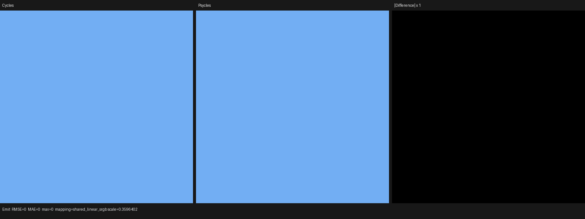

# Raw Principled surface emission

This checkpoint validates Psycles `36b1b08`. It imports Blender's original
Principled BSDF `Emission Color` and `Emission Strength` sockets, preserves
their links in the typed surface program, and evaluates them inside the Luisa
surface AST. Cycles is the only rendering oracle. The Luisa fallback result is
one of the tested backends, not a separate Psycles CPU renderer or reference
model.

## Cycles contract

The source oracle is current Blender/Cycles main `a3afe6326e5f`. In
`scene/shader.cpp`, `output_estimate_emission` always marks Principled
emission non-constant because Alpha, Sheen, and Coat may attenuate it. Direct
Emission Color and Strength literals contribute to the mesh-emitter estimate;
linked inputs remain conservative. In `kernel/svm/closure.h`, the actual
radiance is evaluated from the original sockets at the shading point.

The Blender 5.3-alpha oracle binary identifies itself as `a29a0fec7ada`. Its
differences from current main under `intern/cycles` are limited to the
Psycles per-path trace instrumentation; the two emission-contract source files
above are unchanged. That instrumentation is not used by this image probe.

Psycles keeps the same two different binding-time questions separate:

1. A total closure-topology analysis always schedules reachable Principled
   emission through the deferred device path. This proof is independent of
   editable parameter values, so a material can reuse the same JIT program
   when its emission is changed from zero to non-zero.
2. A per-material host metadata query mirrors Cycles' emitter-discovery
   estimate. It reads only direct parameter literals and closure topology;
   linked value expressions remain conservative. This estimate may include or
   exclude a mesh from the light proposal distribution, but is never used as
   rendered radiance.

The raw closure therefore remains intact across Blender export, graph
adaptation, surface-program lowering, parameter rebinding, and Luisa device
evaluation. There is no baking, Cycles-kernel translation, or host-side
material surrogate.

This checkpoint deliberately isolates the authored emission product with
Alpha = 1, Sheen Weight = 0, and Coat Weight = 0. Exact Alpha/Sheen/Coat layer
attenuation and the remaining Principled lobes are still parity gates; this is
not a claim of complete Principled BSDF support.

## Regression coverage

The contract suite pins all of the following:

- zero and non-zero Principled emission share one structural signature;
- both raw socket expressions survive surface lowering;
- Principled never enters the restricted constant-emission callable;
- direct parameter rebinding changes only the Cycles-style emitter estimate;
- linked inputs remain conservative rather than being host-evaluated; and
- normalized Cycles socket names and Multi-GGX metadata adapt without losing
  either emission socket.

The Luisa closure regression evaluates linked RGB and Value nodes through the
real `SurfaceDispatch` on fallback, HIP, and Vulkan. The area-light regression
also retains a conservatively discovered linked emitter whose device-evaluated
radiance is zero, proving that proposal eligibility and radiometry have not
been collapsed back together.

The Release build used `cmake --build build -j32`. The final warm-cache full
CTest run passed `123/123` in 3.74 seconds; the first mixed cold-cache run
passed the same suite in 55.22 seconds.

## Latest-Cycles EXR differential

The versioned `principled_emission` probe uses a full-frame plane. Linked RGB
and Value nodes author linear color `(0.17, 0.43, 0.91)` and strength `2.75`.
Official Cycles CPU and each Psycles backend rendered 64x64, 64-sample,
untonemapped multilayer EXRs from the same generated `.blend`.

| Backend | Pass | RMSE | Relative RMSE | Maximum error | Mean luminance ratio |
|---|---|---:|---:|---:|---:|
| fallback | Combined | 0 | 0 | 0 | 1.0 |
| fallback | Emit | 0 | 0 | 0 | 1.0 |
| HIP | Combined | 0 | 0 | 0 | 1.0 |
| HIP | Emit | 0 | 0 | 0 | 1.0 |
| Vulkan | Combined | 0 | 0 | 0 | 1.0 |
| Vulkan | Emit | 0 | 0 | 0 | 1.0 |

All three backends reproduce Cycles' linear mean RGB exactly:
`(0.4675211608, 1.1825656891, 2.5025455952)`. Machine-readable reports are
retained under [reports](reports).

This small probe is not a throughput benchmark, but its cold shader stages are
useful diagnostics. Fallback JIT took 0.675 s. HIP JIT took 1.726 s, split
primarily into 0.530 s of LLVM code generation and 0.991 s of bitcode linking.
Vulkan JIT took 1.672 s; about 1.0 s elapsed before the reported SPIR-V
optimization result. The corresponding render-only times were 0.0231 s,
0.00593 s, and 0.0138 s, respectively. Complex-scene throughput remains a
separate benchmark gate.

## Visual inspection

I opened all six Combined and Emit triptychs at original resolution. Cycles
and Psycles have the same uniform color and frame coverage, while every
amplified difference pane is black.

## Remaining parity gates

- implement exact Principled Alpha, Sheen, and Coat attenuation of emission;
- complete the remaining Principled surface lobes and their sampling rules;
- align emitter/environment importance distributions and exact RNG mapping;
- implement heterogeneous residual-ratio shadow transport; and
- implement light trees, MNEE, path guiding, and light linking.
