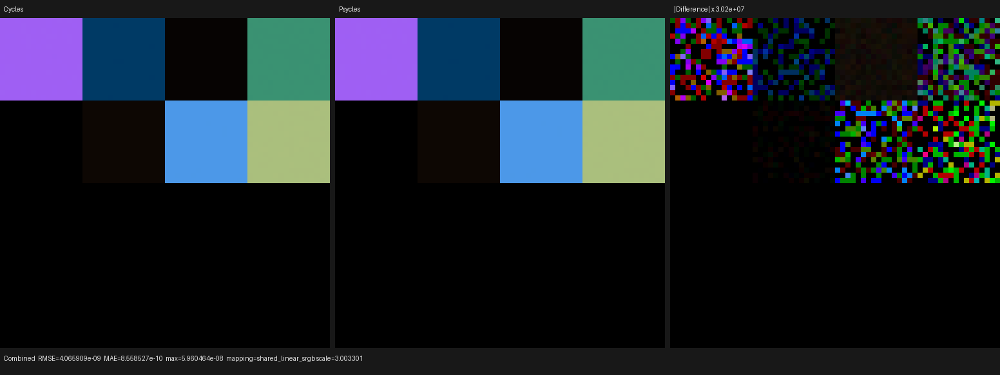
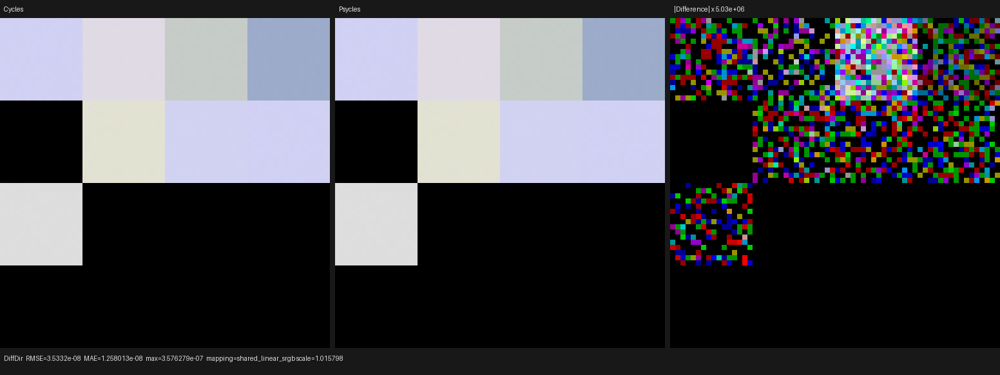
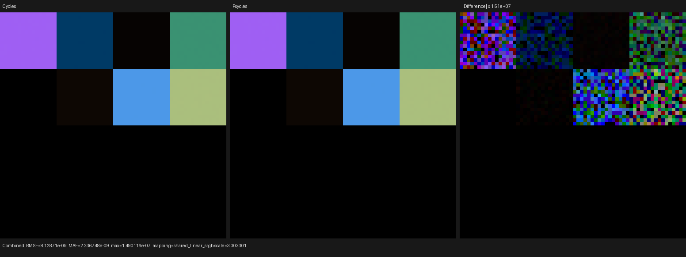
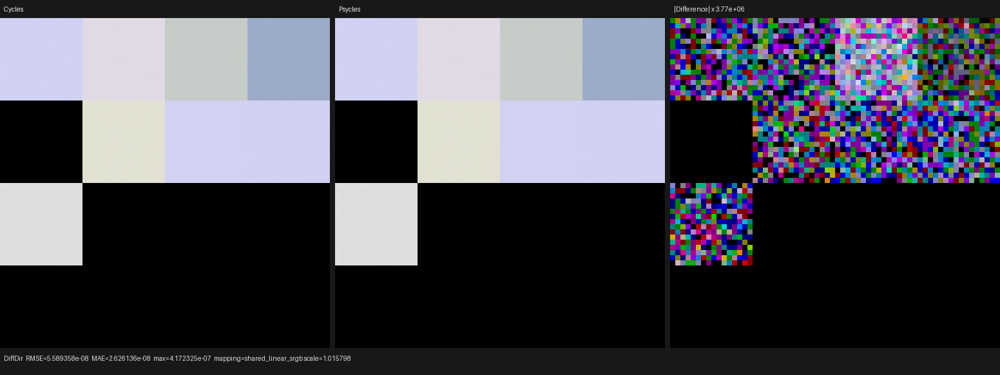
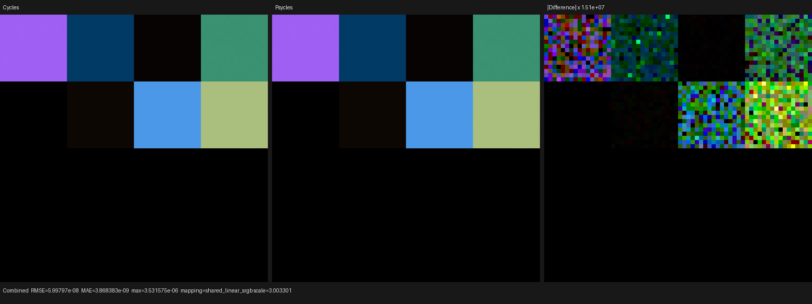
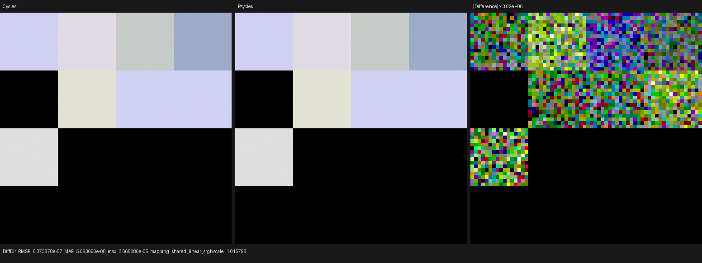
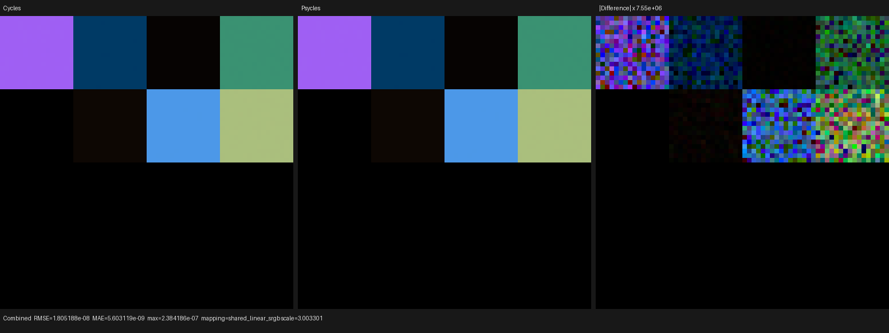
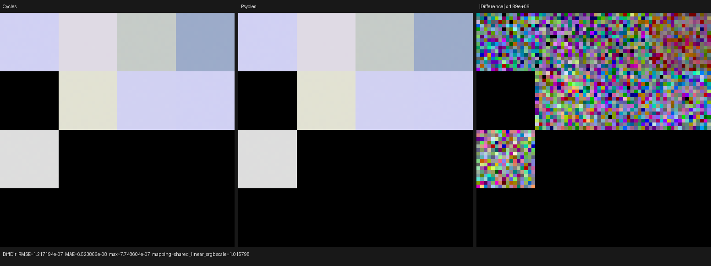

# Cycles Principled Sheen and generic bump shadowing

This checkpoint implements physical Principled Sheen on the Luisa rendering
path, including Cycles' LTC setup, evaluation, sampling, closure allocation,
ordered layer attenuation, AOV classification, and generic bump-shadowing
contract. Blender closures and material settings remain raw runtime inputs;
there is no Blender/Cycles pre-bake and no Psycles CPU reference renderer.

## Cycles oracle

The reference executable is Blender 5.3-alpha `b82c3f0da6c1`, built on
2026-07-31. The inspected source oracle is the local Blender/Cycles checkout
at `a3afe6326e5f`. A scoped Git diff confirms that `intern/cycles` is identical
between these two revisions, so the executable and inspected kernel contract
refer to the same Cycles implementation.

The relevant source contracts are the Principled layer order and Sheen setup,
the Sheen LTC closure, and the generic `bump_shadowing_term` in
`intern/cycles/kernel/closure/bsdf.h`. Psycles uses the versioned Cycles table
payload already imported for device-side BSDF evaluation; Cycles itself is the
only numerical and rendering oracle.

## Formal closure contract

Let `W` be the lower-layer RGB weight after Principled Alpha, `w` the authored
Sheen Weight, `C` the authored Sheen Tint, and `E`, `A`, and `B` the scalar
albedo and LTC transform values looked up from Cycles' 32x32 tables. Psycles
records the following device relation:

```text
S_pre   = max(W * max(C, 0) * max(w, 0), 0)
q_alloc = average(S_pre)
slot    = (w > 1e-5) && (q_alloc >= 1e-5)
valid   = slot && (abs(A) >= 1e-5) && (E >= 1e-5)
S_final = S_pre * E
S_slot  = select(0, select(S_pre, S_final, valid), slot)
q       = select(0, q_alloc * E, valid)
W_next  = select(W,
                 W * saturate(1 - max_component(safe_divide(S_final, W))),
                 valid)
```

Slot allocation and setup validity are intentionally separate states. Cycles
can retain an occupied closure slot after a failed Sheen setup while changing
its type to `CLOSURE_NONE`, retaining the pre-setup `S_slot`, and clearing its
sample weight and evaluated albedo. Psycles stores that orthogonal state
explicitly, preserving closure indices and random-lobe rescaling instead of
deleting the failed candidate.

The Sheen normal is the zero-only-normalized interpolation of the Principled
Normal and Coat Normal by clamped Coat Weight. Roughness is clamped to
`[1e-3, 1]`. The LTC basis fixes its tangent with the incoming direction when
possible and uses the same Cycles fallback basis at the degenerate boundary.
For local outgoing direction `(x, y, z)`, evaluation and density share:

```text
L2 = (A*x + B*z)^2 + (A*y)^2 + z^2
p  = max(z, 0) / pi * (A / L2)^2
f  = S * p
```

Sampling maps the two original random dimensions to Cycles' uniform disk,
forms `normalize((disk.x - disk.z*B, disk.y, disk.z*A))`, and transforms that
direction through the same incoming-oriented basis. No alternate sampler or
extra random dimension is introduced.

## Generic bump-shadowing invariant

The linked-normal discrepancy that exposed this work was not treated as a
Sheen special case. Every supported physical closure now passes through a
single Cycles bump-shadowing relation comparing its closure normal `N` with
the shader-wide smooth normal `Ns`.

For direction `I`, define:

```text
c_i = dot(Ns, I)
c_d = dot(Ns, N)
c_n = dot(N, I)
```

Exact-equal normals return one. Otherwise, evaluation rejects a direction
when `c_i*c_d*c_n < 0`; diffuse-class closures, including Sheen, apply the
same hemisphere rejection during sampling. Non-diffuse closures stop there.
For diffuse closures whose material enables bump-map correction, Cycles then
uses:

```text
cos_i  = abs(c_i)
cos_d  = abs(c_d)
tan2_d = 1 / cos_d^2 - 1
alpha2 = saturate(0.125 * tan2_d)
term   = G1_GGX(alpha2, cos_i)
```

The exact piecewise boundaries are preserved: `cos_i` or `cos_d` at least one
returns one, while `cos_i < 1e-6` returns zero. A nonzero correction scales
closure energy but never changes its PDF. At zero, a closure reached through
`bsdf_eval` contributes neither evaluation nor competing PDF. The closure
selected through `bsdf_sample` instead keeps its original sampling PDF while
its evaluation becomes zero, exactly as Cycles initializes the selected
technique before evaluating the other closures. Psycles represents these as
explicit regular, sampled-light, and sampled-BSDF evaluation modes with the
selected allocated closure index; it does not infer the mode from a material
or lobe type. Device regressions independently pin the hemisphere predicate,
the material-off branch, the unchanged-PDF property, selected-versus-
competing zero behavior, and the `1e-6` grazing boundary.

Blender's original `Material.use_bump_map_correction` is exported, imported,
packed into material flags, and reconstructed on each surface point. It is
not inferred from graph topology or numeric normal values. Specular normal
repair now obeys the same per-material flag instead of being unconditional.

## Regression matrix

The registered `principled_sheen_surface` probe is a 4x4 full-frame material
matrix rendered at 64x64 and 256 fixed samples. Its sixteen raw Principled
graphs cover:

- negative, zero, cutoff-adjacent, ordinary, and above-one Sheen weights;
- negative, zero, near-zero, ordinary, one, and above-one roughness;
- signed and HDR Sheen Tint inputs; and
- two independently linked normals that exercise generic bump shadowing and
  smooth-normal hemisphere rejection.

Only the four outer matrix edges receive a small geometry bleed. Internal
material boundaries remain exactly pixel-aligned; this removes raster filter
coverage from the shader differential without changing any closure input.

The reusable runner hard-gates mean luminance ratio to `[0.99999, 1.00001]`
and relative RMSE to `2e-6` for Combined/Diffuse Direct, `1e-7` for Diffuse
Color, and `1e-6` for Normal. Complete machine-readable reports are retained
under [reports](reports).

The final all-thread build and suite passed `123/123` tests in `67.09 s`:

```bash
cmake --build build -j32
ctest --test-dir build -j32 --output-on-failure
```

The focused closure regression also passed sequentially on fallback, HIP, and
Vulkan. Exporter/importer tests pin the raw bump-correction material flag, and
the source-size gate passes with the largest modified regression file at 1953
lines.

## Latest-Cycles EXR differential

| Actual / reference | Pass | Relative RMSE | Maximum error | Mean luminance ratio |
|---|---|---:|---:|---:|
| fallback / Cycles CPU | Combined | 5.582e-8 | 5.960e-8 | 1.000000071 |
| fallback / Cycles CPU | Diffuse Direct | 7.416e-8 | 3.576e-7 | 1.000000000 |
| HIP / Cycles CPU | Combined | 1.116e-7 | 1.490e-7 | 1.000000071 |
| HIP / Cycles CPU | Diffuse Direct | 1.173e-7 | 4.172e-7 | 1.000000000 |
| Vulkan / Cycles CPU | Combined | 8.235e-7 | 3.532e-6 | 0.999999929 |
| Vulkan / Cycles CPU | Diffuse Direct | 1.338e-6 | 3.666e-5 | 0.999999812 |
| HIP / Cycles HIP | Combined | 2.478e-7 | 2.384e-7 | 1.000000071 |
| HIP / Cycles HIP | Diffuse Direct | 2.555e-7 | 7.749e-7 | 1.000000094 |

Diffuse Color relative RMSE is `5.806e-10` on fallback, zero on HIP/Vulkan,
and `1.622e-8` against Cycles HIP. Normal is exact on fallback/HIP and differs
by only `3.332e-8` relative RMSE on Vulkan and against Cycles HIP. Environment
and every unsupported glossy/transmission pass are exactly zero on both
renderers.

## Probe timing and compile stages

These numbers diagnose this closure and compiler path; they are not a
complex-scene throughput benchmark.

| Renderer | Shader JIT | Render |
|---|---:|---:|
| Cycles CPU | n/a | 0.025-0.027 s |
| Cycles HIP, RX 9070 XT | n/a | 0.071 s |
| Psycles fallback | 1.045 s | 0.0772 s |
| Psycles HIP | 2.426 s | 0.0163 s |
| Psycles Vulkan | 2.788 s | 0.0250 s |

In the direct HIP-oracle run, a cached Psycles HIP JIT took `0.0402 s` and
rendering took `0.0145 s`, versus Cycles HIP's `0.071 s`: a renderer-reported
`4.89x` ratio for this tiny probe only. Lone Monk and the other 480p/1080p
scene gates remain authoritative for production speedup claims.

The uncached HIP path spent `0.909 s` in LLVM code generation and `1.131 s`
linking LLVM bitcode. Vulkan generated 302,102 SPIR-V words and optimized them
to 275,813; timestamps place about `2.07 s` of its `2.788 s` JIT before the
optimization-complete message. Thus the slow Vulkan stage here is shader
generation/SPIR-V optimization and compilation, not the 32-thread C++ build.

## Visual inspection

All retained Combined and Diffuse Direct triptychs were opened at original
resolution. Cycles and Psycles have identical matrix boundaries, black cells,
color ordering, linked-normal regions, and relative Sheen energy on fallback,
HIP, and Vulkan. The difference panes contain only spatially unstructured
floating-point tails after amplification by roughly `10^6-10^7`; there are no
closure silhouettes, material-boundary bands, grazing leaks, or systematic
brightness shifts.

















## Remaining Principled and scene work

- implement physical Coat scattering/sample/PDF/AOV in the same ordered
  host-stage component;
- complete transmission, subsurface, thin-film, and remaining Principled
  interactions without pre-baking closures;
- align remaining RNG, emitter/environment distributions, material/light
  estimators, and trace observability with current Cycles; and
- re-run Lone Monk, Blender 4.1 splash, Classroom, and other complex scenes at
  production resolution across Cycles CPU/HIP and Psycles fallback/HIP/Vulkan.

This checkpoint closes physical Principled Sheen and generic bump shadowing;
it does not claim complete Principled or full-scene Cycles parity.
