# Cycles physical Principled transmission and visible-normal Glass

This checkpoint completes the thick-surface Principled transmission relation
on the Luisa rendering path and corrects the shared Glass microfacet measure.
Psycles receives Blender's original linked closure graph and records Luisa
device expressions from host-stage components. It does not bake materials,
invoke Cycles while rendering, or introduce a Psycles CPU reference renderer.

## Cycles oracle

The sole rendering oracle is Blender 5.3-alpha `b82c3f0da6c1`. The inspected
source checkout is `/home/mike/Projects/blender-cycles` at `a3afe6326e5f`;
`intern/cycles` is unchanged between those revisions. The relevant contracts
are the ordered Principled setup in `intern/cycles/kernel/svm/closure.h`, the
generalized-Schlick Glass implementation in
`intern/cycles/kernel/closure/bsdf_microfacet.h`, and Cycles' Beckmann
visible-normal sample mapping.

## Raw Principled relation

For incoming lower-layer weight `W`, Transmission Weight `t`, Base Color `B`,
IOR `eta`, Specular Tint `S`, and the path's reflective/refractive caustics
predicates `R` and `T`, the host-stage `PrincipledBaseComponent` records:

```text
t0        = saturate(t)
requested = t0 > 1e-5
eta0      = max(eta, 1e-5)
P         = W * t0
F0        = F0_from_ior(eta0) * max(S, 0)
F90       = 1
Kr        = R ? 1 : 0
Kt        = T ? sqrt(saturate(B)) : 0
allocated = requested && (R || T) && average(max(P, 0)) >= 1e-5
W_next    = requested ? W * (1 - t0) : W
```

The result is one coupled generalized-Schlick Glass closure. Reflection and
refraction are not split into approximation closures: they share a
visible-normal distribution, Fresnel lobe roulette, evaluation measure, and
PDF. `GGX` keeps the single-scatter energy relation; Blender's `MULTI_GGX`
selection enables Cycles' Glass energy compensation tables. Metallic remains
an earlier Principled layer and therefore attenuates the transmission input in
the same ordered closure program.

Generalized Schlick does not replace dielectric Fresnel with a fifth-power
shortcut. Psycles evaluates the real dielectric curve and uses it as the
interpolation coordinate between authored `F0` and `F90`, matching Cycles.

## Formal Glass measure

Let `I` be the incoming direction, `O` the outgoing direction, `N` the shading
normal, and `eta` the closure IOR after Cycles' backface inversion. The
microfacet normal is defined by the event:

```text
reflection:    H = normalize(I + O)
transmission:  H = normalize(-(eta * O + I))
```

For inverse-eta transmission, this orientation can make both `N.H` and `H.I`
negative. Rejecting either sign is not an extra physical validity condition;
it deletes valid backface transport. The common visible-normal density is:

```text
J_reflect  = 1 / 4
J_transmit = eta^2 * |H.I * H.O| / |eta * O + I|^2
C          = D(H) / (N.I) * J_event

evaluation = lobe_color * C / (1 + Lambda(I) + Lambda(O))
pdf        = lobe_probability * C / (1 + Lambda(I))
```

These equations apply to both GGX and Beckmann; only `D` and `Lambda` differ.
The Beckmann distribution is even in `N.H`, as required by the eta-oriented
refractive normal. When `eta == 1`, every transmitted microfacet maps to the
single direction `-I`: it is a singular event, so finite-direction evaluation
and PDF are explicitly zero and the zero half-vector cannot create an
unbounded Jacobian.

The former Beckmann sampler drew its NDF while evaluation now used the VNDF
measure. The replacement implements Cycles' deterministic visible-normal
mapping, including its fast `erf`/inverse-`erf` approximations, normal-incidence
branch, and three-step bounded Newton/bisection solve. This is stronger than
merely choosing a statistically equivalent sampler: fixed random dimensions
now produce the same directions as current Cycles.

## Regression matrix

The new `principled_transmission_surface` probe transfers a 4x4 matrix of raw
Principled nodes. Every important socket is linked rather than serialized as
a pre-evaluated material value. Its cases cover:

- negative, zero, below-cutoff, exact-cutoff, ordinary, and above-one
  Transmission Weight;
- roughness from `.05` through `.60`, IOR one, `1.33`, `1.45`, `1.5`, `1.6`,
  `1.8`, and two;
- colored Base Color and Specular Tint, linked and default normals, backface
  eta inversion, `GGX`, and `MULTI_GGX`; and
- a metallic/transmission interaction after the ordered metallic layer.

The image gates require every nonzero retained-pass luminance ratio in
`[0.99999, 1.00001]`. Relative-RMSE limits are `5e-6` for Combined, `2e-6`
for Transmission Direct, `1e-6` for Glossy Color, and `1e-7` for Diffuse
Color, Transmission Color, and Normal.

The device regressions additionally pin the formal cases that an image may
miss: caustics allocation, strict closure cutoff/order, spectral singular
lobe roulette, backface eta, separate Glass AOVs, rough front/backface
evaluation and PDF, finite IOR-one behavior, the oblique Beckmann VNDF PDF,
and fixed Cycles Beckmann sample directions at oblique and normal incidence.

The older `glass_transport` probe is now a strict sampling regression. Its
previous NDF implementation had Combined relative RMSE `5.620e-3`; the new
VNDF implementation is below `9e-5` on every Luisa backend. A runner unit test
accepts the new metrics and deliberately rejects the retained old NDF metrics
with eight independent gate failures.

## Luisa fallback correction

The Beckmann root solve exposed a backend defect rather than a rendering
special case: fallback lowered integer equality but omitted scalar/vector
Boolean equality and inequality. Expressions such as
`(begin.y < 0) == (current.y < 0)` therefore reached fallback's generic
binary comparison with an unsupported Boolean operand.

Luisa commit `e3a6e8b3e` on the `next` branch adds `BOOL` to the formal
equality/inequality lowering and uses LLVM integer compare for both scalar and
vector Boolean values. Its fallback unit regression covers scalar and `bool2`
`==`/`!=`. The Psycles submodule now points at that pushed commit; there is no
software callback workaround in Psycles.

## Latest-Cycles EXR differential

All values compare the retained Psycles EXR against Cycles CPU. Full
machine-readable reports are under [reports](reports).

### Raw Principled transmission, 64x64 at 64 spp

| Backend | Pass | Relative RMSE | Maximum error | Mean luminance ratio |
|---|---|---:|---:|---:|
| fallback | Combined | 3.171e-7 | 2.969e-1 | 1.000000000 |
| fallback | Glossy Color | 1.270e-8 | 5.588e-9 | 1.000000000 |
| fallback | Transmission Color | 1.041e-8 | 2.980e-8 | 1.000000000 |
| fallback | Transmission Direct | 5.071e-10 | 4.883e-4 | 1.000000000 |
| HIP | Combined | 3.896e-7 | 2.969e-1 | 1.000000000 |
| HIP | Glossy Color | 1.270e-8 | 5.588e-9 | 1.000000000 |
| HIP | Transmission Color | 1.041e-8 | 2.980e-8 | 1.000000000 |
| HIP | Transmission Direct | 5.071e-10 | 4.883e-4 | 1.000000000 |
| Vulkan | Combined | 3.039e-6 | 5.613e-1 | 0.999996480 |
| Vulkan | Glossy Color | 2.336e-7 | 1.043e-7 | 0.999999851 |
| Vulkan | Transmission Color | 1.041e-8 | 2.980e-8 | 1.000000000 |
| Vulkan | Transmission Direct | 1.080e-6 | 8.179e-1 | 0.999998567 |

Diffuse Color is bit-exact on all three backends. Normal is bit-exact on
fallback and below `3.34e-8` relative RMSE on HIP/Vulkan. Every pass has zero
invalid pixels. The large-looking maximum absolute Combined/Transmission
values occur in extremely bright microfacet cells; their relative errors and
mean ratios remain within the strict gates.

### Raw Glass/Beckmann transport, 64x64 at 256 spp

| Backend | Pass | Relative RMSE | Maximum error | Mean luminance ratio |
|---|---|---:|---:|---:|
| fallback | Combined | 8.949e-5 | 5.941e-3 | 1.000001075 |
| fallback | Glossy Direct | 5.944e-5 | 3.284e-3 | 1.000001068 |
| fallback | Transmission Direct | 3.594e-5 | 2.442e-3 | 1.000000452 |
| HIP | Combined | 8.595e-5 | 5.941e-3 | 1.000000586 |
| HIP | Glossy Direct | 3.481e-7 | 4.947e-6 | 1.000000142 |
| HIP | Transmission Direct | 8.231e-5 | 6.738e-3 | 1.000000993 |
| Vulkan | Combined | 8.290e-5 | 5.941e-3 | 1.000000880 |
| Vulkan | Glossy Direct | 3.503e-7 | 4.888e-6 | 1.000000142 |
| Vulkan | Transmission Direct | 7.416e-5 | 6.738e-3 | 1.000001355 |

Glass color/normal passes are exact on HIP and Vulkan. Fallback's retained
color/normal relative RMSE is at most `6.104e-5`; every pass has zero invalid
pixels. The small residual is path-sampling convergence against Cycles, not a
missing cell or a different sampling distribution.

Transmission Indirect in the direct-light matrix contains only tiny
near-zero stochastic residue and is intentionally excluded from ratio gates;
Combined, color, direct-transmission, normal, and the dedicated sampled Glass
probe cover the implemented relation without dividing noise by zero.

## Visual inspection

Every triptych below was opened at original resolution. Cycles is on the left,
Psycles on the right, and the center is an automatically amplified difference.
All three backends reproduce the same 16 cell boundaries, cutoff transition,
front/backface transmission, color/tint ordering, roughness response, and
normal orientation. The previously missing rough backface cell is present.
The difference panes show only amplified floating-point or sampling residual;
no structural material or geometry mismatch remains in either probe.

### Principled transmission

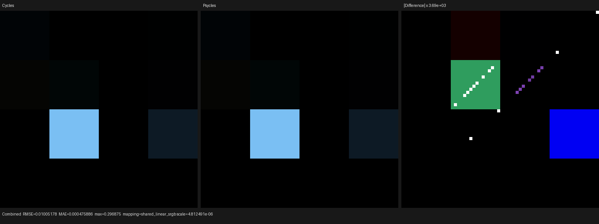

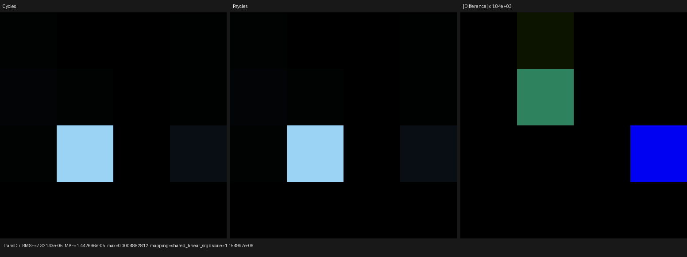


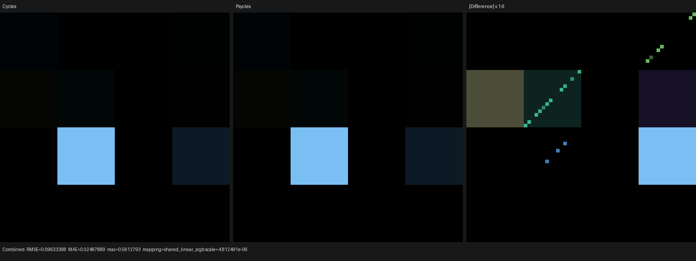

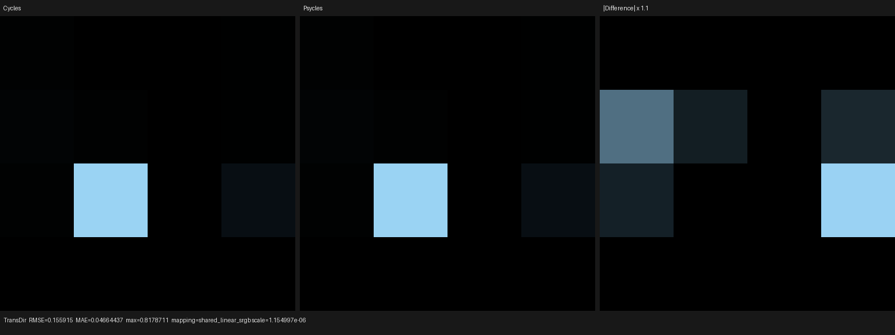

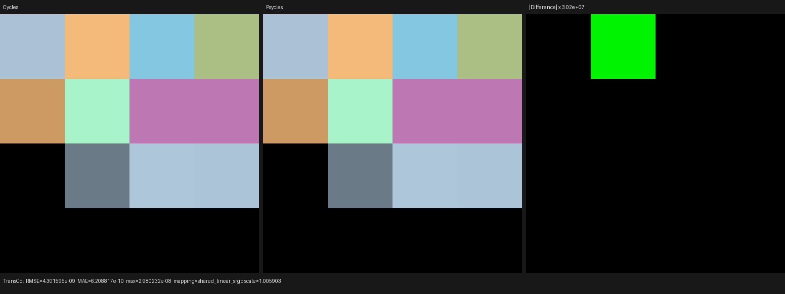

### Glass visible-normal sampling

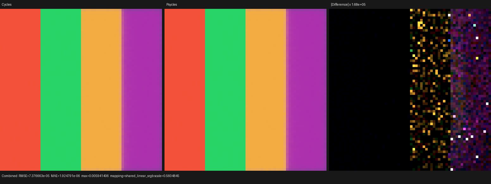

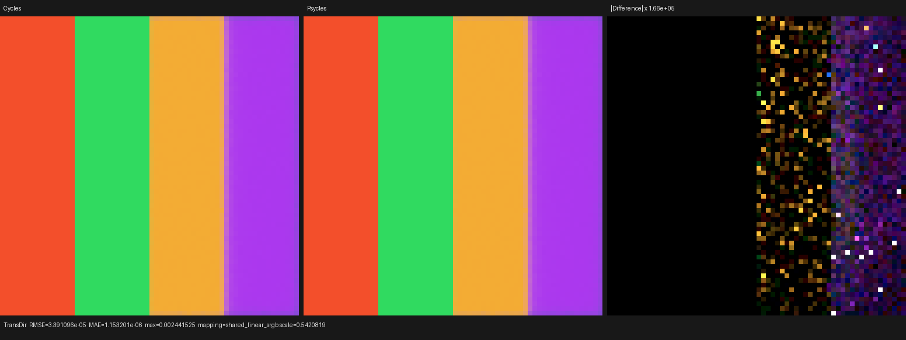

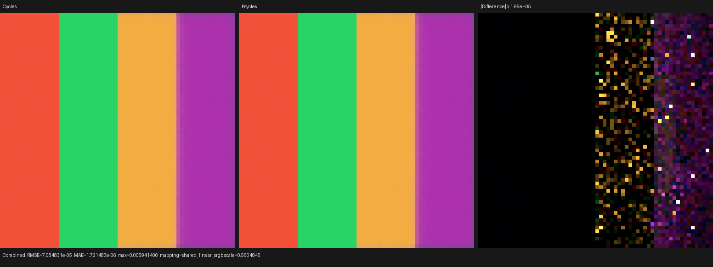

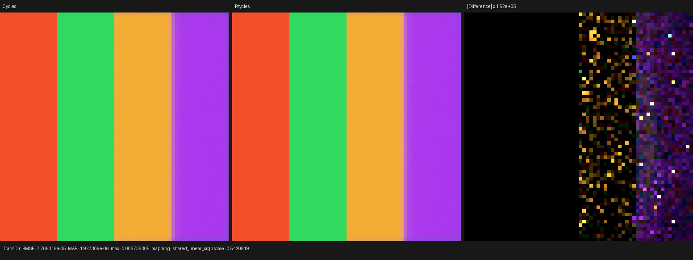

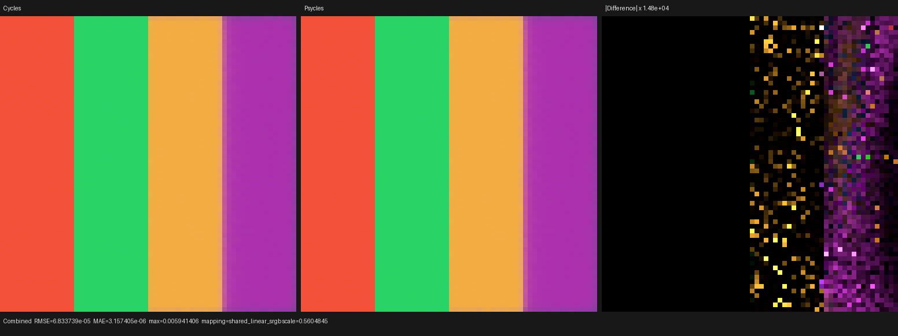

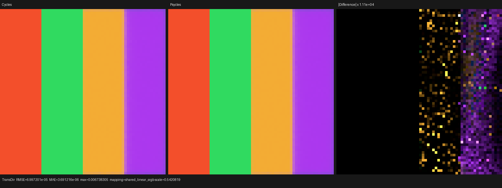

The source EXRs are retained under [exr](exr) for reinspection and future
numeric replay.

## Probe timing and compile stages

These tiny matrices diagnose shader compilation and dispatch only; they are
not production-scene speedup claims.

| Probe/backend | Cold shader JIT | Render |
|---|---:|---:|
| Principled / Cycles CPU | n/a | about 0.020-0.021 s |
| Principled / fallback | 5.467 s | 0.0547 s |
| Principled / HIP | 25.196 s | 0.0145 s |
| Principled / Vulkan | 7.623 s | 0.0245 s |
| Glass / Cycles CPU | n/a | about 0.036-0.038 s |
| Glass / fallback | 1.745 s | 0.0969 s |
| Glass / Vulkan | 3.329 s | 0.0545 s |

The cold Principled HIP compile contains `2.745 s` LLVM code generation and
`21.418 s` device-bitcode linking; linking is the dominant stage. Cold Vulkan
optimized 504,793 SPIR-V words to 473,351, so its delay is shader/SPIR-V and
driver compilation rather than the all-thread C++ build.

## Verification and remaining work

The focused fallback/HIP/Vulkan sample-mapping and transmission tests, source
size policy, probe-runner regression, and exporter settings test passed `9/9`.
The all-thread build and complete suite also passed `129/129`:

```bash
cmake --build build -j32
ctest --test-dir build -j32 --output-on-failure
```

This checkpoint closes thick Principled transmission and shared GGX/Beckmann
Glass VNDF transport. Thin-wall behavior, subsurface, thin film, anisotropy
interactions, and broader complex-scene convergence remain open. Lone Monk,
Blender 4.1 Splash, and Classroom volume-light validation continue as scene
work; this probe checkpoint does not claim complete Principled or scene parity.
