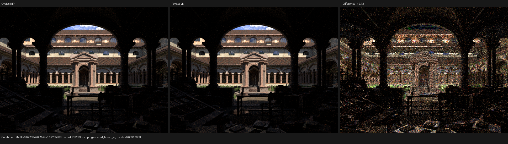
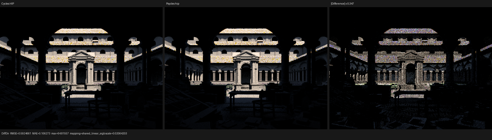
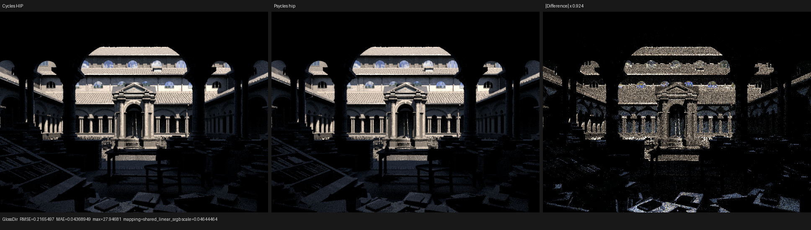
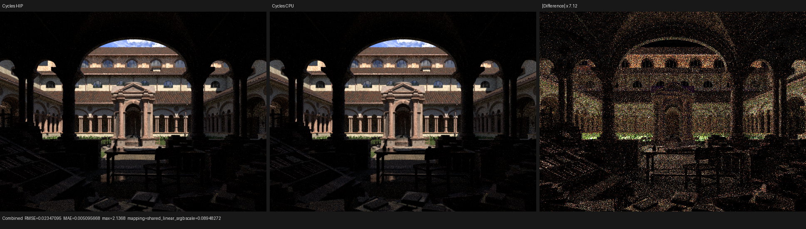

# Cycles sampled-light closure filtering and Lone Monk validation

This checkpoint validates Psycles `72bcb5b` and the semantics-preserving
host-stage cleanup in `4adcc75`. It closes the Cycles contract for filtering
surface closure contributions by a sampled emitter's shader flags. It does
not claim complete Cycles or Lone Monk parity, and it introduces no Psycles
CPU reference renderer.

## Cycles oracle and formal contract

The only algorithmic oracle is the current local Cycles checkout
`/home/mike/Projects/blender-cycles` at `a3afe632`, specifically
`intern/cycles/kernel/integrator/surface_shader.h:246-415`. The Blender
5.3-alpha reference executable was built at `b82c3f0d`; a source-tree diff
confirmed that its `intern/cycles` subtree is identical to `a3afe632`.

For otherwise eligible closures `i`, let `q_i` be the Cycles closure sample
weight, `p_i(w)` its directional PDF, and `f_i(w)` its weighted BSDF
contribution. Cycles evaluates a sampled light with two deliberately different
projections:

```text
competing_pdf(w) = sum_i(q_i * p_i(w)) / sum_i(q_i)
light_eval(w)    = sum_i(include(light_flags, category_i) * f_i(w))
```

The emitter visibility flags therefore project the contribution vector but
never remove a closure from either PDF sum. `SHADER_USE_MIS` is a later
operation: when it is absent, Cycles preserves the evaluated contribution and
sets only the returned competing-technique PDF to zero.

The category predicate is also structural rather than a list of material
cases:

- diffuse and translucent closures are removed by `EXCLUDE_DIFFUSE`;
- pure glossy closures are removed by `EXCLUDE_GLOSSY`;
- pure transmission closures are removed by `EXCLUDE_TRANSMIT`; and
- glass is both glossy and transmissive, so it is removed only when both
  `EXCLUDE_GLOSSY` and `EXCLUDE_TRANSMIT` are set.

Psycles represents this as a separate `SurfaceLightQuery` and the virtual
host-stage `Surface::evaluate_light` interface. `GraphSurface` records the
same material closure AST as ordinary surface evaluation, then applies one
linear category projection while the Luisa kernel is being constructed.
Analytic lamps, emissive triangles, and the environment carry their original
raw Cycles shader flags and all invoke this interface. No lobe mask is
substituted for sampled-light visibility, and no closure is baked by Blender
or Cycles.

The final optimization uses linearity,
`P(sum_i f_i) = sum_i P(f_i)`, to distribute the three category projections
through closure accumulation. Category inclusion booleans are computed once
per evaluation. The general surface evaluator remains available through the
public surface abstraction, while an unreachable production-kernel callable
was removed rather than recorded into every path kernel.

## Regression matrix

`test_luisa_cycles_closure` records the real Luisa DSL evaluator on fallback,
HIP, and Vulkan. Its positive fixtures lock all of the following:

- mixed diffuse/glossy contribution filtering with an invariant PDF;
- diffuse-only, glossy-only, and combined exclusions;
- glass surviving either single exclusion and disappearing under both;
- translucent following Cycles' diffuse category, not transmission; and
- missing `USE_MIS` zeroing only the returned PDF.

The complete 32-way suite passed 123/123 tests after the implementation and
again after the linear-projection optimization. A strict OpenImageIO diff of
the pre/post-refactor Vulkan multilayer EXRs also passed with zero tolerance.
These device fixtures are the positive exclude-flag acceptance tests. Lone
Monk has no analytic lamps and its exported world/instance light visibility
is fully enabled, so the complex scene is intentionally an integration and
no-regression check rather than a substitute for the focused fixtures.

## Lone Monk five-way render

The canonical runner used the original
`lone-monk_cycles_and_exposure-node_demo.blend`, the Cycles-identity bundle
whose aggregate SHA-256 is
`4250d4205d8d01cefd98c15e81021d6dead540b2923797378bf7b32e96e8b8f7`,
640x480 output, 64 fixed samples, and at most four samples per Psycles
dispatch. Cycles CPU and HIP goldens and Psycles fallback, HIP, and Vulkan
were executed sequentially. Adaptive sampling and denoising were excluded
from the authoritative fixed-sample comparison.

Renderer-reported render intervals are separated from scene compilation and
cold shader JIT:

| Renderer | Render | Relative reference |
|---|---:|---:|
| Cycles HIP, RX 9070 XT | 1.8463 s | 1.000x |
| Cycles CPU, Ryzen 9 9950X3D | 5.0970 s | 2.761x Cycles HIP |
| Psycles HIP | 2.4334 s | 1.318x Cycles HIP |
| Psycles Vulkan | 4.2744 s | 2.315x Cycles HIP |
| Psycles fallback | 5.6700 s | 1.112x Cycles CPU |

The initial runs also measured scene compilation / cold shader JIT as
1.311/87.137 s for fallback, 3.528/366.074 s for HIP, and 0.987/119.243 s
for Vulkan. A warm direct rerun measured 2.388 s rendering and 0.361 s cached
JIT on HIP, and 4.257 s rendering and 1.573 s cached JIT on Vulkan.

HIP's cold path kernel spent 24.218 s generating 4,685,828 bytes of LLVM
bitcode and 337.273 s in `hiprtcLinkComplete`. Vulkan generated 2,008,167
SPIR-V words and optimized them to 1,772,514. The final distributed
projection generated 2,005,177 words and optimized to 1,772,038, so the
projection cleanup did not inflate the shader.

The retained machine-readable runner output is [benchmark.json](benchmark.json).

## Exact performance A/B and Vulkan compile stages

An independent detached worktree at `5f2ae86`, immediately before the
sampled-light change, was built with 32 jobs and run against the exact same
bundle and settings. Its path kernel generated 2,003,752 SPIR-V words and
optimized to 1,770,881. Cold JIT was 119.875 s and rendering was 4.275 s;
the warm rerun was 1.488 s cached JIT and 4.241 s rendering. The sampled-light
checkpoint's warm render was 4.257 s, a 0.38% difference within run-to-run
variation. Strict `idiff -fail 0 -warn 0 -failpercent 0` between the two
multilayer EXRs returned `PASS`.

This A/B rules out the sampled-light projection as the earlier apparent
2.7-to-4.2-second Vulkan regression. The 4.2-second behavior is already
present before that change under the current Cycles-identity bundle. It must
be attributed separately, with the geometry-identity transition and exact
bundle change kept in scope.

The cold Vulkan trace also localizes compilation. Roughly 61 seconds elapse
while the large path kernel is recorded/generated and optimized into the
1.77-million-word SPIR-V module. Roughly another 57 seconds elapse after the
binary is reported successful and before JIT completion, in Vulkan
shader-module/pipeline creation and cache handling. The slow stage is not the
32-way C++ project build. The exact A/B values are retained in
[performance-ab.json](performance-ab.json).

## Numerical and visual comparison

Combined-pass values below use Cycles HIP as the reference:

| Actual | RMSE | Relative RMSE | MAE | Mean luminance ratio |
|---|---:|---:|---:|---:|
| Cycles CPU | 0.023471 | 0.015055 | 0.005096 | 0.999966 |
| Psycles fallback | 0.072130 | 0.046265 | 0.022413 | 1.004629 |
| Psycles HIP | 0.072908 | 0.046764 | 0.022566 | 1.005186 |
| Psycles Vulkan | 0.072584 | 0.046557 | 0.022560 | 1.004726 |

The current HIP relative RMSE is 45.0% lower than the `0.084969` physical-
closure checkpoint, primarily after exact Cycles geometry identity and the
subsequent trace-boundary corrections. Complete per-pass metrics are in
[reports](reports).

I opened every retained Combined triptych at its original 1936x546
resolution, plus the HIP Diffuse Direct and Glossy Direct triptychs. At normal
display scale all three Psycles backends agree on composition, exposure,
material families, sky opening, and the broad grass/vegetation placement.
The amplified difference remains structured around roof tiles and eaves,
facade/arch silhouettes, vegetation and the bright grass strip, and sparse
high-energy highlights. Diffuse Direct retains colored sample-structure
differences across the roof and lit facade; Glossy Direct retains roof,
window, arch, and foreground highlight residuals. These differences remain
active parity work and are not waived as visually acceptable.








The Cycles CPU/HIP stochastic floor is retained separately:



## Subsequent proposal/evaluation checkpoint

The emissive-triangle and environment proposal/evaluation split is closed by
[`light-proposal-emission-phase`](../light-proposal-emission-phase/README.md).
The radiometry-free proposal types cannot receive path state or carry
radiance, while separate host-stage evaluators retain the original raw
closure graphs.

## Remaining gates

- Attribute and recover the Vulkan throughput change across the exact
  geometry-identity/bundle boundary.
- Align emitter/environment importance distributions, exact random dimensions
  and sample mapping, and remaining material/light estimators.
- Implement the light tree, MNEE, path guiding, light linking/groups, and the
  other explicit production compatibility gates.

This checkpoint closes sampled-light closure filtering and its PDF invariant;
it does not close full-scene or all-Cycles feature parity.
