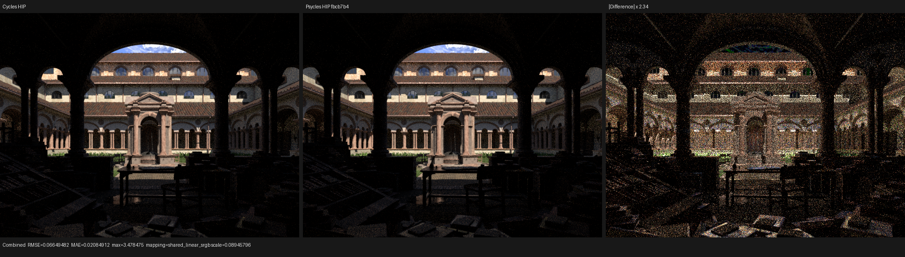
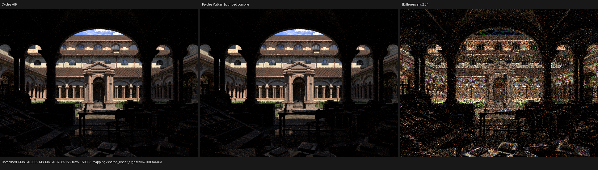
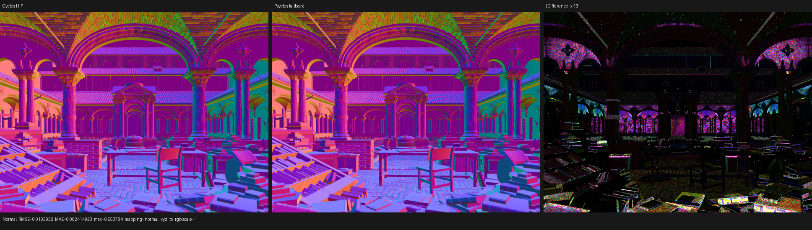
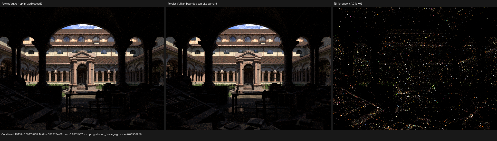

# Shared surface-closure evaluator validation

This validation line moves the surface consumers behind a single post-material
boundary. Runtime material dispatch still evaluates the original Blender
closure graph as Luisa device expressions. It emits the resulting physical
closures in Cycles allocation order, after which shared code evaluates and
samples the retained closure mixture. No closure is evaluated by a CPU
reference model, baked by Blender/Cycles, or replaced with precomputed material
data.

The initial boundary landed in four independently tested commits:

- `514bb67` adds the raw closure-collection boundary;
- `6d1ca46` adds fixed-capacity device-local storage matching Cycles'
  `ShaderData::closure[MAX_CLOSURE]` model;
- `3ef7483` adds the shared consumer; and
- `cceead9` wires runtime flags, closure trace, and AOV into production.

Commit `3020c88` subsequently makes each production consumer's retained field
projection explicit. Commit `0d89e8b` moves BSDF evaluation behind the shared
boundary. Commit `d2b7328` completes the sampling migration and packs each
lossless record into four matrix blocks to keep the generated control flow
bounded. Commit `f075100`, backed by LuisaCompute `next@6a7aabedc`, adds the
Vulkan cold-compilation safety policy described below. Commit `0664943` defines
the lossless four-matrix closure-callable ABI, and commit `fbcb7b4` moves
sampled-light BSDF evaluation to a branch-local visitor over raw closure
expressions.

## Formal contract

The boundary is defined by invariants rather than material-specific cases:

1. Graph evaluation and closure setup remain inside the Luisa shader AST.
2. Physical records are visited in exactly the same order as Cycles allocation:
   aggregate transparency first, followed by the ordered Principled layers and
   ordinary graph closures.
3. A non-scattering record allocates no slot. A scattering record below Cycles'
   closure-weight cutoff allocates no slot.
4. An allocated record whose setup later fails still consumes its slot, has
   closure type `NONE`, and contributes no runtime flags.
5. Capacity truncation retains a prefix of the Cycles allocation sequence. The
   scene-wide capacity is computed from every reachable graph and capped at
   Cycles `MAX_CLOSURE = 64`.
6. Runtime indexing is device-side; no runtime material tag or closure is baked
   into host data.
7. Storage profiles are projections of the canonical record. `runtime_flags`
   retains identity and roughness; `closure_trace` retains the five field groups
   it observes; `aov` retains the six groups it observes; `complete` round-trips
   all 26 fields.
8. Complete records are packed and unpacked losslessly. Closure kind, lobe, and
   flags use a bitcast rather than a numeric conversion; the storage layout does
   not change the closure algebra or material data.
9. Sampling first constructs the Cycles-aligned categorical measure. If
   eligible closure weights are `s_i`, `W = sum(s_i)`, and `u` is the lobe
   dimension, the selected closure is the unique interval containing `u W` and
   its conditional dimension is `(u W - sum_{j<i}(s_j)) / s_i`. The resulting
   joint density is therefore `p(i, w_i) = s_i / W * p_i(w_i)`.
10. Only the selected conditional BSDF sampler executes after categorical
    inversion. The resulting direction is then evaluated against the complete
    retained mixture for Cycles' multi-closure MIS. Delta closures contribute
    their singular mass separately; invalid selections remain observationally
    zero.
11. Per-closure evaluation is a pure contribution function. The complete
    result is its ordered fold in Cycles allocation order, followed by exactly
    one mixture-PDF normalization. The four-matrix callable ABI round-trips all
    26 closure fields without a device pointer, runtime closure index, or
    hidden mutable state.

The OOP boundary is host/JIT-stage metaprogramming: virtual material components
record the graph-dependent AST once. Branch-local operation objects then emit
nested callable invocations while recording the shader AST; no C++ virtual
dispatch remains in generated device code.

## Regression coverage

`test_luisa_surface_closure_collection` checks fallback, HIP, and Vulkan. Its
fixture contains a seven-lobe layered Principled material and a runtime-selected
Beckmann glass material. For every requested slot it compares the projected
shared path with the former Cycles-aligned implementation, including:

- physical closure kind and lobe order;
- capacity-prefix truncation and cutoff filtering;
- setup-invalid slot retention;
- back-facing and filter-glossy runtime flags;
- closure type, sample weight, weight, and normal;
- every AOV field;
- every shared BSDF-evaluation field; and
- every `SurfaceSampleTrace` field for two runtime-selected materials across
  eight lobe masks, caustic policies, filter-glossy states, and random samples.

The focused matrix passes 3/3 and the complete project suite passes 132/132 with
32-way CTest scheduling. Sampling comparison uses `1e-4` only for backend
operation-order rounding; it does not relax closure identity, event, validity,
or selection-index checks.

## Branch-local light-evaluation checkpoint at `fbcb7b4`

Production `evaluate_light` no longer constructs a runtime-indexed private
closure array. Each runtime material branch retains its original Luisa
expressions, packs one raw closure into the lossless callable ABI, evaluates a
pure per-closure contribution, and folds contributions in allocation order.
The same algebra still drives the legacy storage path used by the exact
regression, so the two implementations cannot silently acquire separate BSDF
formulae. Runtime flags, closure trace, AOV, and sampled-light evaluation now
all use branch-local visitors. `sample` and `sample_trace` still use the
complete `Local` storage path and are the next structural migration target.

The focused fallback/HIP/Vulkan matrix passes 3/3. The full project suite
passes 132/132 in 76.65 s with 32-way CTest scheduling. A cold HIP production
smoke on the original 37-material Lone Monk export recorded 3.580 s scene
construction, 53.950 s shader JIT, 21.319 s in HIP LLVM, a 4,884,344-byte linked
code object, and 3,974,916 KiB peak RSS. The 640x480, 1-spp render took 0.107 s;
it is only a structural smoke test and is not used as an image-quality result.

The quality run uses 640x480, 64 fixed spp, and eight samples per dispatch. Its
three warm HIP render times are 3.13597, 3.14253, and 3.14810 s (3.14253 s
median). This is 2.86% below the preceding checkpoint's 3.235 s single run and
1.66x the current Cycles HIP golden's 1.894 s. Because the old value is a single
sample, the speed change is directional rather than a claimed statistically
controlled improvement. Cold JIT increased from 41.780 s to 53.950 s, so the
remaining sampling migration must be measured for both compilation and runtime
rather than judged from kernel size alone.

Direct comparison with the same Cycles HIP multilayer EXR gives Combined RMSE
0.0664948, relative RMSE 0.0426508, mean-luminance ratio 1.000329, and Normal
RMSE 0.0103936. These match the previous checkpoint at its recorded precision.
Both triptychs were opened at their original resolution. Camera and
architecture align; foreground grass and vegetation remain present in the same
locations; broad material energy and normal orientation are unchanged. The
Combined residual remains finite-sample noise and sparse highlights, while the
Normal residual remains concentrated on thin vegetation and geometric edges.

The machine-readable comparison is
[`reports/branch-local-evaluation-hip-vs-cycles-hip.json`](reports/branch-local-evaluation-hip-vs-cycles-hip.json).

## Lone Monk five-way result at `cceead9`

The production run uses Blender 5.3-alpha `b82c3f0da6c1`, the same 37 original
material graphs, 640x480, 64 spp, and eight samples per Psycles dispatch. Cycles
adaptive sampling and denoising are disabled by the golden renderer.

| Renderer | Scene compile | Observed shader JIT | Render only | Relative to Cycles HIP |
| --- | ---: | ---: | ---: | ---: |
| Cycles CPU | included | included | 5.145 s | 2.74x slower |
| Cycles HIP | included | included | 1.881 s | 1.00x |
| Psycles fallback | 1.535 s | 83.115 s cold | 22.162 s | 11.78x slower |
| Psycles HIP | 3.717 s | 69.002 s cold | 3.537 s | 1.88x slower |
| Psycles Vulkan | 1.212 s | 355.832 s cold | 8.816 s | 4.69x slower |

Render throughput is effectively unchanged on HIP. Fallback moved by about two
percent and Vulkan by about six percent in this single run; those two samples
follow long native compilation and are not sufficient to attribute a runtime
regression.

HIP LLVM code generation took 24.454 s and emitted 3,517,376 bytes before the
downstream link. The link produced a 5,534,200-byte code object in 34.811 s.
Vulkan optimized 3,682,846 words to 3,236,597 words in about 143.3 s; the rest
of its cold JIT was again dominated by driver pipeline creation. Peak observed
RSS during that stage was about 29 GB. These measurements reinforce that native
Vulkan compilation remains a separate scalability target.

### Fallback cache-state correction

The earlier callable-boundary report labeled fallback's 0.677 s result as cold.
Its log has no compilation diagnostic and the object was already present in the
cache; it was a cache hit. Fresh path-kernel hashes at `cceead9` and `3020c88`
took 83.115 s and 84.803 s respectively and both reported 537,135 fallback LLVM
instructions. The two storage forms produced byte-identical native objects:

| Storage form | Object bytes | SHA-256 |
| --- | ---: | --- |
| Complete canonical record | 11,051,760 | `70276d70a87b06c01be0ebf13608bd856785d2cc26f12a2582b81a5301e722da` |
| Consumer field projection | 11,051,760 | `70276d70a87b06c01be0ebf13608bd856785d2cc26f12a2582b81a5301e722da` |

This proves the backend already eliminates unused retained fields. The profile
is therefore a semantic/API constraint, not a claimed native-code speedup.

## Numerical and visual inspection

All values below compare the linear multilayer EXR with Cycles HIP.

| Psycles backend | Combined RMSE | Relative RMSE | Mean luminance ratio | Normal RMSE |
| --- | ---: | ---: | ---: | ---: |
| fallback | 0.0657809 | 0.0421928 | 0.999764 | 0.0103932 |
| HIP | 0.0664981 | 0.0426529 | 1.000338 | 0.0103936 |
| Vulkan | 0.0661997 | 0.0424615 | 0.999856 | 0.0103745 |

These are unchanged at the precision relevant to the preceding checkpoint.
Direct old/new EXR comparison gives RMS about `5.9e-7` on fallback/Vulkan; HIP
is within the already recorded sparse HIPRT nondeterminism (`0.00133` RMS).

The six triptychs were opened at their original resolution. Camera, facade,
foreground geometry, vegetation/grass placement, broad normal orientation, and
energy remain aligned. The visible Combined residual is still predominantly
high-frequency sampling noise, while the Normal residual remains concentrated
on thin vegetation, edges, and dark silhouettes. No new missing grass band,
material replacement, normal rotation, or closure-order artifact appears.

### Combined

### Normal

The machine-readable matrix is in [`benchmark.json`](benchmark.json), comparison
reports are in [`reports/`](reports/), and compiler/render logs are in
[`logs/`](logs/).

## Shared evaluation and sampling result at `d2b7328`

The current production run uses the same original 37 Blender material graphs,
the same exported geometry, 640x480, 64 fixed spp, and eight samples per Psycles
dispatch. Cycles is Blender 5.3-alpha `b82c3f0da6c1`; its current CPU and HIP
goldens took 5.233 s and 1.894 s respectively. The table separates scene
construction, native shader JIT, and render-only time.

| Renderer | Scene compile | Cold shader JIT | 64 spp render | Relative to Cycles HIP |
| --- | ---: | ---: | ---: | ---: |
| Cycles CPU | included | included | 5.233 s | 2.76x slower |
| Cycles HIP | included | included | 1.894 s | 1.00x |
| Psycles fallback | 1.321 s | 154.376 s | 8.022 s | 4.24x slower |
| Psycles HIP | 3.515 s | 41.780 s | 3.235 s | 1.71x slower |
| Psycles Vulkan, bounded compile | 1.297 s | 111.529 s | 96.015 s | 50.69x slower |

The Vulkan cold JIT and 64-spp render are separate runs: the cold 1-spp process
measures pipeline construction, while the warm 64-spp process measures the
bounded pipeline's throughput. A warm cache reduces Vulkan pipeline creation
to 7.133 ms and total JIT setup to 2.352 s, but it does not remove the runtime
cost of disabling the driver's optimizing pipeline.

The refactor improves the two production paths that can optimize this kernel.
HIP cold JIT falls from 69.002 s to 41.780 s (39.5%) and render time falls from
3.537 s to 3.235 s (9.3%). The HIP LLVM stage takes 17.438 s and emits 3,692,460
bytes. Fallback no longer emits the warning that its largest function exceeds
Luisa's 250,000-instruction scalability threshold. It therefore runs the full
O3 pipeline: cold JIT grows from 83.115 s to 154.376 s, while render time falls
from 22.162 s to 8.022 s, a 2.76x throughput improvement. This is a compile-time
versus runtime tradeoff, not a cache hit mislabeled as a cold result.

The complete measurements and output hashes are in
[`shared-sampling-benchmark.json`](shared-sampling-benchmark.json).

## Vulkan compiler diagnosis and bounded policy

The current monolithic path shader produces 2,766,936 SPIR-V words before the
SPIR-V optimizer and 2,377,955 after it. The optimized module contains 479,372
instructions, 7,522 labels, 8,551 phi nodes, 82 loops, 23,170 selects, 34,648
loads, and 3,598 stores. Packing complete closure records into matrix blocks
reduced stores from 6,878 to 3,598 without changing the semantic regression.

RADV's default fully optimized pipeline still exceeded 63 GiB and was stopped.
Disabling individual ACO optimizer, value-numbering, and scheduling stages did
not bound the compile: the tested processes remained around 38--44 GiB after
five to six minutes. This rules out a single optional ACO pass as the root
cause. The pathological interaction is the huge runtime-indexed private
closure array flowing through RADV NIR and mandatory ACO liveness, spilling,
and register allocation.

LuisaCompute `next@6a7aabedc` therefore exposes a per-shader
`enable_driver_optimization` option. Vulkan maps `false` to
`VK_PIPELINE_CREATE_DISABLE_OPTIMIZATION_BIT` and includes the pipeline flags in
the PSO-cache identity. Its regression proves that optimized and bounded PSOs
cannot alias while identical SPIR-V is reused. Psycles disables driver
optimization only for the monolithic Vulkan path kernel; every other scene
kernel and the HIP/fallback backends remain optimized. Setting
`PSYCLES_VULKAN_ENABLE_DRIVER_OPTIMIZATION=1` explicitly restores the full
driver path.

The bounded cold pipeline completes in 109.200 s with 18,282,192 KiB peak RSS,
instead of growing without a practical bound. It is deliberately a safety net,
not the performance solution: 64-spp rendering is 10.89x slower than the
historical fully optimized Vulkan checkpoint. The next structural target is to
remove the large dynamic private closure storage from the monolithic shader so
full driver optimization can be restored without an ad hoc material or scene
exception. Detailed stage observations are in
[`vulkan-driver-compile.json`](vulkan-driver-compile.json).

## Current numerical and visual inspection

All current comparisons use the linear multilayer EXR and the same Cycles HIP
golden.

| Psycles backend | Combined RMSE | Relative RMSE | Mean luminance ratio | Normal RMSE |
| --- | ---: | ---: | ---: | ---: |
| fallback | 0.0657640 | 0.0421820 | 0.999760 | 0.0103932 |
| HIP | 0.0664949 | 0.0426509 | 1.000327 | 0.0103942 |
| Vulkan, bounded compile | 0.0662146 | 0.0424710 | 0.999870 | 0.0103745 |

Diffuse Color RMSE remains about `0.006726`, Glossy Color about `0.001278`, and
Transmission Color is exactly zero on both sides. Against the previous fully
optimized Vulkan checkpoint, the current bounded result has Combined RMSE
`0.00174855`, but its 95th-percentile pixel RMSE is only `1.25e-5`; Normal RMSE
is `1.40e-7`, and Diffuse/Glossy Color RMSE is below `1.81e-8`. The sparse
Combined outliers are path-sampling differences between code checkpoints, not
a geometry, normal, or retained-closure change.

Every current Combined and Normal triptych below was opened at its original
resolution. Camera, architecture, books and furniture, foreground grass and
vegetation placement, broad material energy, and normal directions align. The
Combined residual remains finite-sample noise and sparse highlights; the Normal
residual remains concentrated on thin vegetation and geometric edges. No new
missing grass band, density change, material replacement, normal rotation, or
closure-order artifact is visible.

### Current Combined

### Current Normal

### Vulkan checkpoint A/B

Full pass metrics and the triptych display transforms are recorded in the
`shared-sampling-*` and `vk-bounded-*` files under [`reports/`](reports/).
