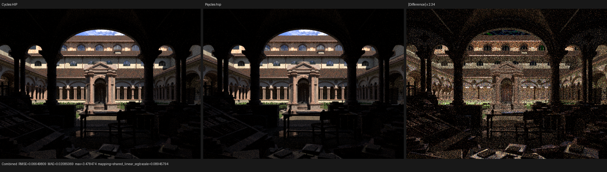
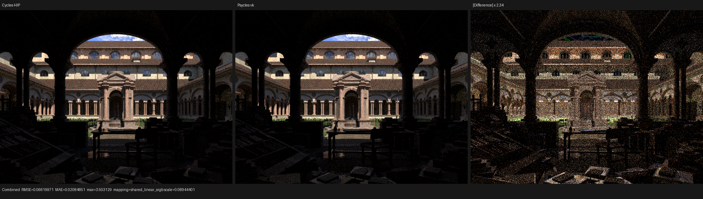
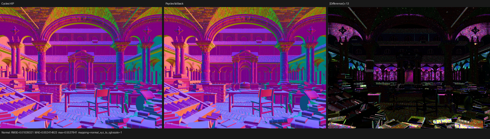

# Shared surface-closure evaluator validation

This checkpoint moves the low-risk surface consumers behind a single
post-material boundary. Runtime material dispatch still evaluates the original
Blender closure graph as Luisa device expressions. It now emits the resulting
physical closures in Cycles allocation order, after which shared code computes
runtime flags, closure diagnostics, and AOVs. No closure is evaluated by a CPU
reference model, baked by Blender/Cycles, or replaced with precomputed material
data.

The implementation landed in four independently tested commits:

- `514bb67` adds the raw closure-collection boundary;
- `6d1ca46` adds fixed-capacity device-local storage matching Cycles'
  `ShaderData::closure[MAX_CLOSURE]` model;
- `3ef7483` adds the shared consumer; and
- `cceead9` wires runtime flags, closure trace, and AOV into production.

Commit `3020c88` subsequently makes each production consumer's retained field
projection explicit. The complete lossless profile remains available for the
upcoming evaluate/sample migration.

## Formal contract

The boundary is defined by invariants rather than material-specific cases:

1. Graph evaluation and closure setup remain inside the Luisa shader AST.
2. Physical records are visited in exactly the same order as Cycles allocation:
   aggregate transparency first, followed by the ordered Principled layers and
   ordinary graph closures.
3. A non-scattering record allocates no slot. A scattering record below Cycles'
   closure-weight cutoff allocates no slot.
4. An allocated record whose setup later fails still consumes its slot, has
   closure type `NONE`, and contributes no runtime flags.
5. Capacity truncation retains a prefix of the Cycles allocation sequence. The
   scene-wide capacity is computed from every reachable graph and capped at
   Cycles `MAX_CLOSURE = 64`.
6. Runtime indexing is device-side; no runtime material tag or closure is baked
   into host data.
7. Storage profiles are projections of the canonical record. `runtime_flags`
   retains identity and roughness; `closure_trace` retains the five field groups
   it observes; `aov` retains the six groups it observes; `complete` round-trips
   all 26 fields.

The OOP boundary is host/JIT-stage metaprogramming: virtual material components
record the graph-dependent AST once, while `SurfaceClosureEvaluator` records the
graph-independent consumer AST after dispatch.

## Regression coverage

`test_luisa_surface_closure_collection` checks fallback, HIP, and Vulkan. Its
fixture contains a seven-lobe layered Principled material and a runtime-selected
Beckmann glass material. For every requested slot it compares the projected
shared path with the former Cycles-aligned implementation, including:

- physical closure kind and lobe order;
- capacity-prefix truncation and cutoff filtering;
- setup-invalid slot retention;
- back-facing and filter-glossy runtime flags;
- closure type, sample weight, weight, and normal; and
- every AOV field.

The focused matrix passes 3/3 and the complete project suite passes 132/132 with
32-way CTest scheduling.

## Lone Monk five-way result

The production run uses Blender 5.3-alpha `b82c3f0da6c1`, the same 37 original
material graphs, 640x480, 64 spp, and eight samples per Psycles dispatch. Cycles
adaptive sampling and denoising are disabled by the golden renderer.

| Renderer | Scene compile | Observed shader JIT | Render only | Relative to Cycles HIP |
| --- | ---: | ---: | ---: | ---: |
| Cycles CPU | included | included | 5.145 s | 2.74x slower |
| Cycles HIP | included | included | 1.881 s | 1.00x |
| Psycles fallback | 1.535 s | 83.115 s cold | 22.162 s | 11.78x slower |
| Psycles HIP | 3.717 s | 69.002 s cold | 3.537 s | 1.88x slower |
| Psycles Vulkan | 1.212 s | 355.832 s cold | 8.816 s | 4.69x slower |

Render throughput is effectively unchanged on HIP. Fallback moved by about two
percent and Vulkan by about six percent in this single run; those two samples
follow long native compilation and are not sufficient to attribute a runtime
regression.

HIP LLVM code generation took 24.454 s and emitted 3,517,376 bytes before the
downstream link. The link produced a 5,534,200-byte code object in 34.811 s.
Vulkan optimized 3,682,846 words to 3,236,597 words in about 143.3 s; the rest
of its cold JIT was again dominated by driver pipeline creation. Peak observed
RSS during that stage was about 29 GB. These measurements reinforce that native
Vulkan compilation remains a separate scalability target.

### Fallback cache-state correction

The earlier callable-boundary report labeled fallback's 0.677 s result as cold.
Its log has no compilation diagnostic and the object was already present in the
cache; it was a cache hit. Fresh path-kernel hashes at `cceead9` and `3020c88`
took 83.115 s and 84.803 s respectively and both reported 537,135 fallback LLVM
instructions. The two storage forms produced byte-identical native objects:

| Storage form | Object bytes | SHA-256 |
| --- | ---: | --- |
| Complete canonical record | 11,051,760 | `70276d70a87b06c01be0ebf13608bd856785d2cc26f12a2582b81a5301e722da` |
| Consumer field projection | 11,051,760 | `70276d70a87b06c01be0ebf13608bd856785d2cc26f12a2582b81a5301e722da` |

This proves the backend already eliminates unused retained fields. The profile
is therefore a semantic/API constraint, not a claimed native-code speedup.

## Numerical and visual inspection

All values below compare the linear multilayer EXR with Cycles HIP.

| Psycles backend | Combined RMSE | Relative RMSE | Mean luminance ratio | Normal RMSE |
| --- | ---: | ---: | ---: | ---: |
| fallback | 0.0657809 | 0.0421928 | 0.999764 | 0.0103932 |
| HIP | 0.0664981 | 0.0426529 | 1.000338 | 0.0103936 |
| Vulkan | 0.0661997 | 0.0424615 | 0.999856 | 0.0103745 |

These are unchanged at the precision relevant to the preceding checkpoint.
Direct old/new EXR comparison gives RMS about `5.9e-7` on fallback/Vulkan; HIP
is within the already recorded sparse HIPRT nondeterminism (`0.00133` RMS).

The six triptychs were opened at their original resolution. Camera, facade,
foreground geometry, vegetation/grass placement, broad normal orientation, and
energy remain aligned. The visible Combined residual is still predominantly
high-frequency sampling noise, while the Normal residual remains concentrated
on thin vegetation, edges, and dark silhouettes. No new missing grass band,
material replacement, normal rotation, or closure-order artifact appears.

### Combined

### Normal

The machine-readable matrix is in [`benchmark.json`](benchmark.json), comparison
reports are in [`reports/`](reports/), and compiler/render logs are in
[`logs/`](logs/).
