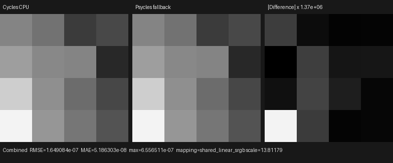
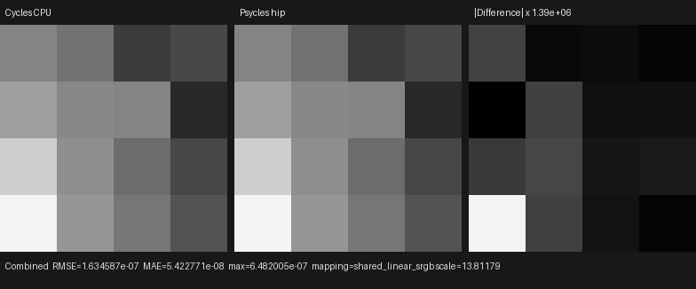
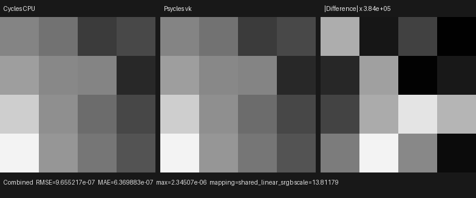
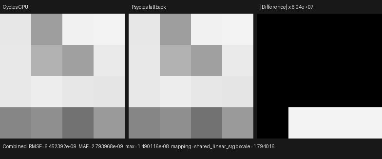
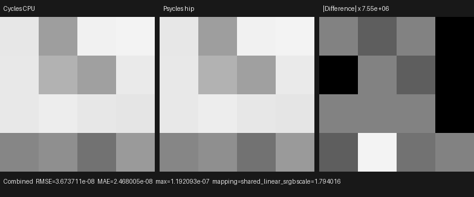
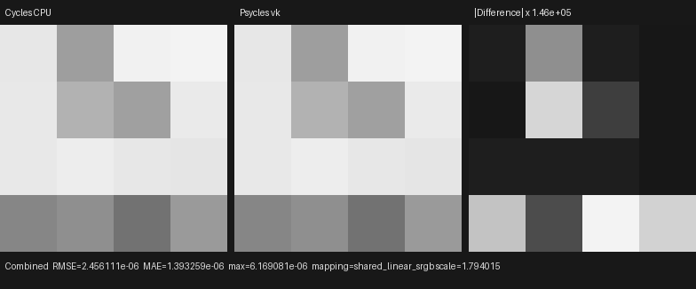
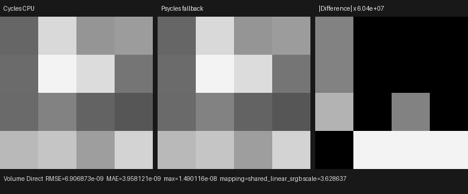
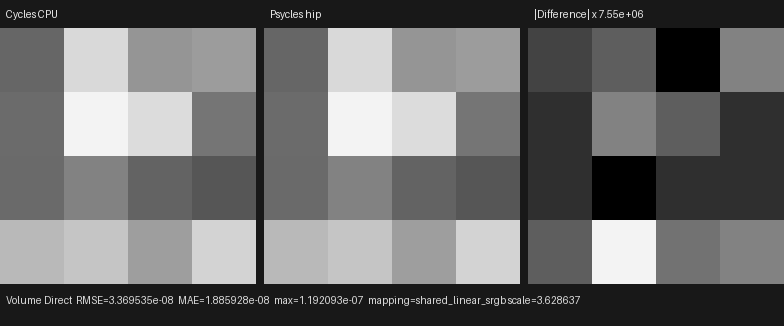
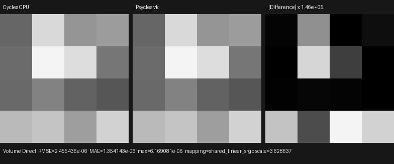

# Volume direct-light emission phases

This checkpoint validates Psycles `0c985d0`. It extends the formal
constant/deferred emission scheduling used by surface NEE to homogeneous and
heterogeneous volume NEE. Cycles remains the only rendering oracle; no CPU
reference integrator or host-side material evaluation is involved.

## Cycles oracle and phase contract

The source oracle is current Cycles main `a3afe632`, specifically
`kernel/integrator/shade_volume.h:2424-2535`. The locally built Blender
5.3-alpha binary is `b82c3f0d`, and its `intern/cycles` tree is byte-identical
to that checkout.

Cycles separates a sampled light into three semantically ordered operations:

```text
sample emitter direction and geometric measure
evaluate constant emission, when available
evaluate the receiving volume phase closure
evaluate deferred raw emission only when the phase value is non-zero
apply light roulette before any shadow ray query
trace surface and volume shadow transmittance
```

Psycles records the same protocol through the host-stage polymorphic
`VolumeDirectLightProvider` interface:

```text
sample_direction(distance)
evaluate_constant_emission()
evaluate_deferred_emission(receiving_nonzero)
```

Each provider stores its proposal as Luisa device expressions. Analytic
lights retain their selected light index and sampled geometry; mesh lights
retain an `EmissiveTriangleLightProposal`; and the environment provider
retains the sampled direction and PDF. The constant/deferred choice is the
compiler's exhaustive closure-tree classification documented in the
[surface checkpoint](../constant-light-emission/README.md). It chooses which
device AST is recorded, but never evaluates or bakes a Blender material on
the host. Deferred mesh and World paths still execute the complete original
raw closure with the collision-point path state.

Both `HomogeneousVolumeSegmentComponent` and
`HeterogeneousVolumeSegmentComponent` orchestrate the protocol. The
emitter-specific providers do not own phase evaluation, roulette, shadow
queries, pass routing, or transport weights. This keeps emitter geometry and
radiometry extensible without duplicating the estimator.

## Regression coverage

The homogeneous and heterogeneous component tests use a recording provider
whose trace must be exactly `123`: direction, constant emission, then
deferred emission. They also assert that the deferred phase receives the
computed non-zero receiving phase value. Existing production triangle and
environment fixtures exercise the real providers on fallback, HIP, and
Vulkan.

The Release build used 32 jobs. Full CTest passed `123/123` in 66.94 seconds.
The focused 12 volume tests also passed on all three Luisa backends. Every
fresh output below is bit-for-bit identical to its retained pre-refactor
Psycles EXR under a zero-tolerance OpenImageIO comparison, showing that the
host-stage reorganization did not alter the estimator.

## Latest-Cycles differential

The triangle fixture uses a raw constant Emission closure with color 1 and
strength 10, a reflected FRONT-only triangle with negative instance scale,
and a homogeneous Volume Scatter closure. The 4x4 one-sample reference is the
official Blender/Cycles CPU EXR retained by the
[triangle MIS checkpoint](../../2026-07-31/homogeneous-volume-triangle-mis/README.md).

| Backend | Combined RMSE | Relative RMSE | Maximum error | Mean luminance ratio |
|---|---:|---:|---:|---:|
| fallback | 1.6491e-7 | 6.8882e-6 | 6.5565e-7 | 0.99999727 |
| HIP | 1.6346e-7 | 6.8276e-6 | 6.4820e-7 | 0.99999707 |
| Vulkan | 9.6552e-7 | 4.0330e-5 | 2.3451e-6 | 1.00001247 |

The environment fixture uses a spatial, therefore deferred, raw World graph.
Its 4x4 one-sample reference is the official Blender/Cycles CPU EXR retained
by the
[environment MIS checkpoint](../../2026-07-31/homogeneous-volume-environment-mis/README.md).

| Backend | Pass | RMSE | Relative RMSE | Maximum error | Mean luminance ratio |
|---|---|---:|---:|---:|---:|
| fallback | Combined | 6.4524e-9 | 1.7650e-8 | 1.4901e-8 | 1.00000000 |
| fallback | Volume Direct | 6.9069e-9 | 5.5557e-8 | 1.4901e-8 | 1.00000000 |
| HIP | Combined | 3.6737e-8 | 1.0049e-7 | 1.1921e-7 | 1.00000000 |
| HIP | Volume Direct | 3.3695e-8 | 2.7104e-7 | 1.1921e-7 | 1.00000022 |
| Vulkan | Combined | 2.4561e-6 | 6.7186e-6 | 6.1691e-6 | 0.99999750 |
| Vulkan | Volume Direct | 2.4554e-6 | 1.9751e-5 | 6.1691e-6 | 0.99999145 |

Machine-readable reports are retained under [reports](reports).

## Visual inspection

I opened all nine generated triptychs at original resolution. The Cycles and
Psycles panes have the same pixel orientation, collision-energy pattern, and
pass routing on every backend. The amplified differences remain scattered
floating-point residuals; there is no shifted feature, missing lobe, or
backend-specific discontinuity.

### Constant triangle emission







### Deferred environment emission













## Remaining parity gates

- import and lower raw Principled BSDF emission sockets;
- align emitter/environment importance distributions and exact RNG mapping;
- implement heterogeneous residual-ratio shadow transport;
- align surface-light roulette ordering with Cycles; and
- implement light trees, MNEE, path guiding, and light linking.
