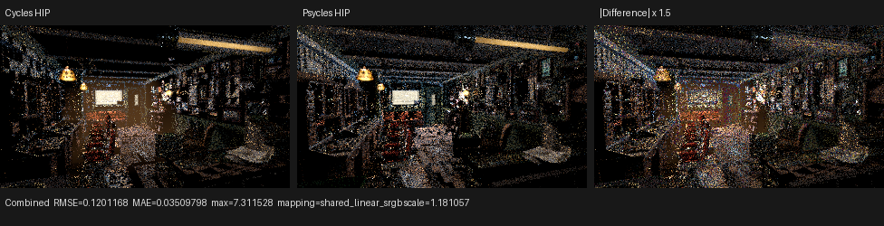
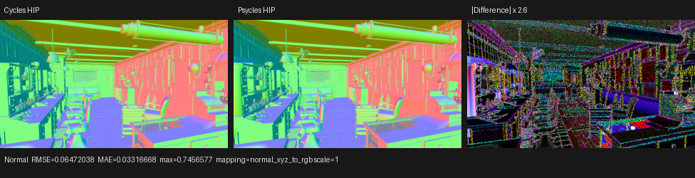
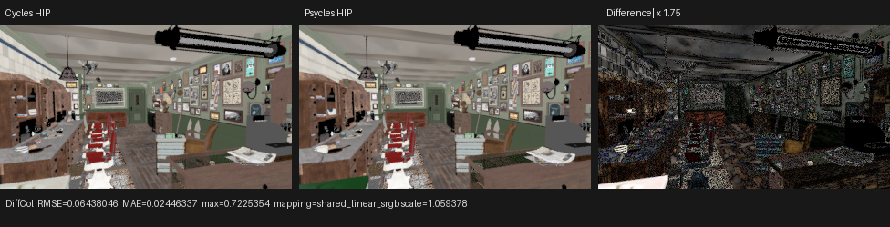

# Barbershop native Burley BSSRDF checkpoint

## Outcome and scope

Psycles now retains standalone and Principled subsurface closures as typed
Luisa BSSRDFs and performs native Burley spatial transport. The exact official
Barbershop Interior scene reaches a complete HIP render and writes linear
multilayer OpenEXR output. Blender/Cycles is used only as the rendering oracle;
no closure, texture, material, or transport result is baked or pre-evaluated.

This is a feature checkpoint, not a Barbershop parity claim. At the time of
the retained render, Burley was the implemented spatial method and Random Walk,
Random Walk Legacy, and Random Walk Skin were the next transport gap. Those
three methods are now implemented and independently verified in the follow-up
[`subsurface-random-walk`](../subsurface-random-walk/README.md) checkpoint; the
historical 320x180 Barbershop comparison below has not been relabeled as a
post-Random-Walk result. The full scene still reports explicit unsupported or
unavailable inputs, and this diagnostic remains below the later production
gate of at least 480p.

The source asset is the user-provided URL:

```text
https://svn.blender.org/svnroot/bf-blender/trunk/lib/benchmarks/cycles/barbershop_interior/barbershop_interior.blend
```

The local unmodified file is
`assets/official-blender-scenes/barbershop-interior/barbershop_interior.blend`,
287,574,804 bytes, SHA-256
`95972b56180462cac47ec82f3a755bd9111ec18ca37a6196a319c013db994130`.
The source audit used current Blender/Cycles checkout
`16f3180fba1e2f052a8c9f7b7c57b7738cd3dd8d`. Reference EXRs were rendered by
the local Blender 5.3 Alpha build `b82c3f0da6c1` on the same Radeon RX 9070 XT.

## Transport contract

The compiler has a native `subsurface` closure operation and a static typed
method discriminator for the four Cycles BSSRDF families. Authored numeric
sockets remain device expressions. Standalone SVM semantics keep closure
weight as `Color * closure-tree weight` while retaining the unscaled Color as
transport albedo. Principled builds its BSSRDF from the clamped base color,
subsurface weight, and surviving base-layer weight. The implementation also
preserves the linked-normal topology, squared Principled roughness, adjusted
non-skin IOR, closure allocation cutoff, partial-channel diffuse fallback, and
the occupied `CLOSURE_NONE` slot produced by a Burley closure below a diffuse
ancestor.

The Burley spatial stage follows the current Cycles construction as one
algorithm rather than a collection of scene cases:

1. Sample the three projection axes with probabilities `0.5, 0.25, 0.25` and
   sample the normalized Burley disk profile per selected color channel.
2. Trace only the originating object through its local acceleration structure.
   Retain at most four intersections with Cycles' exact LCG reservoir rule,
   reject duplicate hit distances, sort retained hits, and apply the
   greater-than-four correction.
3. Evaluate the three-axis MIS weight at every retained hit and importance
   resample one exit. The selected intersection is carried exactly into the
   next shading state; it is not rediscovered with an epsilon ray.
4. Construct Cycles' synthetic exit ray from `P + 2 Ng` along `-Ng`, suppress
   exit material/emission/RR/data-pass evaluation, and use a unit Lambert
   closure for next-event lighting and the real diffuse continuation bounce.
5. Advance the copied path random domain by 16 dimensions at BSSRDF entry and
   another 16 after successful spatial transport. The formal path-step bound
   is `2 * max_bounces + transparent_bounces + 1`, because each counted opaque
   bounce can contain both a BSSRDF entry and its synthetic exit.

The code is split into BSSRDF setup, exit-closure, and path-subsurface
components. It uses Luisa host-side classes to generate typed shader AST and
does not introduce a CPU renderer or reference model.

## Output-specific graph reachability fix

The first Barbershop run exposed a separate formal IR issue before JIT. A
nested Geometry node in `Razor_Blade_Wood.001` uses Normal while its Pointiness
output is unlinked. Graph validation was node-reachable, so eager lowering
still emitted every output of that node. Runtime capability scanning then
mistook the dead Pointiness instruction for a real attribute demand and
rejected meshes whose exporter had correctly omitted Pointiness source data.

The compiler now computes root reachability over the typed value, surface
closure, and volume closure DAGs together. It preserves topological order,
deletes unreachable instructions, and densely remaps every parameter and
expression ID. This is output-level dead-code elimination, not a special
Pointiness exception. On the representative Barbershop material it reduces
the typed value stream from 81 to 65 instructions and removes the false
Pointiness demand. Real linked Pointiness without its evaluated source remains
a hard error.

Regressions cover the exact nested-Geometry shape in the Blender exporter and
the runtime scene contract on fallback, HIP, and Vulkan. All three backends
accept Normal-only geometry without Pointiness data and continue to reject a
truly linked Pointiness graph with no source.

## Automated BSSRDF regression

`tests/test_luisa_bssrdf.cpp` starts from a raw normalized Cycles
`subsurface_scattering` node and verifies that `method=BURLEY` remains a typed
Burley closure through the adapter and compiler. It uses Barbershop
`agent_skin`'s static settings (Scale `0.02`, Radius `[2.7, 1.58, 1]`, IOR
`1.4`, Roughness `1`, Anisotropy `0`) with a nonuniform diagnostic Color,
because the scene's actual Color socket is linked.

The device probe checks Cycles ABI type 31, `radius * scale * 0.25 / pi`, raw
transport albedo, sample/PDF/event payload, full-channel allocation, the
diffuse-ancestor occupied-none/fallback ordering, partial tiny-radius channel
fallback, and summed diffuse-color AOV. The same kernel passes on fallback,
HIP, and Vulkan. The existing Principled closure regression independently
checks ABI type 32 and native Random Walk payload construction. Spatial Random
Walk transport was intentionally outside this retained checkpoint and is
claimed only by the separate follow-up validation linked above.

## Full-scene HIP measurements

The retained export contains 1,649 geometries, 2,555 instances and 564
material/light/world programs. The first successful 64x64x1 run crossed the
previous Pointiness failure, built all HIPRT acceleration structures, compiled
the complete path kernel, and produced PPM, PFM component passes, and a
46-channel linear multilayer EXR.

Cold compilation is currently unacceptable but precisely localized:

| Stage | Time |
| --- | ---: |
| Scene upload and HIPRT build | 17.3096 s |
| Complete Luisa shader JIT | 752.045 s |
| HIP LLVM code generation within JIT | 96.622 s |
| HIP bitcode to code-object link within JIT | 612.494 s |
| Generated AMDGPU code before device-library link | 14,738,496 bytes |
| Final cached code object | 19,197,592 bytes |
| 64x64x1 render | 0.111484 s |

The link alone accounts for 81.4% of shader JIT time. This establishes that
the long cold start is not HIP ray execution; it is the device-library link of
the current monolithic full-material path kernel. The cache is functional. A
warm 320x180x16 rerun loaded the 19.2 MB entry and measured:

| Stage | Psycles HIP |
| --- | ---: |
| Scene upload and HIPRT build | 17.0383 s |
| Cached shader load/JIT | 1.75902 s |
| Rendering | 3.64403 s |
| Sum of reported stages | 22.4414 s |

Cycles HIP on the same scene, device, resolution, 16 fixed samples and seed 0
reported 13.606 s wall time: 12.69 s synchronization, 0.29 s rendering, and
12.99 s total inside Cycles. On the renderer-only counters Psycles is currently
12.57 times slower (`3.64403 / 0.29`); on the reported warm end-to-end stages
it is 1.65 times slower (`22.4414 / 13.606`). These numbers are retained as a
baseline, not presented as a speedup.

## Numerical and visual comparison

The 320x180x16 comparison uses the same scene, same GPU, fixed sample count and
seed. Sampling sequences and all features are not yet aligned, so high-variance
lighting passes are diagnostics rather than acceptance thresholds.

| Pass | RMSE | Relative RMSE | Psycles/Cycles luminance |
| --- | ---: | ---: | ---: |
| Combined | 0.120117 | 0.792472 | 1.05041 |
| Normal | 0.0647204 | 0.120655 | 0.987958 |
| Diffuse Color | 0.0643805 | 0.257837 | 0.959397 |
| Diffuse Direct | 0.442312 | 1.17184 | 1.15538 |
| Diffuse Indirect | 0.144795 | 1.15306 | 1.62587 |
| Glossy Direct | 2.62125 | 1.12757 | 1.99051 |
| Glossy Indirect | 0.450463 | 1.88402 | 2.00156 |
| Emission | 0.0160672 | 0.230981 | 0.725019 |
| Environment | 0.00324555 | 0.383913 | 0.960133 |

I opened the three retained 976x250 triptychs at original resolution.
Camera, room layout, furniture silhouettes and the dominant material-color
regions align. The Normal view confirms the same large-scale geometry and
orientation; its residual is concentrated at detailed/bump-shaded edges. The
Diffuse Color panels are close but not identical. Combined clearly shows
Psycles' brighter direct and indirect glossy response and different stochastic
highlight placement. Those differences are visible without amplification and
remain blockers; the current unsupported/missing inputs include four Hair Info
uses, one Magic Texture, three implicit conversions, two true-displacement
requests, and ten unavailable image references.







The full machine-readable pass report is
[hip-320x180-16spp-report.json](hip-320x180-16spp-report.json).

## Verification

The Release build completed with all 32 build jobs. The complete suite passed
`148/148` tests with 32 parallel lanes in 4.53 s on warm backend caches. This
includes native BSSRDF and live/dead Pointiness contracts on fallback, HIP,
and Vulkan, the automatic-displacement side-effect root regression, Blender
export regressions, and the 2,000-line source-size gate. The size audit covered
384 first-party source files and 125,493 lines.

## Commands

```text
cmake --build build -j32
ctest --test-dir build --output-on-failure -R 'psycles.(luisa_bssrdf|luisa_pointiness_scene|blender_export_pointiness_source)'
build/bin/psycles_render_blender_scene /tmp/barbershop-export /tmp/barbershop.ppm hip 320 180 16 8
/path/to/blender barbershop_interior.blend --background --python tools/render_cycles_golden.py -- /tmp/cycles.exr 320 180 16 0 --cycles-device HIP --device-name '9070 XT'
python3 tools/compare_cycles.py /tmp/cycles.exr /tmp/report.json --triptych-dir /tmp/triptychs Combined=/tmp/psycles.exr Normal=/tmp/psycles.exr DiffCol=/tmp/psycles.exr
```
