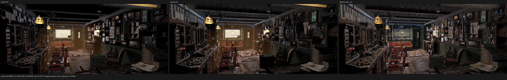
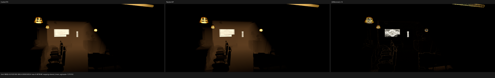
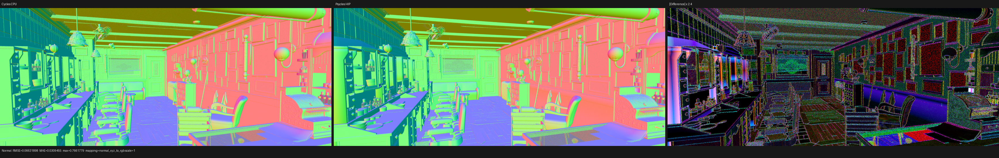
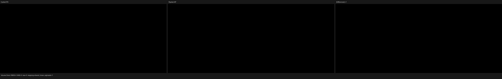

# Barbershop volume and stable traversal checkpoint

## Scope and conclusion

The official Barbershop Interior scene does not exercise volume scattering.
Its only connected material Volume root is material `fog`, whose raw graph is:

```text
Light Path.Is Camera Ray -> Math.Value
Math.Value -> Emission.Strength
Emission.Emission -> Material Output.Volume
```

The unchanged export contains no connected Volume Scatter, Principled Volume,
or Volume Absorption root. Two unconnected Volume Absorption nodes exist, but
they are unreachable and therefore have no rendering semantics. Barbershop's
orange fog is a volume-emission test, and that typed path is covered separately
by the [native volume Emission checkpoint](../volume-emission/README.md).

The full-scene instability found while checking that fog was instead caused by
exactly coincident surfaces. At the diagnostic Cycles pixel `(1041, 254)`, the
first hit is object 1936 / primitive 18648580. The next event is a distinct,
opposite-facing surface at the same position with `t = 0`: object 489 /
primitive 3453870. Both objects use the same transform. This is valid scene
geometry, not an origin epsilon or missing volume event.

## Formal compatibility relation

Current Cycles CPU BVH construction orders equal-centroid references by the
lexicographic tuple `(object, primitive, primitive_type)`. Its triangle test
accepts both ray endpoints, and its binary traversal plus overwrite rule makes
the lexicographically greatest identity the result for an exact-distance tie.
Curve `primitive_type` additionally packs the segment ordinal.

Backend acceleration structures do not promise that visitation order. Vulkan
also specifies built-in triangle candidates on the open interval
`tmin < t < tmax`, whereas Cycles tests `tmin <= t <= tmax`. Psycles now models
the Cycles relation explicitly:

1. outward-round the query interval by one representable value (using the
   smallest normal around zero so FTZ cannot erase the expansion);
2. filter every candidate against the original closed interval and apply the
   existing source/light primitive exclusions;
3. commit the closest accepted candidate during the first traversal;
4. make one bounded, non-committing traversal through the successor of that
   distance and fold all exact-distance candidates through the stable Cycles
   identity order;
5. use the curve segment index as an order-isomorphic representation of
   Cycles' packed segment/type key.

This is an interval and ordering relation, not a scene-specific epsilon or a
backend build-mode workaround. No Luisa backend change was made: Vulkan's
strict endpoint behavior is specified behavior, so the Cycles compatibility
adapter belongs in Psycles.

## Regression matrix

`psycles_luisa_scene_traversal_tests` now covers:

- coincident triangle instances at an interior distance;
- source exclusion selecting the remaining coincident instance;
- the same cases at the exact `tmin = 0` endpoint;
- the same cases at the exact `tmax` endpoint;
- coincident curve segments whose device primitive order is deliberately the
  reverse of their Cycles segment order.

The curve regression failed before the segment-order fix on fallback:

```text
record 0: got {2, 1, 1, 1}, expected {2, 1, 0, 1}
```

After the fix, all records pass on fallback, HIP, and Vulkan. The target was
built with `cmake --build build --target
psycles_luisa_scene_traversal_tests --parallel 32`.

## Cycles trace crop regression

The diagnostic also exposed that exact normalized Blender border coordinates
can round outward in float32. The previous `(1041, 254)` trace became 1x2, so
the apparent output row was ambiguous. The render harness now selects border
coordinates with a quarter-pixel margin in the two integer truncation
intervals. A Python regression checks every pixel at representative extents
through 8192 after float32 storage. A real 1152x480 Barbershop CPU trace now
reports exactly `1 x 1, 1228 channel, float openexr` in `oiiotool --info`.

## Full-scene validation

The authoritative reference is the clean official Blender/Cycles `main`
checkout at `61f93ccb14781f8f1f877a5bb8db04ede49672b3`, built locally in
Release mode on 2026-08-04 with HIP enabled. The incremental build used
`cmake --build ... --parallel 32`. The unchanged official scene was rendered
at 1152x480, 16 spp, seed 0, Tabulated Sobol, scrambling distance 1, fixed
sampling, and no denoising.

The Cycles CPU and HIP goldens both contain 51 float channels. Their volume
results independently confirm the graph audit:

| Reference pass | minimum | maximum | nonzero values |
| --- | ---: | ---: | ---: |
| Cycles CPU Volume Direct | 0 | 0 | 0 |
| Cycles CPU Volume Indirect | 0 | 0 | 0 |
| Cycles HIP Volume Direct | 0 | 0 | 0 |
| Cycles HIP Volume Indirect | 0 | 0 | 0 |
| Cycles CPU Emission | 0 | 1.598729 | 433,882 |

The orange fog is in Emission and Combined. It is not a missing Volume Direct
or Volume Indirect contribution.

### Independent HIP stability

Two fresh Psycles HIP processes rendered the final traversal implementation
at 1152x480 and 1 spp. All 15 emitted PFM pass files are byte-identical. The
EXR files differ only in their `DateTime` metadata; all decoded float channels
have RMSE 0 and maximum absolute error 0. The complete result is in
[the all-pass repeat report](reports/hip-repeat-all.json), with selected
[repeat triptychs](reports/hip-repeat.json).

| Phase | cold process | independent warm process |
| --- | ---: | ---: |
| Scene compilation | 17.230 s | 17.234 s |
| Luisa/HIP shader JIT | 1620.560 s | 2.442 s |
| 1 spp rendering | 1.691 s | 1.689 s |

The cold JIT includes 191.886 seconds to generate the 20.8 MB AMDGPU LLVM
module and 1351.024 seconds in AMD COMGR's single-threaded final bitcode to
code-object stage. The cached code object is 26.7 MB. This is a compiler
scalability problem, separate from render throughput.

### Latest-Cycles differential and speed

The final warm-cache 16 spp render timings are:

| Renderer | device | reported render time | Psycles slowdown |
| --- | --- | ---: | ---: |
| Cycles main | Ryzen 9 9950X3D CPU | 11.646 s | 2.166x |
| Cycles main | Radeon RX 9070 XT HIP | 14.525 s | 1.737x |
| Psycles/Luisa | Radeon RX 9070 XT HIP | 25.230 s | 1.000x |

Psycles additionally spent 17.213 seconds compiling the scene and 2.424
seconds loading the warm shader cache. Cycles' number is the complete
`bpy.ops.render` interval, whereas the Psycles number above is its reported
render interval; the table therefore does not hide Psycles' setup or JIT
costs inside its render time.

Selected 16 spp linear-pass results are:

| Comparison | Combined RMSE | Normal RMSE | Emit RMSE | Combined mean luminance ratio | Emit mean luminance ratio |
| --- | ---: | ---: | ---: | ---: | ---: |
| Psycles HIP vs Cycles CPU | 0.177230 | 0.066319 | 0.010252 | 1.08130 | 0.97552 |
| Psycles HIP vs Cycles HIP | 0.173395 | 0.066335 | 0.010249 | 1.11423 | 0.97546 |
| Cycles CPU vs Cycles HIP | 0.087518 | 0.006778 | 0.000546 | 0.97044 | 1.00005 |

Volume Direct and Volume Indirect are exactly zero in every comparison. Full
15-pass metrics are retained in the
[Cycles CPU report](reports/psycles-hip-vs-cycles-cpu.json),
[Cycles HIP report](reports/psycles-hip-vs-cycles-hip.json), and
[Cycles device-floor report](reports/cycles-cpu-vs-cycles-hip.json).

This checkpoint fixes backend-independent traversal determinism, but it is
not a claim that the full Barbershop render now passes the Cycles release
gate. Relative to the Cycles CPU/HIP device floor, Psycles' Combined, Normal,
and Emit RMSE remain 2.03x, 9.78x, and 18.78x larger. Combined luminance is
also still biased high. These residuals require further sampler, primary
visibility, closure/light estimator, and transport alignment; they are not
evidence that the typed volume-emission closure is absent.

### Visual inspection

The latest-Cycles triptychs were inspected at full resolution. Combined has
the same room layout, objects, and orange fog placement, but the difference
panel still shows material/lighting and high-energy sample residuals. Emit
matches the fog's broad shape and color closely; its remaining error is
concentrated at silhouettes, lamps, and the bright window. Normal agrees on
large surfaces but retains visible edge and fine-geometry differences.
Volume Direct and Volume Indirect are black on both sides, as required by the
actual graph.









Equivalent [Cycles HIP triptychs](triptychs/cycles-hip/) are retained beside
the CPU inspection set. The official scene reports the same two missing
external textures (`generic_scratches.png` and `guilder_ornament.png`) in both
Cycles reference renders; no replacement or pre-baking was introduced.
