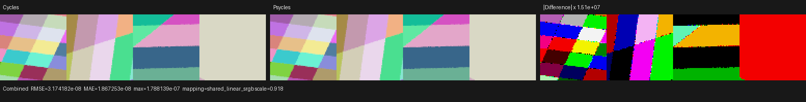
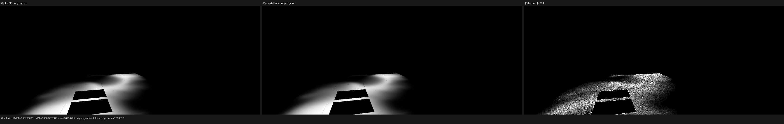
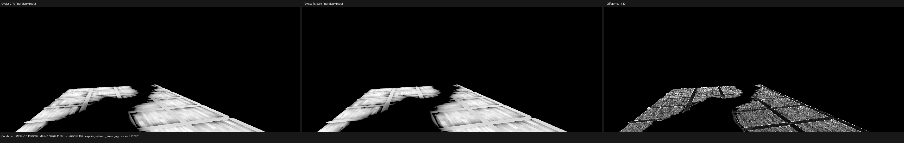

# Barbershop texture-coordinate alignment

## Conclusion

The visible Barbershop floor mismatch was not a mesh UV inversion. The base
wood grain in Cycles and Psycles had the same board direction and scale, and
the exported named UV values differed only at float32 roundoff. The large
GlossCol error came from two independent coordinate states that Cycles keeps
on shader nodes but the Psycles exporter previously discarded:

1. `Texture Coordinate.Object` can reference a separate projector object.
   Cycles transforms the world shading point by that object's inverse affine
   transform; it does not use the shaded object's local position.
2. Every Cycles `TextureNode` may carry a legacy internal `TexMapping`. In the
   official Barbershop material, `Image Texture.001` inside
   `barbershop_floor_wood_panels_dirt` has a hidden POINT mapping with scale
   `(0.1, 0.1, 0.1)`. Sampling the texture without that factor repeated the
   dirt mask ten times too densely and produced the conspicuous wavy pattern.

The source `barbershop_floor_rough.png` is 1024x1024 RGBA with identical RGB
channels and constant alpha 1. The Mix ADD group inputs and Cycles' blend
formula were also correct. This rules out channel conversion, alpha, Mix, and
group socket binding as the cause.

## General implementation

The exporter now records explicit Object coordinates as a column-major
world-to-projector matrix. It separately records non-identity TextureNode
mapping state: vector type, translation, Euler rotation, scale, and the X/Y/Z
axis selectors. The adapter lowers every supported image, environment,
procedural, and sky texture through one typed mapping component before the
concrete texture node.

The mapping operation models all four Cycles modes:

- POINT: `T * R * S * P`;
- TEXTURE: `(T * R * S)^-1 * P`;
- VECTOR: `R * S * V`;
- NORMAL: normalized inverse-transpose direction mapping.

Axis projection is applied first, matching Cycles' `mat * mmat` composition.
For the static TextureNode TEXTURE and NORMAL modes, scale magnitudes below
`1e-5` are sign-preservingly clamped so the transform remains invertible.
This rule is deliberately confined to the legacy TextureNode mapping and does
not change a user-authored Mapping node's zero-scale semantics.

No texture or closure was baked. The unchanged image, raw node graph, and raw
closure tree are still evaluated by Luisa DSL/JIT.

## Regressions

The automated coverage includes:

- Blender export of an explicit projector and its full affine inverse;
- Blender export of a non-identity legacy TextureNode mapping, including zero
  scale and `Z/NONE/X` axis selection, plus identity-state elision;
- JSON adapter and surface-program lowering of the projector, mapping mode,
  and packed axis relation;
- a canonical Cycles differential image probe covering POINT, TEXTURE,
  VECTOR, NORMAL, rotation, signed scale, and nontrivial axis maps.

The 256x64, 4 spp canonical probe used Blender/Cycles `main` commit
`61f93ccb14781f8f1f877a5bb8db04ede49672b3` on CPU as the sole oracle. All
three Luisa backends passed the strict energy and relative-RMSE gates:

| Luisa backend | Combined luminance ratio | Combined relative RMSE | max absolute error |
| --- | ---: | ---: | ---: |
| fallback | 1.00000000 | 5.3235e-8 | 1.7881e-7 |
| HIP | 1.00000000 | 5.3235e-8 | 1.7881e-7 |
| Vulkan | 1.00000000 | 5.3235e-8 | 1.7881e-7 |

The exact reports are retained in [reports](reports/). The three triptychs
were inspected at full resolution; all four tiles are visually identical and
the amplified difference panels contain only float32 roundoff.

## Barbershop material-chain check

To avoid transport and sampling noise while retaining the official geometry,
62 evaluated floor instances were rendered at 1152x480 and 4 spp with the
selected raw material output connected to Emission. Cycles CPU and Psycles
fallback used the same camera and unchanged source nodes.

| Raw output | state | luminance ratio | RMSE | relative RMSE | mean absolute error |
| --- | --- | ---: | ---: | ---: | ---: |
| dirt group Color | before TextureNode mapping | 1.016205 | 0.143791 | 1.212637 | 0.038034 |
| dirt group Color | after both fixes | 0.999975 | 0.007306 | 0.061614 | 0.000377 |
| final glossy Color | before TextureNode mapping | 1.010111 | 0.143037 | 0.685575 | 0.041975 |
| final glossy Color | after both fixes | 0.999971 | 0.013292 | 0.063708 | 0.002694 |

The remaining error is concentrated at texture-filter and rasterized geometry
edges; the mask placement, scale, broad intensity, wood-board structure, and
final glossy pattern agree visually. The final glossy RMSE fell by 10.76x and
its mean luminance differs by only 0.0029%.

These focused results establish the texture-coordinate cause. A new full-scene
high-spp render is tracked separately because its remaining transport,
sampling, and closure differences are not texture-coordinate regressions.
