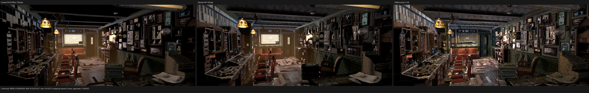
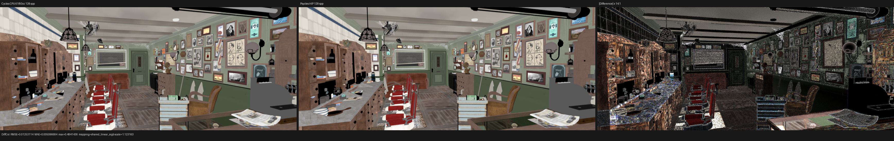
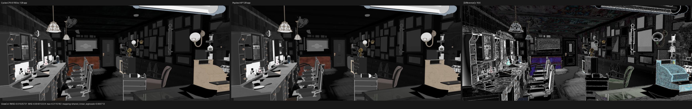
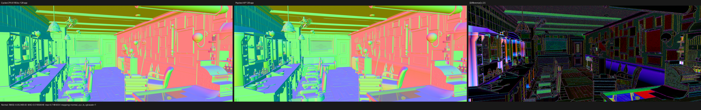
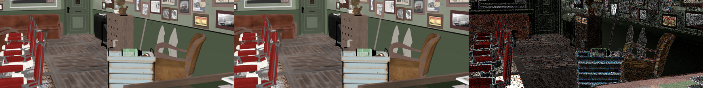
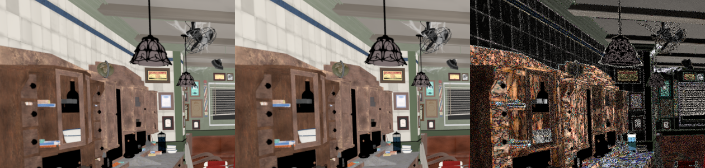
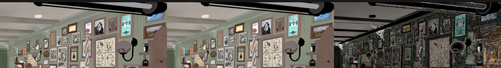
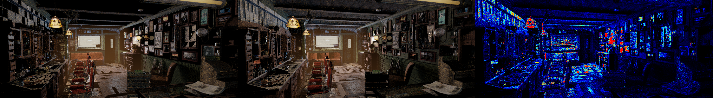

# Barbershop texture-coordinate alignment

> Follow-up, 2026-08-05: the explicit Object-coordinate and per-texture
> mapping corrections documented here remain valid. A later audit found two
> additional independent contracts: selection of Blender's render/default UV
> layer and the shading-normal sign used by back-facing Image Texture `BOX`
> projection. The newer staged and full-scene results are recorded in
> [the render-UV/BOX checkpoint](../../2026-08-05/barbershop-render-uv-box/README.md);
> the full-scene numbers below are retained as historical before/after data for
> this checkpoint.

## Conclusion

The visible Barbershop floor mismatch was not a mesh UV inversion. The base
wood grain in Cycles and Psycles had the same board direction and scale, and
the exported named UV values differed only at float32 roundoff. The large
GlossCol error came from two independent coordinate states that Cycles keeps
on shader nodes but the Psycles exporter previously discarded:

1. `Texture Coordinate.Object` can reference a separate projector object.
   Cycles transforms the world shading point by that object's inverse affine
   transform; it does not use the shaded object's local position.
2. Every Cycles `TextureNode` may carry a legacy internal `TexMapping`. In the
   official Barbershop material, `Image Texture.001` inside
   `barbershop_floor_wood_panels_dirt` has a hidden POINT mapping with scale
   `(0.1, 0.1, 0.1)`. Sampling the texture without that factor repeated the
   dirt mask ten times too densely and produced the conspicuous wavy pattern.

The source `barbershop_floor_rough.png` is 1024x1024 RGBA with identical RGB
channels and constant alpha 1. The Mix ADD group inputs and Cycles' blend
formula were also correct. This rules out channel conversion, alpha, Mix, and
group socket binding as the cause.

The clean full-scene export contains 212 non-identity TextureNode mappings in
112 materials and four node groups. They are not confined to the floor:

| Texture kind | mapped nodes |
| --- | ---: |
| Image Texture | 128 |
| Noise Texture | 54 |
| Voronoi Texture | 14 |
| Gradient Texture | 14 |
| Magic Texture | 2 |

Of those mappings, 186 contain non-unit scale, 23 contain rotation, eight
contain translation, and 22 contain an axis remap; the sets overlap. Concrete
examples corresponding to the originally reported surfaces include floor
scale `0.1`, ceiling and wall scales `0.5`, `6`, and `2.7/3.7`, cupboard scale
`3.1`, and bookshelf scale `0.3`. This inventory is why the correction lives
in the common texture-coordinate lowering path rather than in a Barbershop
material or image special case.

## General implementation

The exporter now records explicit Object coordinates as a column-major
world-to-projector matrix. It separately records non-identity TextureNode
mapping state: vector type, translation, Euler rotation, scale, and the X/Y/Z
axis selectors. The adapter lowers every supported image, environment,
procedural, and sky texture through one typed mapping component before the
concrete texture node.

The mapping operation models all four Cycles modes:

- POINT: `T * R * S * P`;
- TEXTURE: `(T * R * S)^-1 * P`;
- VECTOR: `R * S * V`;
- NORMAL: normalized inverse-transpose direction mapping.

Axis projection is applied first, matching Cycles' `mat * mmat` composition.
For the static TextureNode TEXTURE and NORMAL modes, scale magnitudes below
`1e-5` are sign-preservingly clamped so the transform remains invertible.
This rule is deliberately confined to the legacy TextureNode mapping and does
not change a user-authored Mapping node's zero-scale semantics.

No texture or closure was baked. The unchanged image, raw node graph, and raw
closure tree are still evaluated by Luisa DSL/JIT.

## Regressions

The automated coverage includes:

- Blender export of an explicit projector and its full affine inverse;
- Blender export of a non-identity legacy TextureNode mapping, including zero
  scale and `Z/NONE/X` axis selection, plus identity-state elision;
- JSON adapter and surface-program lowering of the projector, mapping mode,
  and packed axis relation;
- a canonical Cycles differential image probe covering POINT, TEXTURE,
  VECTOR, NORMAL, rotation, signed scale, and nontrivial axis maps.

The 256x64, 4 spp canonical probe used Blender/Cycles `main` commit
`61f93ccb14781f8f1f877a5bb8db04ede49672b3` on CPU as the sole oracle. All
three Luisa backends passed the strict energy and relative-RMSE gates:

| Luisa backend | Combined luminance ratio | Combined relative RMSE | max absolute error |
| --- | ---: | ---: | ---: |
| fallback | 1.00000000 | 5.3235e-8 | 1.7881e-7 |
| HIP | 1.00000000 | 5.3235e-8 | 1.7881e-7 |
| Vulkan | 1.00000000 | 5.3235e-8 | 1.7881e-7 |

The exact reports are retained in [reports](reports/). The three triptychs
were inspected at full resolution; all four tiles are visually identical and
the amplified difference panels contain only float32 roundoff.

## Barbershop material-chain check

To avoid transport and sampling noise while retaining the official geometry,
62 evaluated floor instances were rendered at 1152x480 and 4 spp with the
selected raw material output connected to Emission. Cycles CPU and Psycles
fallback used the same camera and unchanged source nodes.

| Raw output | state | luminance ratio | RMSE | relative RMSE | mean absolute error |
| --- | --- | ---: | ---: | ---: | ---: |
| dirt group Color | before TextureNode mapping | 1.016205 | 0.143791 | 1.212637 | 0.038034 |
| dirt group Color | after both fixes | 0.999975 | 0.007306 | 0.061614 | 0.000377 |
| final glossy Color | before TextureNode mapping | 1.010111 | 0.143037 | 0.685575 | 0.041975 |
| final glossy Color | after both fixes | 0.999971 | 0.013292 | 0.063708 | 0.002694 |

The remaining error is concentrated at texture-filter and rasterized geometry
edges; the mask placement, scale, broad intensity, wood-board structure, and
final glossy pattern agree visually. The final glossy RMSE fell by 10.76x and
its mean luminance differs by only 0.0029%.

## Full-scene 128 spp validation

The complete official scene was freshly exported after both coordinate fixes:
1,649 meshes, six curve geometries, 2,565 instances, 547 source materials, and
190 exported images. Psycles compiled 564 runtime materials after graph
specialization. The image comparison used 1152x480 at 128 spp and the same
Cycles `main` commit `61f93ccb14781f8f1f877a5bb8db04ede49672b3` on both CPU
and HIP. All files are linear multilayer EXRs; no denoiser, pre-baking, or
display transform participates in the metrics.

The table compares the previous Psycles 128 spp image with a newly rendered
image from the corrected export. Ratios are Psycles/reference mean luminance.

| Cycles oracle | Psycles state | Combined RMSE | Combined ratio | DiffCol RMSE | DiffCol ratio | GlossCol RMSE | GlossCol ratio | Normal RMSE | Emit RMSE |
| --- | --- | ---: | ---: | ---: | ---: | ---: | ---: | ---: | ---: |
| CPU | before | 0.083270 | 1.089490 | 0.031806 | 1.004364 | 0.012856 | 1.010049 | 0.052539 | 0.006118 |
| CPU | after | 0.082864 | 1.099616 | 0.012531 | 1.005792 | 0.010257 | 1.003159 | 0.052495 | 0.002817 |
| HIP | before | 0.074093 | 1.118655 | 0.031775 | 1.004146 | 0.012543 | 1.008484 | 0.052530 | 0.006127 |
| HIP | after | 0.073590 | 1.129052 | 0.012627 | 1.005574 | 0.009809 | 1.001605 | 0.052485 | 0.002837 |

Against Cycles CPU, the coordinate correction reduces DiffCol RMSE by 60.6%,
GlossCol RMSE by 20.2%, and Emit RMSE by 54.0%. The HIP oracle gives the same
conclusion. Combined improves only slightly and its mean remains too bright;
Normal is nearly unchanged. This cleanly separates the fixed texture-coordinate
error from the remaining sampler, light-transport, bump-normal, and closure
alignment work. The correction is therefore not being credited for unrelated
full-path residuals.

The exact before/after CPU and HIP reports are retained in [reports](reports/).
The linear triptychs below use the same display scale for reference and actual;
their difference panels are independently amplified and state that factor in
the footer.

### Visual inspection

The full-resolution DiffCol and GlossCol triptychs and the three surface crops
were inspected manually. The floor board direction, dirt-mask placement, and
repeat scale now agree. The left cabinet wood grain, the ceiling segmentation,
and the long right wall also agree in direction and spatial frequency. Their
remaining visible error is dominated by contrast/filter edges, fine geometry,
and the bump-normal path rather than a repeated, rotated, or offset texture.

The following triptych applies Blender 5.3's `sRGB`/`Filmic`/`None` OCIO view
to the same linear Combined images. From left to right it shows Cycles CPU,
Psycles HIP, and a linear-error visualization. Psycles still has a broad
positive illumination bias and transport residuals, especially on the floor;
this is not presented as full Cycles parity.

### Timing and compiler stage

The corrected cold HIP process spent 17.247 s compiling the scene, 1,645.76 s
in shader JIT, and 6.374 s rendering 4 spp. Within the JIT, Luisa/HIP LLVM
generation took 194.799 s and AMD COMGR's single-threaded IR-to-code-object
link took 1,374.332 s. The resulting 27.3 MB code object was cached. A warm
128 spp process spent 17.213 s on the scene, 2.434 s loading/JITing the shader,
and 196.904 s rendering; its complete wall time was 218.35 s and peak host RSS
was 11.44 GB. This confirms the long cold start is a HIP compiler scalability
issue, not GPU rendering time.

The warm timing comparison is:

| samples | renderer/device | reported render interval | process wall time |
| ---: | --- | ---: | ---: |
| 4 | Cycles CPU | 9.758 s | 10.79 s |
| 4 | Cycles HIP | 14.636 s | 15.71 s |
| 4 | Psycles HIP | 6.363 s | 27.79 s |
| 128 | Cycles CPU | 28.107 s | not retained |
| 128 | Cycles HIP | 19.161 s | not retained |
| 128 | Psycles HIP | 196.904 s | 218.35 s |

The 4 spp Psycles device interval is apparently 2.30x faster than Cycles HIP,
but the complete warm Psycles process is 1.90x slower because scene setup and
JIT dominate such a short render. At the meaningful 128 spp throughput point,
Psycles HIP is 10.28x slower than Cycles HIP and 7.00x slower than Cycles CPU
even before Psycles' scene/JIT overhead is counted. No speedup is claimed: the
current path kernel requires substantial transport-throughput optimization
after functional alignment.

The upstream scene archive itself lacks `generic_scratches.png` and
`guilder_ornament.png`; latest Cycles reports those same two failures. Psycles
also reports four unavailable `agent_skin` maps that are outside the visible
surfaces inspected here. These asset limitations are recorded rather than
silently substituting baked textures.

Finally, the complete repository suite passed after the fix: 176/176 tests in
152.58 s with 32-way CTest parallelism, including fallback, HIP, Vulkan, Blender
export, texture-coordinate, volume, closure, curve, and EXR coverage.
