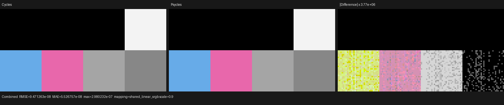

# Geometry Attribute outputs and orthographic viewplane — 2026-08-04

This checkpoint implements the geometry color-attribute subset needed by the
official Barbershop Interior scene and compares the unchanged Blender node
graphs directly with Cycles. Blender does not evaluate or bake a material,
closure, coordinate, or Attribute output for Psycles.

The image oracle is Blender 5.3.0 Alpha build `b82c3f0da6c1` using Cycles CPU.
The source contract was checked against the freshly fetched local
`blender-cycles` `origin/main` revision `16f3180f`. The binary and source
revisions are recorded separately because they are not the same build.

## Cycles contract

For a present RGBA geometry color attribute, Cycles exposes RGB through both
Color and Vector, the arithmetic mean of RGB through Fac, and A through Alpha.
For a missing attribute, Color, Vector, and Fac are zero while Alpha is one.
The nonzero missing-Alpha default follows from Cycles resolving a missing
descriptor as a float3 before projecting its alpha; it is not Blender's socket
default.

Psycles represents these as four typed outputs and three explicit value
operations (`attribute_color`, `attribute_factor`, and `attribute_alpha`). The
Factor path is scalar throughout lowering instead of travelling through a
weakly typed float4 parameter. Attribute lookup remains dynamic scene data in
`ShaderServices`, while the node/output selection is expanded when Luisa
traces the shader AST.

Barbershop stores its `Dirt`, `Col`, and related masks as
`CORNER/BYTE_COLOR`. Cycles keeps that source type through mesh sync, decodes
sRGB, and applies its OCIO-derived linear Rec.709-to-working-space matrix at
device fetch. Blender's `.color` accessor performs the first conversion; the
exporter now applies the already-exported Cycles shader matrix for the second
conversion before writing the scene-linear geometry stream. FLOAT_COLOR and
POINT-domain values retain Cycles' separate float-upload behavior.

This does not claim the complete legacy Attribute node. Geometry color
attributes are covered; arbitrary float/vector attributes and the OBJECT,
INSTANCER, and VIEW_LAYER modes remain explicit compatibility work. The node
therefore remains `device_partial` in the release inventory.

## Canonical Cycles probe

`geometry_attribute_outputs` is a 128x64 non-square, eight-cell raw-node probe.
It covers present Color, Vector, Fac, and Alpha plus all four missing-attribute
defaults. Its mesh uses the same corner-domain byte-color representation as
Barbershop. The non-square frame also guards the complete orthographic sensor
fit path.

| Luisa backend | Combined energy ratio | Combined relative RMSE | Maximum absolute error | Invalid pixels |
| --- | ---: | ---: | ---: | ---: |
| fallback | 0.999999805 | 1.925495e-7 | 2.980232e-7 | 0 |
| HIP | 0.999999805 | 1.931125e-7 | 2.980232e-7 | 0 |
| Vulkan | 0.999999805 | 1.914497e-7 | 2.980232e-7 | 0 |

Combined and Emit have channel-mean ratios exactly `1.0` at report precision;
Normal is exact. Reports are [fallback](reports/fallback.json),
[HIP](reports/hip.json), and [Vulkan](reports/vk.json).

The three Combined triptychs were opened at their original 1552x330
resolution. Cycles and Psycles have the same cell positions, colors, black
missing Color/Vector/Fac cells, and white missing Alpha cell on every backend.
Only the difference panel, amplified by about `3.77e6`, exposes last-bit float
noise.




## Regression-discovered camera defect

The first non-square run had a Combined energy ratio of `0.52165` and relative
RMSE of `1.02259`: Psycles rendered the correct Attribute values into only the
middle half of the frame. The defect was independent of Attribute lookup.
Psycles had treated Blender's orthographic scale as the vertical span for all
sensor-fit modes.

The fix is a single host-stage viewplane invariant shared by ray generation
and conservative volume bounds:

```text
horizontal fit: (horizontal span, vertical span) = (scale, scale / aspect)
vertical fit:   (horizontal span, vertical span) = (scale * aspect, scale)
```

Horizontal, vertical, portrait, and landscape cases are tested directly.
The volume metadata regression also rejects the old over-wide horizontal-fit
bounds. Camera sampling passes on fallback, HIP, and Vulkan.

## Barbershop audit

The exact user-provided asset is
`assets/official-blender-scenes/barbershop-interior/barbershop_interior.blend`
with SHA-256
`95972b56180462cac47ec82f3a755bd9111ec18ca37a6196a319c013db994130`.
The trusted embedded BlenRig property script was inspected before enabling it,
so the export and future Cycles render consume the same RENDER dependency
graph.

The refreshed raw export contains 1,649 geometries, 2,555 instances, 547
source materials, and 190 images. It took 4:44.37, peaked at 11,843,104 KiB
RSS, and used no swap. The 4.9-GiB geometry bundle passed every binary-section
boundary check. The full inspector compiled all 564 material/light/world
programs in 1.29 seconds with 5,187,432 KiB peak RSS and no errors.

All four previous Attribute diagnostics are gone. The 22 remaining diagnostics
are independent blockers: one standalone Subsurface Scattering node, four Hair
Info nodes, one Magic Texture, four implicit socket conversions, two true
displacement requests, and ten image references absent from the official
download. No result here is presented as full Barbershop image parity while
those blockers remain.

## Regression gates

The backend Attribute test checks typed lowering and present/missing values on
fallback, HIP, and Vulkan. The Blender export test locks byte-corner OCIO
conversion and proves all four raw Attribute outputs reach typed lowering. The
canonical probe enforces both energy and per-pixel error gates. The complete
32-lane project suite passes 145/145 tests in 22.37 seconds, including the
2,000-line source-size gate.

## Commands

```text
cmake --build build -j32
ctest --test-dir build --output-on-failure -j32
python3 tools/run_cycles_shader_probes.py geometry_attribute_outputs --blender /path/to/blender --psycles-render build/bin/psycles_render_blender_scene --output-dir /tmp/attribute --backend fallback|hip|vk --cycles-device CPU --width 128 --height 64 --samples 1
build/bin/psycles_inspect_blender_material /tmp/barbershop-export '*'
```
