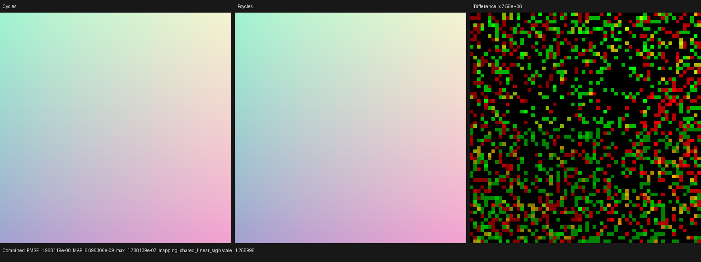
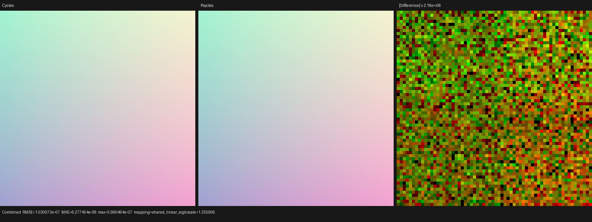
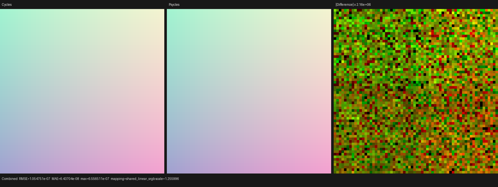

# Cycles float3-family conversion checkpoint

## Outcome

Psycles now applies Cycles' component-preserving conversion law across the
shader float3 family instead of requiring a separately enumerated cast for
every source/target pair. This fixes the two live conversion failures in the
exact official Barbershop Interior scene without a material-name, node-name,
or scene-specific exception.

The source asset is:

```text
https://svn.blender.org/svnroot/bf-blender/trunk/lib/benchmarks/cycles/barbershop_interior/barbershop_interior.blend
```

The unmodified local file is 287,574,804 bytes with SHA-256
`95972b56180462cac47ec82f3a755bd9111ec18ca37a6196a319c013db994130`.
Both `wood_floor` and `wood_floor.001` contain the same live link:

```text
Geometry.Position (point) -> Mix.002.B_Color (color)
```

The exporter correctly records Blender's socket as `NodeSocketVector`, while
Psycles' typed Geometry node refines Position to a point. Before this change,
the normalizer had `point -> vector` and `vector -> color` primitives but did
not compose them. It warned and substituted a zero color, deleting the
position-dependent floor variation. After this change, the exact full-scene
material audit drops from 19 warnings to 17; both implicit-conversion warnings
are gone and the linked value remains live.

## Formal conversion rule

Current Cycles `ConvertNode` treats color, vector, point, and normal as one
three-component storage family. A conversion within that family is a
component-preserving identity; only conversion to a scalar distinguishes
color luminance from vector/point/normal component average.

Psycles keeps those semantic types in its graph IR, so it uses `vector` as the
canonical internal waypoint:

```text
{point, normal, float3} -> vector -> {color, normal}
color                  -> vector -> normal
float                   -> color -> vector -> normal
```

Every arrow is an existing typed node with a checked input/output schema. The
compiled Luisa AST operations are aliases for family-preserving arrows, so no
runtime tag, padded `float4`, or dynamic conversion branch reaches device
code. Color-to-scalar and vector-family-to-scalar retain their distinct Cycles
formulas. This is a closed rule over the supported shader float3 family, not a
special patch for Geometry Position or Mix.

## Regression coverage

The raw Blender importer fixture now links Geometry Position directly to a
Color input and requires the normalized graph to contain both
`point_to_vector` and `vector_to_color`. It also rejects any unsupported
conversion diagnostic, so falling back to a zero literal cannot pass.

The end-to-end `geometry_position_color_conversion` probe reproduces the exact
Barbershop shape: Geometry Position is linked directly to `B_Color` of a
modern RGBA Mix node in ADD mode. A constant `A_Color` and factor 0.2 keep the
entire world-position gradient positive and observable through Emission.
Nothing is baked or pre-evaluated. Blender/Cycles is the only rendering oracle.

All comparisons use Blender 5.3 Alpha `b82c3f0da6c1` with Cycles source
`16f3180fba1e2f052a8c9f7b7c57b7738cd3dd8d`, fixed 64x64 output, 256
Tabulated Sobol samples, seed 20,903, no adaptive sampling, and no denoising.

## Numerical comparison

Fallback is compared with Cycles CPU. HIP and Vulkan are compared with Cycles
HIP on the same Radeon RX 9070 XT. Every unrelated pass is zero and every
report contains zero invalid pixels.

| Backend/oracle | Combined relative RMSE | Combined luminance ratio | Combined max abs | Emit relative RMSE | Emit luminance ratio |
| --- | ---: | ---: | ---: | ---: | ---: |
| fallback / Cycles CPU | 3.85422e-8 | 1.000000000 | 1.78814e-7 | 3.85422e-8 | 1.000000000 |
| HIP / Cycles HIP | 2.01722e-7 | 1.000000000 | 5.96046e-7 | 2.01529e-7 | 1.000000060 |
| Vulkan / Cycles HIP | 2.06555e-7 | 1.000000000 | 6.55651e-7 | 2.04272e-7 | 1.000000060 |

The automated Combined and Emit gates require relative RMSE below `1e-6` and
luminance ratio within `[0.99999, 1.00001]`. Complete reports and Cycles render
metadata are retained under [reports](reports/).

## Visual inspection

I opened all three Combined triptychs at their original 1,552x582 resolution.
The horizontal and vertical gradients, four-corner colors, neutral center,
edge coverage, and overall energy are visually indistinguishable. Residuals
appear only after 2.16-million to 7.55-million-times amplification and have no
coherent gradient, color, edge, or orientation bias.







## Verification

- The focused Blender importer regression passed.
- The exact Barbershop material audit contains no implicit-conversion warning.
- Fallback, HIP, and Vulkan wrote linear multilayer EXRs and passed the
  tightened Combined/Emit gates.
- The complete project build used all 32 jobs, then all 151 CTest targets
  passed in 4.67 seconds with 32 parallel lanes, including the first-party
  2,000-line source-size gate.

Representative commands:

```text
cmake --build build --parallel 32
ctest --test-dir build --output-on-failure --parallel 32 -R 'psycles.blender_import'
build/bin/psycles_inspect_blender_material /tmp/barbershop-export '*'
python3 tools/run_cycles_shader_probes.py geometry_position_color_conversion --blender /path/to/blender --psycles-render build/bin/psycles_render_blender_scene --output-dir /tmp/position-color --backend vk --cycles-device HIP --cycles-device-name '9070 XT' --width 64 --height 64 --samples 256
```
