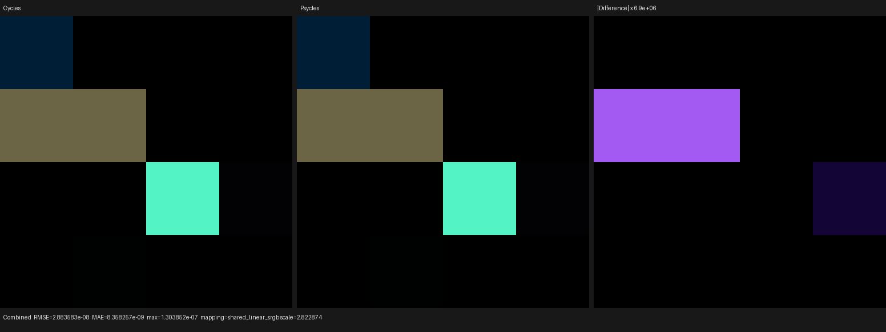
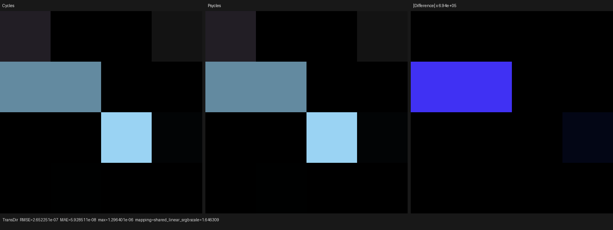
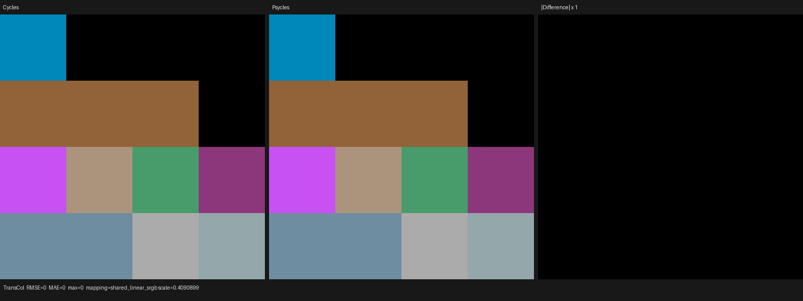

# Standalone Refraction BSDF parity — 2026-08-04

This checkpoint implements Blender/Cycles `ShaderNodeBsdfRefraction` as a
native Luisa closure and validates it against the current local Cycles source
and Cycles CPU renderer. No closure, material, image, or shading result is
baked by Blender. The probe and the official Barbershop export both retain the
original Refraction nodes and typed sockets.

The renderer oracle is Blender 5.2.0 LTS build `fbe6228777e7` using Cycles
CPU. The closure contract was also checked against a clean, freshly fetched
`blender-cycles` `origin/main` at
`72e50464a3cf00ee93954ec74ee8d9dbe9f42ab8`; the binary and source revisions
are recorded separately rather than presented as the same build.
The versioned shader-node baseline was independently rerun with the official
Blender 4.5.10 LTS build `6dc0b208d1b5`: fallback Combined RMSE was
`2.13e-15`, Transmission Direct RMSE was `8.27e-15`, and Transmission Color,
Gloss Color, and Normal were exact. Thus its 4.5.10 numbers do not borrow the
newer oracle's measurements.

## Formal closure contract

The implementation uses exact Cycles closure identities 20 for Beckmann
Refraction and 21 for GGX Refraction. It shares only the distribution,
visible-normal, refractive half-vector, Smith masking, Jacobian, and sampling
machinery with the dielectric microfacet component. Its lobe contract remains
distinct from Glass:

- closure weight is `max(Color * mix_weight, 0)` and uses Cycles' `1e-5`
  average-weight allocation cutoff;
- the reflection spectrum and reflection probability are identically zero;
- the transmission spectrum is one except under total internal reflection;
- TIR zeros evaluation and transmission albedo, while the allocation-derived
  closure-selection weight remains unchanged until conditional sampling;
- alpha is `clamp(Roughness^2, 0, 1)` (including linked negative values) and
  no GGX multi-scatter energy compensation is applied;
- IOR is clamped to `1e-5` and inverted exactly once for a back-facing hit;
- both glossy and transmission path masks are required, while a sampled light
  excluding either glossy or transmission removes the closure;
- Gloss Color is zero, Transmission Color is the allocated closure weight,
  and the closure still contributes to normal/roughness data-pass weighting.

This is represented by a separate compiler operation and device closure kind;
it is not implemented by setting a Glass tint to zero, because Glass would
still multiply transmission by one minus Fresnel and would use different
light-exclusion semantics.

## Regression coverage

`tests/test_luisa_refraction.cpp` runs on fallback, HIP, and Vulkan. It checks
the typed lowering, ABI identities, caustic allocation, analytic normal-angle
GGX BTDF and PDF, strict zero reflection, MIS light masks, split AOVs, smooth
sampling, lobe eligibility, backface eta, unit-IOR normalization, TIR, and the
closure allocation cutoff, and TIR mixture-selection weight. All three backend
tests pass. The complete project suite passes 142/142 tests with 32-way CTest
parallelism. After the final dielectric-AST change, the cold-JIT run took
34.68 s and peaked at 3,995,956 KiB RSS; the immediate warm-cache rerun took
4.28 s and peaked at 1,452,820 KiB.

The `refraction_bsdf_matrix` Blender probe contains 16 raw Refraction nodes.
It includes the exact Barbershop disinfectant parameters (Beckmann,
Roughness `0.137102127`, IOR `1.159999967`, Color
`[0.382274, 0.651278, 0.868007]`), both distributions, linked scalar and
normal sockets, smooth and rough cases, IOR below/equal/above one, backfaces,
TIR-oriented normals, negative roughness and colors, and values around the allocation
cutoff. A tilted zero-angle Sun makes the camera-hit evaluation deterministic
and exercises the off-normal refractive Jacobian. `max_bounces=0` intentionally
keeps Monte Carlo continuation variance out of this formula-level probe;
sampling is covered deterministically by the backend regression.

| Luisa backend | Combined energy ratio | Combined relative RMSE | TransDir relative RMSE | TransCol relative RMSE | GlossCol |
| --- | ---: | ---: | ---: | ---: | ---: |
| fallback | 1.000000173 | 5.116675e-7 | 2.293264e-6 | 0 | exactly zero |
| HIP | 1.000000000 | 8.355153e-8 | 7.854503e-8 | 3.842153e-5 | exactly zero |
| Vulkan | 1.000000000 | 1.433203e-7 | 1.444936e-7 | 3.842153e-5 | exactly zero |

Every report has 4,096 valid pixels and zero invalid pixels. The larger HIP
and Vulkan TransCol residual is confined to backend float conversion at cell
boundaries; its energy ratio is `1.000000342`, and the displayed Cycles and
Psycles panels are visually indistinguishable.

Reports: [fallback](reports/fallback.json), [HIP](reports/hip.json), and
[Vulkan](reports/vk.json).

## Original-resolution visual inspection

Combined, Transmission Direct, Transmission Color, Gloss Color, and Normal
triptychs were opened at their original 1552x582 resolution for all three
backends. Cycles and Psycles have the same visible cells, colors, boundaries,
normal orientation, zero-reflection regions, and TIR/cutoff black regions.
Only the amplified residual panel exposes float-scale backend differences;
there is no missing lobe, shifted cell, reflection leak, or backend-specific
artifact.

Representative fallback triptychs:







The corresponding HIP and Vulkan images, plus Gloss Color and Normal, are in
the [triptychs directory](triptychs/).

## Barbershop audit

The exact user-provided asset is
`assets/official-blender-scenes/barbershop-interior/barbershop_interior.blend`
with SHA-256
`95972b56180462cac47ec82f3a755bd9111ec18ca37a6196a319c013db994130`.
The unchanged existing export contains two reachable standalone Refraction
nodes in `Disinfectant_Liquid` and `Disinfectant_Liquid.001`. Both now compile
to three-closure programs with the same structural signature. The full
material inspector compiles 564 material/light/world programs, emits zero
Refraction warnings, and reduces total diagnostics from 30 to 26. The run took
1.27 s wall time, peaked at 5,191,116 KiB RSS, and used no swap.

The 26 remaining diagnostics are independent work: one Subsurface Scattering,
four Hair Info, four Attribute, one Magic Texture, four implicit conversions,
two true-displacement approximations, and ten unavailable images.

## Commands

```text
cmake --build build --parallel 32
ctest --test-dir build --output-on-failure --parallel 32
python3 tools/run_cycles_shader_probes.py --blender /usr/bin/blender --psycles-render build/bin/psycles_render_blender_scene --output-dir /tmp/refraction --backend fallback|hip|vk --cycles-device CPU --width 64 --height 64 --samples 256 refraction_bsdf_matrix
build/bin/psycles_inspect_blender_material /tmp/barbershop-export '*'
```
