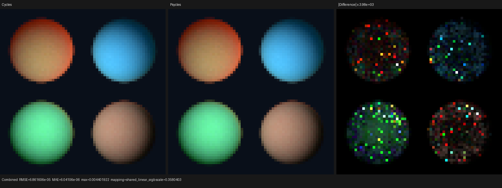
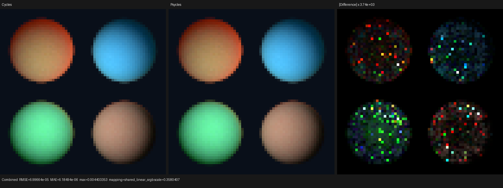
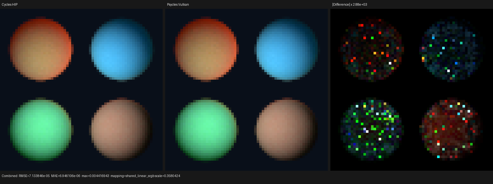
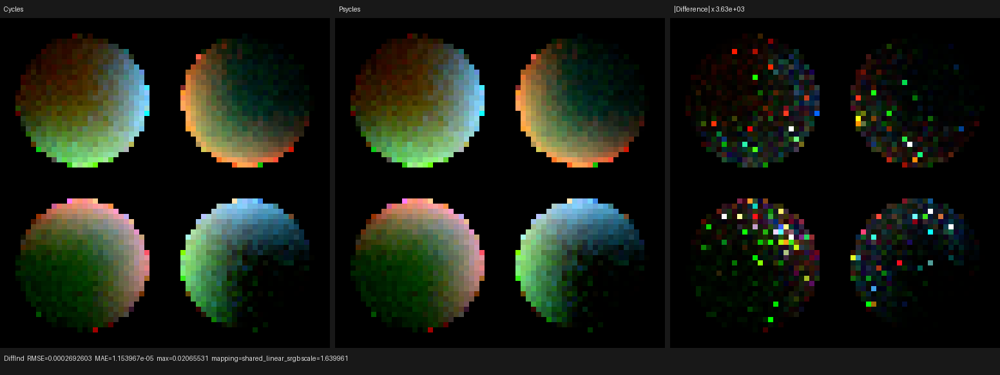
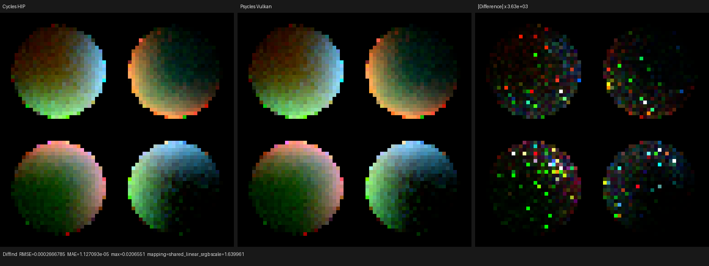

# Native subsurface Random Walk checkpoint

## Outcome

Psycles now executes Cycles' `RANDOM_WALK`, `RANDOM_WALK_LEGACY`, and
`RANDOM_WALK_SKIN` BSSRDF transport as typed Luisa shader AST on fallback,
HIP, and Vulkan. Authored closures, parameters, textures, ray queries, and
path state remain live device expressions. Blender/Cycles is the only
rendering oracle; there is no CPU reference renderer and no closure or
transport prebake.

The oracle is Blender 5.3 Alpha `b82c3f0da6c1` backed by the current local
Cycles source checkout
`16f3180fba1e2f052a8c9f7b7c57b7738cd3dd8d`. The probe covers positive- and
negative-anisotropy Standard Random Walk, Legacy, and Skin in closed smooth
geometry under two colored disk lights. All comparisons use 64x64, 4,096
fixed Tabulated Sobol samples, seed 20,903, no adaptive sampling, and no
denoising.

## Transport contract

The host-side `SubsurfaceRandomWalkComponent` generates one Luisa program for
all three methods:

1. Standard and negative-anisotropy paths use the current van-de-Hulst
   mapping; Legacy uses Cycles' fitted remap; Skin uses the current skin
   coefficients and its 50/50 diffuse/refractive entry mixture. Low-albedo
   channel compensation and the minimum-alpha rule are applied before the
   walk.
2. Entry, channel, distance, guiding-strategy, guiding-direction, and phase
   samples use Cycles' Tabulated Sobol dimensions. The local walk begins from
   the same `0xdeadbeef` path-offset scramble and advances by the same
   16-dimension bounce stride.
3. The local transport runs for at most 256 volume events. The first ten
   events use the original coefficients; later events use similarity theory.
   Henyey-Greenstein and Dwivedi proposals share Cycles' mixture PDFs,
   backward-interface probability, stretched extinction, and throughput
   estimator.
4. Each step performs a device ray query restricted to the originating Cycles
   object. Rays use `tmin = 0`. Only the exact entry `(object, primitive)` is
   rejected on the first query; there is no distance epsilon or host-side
   self-intersection heuristic. The committed exit hit is preserved directly.
5. A successful walk updates throughput, carries the exact pending hit into
   the ordinary surface stage, constructs Cycles' synthetic reverse exit ray,
   and advances the outer RNG domain once. Failure terminates that selected
   BSSRDF path.

Focused path traces at non-edge pixels pin the complete stochastic trajectory,
not only final pixels. Legacy matched Cycles CPU from primitive 10,723 to
9,019 with exit position within about `1e-6` and throughput
`(0.186296, 0.668594, 0.0321572)` versus Cycles
`(0.186296, 0.668590, 0.0321576)`. Skin matched primitive 14,652 to 15,760
with throughput within `1e-5`.

## Bugs exposed by the probe

The first complete images were stably 2.82% too bright. Random Walk traces
already matched Cycles, so the probe was reduced at the direct-light sample.
Blender stores an ignored default `size_y` for disk and square area lights;
Cycles uses `area_size` for both axes and consults `area_sizey` only for
rectangle and ellipse shapes. Psycles now imports that same shape-dependent
contract. The Blender import regression pins a disk with `size = 1.3` and an
ignored `size_y = 0.25`, while retaining the existing light identity checks.

Vulkan then exposed a separate XIR structurization defect. Five indexed-branch
case labels shared one return block while the default label was unreachable.
Duplicate-case proxies and single-exit rewriting moved only four equivalent
edges across a fresh merge, leaving the direct case as a post-merge re-entry.
The Luisa fix closes the exit cut over canonical target classes while
preserving already-cut forwarding paths; it is a graph invariant rather than
a shader-specific rewrite. Its reduced regression, full 58-test/1,096-assertion
XIR suite, and cold RADV compile evidence are in Luisa commit
`c05d0ecc8` on `next`.

The fallback shared-edge miss found during the same audit was fixed separately
by using Embree robust scene construction, matching Cycles CPU's Embree
contract. Its exact ray-query regression is in Luisa commit `f55060ab3`.

## Numerical comparison

Fallback is compared with Cycles CPU. HIP and Vulkan are compared with Cycles
HIP on the same RX 9070 XT. The residual is sparse floating-point/shared-edge
noise; every run has zero invalid pixels.

| Backend/oracle | Combined RMSE | Combined relative RMSE | Energy ratio | Diffuse Direct relative RMSE | Diffuse Indirect relative RMSE | Normal relative RMSE |
| --- | ---: | ---: | ---: | ---: | ---: | ---: |
| fallback / Cycles CPU | 6.86161e-5 | 1.22030e-4 | 1.00000124 | 1.07045e-4 | 2.32295e-3 | 1.55383e-5 |
| HIP / Cycles HIP | 6.99664e-5 | 1.24432e-4 | 1.00000067 | 1.08885e-4 | 2.34594e-3 | 1.44563e-5 |
| Vulkan / Cycles HIP | 7.13385e-5 | 1.26872e-4 | 1.00000067 | 1.26757e-4 | 2.32345e-3 | 1.44556e-5 |

Diffuse Color and Environment are pixel-exact on all three Luisa backends.
The complete 13-pass reports are retained under [reports](reports/).

## Visual inspection

I opened all twelve retained Combined, Diffuse Direct, Diffuse Indirect, and
Normal triptychs at their original 1,552x582 resolution. In every reference /
actual pair the sphere silhouette, subsurface color transport, terminator,
colored rim lighting, and internal indirect-light gradient are visually
indistinguishable. Differences become visible only after the comparator's
2,882x-3,984x amplification and remain sparse, unstructured single-pixel
noise; there is no coherent energy, radius, normal, or lobe-shape residual.







The more sensitive indirect-light triptychs are also retained:






## Timing

These are warm-shader timings for the focused 64x64x4,096 probe, so they are
not substitutes for the required 480p/1080p complex-scene benchmark. They do
make the current performance deficit explicit.

| Renderer/device | Render time | Psycles/Cycles ratio |
| --- | ---: | ---: |
| Cycles CPU / Ryzen 9 9950X3D | 0.8351 s | 1.00x |
| Psycles fallback / same CPU | 3.5204 s | 4.22x slower |
| Cycles HIP / RX 9070 XT | 0.8081 s | 1.00x |
| Psycles HIP / RX 9070 XT | 5.4052 s | 6.69x slower |
| Psycles Vulkan / RX 9070 XT | 5.8250 s | 7.21x slower |

The final Vulkan validation also disabled the Psycles shader cache. The full
XIR-to-SPIR-V path reduced 243,328 words to 229,290 words and completed shader
JIT in 4.779 s before rendering and writing the multilayer EXR.

## Verification

- The complete project build passed with `--parallel 32`.
- Native coefficient and entry-stage regressions pass on fallback, HIP, and
  Vulkan.
- The Blender area-light import regression and the existing Blender importer
  suite pass.
- The complete XIR structurizer suite passes 58 tests and 1,096 assertions.
- All three Luisa backends rendered 4,096 spp multilayer EXRs and passed
  numerical plus original-resolution visual inspection against Cycles.

Representative commands:

```text
cmake --build build --parallel 32
ctest --test-dir build --output-on-failure --parallel 32 -R 'psycles.(luisa_random_walk|blender_import)'
python3 tools/run_cycles_shader_probes.py random_walk_transport --blender /path/to/blender --psycles-render build/bin/psycles_render_blender_scene --output-dir /tmp/random-walk --backend vk --cycles-device HIP --cycles-device-name '9070 XT' --width 64 --height 64 --samples 4096
PSYCLES_DISABLE_SHADER_CACHE=1 build/bin/psycles_render_blender_scene /tmp/random-walk/random_walk_transport/export /tmp/random-walk-vk.ppm vk 64 64 1
```
