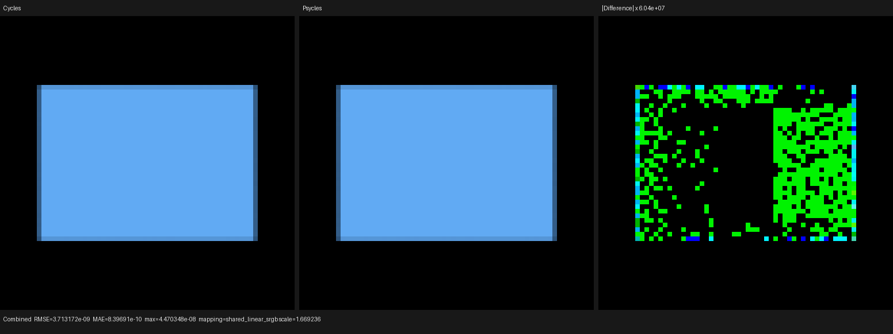
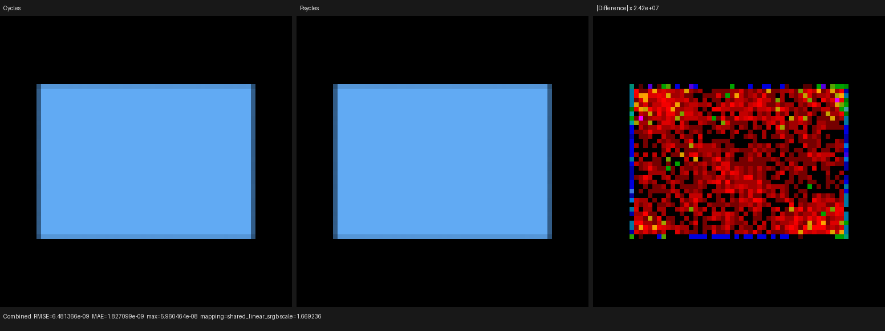

# Native volume Emission checkpoint

## Outcome

Psycles now lowers Blender's ordinary Emission node to a typed volume
closure when it is reached from a Material Output Volume socket. The closure
is evaluated as live Luisa shader AST on fallback, HIP, and Vulkan; the same
node reached from a Surface socket remains the existing surface emission.
No closure value, material, or transport result is baked or evaluated by
Blender.

This gap was found in the exact official Barbershop Interior asset:

```text
https://svn.blender.org/svnroot/bf-blender/trunk/lib/benchmarks/cycles/barbershop_interior/barbershop_interior.blend
```

The unmodified local file is 287,574,804 bytes with SHA-256
`95972b56180462cac47ec82f3a755bd9111ec18ca37a6196a319c013db994130`.
Its `fog` material connects an Emission node to the volume graph. Before this
change the material inspector emitted an unsupported implicit-closure warning;
after native lowering that warning is gone. The complete audit now reports 19
other actionable warnings: unavailable external images, four Hair Info uses,
one Magic Texture, two true-displacement requests, and two remaining implicit
socket conversions. This is a feature checkpoint, not a full-scene parity
claim.

## Cycles contract

The sole oracle is the local current Cycles checkout
`16f3180fba1e2f052a8c9f7b7c57b7738cd3dd8d`. In Cycles,
`svm_node_closure_emission` uses the closure-tree weight and optional mix
weight in both domains. During volume evaluation it:

1. suppresses emission for shadow and extinction queries;
2. multiplies the signed closure weight by `object_volume_density`;
3. accumulates it through `emission_setup` without the non-negative clamp
   used when allocating scattering closures.

Psycles represents this as a distinct `volume_emission` graph node and
`VolumeOperation::emission`, rather than casting a weakly typed surface
closure. Color and Strength stay typed device expressions. Add/Mix closure
weights and object-density scaling are applied at volume evaluation, and the
existing query mask controls shadow/extinction suppression. The host-side
closure-allocation budget also counts the Emission node exactly once, as
Cycles does, without reserving a phase-function volume block.

## Regression coverage

The raw Blender importer fixture connects a dynamically linked Emission node
through an Add Shader tree to Material Output Volume and asserts that the
result is the typed volume operation. The device coefficient regression adds
signed color `(0.25, -0.5, 0.75)`, Strength `1.2`, and object density `2` to a
mixed absorption/scatter/Principled tree. It pins the resulting emission
coefficient `(3.4, 4.0, 9.4)`, the emission-disabled query, and execution on
fallback, HIP, and Vulkan.

The end-to-end `volume_emission_transport` probe reproduces Barbershop's
topology with a normal Emission node connected directly to Volume. Its
Strength remains dynamically linked to `Is Camera Ray * 0.7`; the closed
scaled cube therefore tests graph-domain selection, linked expression
evaluation, boundary transport, object-density application, and Emit/Combined
AOV routing together. Comparisons use Blender 5.3 Alpha `b82c3f0da6c1`, fixed
64x64 output, 256 Tabulated Sobol samples, seed 20,903, no adaptive sampling,
and no denoising.

## Numerical comparison

Fallback is compared with Cycles CPU. HIP and Vulkan are compared with Cycles
HIP on the same Radeon RX 9070 XT. Combined and Emit are identical in this
emission-only probe, every unrelated pass is zero, and every report contains
zero invalid pixels.

| Backend/oracle | RMSE | Relative RMSE | Psycles/Cycles luminance | Maximum absolute error |
| --- | ---: | ---: | ---: | ---: |
| fallback / Cycles CPU | 3.71317e-9 | 1.76993e-8 | 1.000000000 | 4.47035e-8 |
| HIP / Cycles HIP | 6.48137e-9 | 3.08943e-8 | 0.999999827 | 5.96046e-8 |
| Vulkan / Cycles HIP | 6.48137e-9 | 3.08943e-8 | 0.999999827 | 5.96046e-8 |

The automated gate is deliberately tighter than the observed result: relative
RMSE must stay below `1e-6` and luminance ratio must remain within
`[0.99999, 1.00001]` for both Combined and Emit. Complete machine-readable
reports and Cycles render metadata are retained under [reports](reports/).

## Visual inspection

I opened all three Combined triptychs at their original 1,552x582 resolution.
The closed-volume silhouette, projected bounds, edge bands, color, and uniform
interior are visually indistinguishable between Cycles and Psycles on every
backend. A residual is visible only in the comparator's 24.2-million to
60.4-million-times amplified difference panels; it is sparse floating-point
rounding noise with no coherent shape, brightness, color, or boundary bias.






## Verification

- The focused Blender importer test passed.
- The coefficient regression passed on fallback, HIP, and Vulkan.
- All three end-to-end probes wrote linear multilayer EXRs and passed the
  tightened Combined/Emit gates.
- The complete project build used all 32 jobs, then all 151 CTest targets
  passed in 4.83 seconds with 32 parallel lanes. This includes the first-party
  2,000-line source-size gate.

Representative commands:

```text
cmake --build build --parallel 32
ctest --test-dir build --output-on-failure --parallel 32 -R 'psycles.(blender_import|luisa_volume_coefficients)'
python3 tools/run_cycles_shader_probes.py volume_emission_transport --blender /path/to/blender --psycles-render build/bin/psycles_render_blender_scene --output-dir /tmp/volume-emission --backend vk --cycles-device HIP --cycles-device-name '9070 XT' --width 64 --height 64 --samples 256
```
